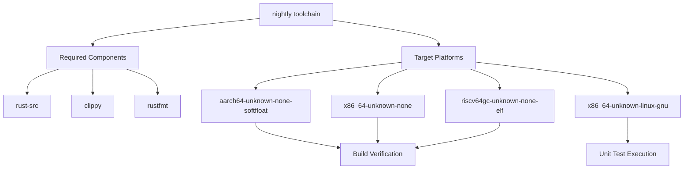
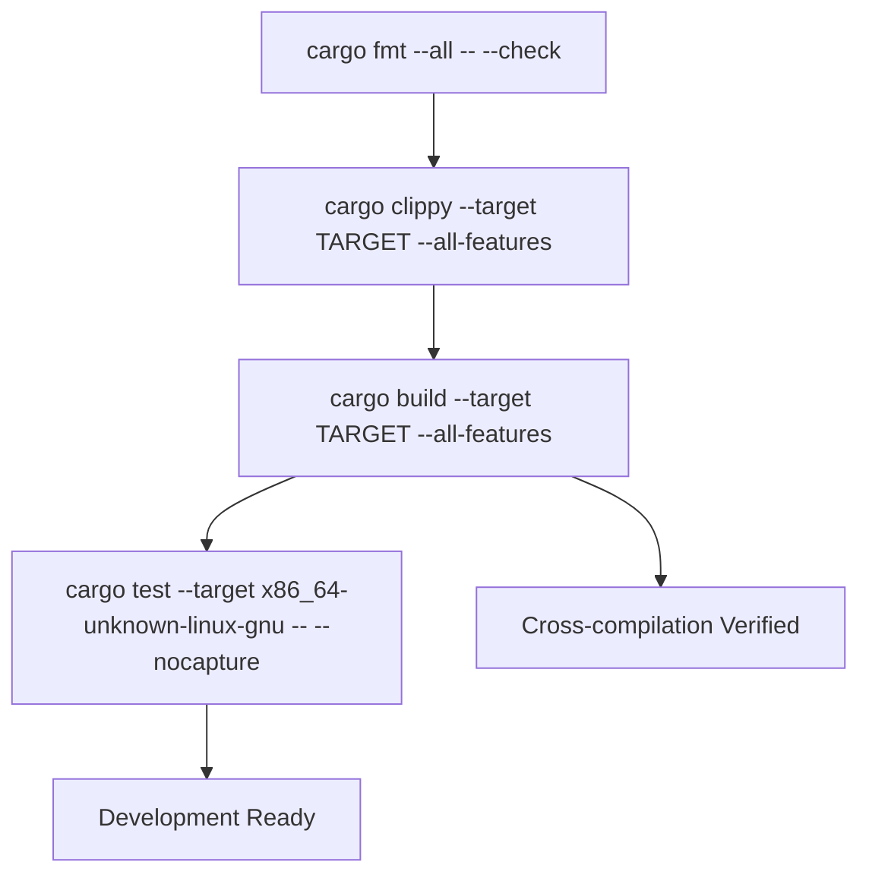
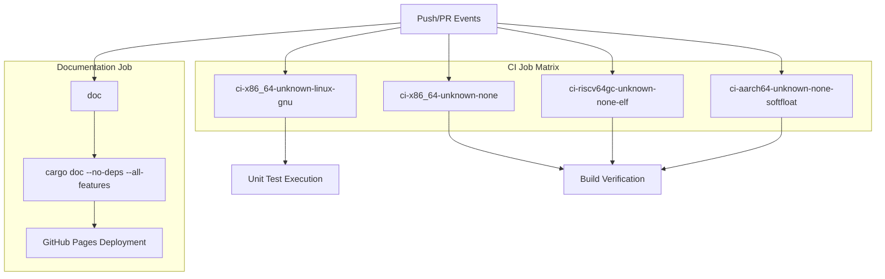
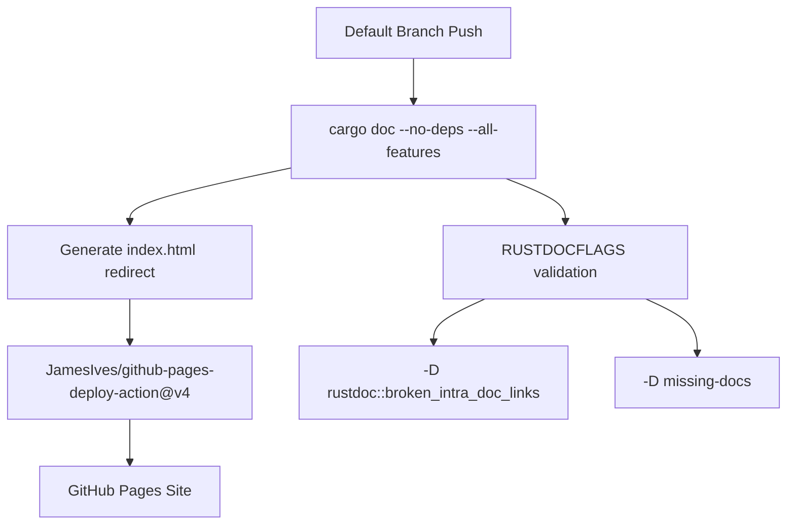

# Development Guide

> **Relevant source files**
> * [.github/workflows/ci.yml](https://github.com/arceos-org/handler_table/blob/036a12c4/.github/workflows/ci.yml)

This document provides comprehensive information for developers who want to build, test, or contribute to the `handler_table` crate. It covers local development setup, testing procedures, and the automated CI/CD pipeline that ensures code quality across multiple target architectures.

For information about using the HandlerTable API, see [User Guide](/arceos-org/handler_table/2-user-guide). For implementation details and internal architecture, see [Implementation Details](/arceos-org/handler_table/3-implementation-details).

## Development Environment Setup

The `handler_table` crate requires a Rust nightly toolchain with specific components and target platforms for comprehensive development and testing. The development workflow supports both local development on `x86_64-unknown-linux-gnu` and cross-compilation for embedded `no_std` targets.

### Required Toolchain Configuration

**Development Environment Commands**

The following commands establish the required development environment:

* Install nightly toolchain: `rustup toolchain install nightly`
* Add required components: `rustup component add rust-src clippy rustfmt`
* Add target platforms: `rustup target add x86_64-unknown-none riscv64gc-unknown-none-elf aarch64-unknown-none-softfloat`

Sources: [.github/workflows/ci.yml(L15 - L19)&emsp;](https://github.com/arceos-org/handler_table/blob/036a12c4/.github/workflows/ci.yml#L15-L19)

## Build and Test Workflow

The development workflow follows a structured approach ensuring code quality through formatting checks, linting, building, and testing across all supported target architectures.

### Local Development Commands

**Command Details**

|Command Purpose|Command|Target Scope|
| --- | --- | --- |
|Format verification|cargo fmt --all -- --check|All source files|
|Static analysis|cargo clippy --target $TARGET --all-features|Per-target analysis|
|Build verification|cargo build --target $TARGET --all-features|All target platforms|
|Unit test execution|cargo test --target x86_64-unknown-linux-gnu -- --nocapture|Linux target only|

The build process verifies compilation across all target architectures, but unit tests execute only on `x86_64-unknown-linux-gnu` due to the embedded nature of other targets.

Sources: [.github/workflows/ci.yml(L22 - L30)&emsp;](https://github.com/arceos-org/handler_table/blob/036a12c4/.github/workflows/ci.yml#L22-L30)

## CI/CD Pipeline Architecture

The automated pipeline implements a comprehensive verification strategy using GitHub Actions with matrix builds across multiple Rust toolchains and target architectures.

### Pipeline Jobs and Dependencies

**Matrix Build Configuration**

The CI pipeline uses a fail-fast strategy set to `false`, ensuring all target architectures complete their builds even if one fails. Each matrix job executes the complete verification workflow for its assigned target.

|Matrix Dimension|Values|
| --- | --- |
|rust-toolchain|nightly|
|targets|x86_64-unknown-linux-gnu,x86_64-unknown-none,riscv64gc-unknown-none-elf,aarch64-unknown-none-softfloat|

Sources: [.github/workflows/ci.yml(L8 - L12)&emsp;](https://github.com/arceos-org/handler_table/blob/036a12c4/.github/workflows/ci.yml#L8-L12)

### Documentation Generation and Deployment

The documentation pipeline generates API documentation and deploys it to GitHub Pages with automatic index page generation and dependency exclusion.

**Documentation Environment Variables**

* `RUSTDOCFLAGS`: `-D rustdoc::broken_intra_doc_links -D missing-docs`
* `default-branch`: Dynamic branch reference for deployment conditions

The documentation deployment occurs only on pushes to the default branch, with automatic index page generation using the crate name extracted from `cargo tree` output.

Sources: [.github/workflows/ci.yml(L32 - L55)&emsp;](https://github.com/arceos-org/handler_table/blob/036a12c4/.github/workflows/ci.yml#L32-L55)

## Contributing Workflow

### Code Quality Requirements

All contributions must pass the complete CI pipeline verification, including:

1. **Format Compliance**: Code must conform to `rustfmt` standards
2. **Lint Compliance**: No `clippy` warnings across all target architectures
3. **Build Success**: Successful compilation on all supported targets
4. **Test Passage**: Unit tests must pass on `x86_64-unknown-linux-gnu`
5. **Documentation Standards**: No broken intra-doc links or missing documentation

### Target Architecture Support

The crate maintains compatibility across diverse target architectures representing different use cases:

|Target|Purpose|Test Coverage|
| --- | --- | --- |
|x86_64-unknown-linux-gnu|Development and testing|Full unit tests|
|x86_64-unknown-none|Bare metal x86_64|Build verification|
|riscv64gc-unknown-none-elf|RISC-V embedded|Build verification|
|aarch64-unknown-none-softfloat|ARM64 embedded|Build verification|

This architecture matrix ensures the crate functions correctly across the diverse hardware platforms supported by ArceOS.

Sources: [.github/workflows/ci.yml(L12)&emsp;](https://github.com/arceos-org/handler_table/blob/036a12c4/.github/workflows/ci.yml#L12-L12) [.github/workflows/ci.yml(L25 - L30)&emsp;](https://github.com/arceos-org/handler_table/blob/036a12c4/.github/workflows/ci.yml#L25-L30)