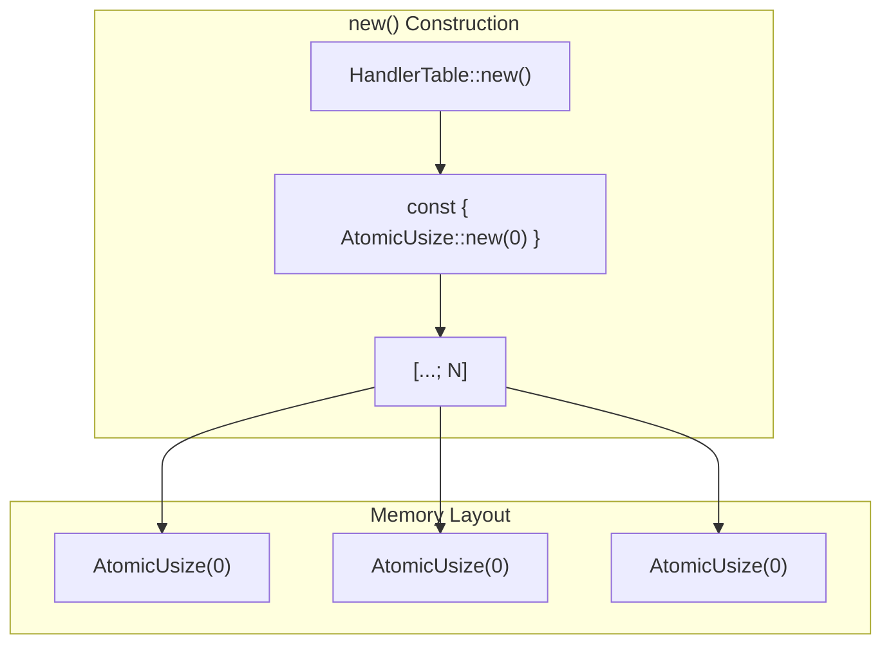
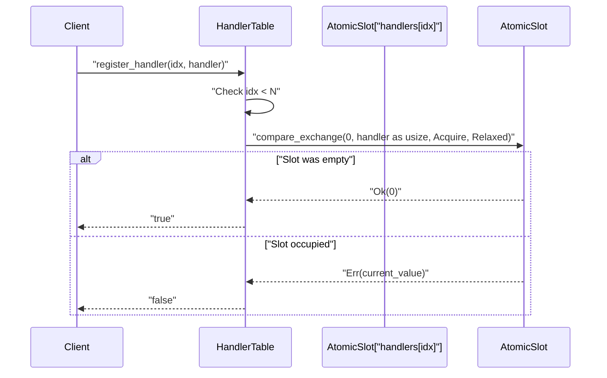
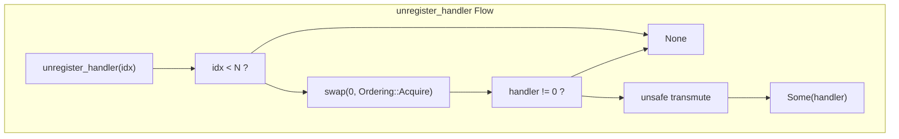
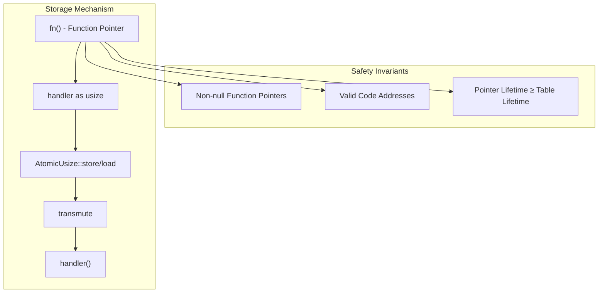
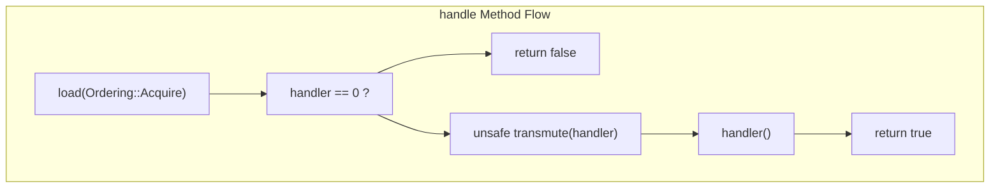
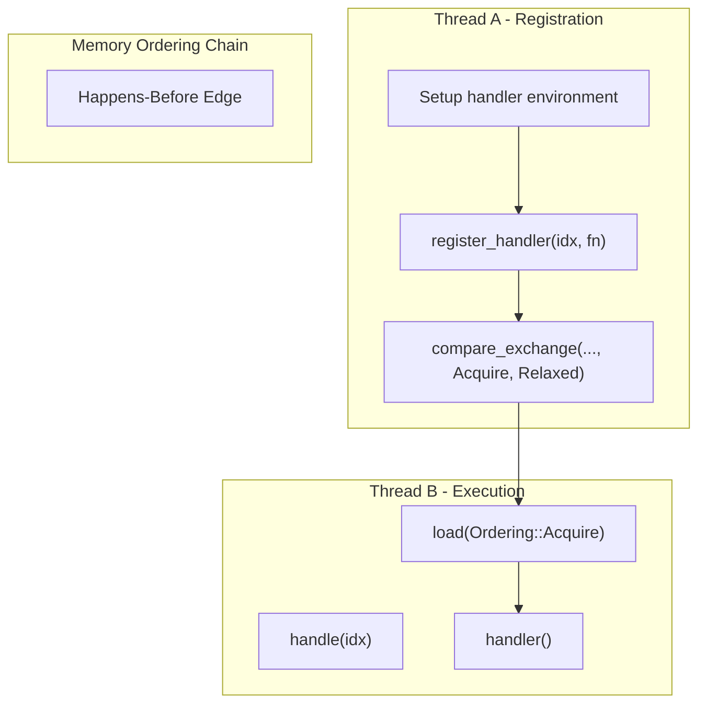
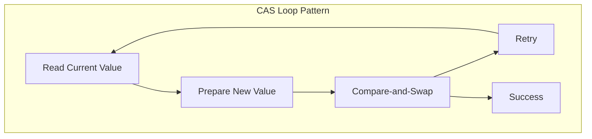

# Implementation Details

> **Relevant source files**
> * [src/lib.rs](https://github.com/arceos-org/handler_table/blob/036a12c4/src/lib.rs)

This document provides a deep technical analysis of the `HandlerTable<N>` implementation, covering the internal architecture, atomic operations strategy, and lock-free design patterns. It explains how function pointers are stored atomically, the memory ordering guarantees, and the safety mechanisms that enable concurrent access without locks.

For high-level usage information, see [User Guide](/arceos-org/handler_table/2-user-guide). For atomic operations theory, see [Atomic Operations](/arceos-org/handler_table/3.1-atomic-operations).

## Core Data Structure

The `HandlerTable<N>` struct implements a fixed-size, lock-free event handler registry using a compile-time constant generic parameter `N` to define the maximum number of event handlers.

### HandlerTable Structure

```mermaid
flowchart TD
subgraph subGraph2["Value Interpretation"]
    Zero["0 = Empty Slot"]
    NonZero["Non-zero = Function Pointer"]
    Transmute["unsafe transmute"]
end
subgraph subGraph1["Handler Storage"]
    H0["handlers[0]: AtomicUsize"]
    H1["handlers[1]: AtomicUsize"]
    HN["handlers[N-1]: AtomicUsize"]
end
subgraph HandlerTable<N>["HandlerTable"]
    HT["HandlerTable"]
    Array["handlers: [AtomicUsize; N]"]
end

Array --> H0
Array --> H1
Array --> HN
H0 --> Zero
H1 --> NonZero
HN --> Zero
HT --> Array
NonZero --> Transmute
```

The fundamental design stores function pointers as `usize` values within `AtomicUsize` containers. An empty slot is represented by the value `0`, while registered handlers store the function pointer cast to `usize`. This design enables atomic operations on what are essentially function pointer references.

**Sources:** [src/lib.rs(L14 - L16)&emsp;](https://github.com/arceos-org/handler_table/blob/036a12c4/src/lib.rs#L14-L16) [src/lib.rs(L21 - L23)&emsp;](https://github.com/arceos-org/handler_table/blob/036a12c4/src/lib.rs#L21-L23)

### Initialization Pattern

The constructor uses a const-evaluated array initialization pattern that ensures all atomic slots begin in the empty state:



The `const { AtomicUsize::new(0) }` expression leverages Rust's const evaluation to initialize each array element at compile time, ensuring zero-cost initialization and immediate readiness for concurrent access.

**Sources:** [src/lib.rs(L19 - L24)&emsp;](https://github.com/arceos-org/handler_table/blob/036a12c4/src/lib.rs#L19-L24)

## Atomic Operations Strategy

The implementation employs three distinct atomic operations, each optimized for its specific use case within the lock-free protocol.

### Operation Mapping

|Method|Atomic Operation|Success Condition|Failure Behavior|
| --- | --- | --- | --- |
|register_handler|compare_exchange|Slot was empty (0)|Returns false|
|unregister_handler|swap|Always succeeds|Returns None if empty|
|handle|load|Always succeeds|Returns false if empty|

### Registration Protocol



The `compare_exchange` operation provides atomic test-and-set functionality, ensuring that only one thread can successfully register a handler for any given index. The operation uses `Ordering::Acquire` for success to establish happens-before relationships with subsequent operations.

**Sources:** [src/lib.rs(L30 - L37)&emsp;](https://github.com/arceos-org/handler_table/blob/036a12c4/src/lib.rs#L30-L37)

### Deregistration Protocol

The `swap` operation unconditionally exchanges the current value with `0`, returning the previous value. This ensures atomic removal regardless of the current state:



**Sources:** [src/lib.rs(L42 - L52)&emsp;](https://github.com/arceos-org/handler_table/blob/036a12c4/src/lib.rs#L42-L52)

## Function Pointer Storage and Safety

The core challenge in this implementation is safely storing and retrieving function pointers through atomic operations. Since `AtomicPtr<fn()>` doesn't exist in stable Rust, the implementation uses `AtomicUsize` with unsafe transmutation.

### Pointer-to-Integer Conversion



The implementation relies on several critical safety assumptions:

* Function pointers are never null (guaranteed by Rust's type system)
* Function pointers have the same size as `usize` on the target platform
* Function addresses remain valid for the lifetime of the `HandlerTable`
* The transmutation between `usize` and `fn()` preserves the pointer value

**Sources:** [src/lib.rs(L48)&emsp;](https://github.com/arceos-org/handler_table/blob/036a12c4/src/lib.rs#L48-L48) [src/lib.rs(L64)&emsp;](https://github.com/arceos-org/handler_table/blob/036a12c4/src/lib.rs#L64-L64)

### Event Handling Execution

The `handle` method demonstrates the complete pointer recovery and execution sequence:



The atomic load with `Ordering::Acquire` ensures that any writes to memory performed by the registering thread before the `compare_exchange` are visible to the handling thread.

**Sources:** [src/lib.rs(L58 - L70)&emsp;](https://github.com/arceos-org/handler_table/blob/036a12c4/src/lib.rs#L58-L70)

## Memory Ordering Guarantees

The implementation uses a carefully chosen set of memory orderings to balance performance with correctness guarantees.

### Ordering Strategy

|Operation|Success Ordering|Failure Ordering|Rationale|
| --- | --- | --- | --- |
|compare_exchange|Acquire|Relaxed|Synchronize with prior writes|
|swap|Acquire|N/A|Ensure visibility of handler execution|
|load|Acquire|N/A|See registration writes|

### Happens-Before Relationships



The `Acquire` ordering on successful registration creates a happens-before relationship with the `Acquire` load during event handling, ensuring that any memory operations completed before registration are visible during handler execution.

**Sources:** [src/lib.rs(L35)&emsp;](https://github.com/arceos-org/handler_table/blob/036a12c4/src/lib.rs#L35-L35) [src/lib.rs(L46)&emsp;](https://github.com/arceos-org/handler_table/blob/036a12c4/src/lib.rs#L46-L46) [src/lib.rs(L62)&emsp;](https://github.com/arceos-org/handler_table/blob/036a12c4/src/lib.rs#L62-L62)

## Lock-free Design Patterns

The `HandlerTable` implementation demonstrates several fundamental lock-free programming patterns adapted for event handling scenarios.

### Compare-and-Swap Pattern

The registration mechanism implements the classic compare-and-swap pattern for atomic updates:



However, the handler table simplifies this pattern by only allowing transitions from empty (0) to occupied (non-zero), eliminating the need for retry loops.

### ABA Problem Avoidance

The design inherently avoids the ABA problem through its state transition model:

|From State|To State|Operation|ABA Risk|
| --- | --- | --- | --- |
|Empty (0)|Handler (ptr)|register_handler|None - single transition|
|Handler (ptr)|Empty (0)|unregister_handler|None - swap is atomic|
|Any|Any|handle|None - read-only|

The absence of complex state transitions and the use of swap for deregistration eliminate scenarios where the ABA problem could manifest.

**Sources:** [src/lib.rs(L30 - L37)&emsp;](https://github.com/arceos-org/handler_table/blob/036a12c4/src/lib.rs#L30-L37) [src/lib.rs(L42 - L52)&emsp;](https://github.com/arceos-org/handler_table/blob/036a12c4/src/lib.rs#L42-L52) [src/lib.rs(L58 - L70)&emsp;](https://github.com/arceos-org/handler_table/blob/036a12c4/src/lib.rs#L58-L70)