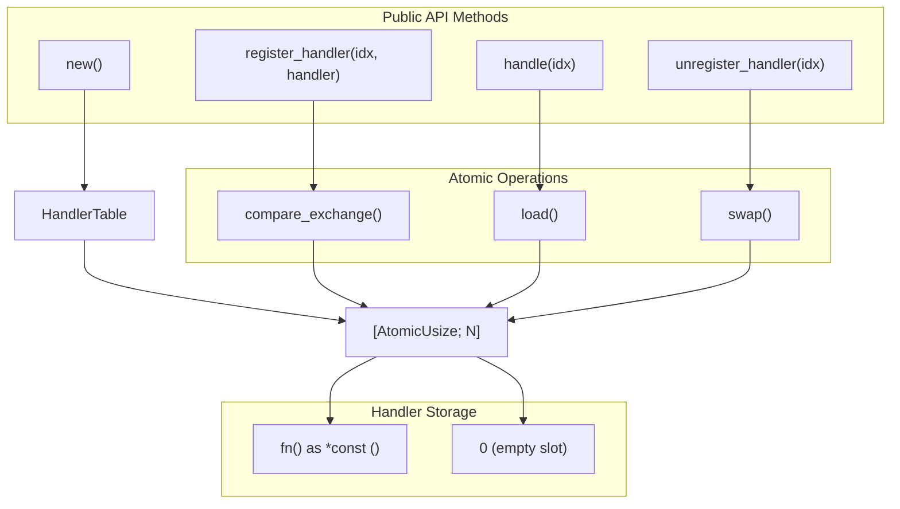

# Introduction

> **Relevant source files**
> * [Cargo.toml](https://github.com/arceos-org/handler_table/blob/036a12c4/Cargo.toml)
> * [README.md](https://github.com/arceos-org/handler_table/blob/036a12c4/README.md)

## Purpose and Scope

This document covers the `handler_table` crate, a lock-free event handling system designed for the ArceOS operating system. The crate provides a thread-safe, fixed-size table that maps event identifiers to handler functions without requiring locks or dynamic memory allocation.

For detailed API usage and examples, see [User Guide](/arceos-org/handler_table/2-user-guide). For implementation details and atomic operations, see [Implementation Details](/arceos-org/handler_table/3-implementation-details). For ArceOS-specific integration patterns, see [ArceOS Integration](/arceos-org/handler_table/1.1-arceos-integration).

## Overview

The `handler_table` crate implements a `HandlerTable<N>` structure that stores function pointers in a compile-time sized array using atomic operations for thread safety. It serves as a central dispatch mechanism for event handling in kernel and embedded environments where lock-free operations are critical for performance and real-time guarantees.

### System Architecture

The following diagram illustrates the core components and their relationships in the codebase:

**HandlerTable Core Components**



Sources: [Cargo.toml(L1 - L15)&emsp;](https://github.com/arceos-org/handler_table/blob/036a12c4/Cargo.toml#L1-L15) [README.md(L11 - L31)&emsp;](https://github.com/arceos-org/handler_table/blob/036a12c4/README.md#L11-L31)

### Event Handling Flow

The following diagram shows how events flow through the system using specific code entities:

**Event Processing Pipeline**

```

```

Sources: [README.md(L16 - L28)&emsp;](https://github.com/arceos-org/handler_table/blob/036a12c4/README.md#L16-L28)

## Key Characteristics

The `handler_table` crate provides several critical features for system-level event handling:

|Feature|Implementation|Benefit|
| --- | --- | --- |
|Lock-free Operation|Atomic operations only (AtomicUsize)|No blocking, suitable for interrupt contexts|
|Fixed Size|Compile-time array[AtomicUsize; N]|No dynamic allocation,no_stdcompatible|
|Thread Safety|Memory ordering guarantees|Safe concurrent access across threads|
|Zero Dependencies|Pure core library usage|Minimal footprint for embedded systems|

### Target Environments

The crate is specifically designed for:

* **ArceOS kernel components** - Central event dispatch system
* **Embedded systems** - Real-time event handling without heap allocation
* **Interrupt handlers** - Lock-free operation in critical sections
* **Multi-architecture support** - Works across x86_64, RISC-V, and ARM platforms

Sources: [Cargo.toml(L6 - L12)&emsp;](https://github.com/arceos-org/handler_table/blob/036a12c4/Cargo.toml#L6-L12)

## Integration Context

Within the ArceOS ecosystem, `handler_table` serves as a foundational component for event-driven programming patterns. The lock-free design enables high-performance event dispatch suitable for kernel-level operations where traditional locking mechanisms would introduce unacceptable latency or deadlock risks.

For specific integration patterns with ArceOS components, see [ArceOS Integration](/arceos-org/handler_table/1.1-arceos-integration). For understanding the lock-free design principles and their benefits, see [Lock-free Design Benefits](/arceos-org/handler_table/1.2-lock-free-design-benefits).

Sources: [Cargo.toml(L8 - L11)&emsp;](https://github.com/arceos-org/handler_table/blob/036a12c4/Cargo.toml#L8-L11) [README.md(L1 - L7)&emsp;](https://github.com/arceos-org/handler_table/blob/036a12c4/README.md#L1-L7)