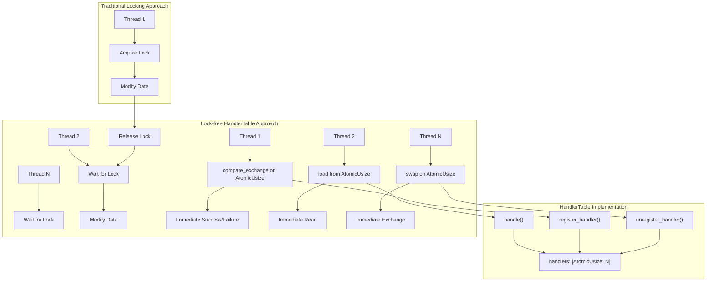
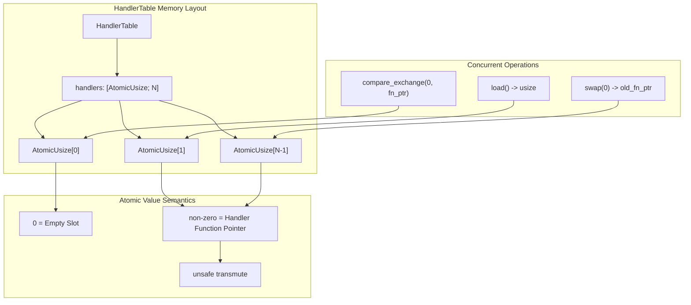
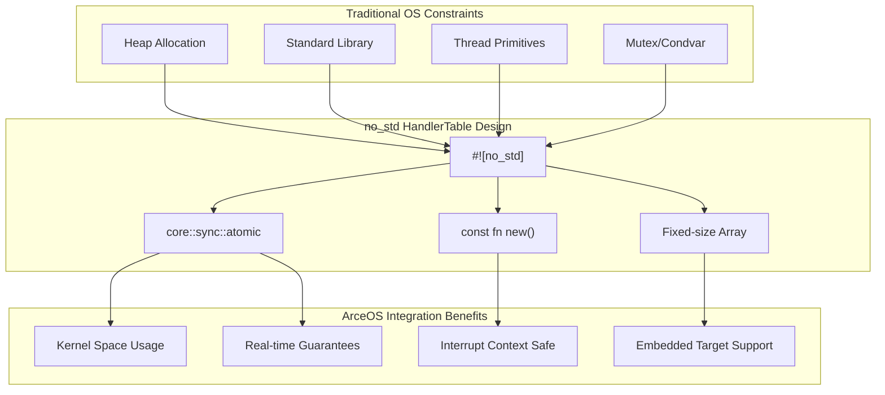
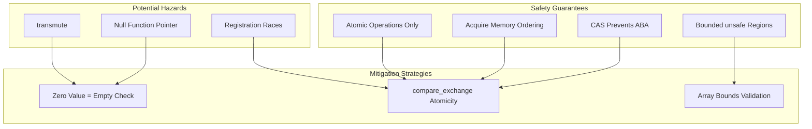

# Lock-free Design Benefits

> **Relevant source files**
> * [README.md](https://github.com/arceos-org/handler_table/blob/036a12c4/README.md)
> * [src/lib.rs](https://github.com/arceos-org/handler_table/blob/036a12c4/src/lib.rs)

## Purpose and Scope

This document explains the lock-free design principles used in the `handler_table` crate and the specific benefits this approach provides for event handling in operating systems. We focus on how lock-free programming concepts enable high-performance, concurrent event dispatch without traditional synchronization primitives.

For information about how this crate integrates with ArceOS specifically, see [ArceOS Integration](/arceos-org/handler_table/1.1-arceos-integration). For detailed implementation specifics of the atomic operations, see [Atomic Operations](/arceos-org/handler_table/3.1-atomic-operations).

## Lock-free Programming Fundamentals

Lock-free programming is a concurrency paradigm that eliminates the use of traditional locks (mutexes, semaphores) by relying on atomic operations to ensure thread safety. In the `handler_table` crate, this is achieved through the use of `AtomicUsize` arrays and carefully chosen memory ordering constraints.

### Core Lock-free Principles in HandlerTable



Sources: [src/lib.rs(L14 - L16)&emsp;](https://github.com/arceos-org/handler_table/blob/036a12c4/src/lib.rs#L14-L16) [src/lib.rs(L30 - L37)&emsp;](https://github.com/arceos-org/handler_table/blob/036a12c4/src/lib.rs#L30-L37) [src/lib.rs(L58 - L70)&emsp;](https://github.com/arceos-org/handler_table/blob/036a12c4/src/lib.rs#L58-L70) [src/lib.rs(L42 - L52)&emsp;](https://github.com/arceos-org/handler_table/blob/036a12c4/src/lib.rs#L42-L52)

### Atomic Operations Mapping

The `HandlerTable` maps each operation to specific atomic primitives:

|Operation|Atomic Method|Memory Ordering|Purpose|
| --- | --- | --- | --- |
|register_handler|compare_exchange|Acquire/Relaxed|Atomically register if slot empty|
|handle|load|Acquire|Read handler pointer safely|
|unregister_handler|swap|Acquire|Atomically remove and return handler|

Sources: [src/lib.rs(L34 - L36)&emsp;](https://github.com/arceos-org/handler_table/blob/036a12c4/src/lib.rs#L34-L36) [src/lib.rs(L62)&emsp;](https://github.com/arceos-org/handler_table/blob/036a12c4/src/lib.rs#L62-L62) [src/lib.rs(L46)&emsp;](https://github.com/arceos-org/handler_table/blob/036a12c4/src/lib.rs#L46-L46)

## Benefits in Event Handling Systems

### Non-blocking Event Processing

Lock-free design enables event handlers to be registered, executed, and unregistered without blocking other threads. This is critical in operating system kernels where interrupt handlers and system calls must execute with minimal latency.

```mermaid
sequenceDiagram
    participant InterruptContext as Interrupt Context
    participant HandlerTable as HandlerTable
    participant AtomicUsizeidx as AtomicUsize[idx]
    participant EventHandler as Event Handler

    Note over InterruptContext,EventHandler: Concurrent Event Processing
    par Registration in Kernel Thread
        InterruptContext ->> HandlerTable: "register_handler(IRQ_TIMER, timer_handler)"
        HandlerTable ->> AtomicUsizeidx: "compare_exchange(0, handler_ptr)"
        AtomicUsizeidx -->> HandlerTable: "Ok() - Registration Success"
    else Event Handling in Interrupt
        InterruptContext ->> HandlerTable: "handle(IRQ_TIMER)"
        HandlerTable ->> AtomicUsizeidx: "load(Ordering::Acquire)"
        AtomicUsizeidx -->> HandlerTable: "handler_ptr"
        HandlerTable ->> EventHandler: "Call timer_handler()"
        EventHandler -->> HandlerTable: "Handler Complete"
        HandlerTable -->> InterruptContext: "true - Event Handled"
    else Cleanup in User Thread
        InterruptContext ->> HandlerTable: "unregister_handler(IRQ_TIMER)"
        HandlerTable ->> AtomicUsizeidx: "swap(0, Ordering::Acquire)"
        AtomicUsizeidx -->> HandlerTable: "old_handler_ptr"
        HandlerTable -->> InterruptContext: "Some(timer_handler)"
    end
```

Sources: [src/lib.rs(L30 - L37)&emsp;](https://github.com/arceos-org/handler_table/blob/036a12c4/src/lib.rs#L30-L37) [src/lib.rs(L58 - L70)&emsp;](https://github.com/arceos-org/handler_table/blob/036a12c4/src/lib.rs#L58-L70) [src/lib.rs(L42 - L52)&emsp;](https://github.com/arceos-org/handler_table/blob/036a12c4/src/lib.rs#L42-L52)

### Deterministic Performance Characteristics

Unlike mutex-based approaches, lock-free operations have bounded execution time regardless of concurrent access patterns:

|Characteristic|Lock-based Approach|Lock-free HandlerTable|
| --- | --- | --- |
|Worst-case latency|Unbounded (lock contention)|Bounded (atomic operation time)|
|Priority inversion|Possible|Impossible|
|Deadlock risk|Present|Absent|
|Context switching|Required on contention|Never required|

Sources: [src/lib.rs(L4)&emsp;](https://github.com/arceos-org/handler_table/blob/036a12c4/src/lib.rs#L4-L4) [src/lib.rs(L34 - L36)&emsp;](https://github.com/arceos-org/handler_table/blob/036a12c4/src/lib.rs#L34-L36)

## Implementation in HandlerTable

### Memory Layout and Atomic Storage

The `HandlerTable<N>` stores function pointers as `usize` values in an `AtomicUsize` array, leveraging the fact that function pointers have the same size as `usize` on supported architectures.



Sources: [src/lib.rs(L14 - L16)&emsp;](https://github.com/arceos-org/handler_table/blob/036a12c4/src/lib.rs#L14-L16) [src/lib.rs(L22 - L23)&emsp;](https://github.com/arceos-org/handler_table/blob/036a12c4/src/lib.rs#L22-L23) [src/lib.rs(L48)&emsp;](https://github.com/arceos-org/handler_table/blob/036a12c4/src/lib.rs#L48-L48) [src/lib.rs(L64)&emsp;](https://github.com/arceos-org/handler_table/blob/036a12c4/src/lib.rs#L64-L64)

### Memory Ordering Guarantees

The crate uses `Ordering::Acquire` for reads and exchanges, ensuring that:

1. Handler registration becomes visible to other threads before any subsequent operations
2. Handler execution observes all memory writes that happened before registration
3. Handler unregistration synchronizes with any concurrent access attempts

```
// From register_handler - ensures visibility of registration
compare_exchange(0, handler as usize, Ordering::Acquire, Ordering::Relaxed)

// From handle - ensures handler sees all prior writes
load(Ordering::Acquire)

// From unregister_handler - ensures cleanup synchronization
swap(0, Ordering::Acquire)
```

Sources: [src/lib.rs(L35)&emsp;](https://github.com/arceos-org/handler_table/blob/036a12c4/src/lib.rs#L35-L35) [src/lib.rs(L62)&emsp;](https://github.com/arceos-org/handler_table/blob/036a12c4/src/lib.rs#L62-L62) [src/lib.rs(L46)&emsp;](https://github.com/arceos-org/handler_table/blob/036a12c4/src/lib.rs#L46-L46)

## Performance and Scalability Benefits

### Scalability Analysis

Lock-free design provides several scalability advantages for event-driven systems:

|Metric|Impact|Benefit|
| --- | --- | --- |
|Thread contention|Eliminated|Linear scalability with core count|
|Cache coherency|Minimized|Reduced memory bus traffic|
|Context switches|Avoided|Lower CPU overhead|
|Real-time guarantees|Preserved|Predictable worst-case execution time|

### No-std Environment Optimization

The `#![no_std]` design requirement makes lock-free programming essential, as traditional locking primitives are unavailable or too heavyweight for embedded/kernel environments.



Sources: [src/lib.rs(L1)&emsp;](https://github.com/arceos-org/handler_table/blob/036a12c4/src/lib.rs#L1-L1) [src/lib.rs(L4)&emsp;](https://github.com/arceos-org/handler_table/blob/036a12c4/src/lib.rs#L4-L4) [src/lib.rs(L20 - L24)&emsp;](https://github.com/arceos-org/handler_table/blob/036a12c4/src/lib.rs#L20-L24)

## Memory Safety and Correctness

### Safe Concurrent Access Patterns

The lock-free design maintains memory safety through several mechanisms:

1. **Atomic pointer operations**: Function pointers are stored and accessed atomically
2. **ABA problem avoidance**: Using `compare_exchange` prevents race conditions during registration
3. **Memory ordering**: `Acquire` ordering ensures proper synchronization
4. **Bounded unsafe code**: `unsafe` transmutation is isolated to well-defined conversion points



Sources: [src/lib.rs(L48)&emsp;](https://github.com/arceos-org/handler_table/blob/036a12c4/src/lib.rs#L48-L48) [src/lib.rs(L64)&emsp;](https://github.com/arceos-org/handler_table/blob/036a12c4/src/lib.rs#L64-L64) [src/lib.rs(L31 - L32)&emsp;](https://github.com/arceos-org/handler_table/blob/036a12c4/src/lib.rs#L31-L32) [src/lib.rs(L43 - L44)&emsp;](https://github.com/arceos-org/handler_table/blob/036a12c4/src/lib.rs#L43-L44) [src/lib.rs(L59 - L60)&emsp;](https://github.com/arceos-org/handler_table/blob/036a12c4/src/lib.rs#L59-L60)

The lock-free design of `HandlerTable` provides essential performance and safety characteristics required for kernel-level event handling while maintaining the simplicity needed for embedded and real-time systems.