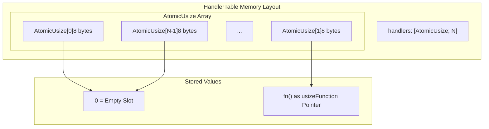
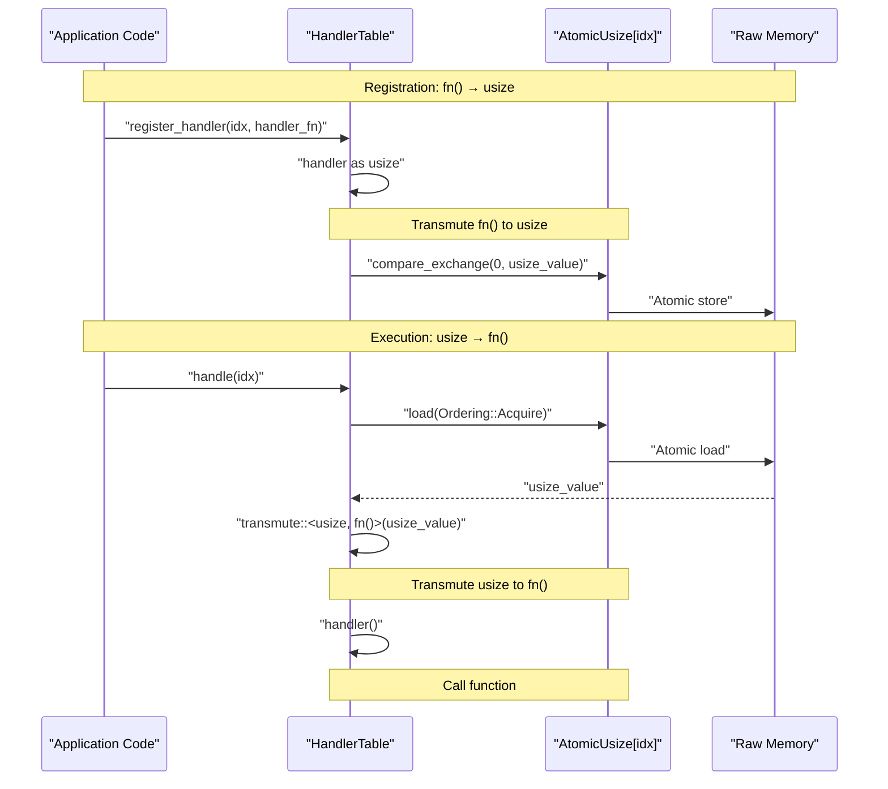
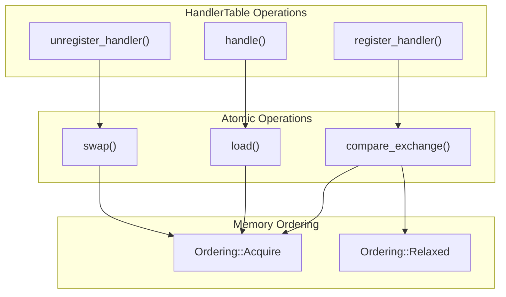
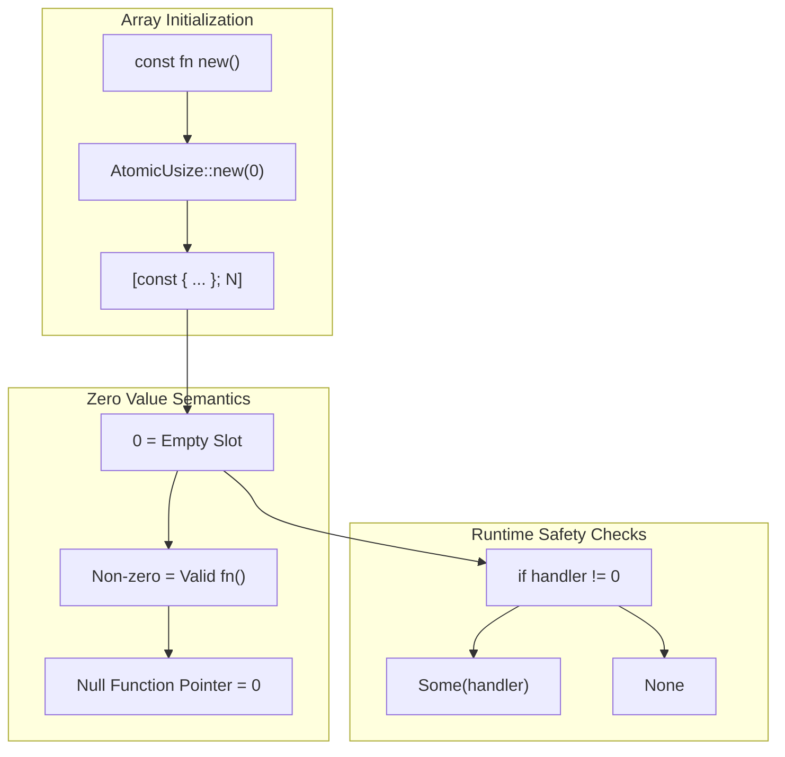
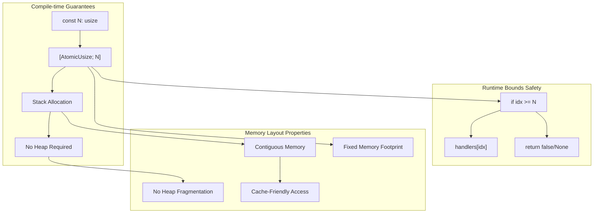
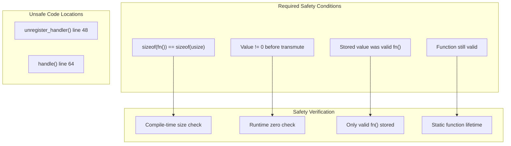

# Memory Layout and Safety

> **Relevant source files**
> * [src/lib.rs](https://github.com/arceos-org/handler_table/blob/036a12c4/src/lib.rs)

This document explains the memory layout of the `HandlerTable` structure and the safety mechanisms that ensure correct lock-free operation. It covers how function pointers are stored atomically, memory ordering guarantees, and the safety implications of pointer transmutation operations.

For information about the specific atomic operations used, see [Atomic Operations](/arceos-org/handler_table/3.1-atomic-operations). For general API usage patterns, see [API Reference](/arceos-org/handler_table/2.1-api-reference).

## Memory Layout Overview

The `HandlerTable<N>` structure has a simple but carefully designed memory layout that enables lock-free concurrent access to event handlers.

### HandlerTable Structure Layout

**HandlerTable Memory Characteristics**

|Property|Value|Rationale|
| --- | --- | --- |
|Size|N * size_of::<AtomicUsize>()|Fixed compile-time size|
|Alignment|align_of::<AtomicUsize>()|Platform atomic alignment|
|Initialization|All slots = 0|Zero represents empty slot|
|Mutability|Atomic operations only|Lock-free concurrency|

Sources: [src/lib.rs(L14 - L16)&emsp;](https://github.com/arceos-org/handler_table/blob/036a12c4/src/lib.rs#L14-L16) [src/lib.rs(L20 - L24)&emsp;](https://github.com/arceos-org/handler_table/blob/036a12c4/src/lib.rs#L20-L24)

## Function Pointer Storage Mechanism

The core safety challenge is storing function pointers (`fn()`) in atomic integers (`AtomicUsize`) while maintaining type safety and memory safety.

### Pointer Transmutation Process

**Transmutation Safety Requirements**

The unsafe transmute operations in the codebase rely on several critical safety invariants:

1. **Size Compatibility**: `size_of::<fn()>() == size_of::<usize>()` on the target platform
2. **Representation Compatibility**: Function pointers can be safely cast to/from usize
3. **Lifetime Management**: Function pointers remain valid for the lifetime of storage
4. **Non-zero Constraint**: Valid function pointers are never zero (allowing zero as "empty")

Sources: [src/lib.rs(L35)&emsp;](https://github.com/arceos-org/handler_table/blob/036a12c4/src/lib.rs#L35-L35) [src/lib.rs(L48)&emsp;](https://github.com/arceos-org/handler_table/blob/036a12c4/src/lib.rs#L48-L48) [src/lib.rs(L64)&emsp;](https://github.com/arceos-org/handler_table/blob/036a12c4/src/lib.rs#L64-L64)

## Memory Ordering Guarantees

The `HandlerTable` uses specific memory ordering constraints to ensure correct synchronization without locks.

### Ordering Operations Mapping

**Memory Ordering Analysis**

|Operation|Success Ordering|Failure Ordering|Purpose|
| --- | --- | --- | --- |
|compare_exchange|Acquire|Relaxed|Synchronize handler installation|
|load|Acquire|N/A|Ensure handler visibility|
|swap|Acquire|N/A|Synchronize handler removal|

The `Acquire` ordering ensures that:

* Handler installations are visible to all threads before the operation completes
* Handler loads see the most recent installed handler
* Handler removals synchronize with ongoing executions

Sources: [src/lib.rs(L35)&emsp;](https://github.com/arceos-org/handler_table/blob/036a12c4/src/lib.rs#L35-L35) [src/lib.rs(L46)&emsp;](https://github.com/arceos-org/handler_table/blob/036a12c4/src/lib.rs#L46-L46) [src/lib.rs(L62)&emsp;](https://github.com/arceos-org/handler_table/blob/036a12c4/src/lib.rs#L62-L62)

## Zero Value Semantics

The choice of zero as the "empty slot" marker has important memory safety implications.

### Zero Representation Safety

**Zero Value Safety Properties**

1. **Platform Guarantee**: On all supported platforms, null function pointers have value 0
2. **Initialization Safety**: `AtomicUsize::new(0)` is const and safe
3. **Detection Safety**: Zero checks reliably distinguish empty from occupied slots
4. **Transmute Safety**: Zero values are never transmuted to function pointers

Sources: [src/lib.rs(L22)&emsp;](https://github.com/arceos-org/handler_table/blob/036a12c4/src/lib.rs#L22-L22) [src/lib.rs(L47 - L51)&emsp;](https://github.com/arceos-org/handler_table/blob/036a12c4/src/lib.rs#L47-L51) [src/lib.rs(L63 - L68)&emsp;](https://github.com/arceos-org/handler_table/blob/036a12c4/src/lib.rs#L63-L68)

## Compile-time Safety Constraints

The generic constant `N` parameter provides compile-time memory safety guarantees.

### Fixed-Size Array Benefits

**Compile-time Safety Benefits**

* **No Dynamic Allocation**: Array size known at compile time, enabling `no_std` compatibility
* **Bounds Safety**: Array access bounds are checked explicitly before atomic operations
* **Memory Predictability**: Fixed memory footprint enables real-time system usage
* **Cache Locality**: Contiguous array layout optimizes memory access patterns

Sources: [src/lib.rs(L14 - L16)&emsp;](https://github.com/arceos-org/handler_table/blob/036a12c4/src/lib.rs#L14-L16) [src/lib.rs(L31 - L33)&emsp;](https://github.com/arceos-org/handler_table/blob/036a12c4/src/lib.rs#L31-L33) [src/lib.rs(L43 - L45)&emsp;](https://github.com/arceos-org/handler_table/blob/036a12c4/src/lib.rs#L43-L45) [src/lib.rs(L59 - L61)&emsp;](https://github.com/arceos-org/handler_table/blob/036a12c4/src/lib.rs#L59-L61)

## Unsafe Code Safety Analysis

The `HandlerTable` contains two `unsafe` blocks that require careful safety analysis.

### Transmute Safety Invariants

**Safety Argument Summary**

1. **Size Safety**: Function pointers and `usize` have identical size on all target platforms
2. **Value Safety**: Only valid function pointers (converted via `as usize`) are stored
3. **Zero Safety**: Runtime checks prevent transmuting zero values
4. **Lifetime Safety**: Event handlers typically have static lifetime in kernel contexts

The unsafe transmute operations are sound because they only reverse a previous safe cast operation under controlled conditions.

Sources: [src/lib.rs(L48)&emsp;](https://github.com/arceos-org/handler_table/blob/036a12c4/src/lib.rs#L48-L48) [src/lib.rs(L64)&emsp;](https://github.com/arceos-org/handler_table/blob/036a12c4/src/lib.rs#L64-L64)