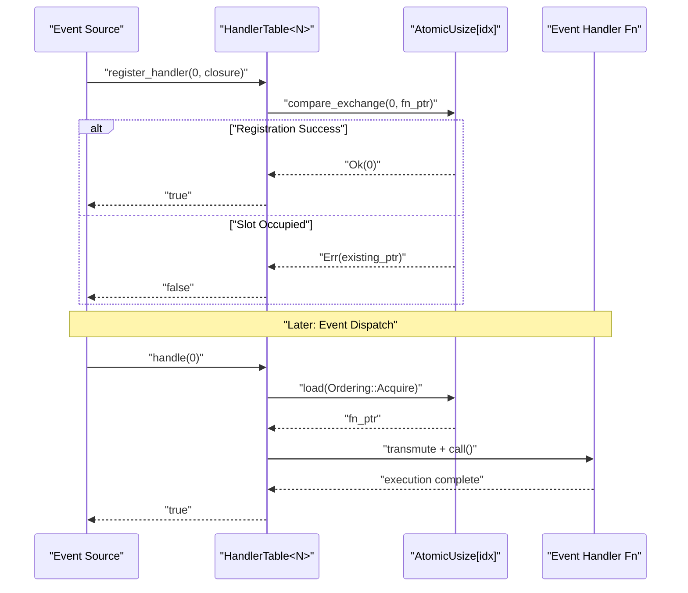
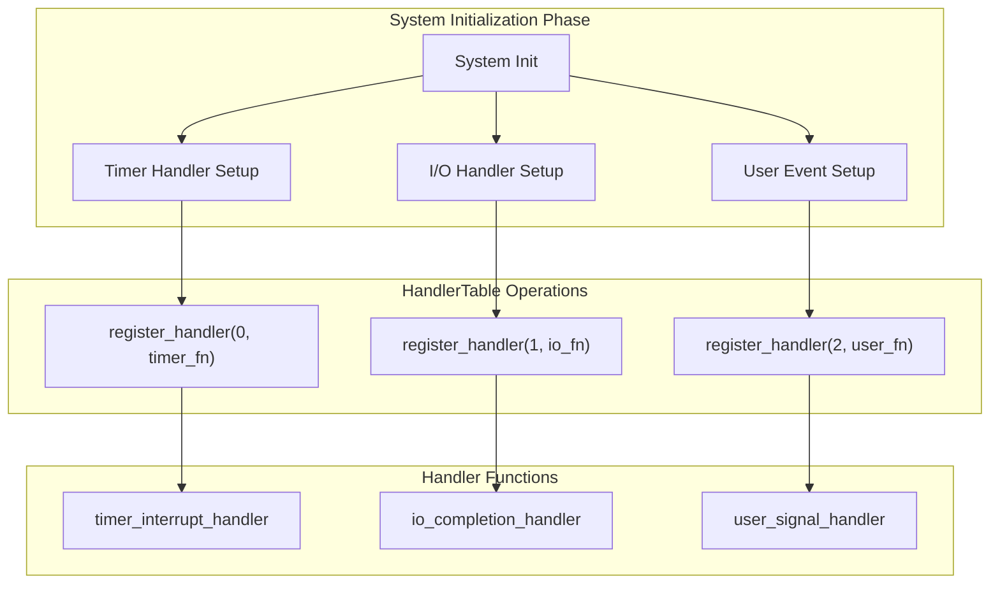
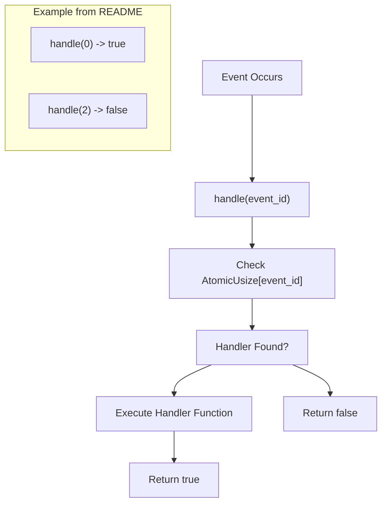
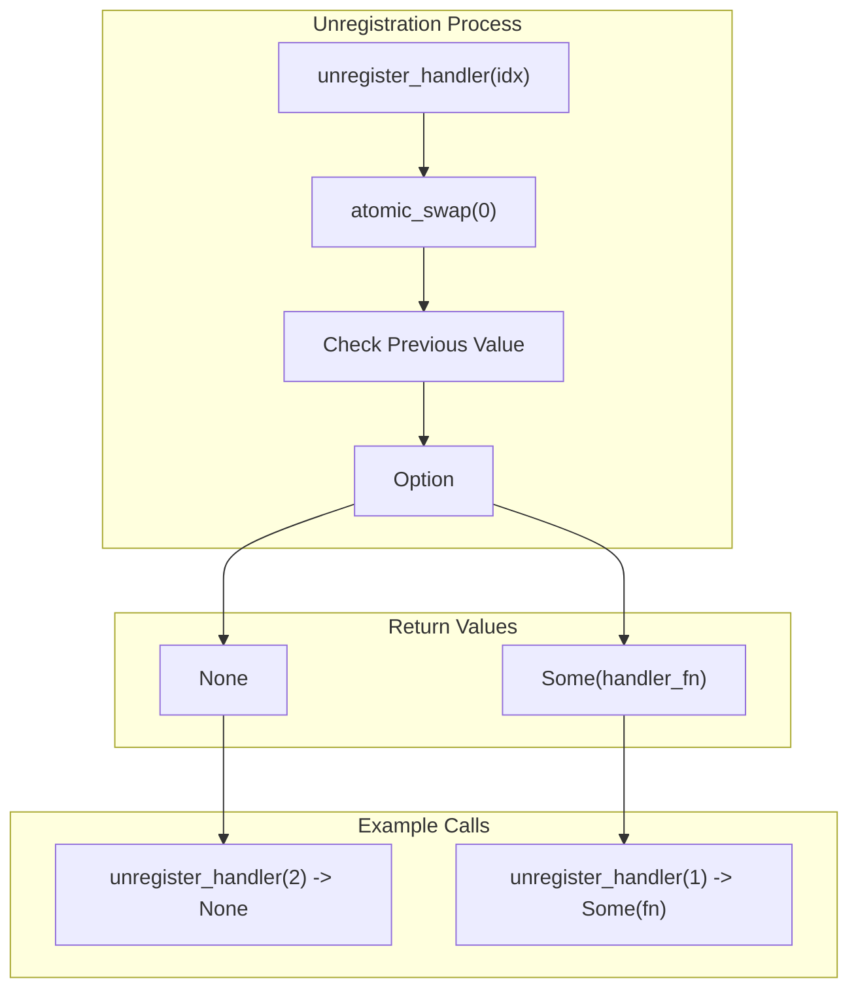
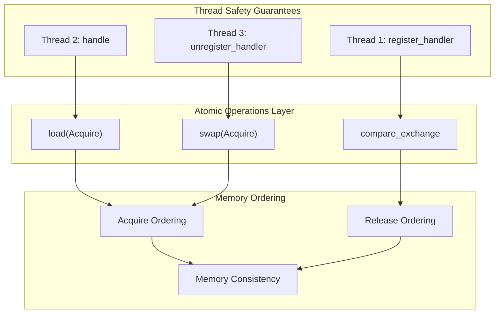
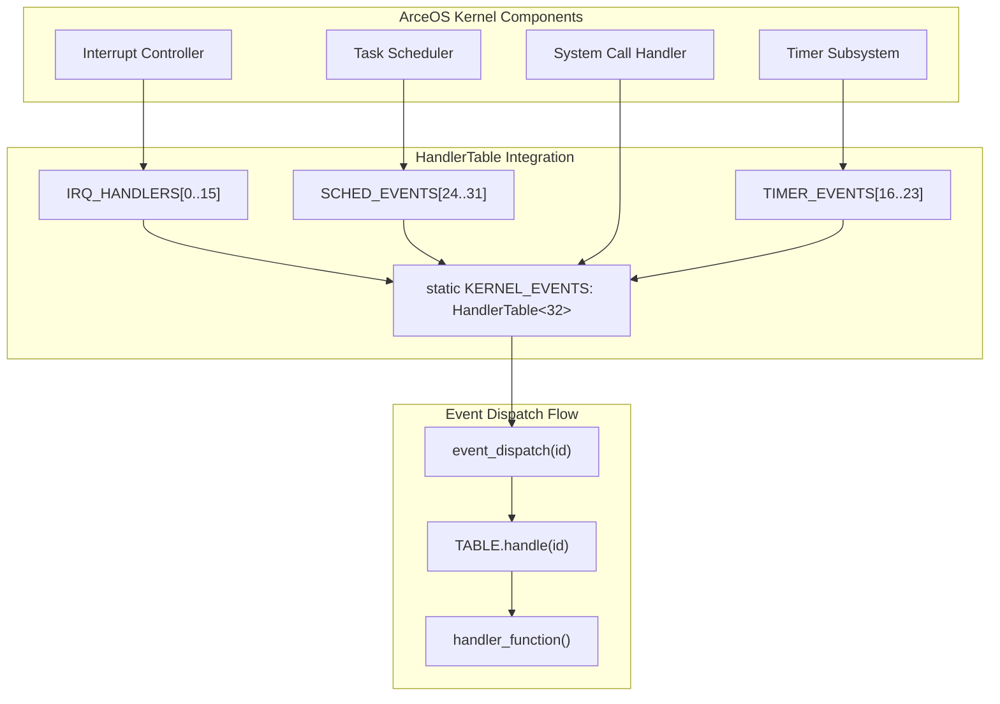
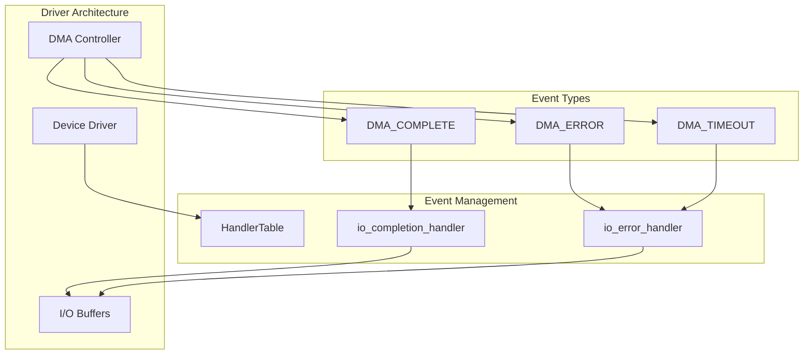

# Usage Examples

> **Relevant source files**
> * [README.md](https://github.com/arceos-org/handler_table/blob/036a12c4/README.md)

This document provides practical examples demonstrating how to use the `HandlerTable` API in real-world scenarios. It covers common usage patterns, integration strategies, and best practices for implementing lock-free event handling in no_std environments.

For detailed API documentation, see [API Reference](/arceos-org/handler_table/2.1-api-reference). For implementation details about the underlying atomic operations, see [Implementation Details](/arceos-org/handler_table/3-implementation-details).

## Basic Event Handler Registration

The fundamental usage pattern involves creating a static `HandlerTable`, registering event handlers, and dispatching events as they occur.

### Static Table Creation and Handler Registration

```

```

The basic pattern demonstrated in [README.md(L11 - L31)&emsp;](https://github.com/arceos-org/handler_table/blob/036a12c4/README.md#L11-L31) shows:

|Operation|Method|Purpose|
| --- | --- | --- |
|Creation|HandlerTable::new()|Initialize empty handler table|
|Registration|register_handler(idx, fn)|Associate handler function with event ID|
|Dispatch|handle(idx)|Execute registered handler for event|
|Cleanup|unregister_handler(idx)|Remove and retrieve handler function|

Sources: [README.md(L11 - L31)&emsp;](https://github.com/arceos-org/handler_table/blob/036a12c4/README.md#L11-L31)

## Event Registration Patterns

### Single Event Handler Registration

The most common pattern involves registering individual handlers for specific event types. Each handler is a closure or function pointer that gets executed when the corresponding event occurs.



Sources: [README.md(L16 - L21)&emsp;](https://github.com/arceos-org/handler_table/blob/036a12c4/README.md#L16-L21)

### Multiple Handler Registration

For systems handling multiple event types, handlers are typically registered during initialization:



Sources: [README.md(L16 - L21)&emsp;](https://github.com/arceos-org/handler_table/blob/036a12c4/README.md#L16-L21)

## Event Handling Scenarios

### Successful Event Dispatch

When an event occurs and a handler is registered, the `handle` method executes the associated function and returns `true`:



The example in [README.md(L23 - L24)&emsp;](https://github.com/arceos-org/handler_table/blob/036a12c4/README.md#L23-L24) demonstrates both successful dispatch (`handle(0)` returns `true`) and missing handler scenarios (`handle(2)` returns `false`).

Sources: [README.md(L23 - L24)&emsp;](https://github.com/arceos-org/handler_table/blob/036a12c4/README.md#L23-L24)

### Handler Retrieval and Cleanup

The `unregister_handler` method provides atomic removal and retrieval of handler functions:



The pattern shown in [README.md(L26 - L28)&emsp;](https://github.com/arceos-org/handler_table/blob/036a12c4/README.md#L26-L28) demonstrates retrieving a previously registered handler function, which can then be called directly.

Sources: [README.md(L26 - L30)&emsp;](https://github.com/arceos-org/handler_table/blob/036a12c4/README.md#L26-L30)

## Advanced Usage Patterns

### Concurrent Handler Management

In multi-threaded environments, multiple threads can safely register, handle, and unregister events without synchronization primitives:



Sources: [README.md(L14)&emsp;](https://github.com/arceos-org/handler_table/blob/036a12c4/README.md#L14-L14)

### Static vs Dynamic Handler Tables

The compile-time sized `HandlerTable<N>` enables static allocation suitable for no_std environments:

|Approach|Declaration|Use Case|
| --- | --- | --- |
|Static Global|static TABLE: HandlerTable<8>|System-wide event handling|
|Local Instance|let table = HandlerTable::<16>::new()|Component-specific events|
|Const Generic|HandlerTable<MAX_EVENTS>|Configurable event capacity|

The static approach shown in [README.md(L14)&emsp;](https://github.com/arceos-org/handler_table/blob/036a12c4/README.md#L14-L14) is preferred for kernel-level integration where heap allocation is unavailable.

Sources: [README.md(L14)&emsp;](https://github.com/arceos-org/handler_table/blob/036a12c4/README.md#L14-L14)

## Integration Examples

### ArceOS Kernel Integration

In the ArceOS operating system context, `HandlerTable` serves as the central event dispatch mechanism:



Sources: [README.md(L7)&emsp;](https://github.com/arceos-org/handler_table/blob/036a12c4/README.md#L7-L7)

### Device Driver Event Handling

Device drivers can use dedicated handler tables for managing I/O completion events:



This pattern allows drivers to maintain separate event handling contexts while leveraging the same lock-free infrastructure.

Sources: [README.md(L7)&emsp;](https://github.com/arceos-org/handler_table/blob/036a12c4/README.md#L7-L7)