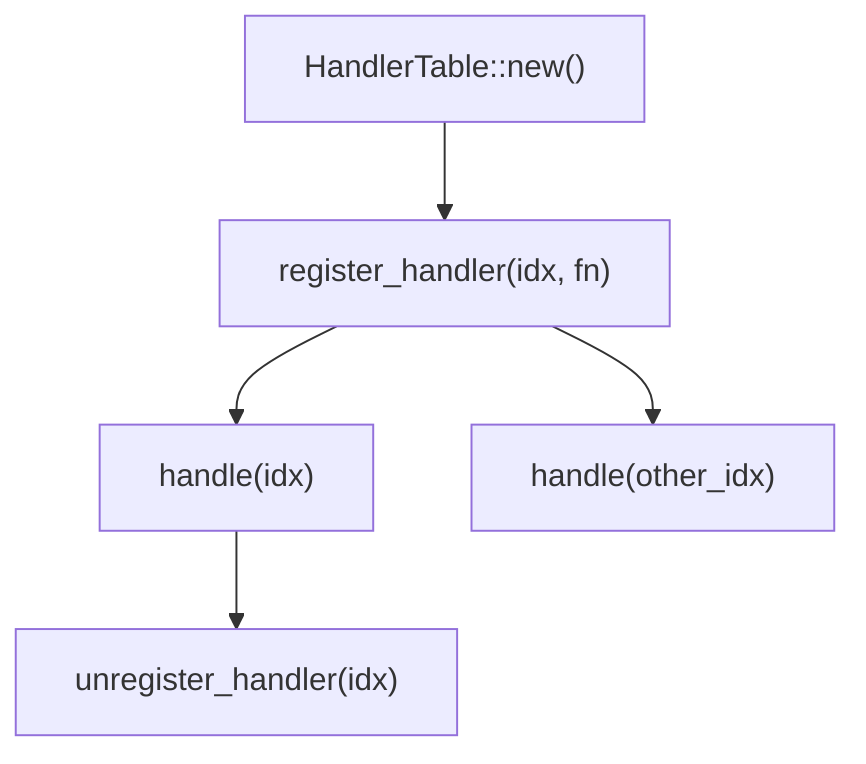
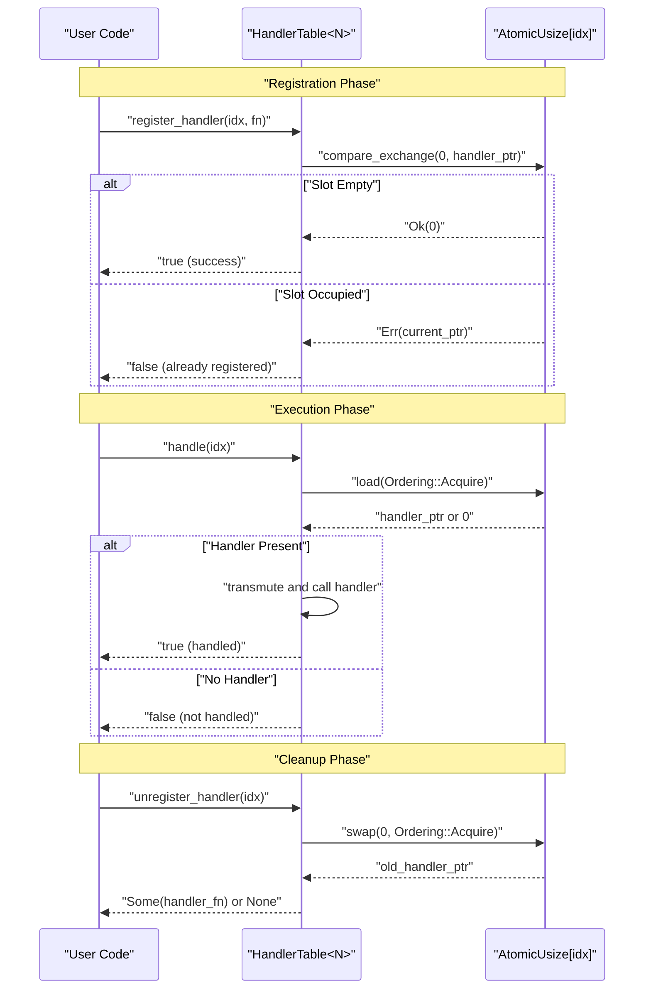
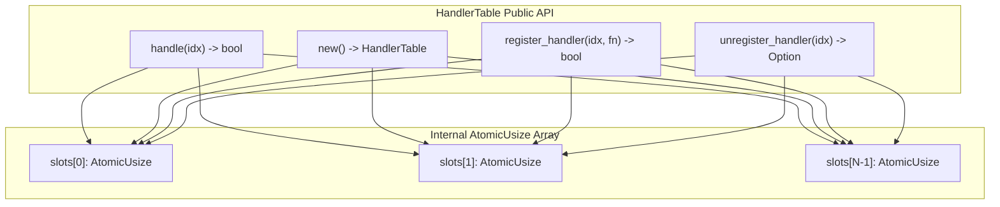

# User Guide

> **Relevant source files**
> * [README.md](https://github.com/arceos-org/handler_table/blob/036a12c4/README.md)

This guide provides practical instructions for using the `handler_table` crate in your applications. The guide covers the complete API usage workflow, from initialization through event handling and cleanup. For detailed API documentation, see [API Reference](/arceos-org/handler_table/2.1-api-reference), and for comprehensive examples, see [Usage Examples](/arceos-org/handler_table/2.2-usage-examples). For implementation details and internals, see [Implementation Details](/arceos-org/handler_table/3-implementation-details).

## Overview

The `HandlerTable<N>` provides a lock-free, fixed-size table for registering and invoking event handlers. It is designed for `no_std` environments where traditional synchronization primitives are unavailable or undesirable. The table uses atomic operations to ensure thread safety without blocking.

**Core Usage Pattern:**



**Sources:** [README.md(L1 - L32)&emsp;](https://github.com/arceos-org/handler_table/blob/036a12c4/README.md#L1-L32)

## Key Concepts

The `HandlerTable<N>` operates on several fundamental concepts:

|Concept|Description|Code Entity|
| --- | --- | --- |
|Fixed Size|Table size determined at compile time|HandlerTable<N>generic parameter|
|Event Index|Numeric identifier for each event type|idxparameter in methods|
|Handler Function|Zero-argument closure or function pointer|FnOnce()trait bound|
|Atomic Storage|Lock-free concurrent access|InternalAtomicUsizearray|

### Handler Table Lifecycle

```

```

**Sources:** [README.md(L11 - L31)&emsp;](https://github.com/arceos-org/handler_table/blob/036a12c4/README.md#L11-L31)

## Quick Start Example

The basic usage follows a simple pattern of registration, handling, and optional cleanup:

```javascript
use handler_table::HandlerTable;

// Create a table with 8 slots
static TABLE: HandlerTable<8> = HandlerTable::new();

// Register handlers for specific event indices
TABLE.register_handler(0, || {
    println!("Hello, event 0!");
});
TABLE.register_handler(1, || {
    println!("Hello, event 1!");
});

// Handle events by index
assert!(TABLE.handle(0));  // Returns true, prints message
assert!(!TABLE.handle(2)); // Returns false, no handler registered

// Unregister and retrieve handlers
let handler = TABLE.unregister_handler(1).unwrap();
handler(); // Can still call the retrieved handler
```

**Sources:** [README.md(L11 - L31)&emsp;](https://github.com/arceos-org/handler_table/blob/036a12c4/README.md#L11-L31)

## API Workflow

The following diagram shows how the main API methods interact with the internal atomic storage:



**Sources:** [README.md(L16 - L30)&emsp;](https://github.com/arceos-org/handler_table/blob/036a12c4/README.md#L16-L30)

## Core API Methods

The `HandlerTable<N>` provides four essential methods for handler management:

### Initialization

* **`HandlerTable::new()`** - Creates a new empty handler table with all slots initialized to zero

### Registration

* **`register_handler(idx: usize, handler: impl FnOnce())`** - Atomically registers a handler function at the specified index
* Returns `true` if registration succeeds
* Returns `false` if a handler is already registered at that index

### Execution

* **`handle(idx: usize)`** - Invokes the handler registered at the specified index
* Returns `true` if a handler was found and executed
* Returns `false` if no handler is registered at that index

### Cleanup

* **`unregister_handler(idx: usize)`** - Atomically removes and returns the handler at the specified index
* Returns `Some(handler)` if a handler was registered
* Returns `None` if no handler was registered



**Sources:** [README.md(L16 - L30)&emsp;](https://github.com/arceos-org/handler_table/blob/036a12c4/README.md#L16-L30)

## Best Practices

### Size Selection

Choose the table size `N` based on your maximum expected number of concurrent event types. The size is fixed at compile time and cannot be changed dynamically.

### Index Management

* Use consistent index values across your application
* Consider defining constants for event indices to avoid magic numbers
* Ensure indices are within bounds (0 to N-1)

### Handler Design

* Keep handlers lightweight and fast-executing
* Avoid blocking operations within handlers
* Consider handler re-entrancy if the same index might be triggered during execution

### Concurrent Usage

* Multiple threads can safely call any method simultaneously
* Registration conflicts return `false` rather than blocking
* Handler execution is atomic but the handler itself may not be re-entrant

### Error Handling

* Check return values from `register_handler()` to handle registration conflicts
* Check return values from `handle()` to distinguish between handled and unhandled events
* Use the return value from `unregister_handler()` to verify successful removal

**Sources:** [README.md(L1 - L32)&emsp;](https://github.com/arceos-org/handler_table/blob/036a12c4/README.md#L1-L32)