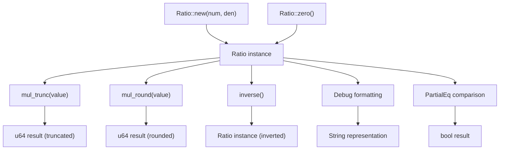
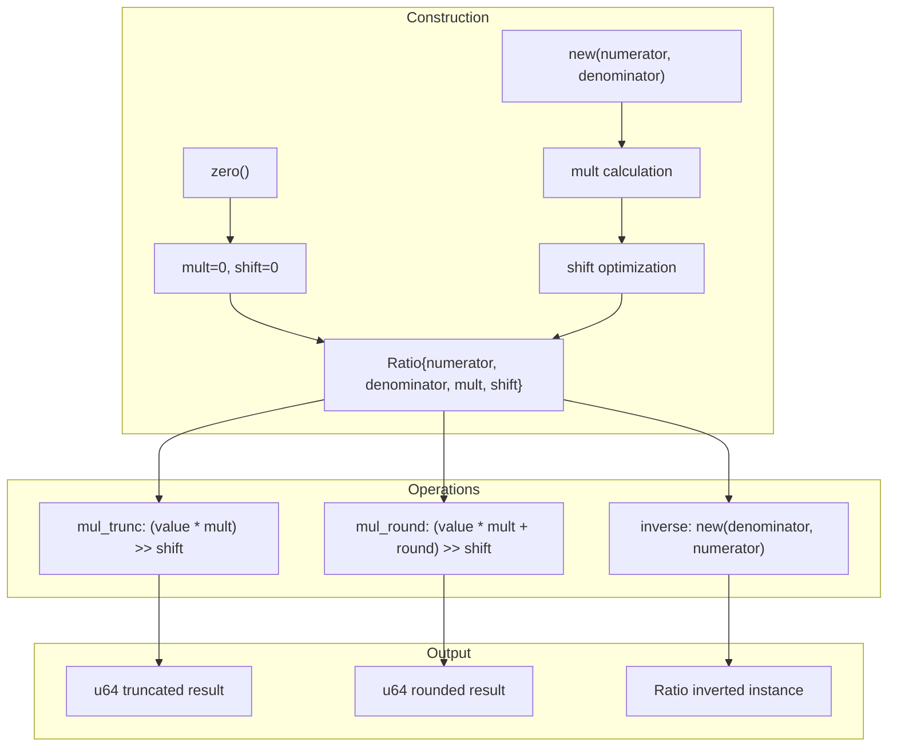

# API Reference

> **Relevant source files**
> * [README.md](https://github.com/arceos-org/int_ratio/blob/c753d341/README.md)
> * [src/lib.rs](https://github.com/arceos-org/int_ratio/blob/c753d341/src/lib.rs)

This document provides comprehensive documentation of all public APIs in the `int_ratio` crate. It covers the `Ratio` struct, its constructors, arithmetic operations, and utility methods. For implementation details of the internal architecture, see [Internal Architecture](/arceos-org/int_ratio/2.1-internal-architecture). For mathematical principles behind the optimization strategy, see [Mathematical Foundation](/arceos-org/int_ratio/2.3-mathematical-foundation).

## Core Type

### Ratio Struct

The `Ratio` struct is the central type that represents a rational number optimized for performance through a `mult/(1<<shift)` representation.

|Field|Type|Purpose|
| --- | --- | --- |
|numerator|u32|Original numerator value|
|denominator|u32|Original denominator value|
|mult|u32|Optimized multiplication factor|
|shift|u32|Bit shift amount for division|

The struct implements `Clone`, `Copy`, `Debug`, and `PartialEq` traits for convenience.

Sources: [src/lib.rs(L13 - L19)&emsp;](https://github.com/arceos-org/int_ratio/blob/c753d341/src/lib.rs#L13-L19)

## Constructor Methods

### Ratio::new

```javascript
pub const fn new(numerator: u32, denominator: u32) -> Self
```

Creates a new ratio from `numerator/denominator`. The constructor performs optimization to convert the fraction into `mult/(1<<shift)` form for efficient arithmetic operations.

**Behavior:**

* Panics if `denominator` is zero and `numerator` is non-zero
* Returns a zero ratio if `numerator` is zero
* Calculates optimal `mult` and `shift` values to maximize precision
* Removes common factors of 2 to minimize `shift`

**Example from codebase:**

```javascript
let ratio = Ratio::new(625_000, 1_000_000); // Results in mult=5, shift=3
```

Sources: [src/lib.rs(L51 - L84)&emsp;](https://github.com/arceos-org/int_ratio/blob/c753d341/src/lib.rs#L51-L84)

### Ratio::zero

```javascript
pub const fn zero() -> Self
```

Creates a special zero ratio with `numerator=0` and `denominator=0`. This differs from other zero ratios (`0/x`) because it does not panic when inverted, instead returning another zero ratio.

**Example from codebase:**

```javascript
let zero = Ratio::zero();
assert_eq!(zero.mul_trunc(123), 0);
assert_eq!(zero.inverse(), Ratio::zero());
```

Sources: [src/lib.rs(L37 - L44)&emsp;](https://github.com/arceos-org/int_ratio/blob/c753d341/src/lib.rs#L37-L44)

## Arithmetic Operations

### mul_trunc

```javascript
pub const fn mul_trunc(self, value: u64) -> u64
```

Multiplies the ratio by a value and truncates (rounds down) the result. Uses the optimized `mult` and `shift` values to avoid expensive division.

**Implementation:** `((value * mult) >> shift)`

**Example from codebase:**

```javascript
let ratio = Ratio::new(2, 3);
assert_eq!(ratio.mul_trunc(100), 66); // trunc(100 * 2 / 3) = trunc(66.66...) = 66
```

Sources: [src/lib.rs(L114 - L116)&emsp;](https://github.com/arceos-org/int_ratio/blob/c753d341/src/lib.rs#L114-L116)

### mul_round

```javascript
pub const fn mul_round(self, value: u64) -> u64
```

Multiplies the ratio by a value and rounds to the nearest whole number. Adds a rounding factor before shifting.

**Implementation:** `((value * mult + (1 << shift >> 1)) >> shift)`

**Example from codebase:**

```javascript
let ratio = Ratio::new(2, 3);
assert_eq!(ratio.mul_round(100), 67); // round(100 * 2 / 3) = round(66.66...) = 67
```

Sources: [src/lib.rs(L130 - L132)&emsp;](https://github.com/arceos-org/int_ratio/blob/c753d341/src/lib.rs#L130-L132)

## Utility Methods

### inverse

```javascript
pub const fn inverse(self) -> Self
```

Returns the mathematical inverse of the ratio by swapping numerator and denominator. Handles the special zero ratio case gracefully.

**Example from codebase:**

```javascript
let ratio = Ratio::new(1, 2);
assert_eq!(ratio.inverse(), Ratio::new(2, 1));
```

Sources: [src/lib.rs(L99 - L101)&emsp;](https://github.com/arceos-org/int_ratio/blob/c753d341/src/lib.rs#L99-L101)

## Trait Implementations

### Debug

The `Debug` trait provides readable output showing both original and optimized representations:

```css
// Format: "Ratio(numerator/denominator ~= mult/(1<<shift))"
println!("{:?}", Ratio::new(1, 3)); // Ratio(1/3 ~= 1431655765/4294967296)
```

Sources: [src/lib.rs(L135 - L146)&emsp;](https://github.com/arceos-org/int_ratio/blob/c753d341/src/lib.rs#L135-L146)

### PartialEq

Equality comparison based on the optimized `mult` and `shift` values rather than original numerator/denominator:

```rust
fn eq(&self, other: &Ratio) -> bool {
    self.mult == other.mult && self.shift == other.shift
}
```

Sources: [src/lib.rs(L148 - L153)&emsp;](https://github.com/arceos-org/int_ratio/blob/c753d341/src/lib.rs#L148-L153)

## API Usage Patterns

**Method Call Flow Diagram**



Sources: [src/lib.rs(L21 - L153)&emsp;](https://github.com/arceos-org/int_ratio/blob/c753d341/src/lib.rs#L21-L153)

## Method Relationship and Data Flow

**Ratio Internal State and Operations**



Sources: [src/lib.rs(L51 - L132)&emsp;](https://github.com/arceos-org/int_ratio/blob/c753d341/src/lib.rs#L51-L132)

## Performance Characteristics

|Operation|Time Complexity|Notes|
| --- | --- | --- |
|new()|O(1)|Constant time optimization during construction|
|zero()|O(1)|Direct field assignment|
|mul_trunc()|O(1)|Single multiplication and bit shift|
|mul_round()|O(1)|Single multiplication, addition, and bit shift|
|inverse()|O(1)|Callsnew()with swapped parameters|

The key performance benefit is that all arithmetic operations use multiplication and bit shifts instead of division, making them suitable for embedded and real-time systems.

Sources: [src/lib.rs(L114 - L116)&emsp;](https://github.com/arceos-org/int_ratio/blob/c753d341/src/lib.rs#L114-L116) [src/lib.rs(L130 - L132)&emsp;](https://github.com/arceos-org/int_ratio/blob/c753d341/src/lib.rs#L130-L132)