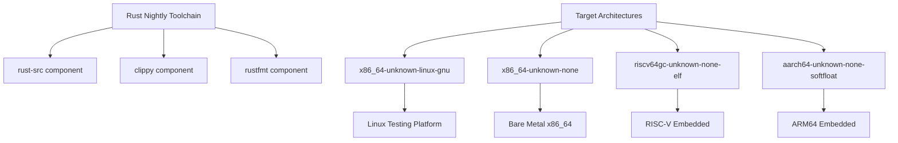
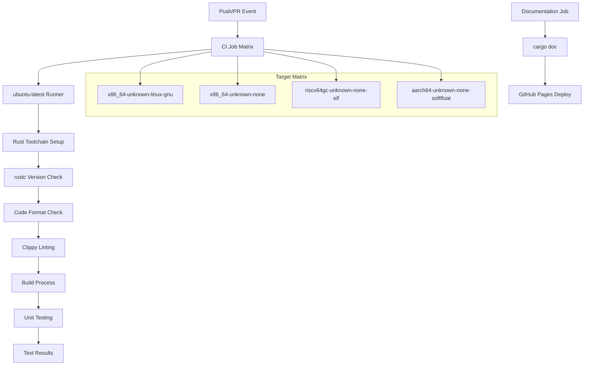
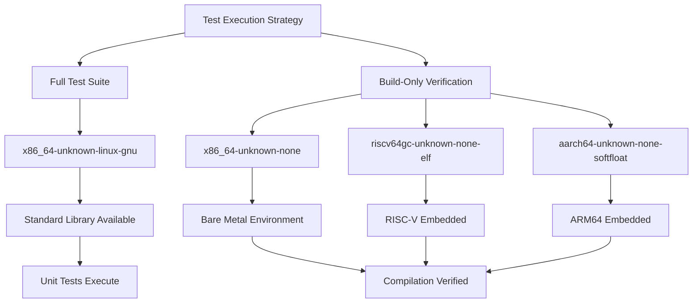
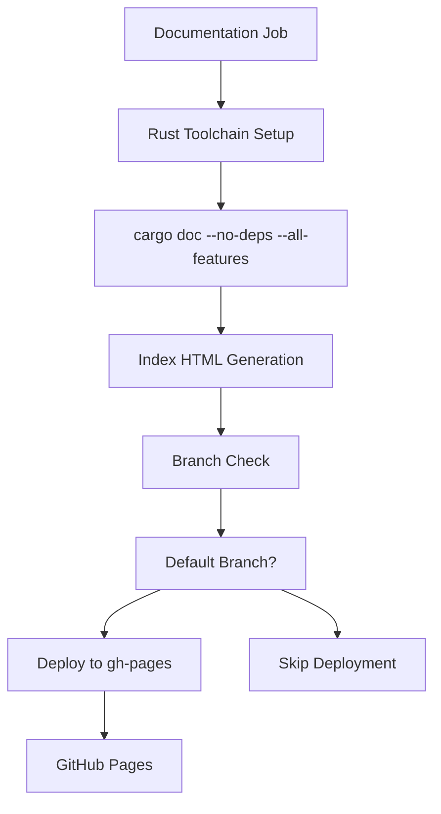

# Development Guide

> **Relevant source files**
> * [.github/workflows/ci.yml](https://github.com/arceos-org/int_ratio/blob/c753d341/.github/workflows/ci.yml)
> * [.gitignore](https://github.com/arceos-org/int_ratio/blob/c753d341/.gitignore)

This document provides comprehensive information for developers contributing to the int_ratio crate. It covers development environment setup, continuous integration pipeline, code quality standards, and testing procedures across multiple target architectures. For information about using the int_ratio API in applications, see [Usage Guide](/arceos-org/int_ratio/3-usage-guide). For details about the internal implementation, see [Ratio Type Implementation](/arceos-org/int_ratio/2-ratio-type-implementation).

## Development Environment Setup

The int_ratio crate requires a Rust nightly toolchain with specific components and target support for cross-platform compatibility testing.

### Required Toolchain Configuration

The development environment must include:

* **Rust Toolchain**: `nightly` channel
* **Components**: `rust-src`, `clippy`, `rustfmt`
* **Target Architectures**: `x86_64-unknown-linux-gnu`, `x86_64-unknown-none`, `riscv64gc-unknown-none-elf`, `aarch64-unknown-none-softfloat`

**Development Environment Architecture**

Sources: [.github/workflows/ci.yml(L15 - L19)&emsp;](https://github.com/arceos-org/int_ratio/blob/c753d341/.github/workflows/ci.yml#L15-L19)

## CI Pipeline Architecture

The continuous integration system employs a matrix strategy to ensure cross-platform compatibility and maintain code quality standards.

**CI Pipeline Flow and Target Matrix**

### Pipeline Stages

|Stage|Command|Purpose|Target Scope|
| --- | --- | --- | --- |
|Format Check|cargo fmt --all -- --check|Enforce code style consistency|All targets|
|Linting|cargo clippy --target $TARGET --all-features|Static analysis and best practices|Per target|
|Build|cargo build --target $TARGET --all-features|Compilation verification|Per target|
|Unit Test|cargo test --target $TARGET -- --nocapture|Functional testing|Linux only|

Sources: [.github/workflows/ci.yml(L22 - L30)&emsp;](https://github.com/arceos-org/int_ratio/blob/c753d341/.github/workflows/ci.yml#L22-L30)

## Code Quality Standards

The project enforces strict code quality through automated tooling integrated into the CI pipeline.

### Formatting Requirements

Code formatting uses `rustfmt` with default configuration. All contributions must pass the format check defined in [.github/workflows/ci.yml(L22 - L23)&emsp;](https://github.com/arceos-org/int_ratio/blob/c753d341/.github/workflows/ci.yml#L22-L23)

### Linting Standards

Clippy linting runs with custom configuration allowing the `clippy::new_without_default` warning, as specified in [.github/workflows/ci.yml(L24 - L25)&emsp;](https://github.com/arceos-org/int_ratio/blob/c753d341/.github/workflows/ci.yml#L24-L25) This exception acknowledges that the `Ratio::new` constructor appropriately requires explicit parameters.

### Documentation Standards

Documentation builds enforce strict standards through `RUSTDOCFLAGS` configuration:

* `-D rustdoc::broken_intra_doc_links`: Fails on broken internal links
* `-D missing-docs`: Requires documentation for all public items

Sources: [.github/workflows/ci.yml(L40)&emsp;](https://github.com/arceos-org/int_ratio/blob/c753d341/.github/workflows/ci.yml#L40-L40)

## Testing Strategy

The testing approach balances comprehensive platform coverage with practical constraints of embedded target environments.

**Multi-Architecture Testing Strategy**

### Platform-Specific Testing

* **Linux Platform** (`x86_64-unknown-linux-gnu`): Full unit test execution with `--nocapture` flag for detailed output
* **Embedded Targets**: Build verification only due to runtime environment constraints

The conditional test execution logic is implemented in [.github/workflows/ci.yml(L28 - L30)&emsp;](https://github.com/arceos-org/int_ratio/blob/c753d341/.github/workflows/ci.yml#L28-L30)

Sources: [.github/workflows/ci.yml(L11 - L12)&emsp;](https://github.com/arceos-org/int_ratio/blob/c753d341/.github/workflows/ci.yml#L11-L12) [.github/workflows/ci.yml(L28 - L30)&emsp;](https://github.com/arceos-org/int_ratio/blob/c753d341/.github/workflows/ci.yml#L28-L30)

## Documentation Deployment

The project maintains automated documentation deployment to GitHub Pages with the following workflow:

**Documentation Build and Deployment Process**

The documentation system automatically generates API documentation and deploys it to GitHub Pages when changes are pushed to the default branch, as configured in [.github/workflows/ci.yml(L49 - L55)&emsp;](https://github.com/arceos-org/int_ratio/blob/c753d341/.github/workflows/ci.yml#L49-L55)

Sources: [.github/workflows/ci.yml(L32 - L55)&emsp;](https://github.com/arceos-org/int_ratio/blob/c753d341/.github/workflows/ci.yml#L32-L55)

## Contributing Workflow

### Pre-Contribution Checklist

Before submitting contributions, ensure:

1. **Local Testing**: Run `cargo test` on `x86_64-unknown-linux-gnu` target
2. **Format Compliance**: Execute `cargo fmt --all -- --check`
3. **Lint Compliance**: Run `cargo clippy --all-features` for each target
4. **Build Verification**: Confirm `cargo build` succeeds on all targets

### Repository Configuration

The project uses standard Git configuration with build artifacts excluded via [.gitignore(L1 - L4)&emsp;](https://github.com/arceos-org/int_ratio/blob/c753d341/.gitignore#L1-L4)

Sources: [.gitignore(L1 - L4)&emsp;](https://github.com/arceos-org/int_ratio/blob/c753d341/.gitignore#L1-L4)