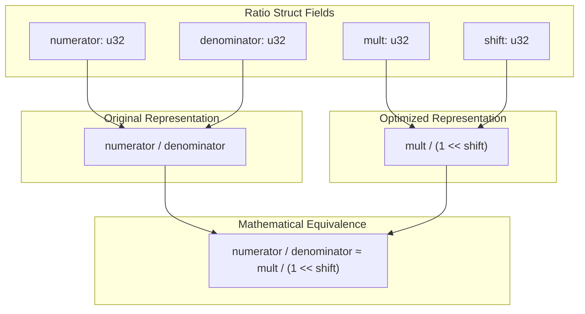
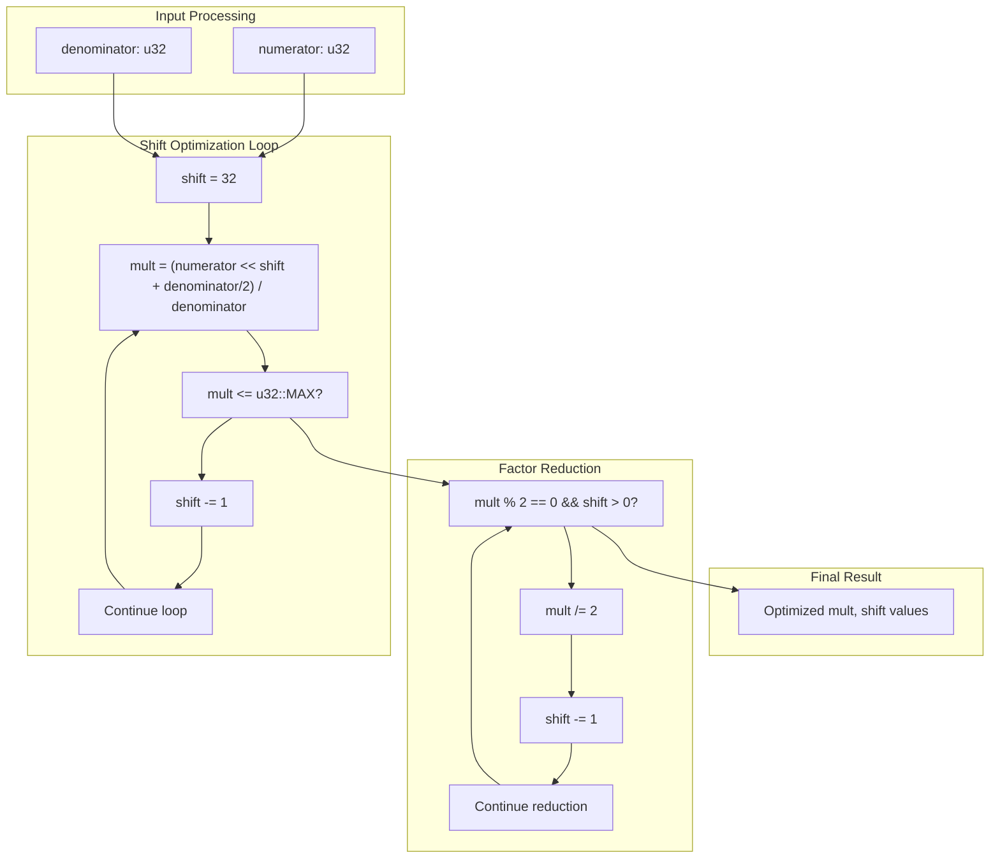
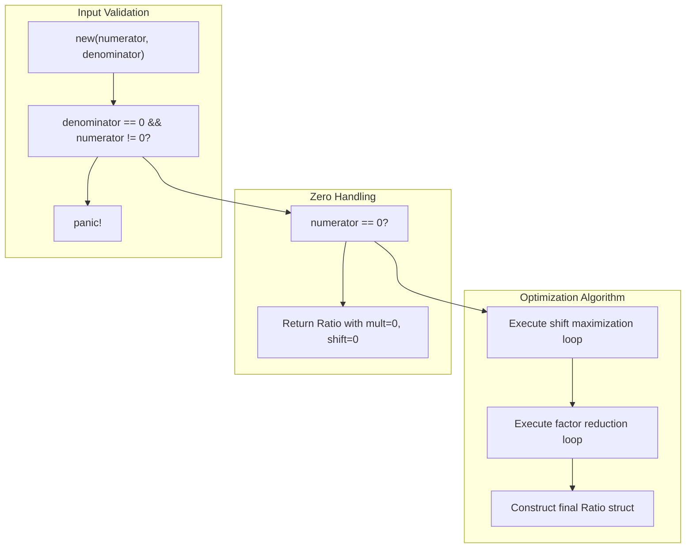
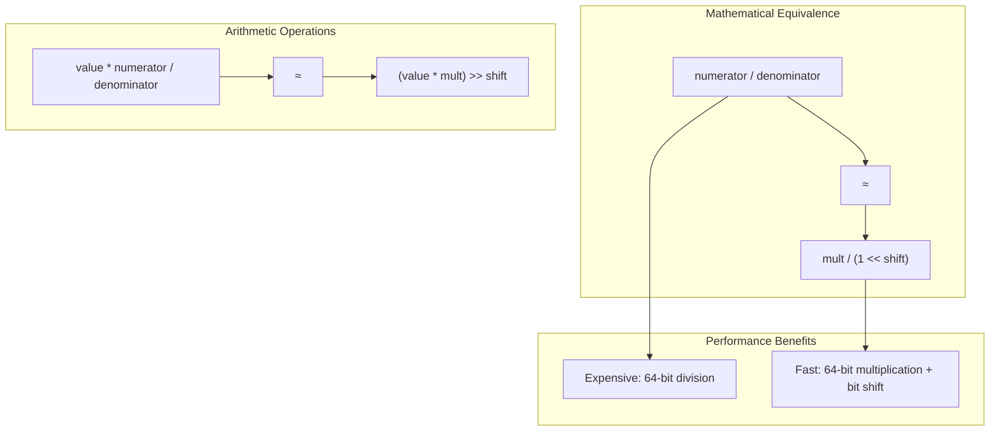
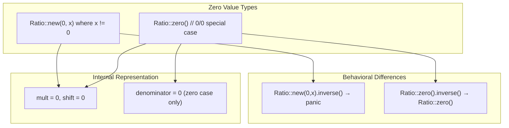

# Internal Architecture

> **Relevant source files**
> * [src/lib.rs](https://github.com/arceos-org/int_ratio/blob/c753d341/src/lib.rs)

This document explains the internal design and optimization strategies of the `Ratio` struct, focusing on how it transforms traditional fractional representation into a high-performance `mult/(1<<shift)` format. This page covers the core data structure, field relationships, and the constructor optimization algorithm that enables division-free arithmetic operations.

For information about the public API methods and their usage, see [API Reference](/arceos-org/int_ratio/2.2-api-reference). For the mathematical principles underlying the optimization strategy, see [Mathematical Foundation](/arceos-org/int_ratio/2.3-mathematical-foundation).

## Core Data Structure

The `Ratio` struct stores both the original rational number representation and its optimized computational form. This dual representation enables both mathematical correctness and performance optimization.

**Ratio Struct Field Mapping**

The struct maintains four fields that work together to provide both the original rational number and its optimized computational equivalent:

|Field|Type|Purpose|Usage|
| --- | --- | --- | --- |
|numerator|u32|Original fraction numerator|Mathematical operations, inverse calculation|
|denominator|u32|Original fraction denominator|Mathematical operations, inverse calculation|
|mult|u32|Optimized multiplier|Fast arithmetic via(value * mult) >> shift|
|shift|u32|Bit shift amount|Replaces division with bit shifting|

Sources: [src/lib.rs(L13 - L19)&emsp;](https://github.com/arceos-org/int_ratio/blob/c753d341/src/lib.rs#L13-L19)

## Mult/Shift Transformation Algorithm

The core optimization transforms any rational number `numerator/denominator` into an equivalent `mult/(1<<shift)` representation. This transformation enables replacing expensive division operations with fast bit shifts during arithmetic operations.

**Transformation Process**

The algorithm operates in two phases to find the optimal `mult` and `shift` values:

1. **Shift Maximization Phase** [src/lib.rs(L63 - L71)&emsp;](https://github.com/arceos-org/int_ratio/blob/c753d341/src/lib.rs#L63-L71):

* Starts with `shift = 32` (maximum precision)
* Calculates `mult = (numerator << shift + denominator/2) / denominator`
* Reduces `shift` until `mult` fits in `u32::MAX`
* The `+ denominator/2` term provides rounding during the division
2. **Factor Reduction Phase** [src/lib.rs(L73 - L76)&emsp;](https://github.com/arceos-org/int_ratio/blob/c753d341/src/lib.rs#L73-L76):

* Removes common factors of 2 from `mult` and `shift`
* Continues while `mult` is even and `shift > 0`
* Optimizes for the smallest possible `mult` value

Sources: [src/lib.rs(L62 - L84)&emsp;](https://github.com/arceos-org/int_ratio/blob/c753d341/src/lib.rs#L62-L84)

## Constructor Logic Flow

The `new` constructor implements the transformation algorithm with special handling for edge cases and zero values.

**Edge Case Handling**

The constructor provides specific behavior for mathematical edge cases:

* **Invalid Division** [src/lib.rs(L52)&emsp;](https://github.com/arceos-org/int_ratio/blob/c753d341/src/lib.rs#L52-L52): Panics when `denominator == 0` and `numerator != 0`
* **Zero Numerator** [src/lib.rs(L53 - L60)&emsp;](https://github.com/arceos-org/int_ratio/blob/c753d341/src/lib.rs#L53-L60): Returns a ratio with `mult = 0, shift = 0` for any `0/x` case
* **Zero Ratio** [src/lib.rs(L37 - L44)&emsp;](https://github.com/arceos-org/int_ratio/blob/c753d341/src/lib.rs#L37-L44): Special `zero()` constructor creates `0/0` ratio that doesn't panic on inversion

Sources: [src/lib.rs(L46 - L84)&emsp;](https://github.com/arceos-org/int_ratio/blob/c753d341/src/lib.rs#L46-L84)

## Internal Field Relationships

The optimized fields maintain mathematical equivalence with the original fraction while enabling performance optimizations.

**Precision vs Performance Trade-offs**

The transformation balances mathematical precision with computational efficiency:

|Aspect|Traditional|Optimized|
| --- | --- | --- |
|Representation|numerator/denominator|mult/(1<<shift)|
|Arithmetic|(value * num) / denom|(value * mult) >> shift|
|Operations|Division (expensive)|Multiplication + Bit shift|
|Precision|Exact|Approximated withinu32constraints|
|Performance|Slower on embedded|Optimized for embedded targets|

The `shift` value is maximized to preserve as much precision as possible within the `u32` constraint for `mult`. The factor reduction phase then optimizes the representation by removing unnecessary powers of 2.

Sources: [src/lib.rs(L8 - L11)&emsp;](https://github.com/arceos-org/int_ratio/blob/c753d341/src/lib.rs#L8-L11) [src/lib.rs(L114 - L132)&emsp;](https://github.com/arceos-org/int_ratio/blob/c753d341/src/lib.rs#L114-L132)

## Zero Value Optimization

The crate provides optimized handling for zero values to avoid computational overhead and support mathematical edge cases.

The zero optimization eliminates unnecessary computation for zero multiplication operations while providing safe inversion behavior for the special `0/0` case.

Sources: [src/lib.rs(L22 - L44)&emsp;](https://github.com/arceos-org/int_ratio/blob/c753d341/src/lib.rs#L22-L44) [src/lib.rs(L99 - L101)&emsp;](https://github.com/arceos-org/int_ratio/blob/c753d341/src/lib.rs#L99-L101)