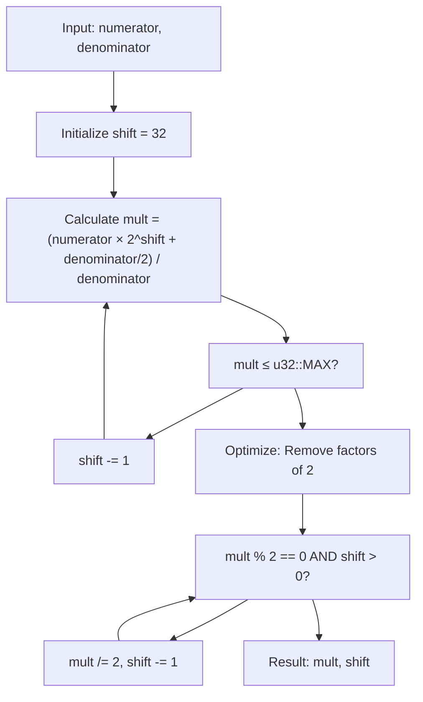
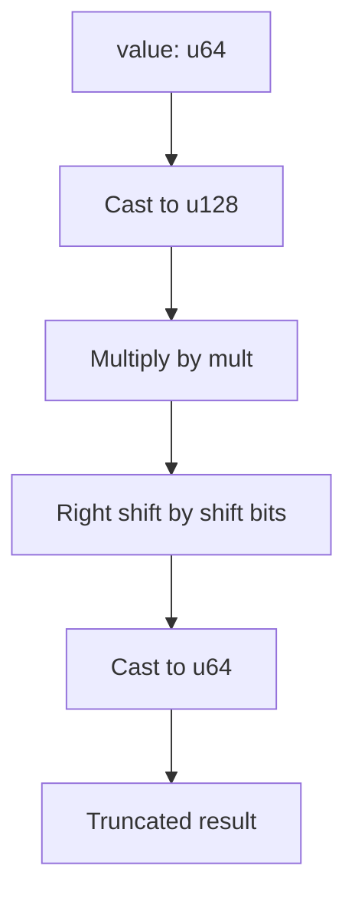
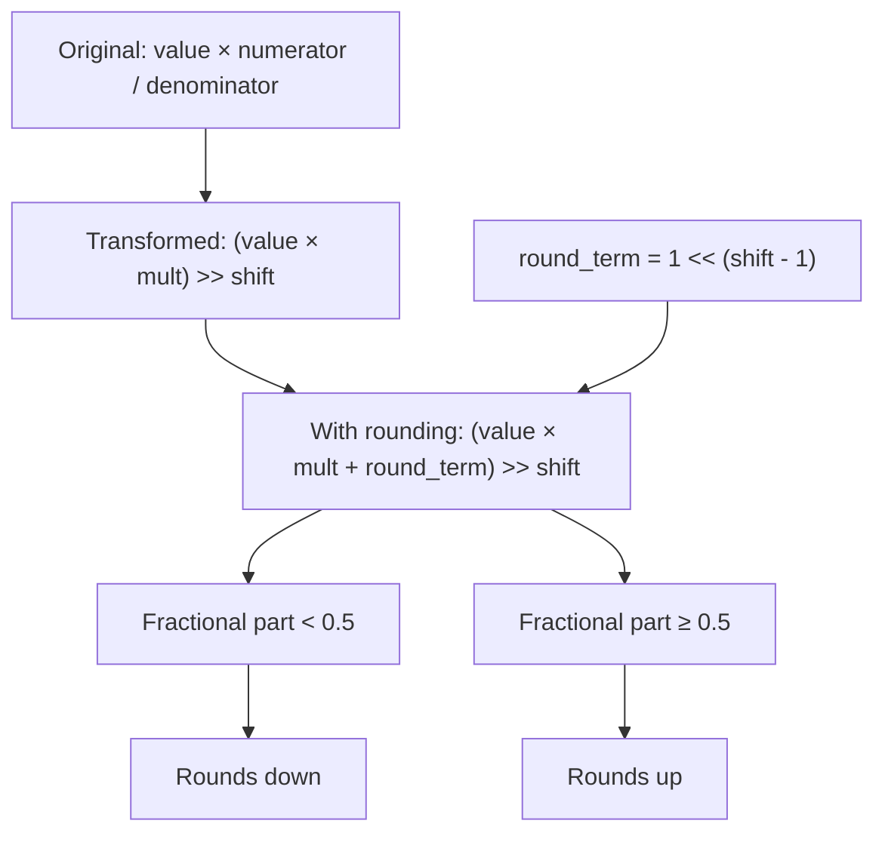
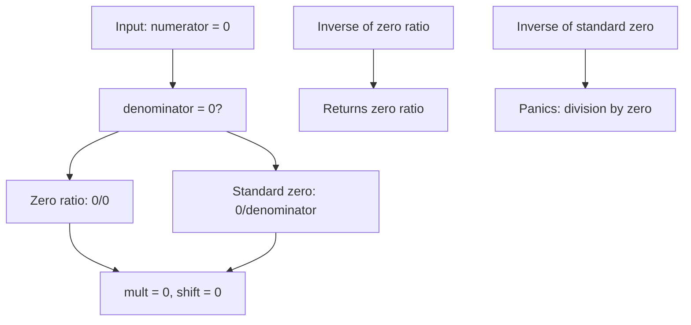

# Mathematical Foundation

> **Relevant source files**
> * [src/lib.rs](https://github.com/arceos-org/int_ratio/blob/c753d341/src/lib.rs)

This document explains the mathematical principles underlying the `Ratio` type's optimization strategy and arithmetic operations. It covers the core transformation from traditional rational arithmetic to fixed-point representation, precision analysis, and the algorithms used to maximize computational efficiency while maintaining mathematical accuracy.

For implementation details of the `Ratio` API, see [API Reference](/arceos-org/int_ratio/2.2-api-reference). For architectural specifics of the internal data structures, see [Internal Architecture](/arceos-org/int_ratio/2.1-internal-architecture).

## Core Mathematical Transformation

The fundamental innovation of the `int_ratio` crate lies in transforming traditional rational arithmetic `numerator/denominator` into an optimized fixed-point representation `mult/(1<<shift)`. This transformation enables fast multiplication operations using bit shifts instead of expensive division operations.

### Mathematical Equivalence

The transformation maintains mathematical equivalence through the following relationship:

```
numerator/denominator = mult/(1<<shift)
```

Where:

* `mult = (numerator × (1<<shift) + denominator/2) / denominator`
* `shift` is maximized subject to `mult ≤ u32::MAX`

#### Transformation Algorithm Flow



**Sources:** [src/lib.rs(L62 - L83)&emsp;](https://github.com/arceos-org/int_ratio/blob/c753d341/src/lib.rs#L62-L83)

### Precision Optimization Strategy

The algorithm maximizes precision by selecting the largest possible `shift` value while ensuring `mult` fits within a `u32`. This approach balances two competing requirements:

|Requirement|Implementation|Benefit|
| --- | --- | --- |
|Maximize precision|Start withshift = 32, decrement untilmult ≤ u32::MAX|Uses maximum available bits|
|Minimize computation|Remove common factors of 2 frommultandshift|Reduces multiplication overhead|
|Maintain accuracy|Adddenominator/2before division|Implements banker's rounding|

**Sources:** [src/lib.rs(L63 - L76)&emsp;](https://github.com/arceos-org/int_ratio/blob/c753d341/src/lib.rs#L63-L76)

## Arithmetic Operation Mathematics

### Multiplication with Truncation

The `mul_trunc` operation implements the mathematical formula:

```
result = ⌊(value × mult) / (1<<shift)⌋
```

This is efficiently computed as a bit shift operation:



**Sources:** [src/lib.rs(L114 - L116)&emsp;](https://github.com/arceos-org/int_ratio/blob/c753d341/src/lib.rs#L114-L116)

### Multiplication with Rounding

The `mul_round` operation adds a rounding term before the shift:

```
result = ⌊(value × mult + 2^(shift-1)) / (1<<shift)⌋
```

The rounding term `2^(shift-1)` represents half of the divisor `2^shift`, implementing proper mathematical rounding:

#### Rounding Behavior Analysis



**Sources:** [src/lib.rs(L130 - L132)&emsp;](https://github.com/arceos-org/int_ratio/blob/c753d341/src/lib.rs#L130-L132)

## Precision Analysis and Bounds

### Maximum Precision Calculation

The precision of the representation depends on the selected `shift` value. The algorithm maximizes precision by:

1. **Starting with maximum shift**: Begin with `shift = 32` to use all available bits
2. **Constraint enforcement**: Ensure `mult ≤ u32::MAX` to prevent overflow
3. **Optimization**: Remove unnecessary factors of 2 to minimize computational cost

### Error Bounds

The maximum relative error introduced by the transformation is bounded by:

```
|error| ≤ 1 / (2^shift)
```

This bound is achieved because the worst-case rounding error in computing `mult` is at most 0.5, which translates to a relative error of `0.5 / (2^shift)` in the final result.

#### Error Analysis by Shift Value

|Shift Value|Maximum Relative Error|Precision (decimal places)|
| --- | --- | --- |
|32|2.33 × 10⁻¹⁰|~9.7|
|16|1.53 × 10⁻⁵|~4.8|
|8|3.91 × 10⁻³|~2.4|

**Sources:** [src/lib.rs(L66 - L77)&emsp;](https://github.com/arceos-org/int_ratio/blob/c753d341/src/lib.rs#L66-L77)

## Special Cases and Edge Conditions

### Zero Handling

The zero ratio requires special mathematical treatment to avoid division by zero in inverse operations:



**Sources:** [src/lib.rs(L37 - L44)&emsp;](https://github.com/arceos-org/int_ratio/blob/c753d341/src/lib.rs#L37-L44) [src/lib.rs(L53 - L60)&emsp;](https://github.com/arceos-org/int_ratio/blob/c753d341/src/lib.rs#L53-L60)

### Boundary Conditions

The algorithm handles several mathematical boundary conditions:

1. **Maximum values**: When `numerator = u32::MAX` and `denominator = 1`, the result is `mult = u32::MAX, shift = 0`
2. **Minimum precision**: When `numerator = 1` and `denominator = u32::MAX`, maximum shift is used
3. **Unity ratio**: When `numerator = denominator`, the result is `mult = 1, shift = 0`

**Sources:** [src/lib.rs(L161 - L185)&emsp;](https://github.com/arceos-org/int_ratio/blob/c753d341/src/lib.rs#L161-L185)

## Computational Complexity

The mathematical operations achieve the following complexity characteristics:

|Operation|Time Complexity|Space Complexity|Notes|
| --- | --- | --- | --- |
|new()|O(log n)|O(1)|Due to shift optimization loop|
|mul_trunc()|O(1)|O(1)|Single multiplication + shift|
|mul_round()|O(1)|O(1)|Single multiplication + shift|
|inverse()|O(log n)|O(1)|Callsnew()with swapped parameters|

The O(log n) complexity of construction comes from the iterative reduction of the shift value and the factor-of-2 elimination loop.

**Sources:** [src/lib.rs(L65 - L83)&emsp;](https://github.com/arceos-org/int_ratio/blob/c753d341/src/lib.rs#L65-L83) [src/lib.rs(L99 - L101)&emsp;](https://github.com/arceos-org/int_ratio/blob/c753d341/src/lib.rs#L99-L101)