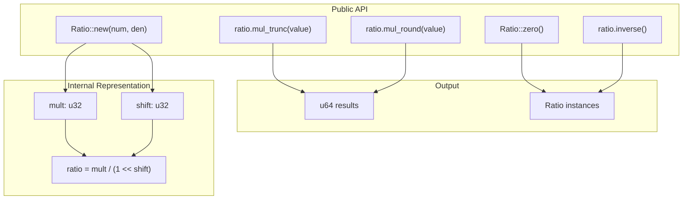
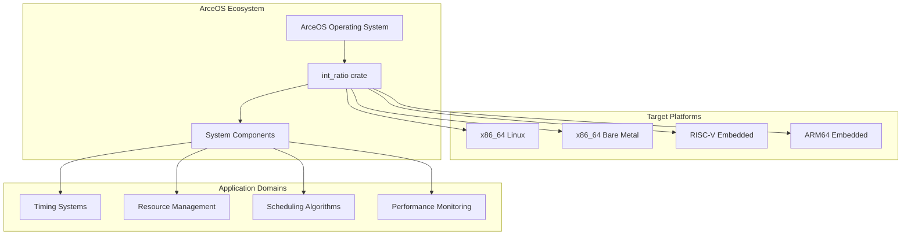

# Overview

> **Relevant source files**
> * [Cargo.toml](https://github.com/arceos-org/int_ratio/blob/c753d341/Cargo.toml)
> * [README.md](https://github.com/arceos-org/int_ratio/blob/c753d341/README.md)

This document provides an introduction to the `int_ratio` crate, an efficient integer-based rational arithmetic library designed for embedded systems and performance-critical applications within the ArceOS ecosystem. The crate implements rational number operations using optimized integer arithmetic that avoids expensive division operations.

For detailed implementation specifics of the core `Ratio` type, see [Ratio Type Implementation](/arceos-org/int_ratio/2-ratio-type-implementation). For practical usage examples and patterns, see [Usage Guide](/arceos-org/int_ratio/3-usage-guide).

## Purpose and Scope

The `int_ratio` crate serves as a foundational mathematical library that provides precise rational number arithmetic without relying on floating-point operations or expensive integer division. It is specifically designed for use in embedded systems, bare-metal environments, and other performance-critical scenarios where computational efficiency and deterministic behavior are essential.

**Sources:** [Cargo.toml(L1 - L15)&emsp;](https://github.com/arceos-org/int_ratio/blob/c753d341/Cargo.toml#L1-L15) [README.md(L1 - L22)&emsp;](https://github.com/arceos-org/int_ratio/blob/c753d341/README.md#L1-L22)

## Core Functionality

The crate centers around the `Ratio` struct, which represents a rational number as the quotient of two integers. Rather than storing the numerator and denominator directly, the implementation uses an optimized internal representation that enables fast multiplication operations through bit shifting.

### Ratio Operations

**Ratio API and Internal Architecture**

The `Ratio::new()` constructor transforms input numerator and denominator values into an optimized `mult`/`shift` representation, while `mul_trunc()` and `mul_round()` provide different precision behaviors for arithmetic operations.

**Sources:** [README.md(L14 - L21)&emsp;](https://github.com/arceos-org/int_ratio/blob/c753d341/README.md#L14-L21)

## ArceOS Ecosystem Integration

The `int_ratio` crate operates as a core mathematical utility within the broader ArceOS operating system ecosystem, providing rational arithmetic capabilities that support system-level operations requiring precise fractional calculations.

**ArceOS Integration and Platform Support**

The crate provides cross-platform rational arithmetic services that enable ArceOS system components to perform precise fractional calculations across multiple hardware architectures.

**Sources:** [Cargo.toml(L8 - L9)&emsp;](https://github.com/arceos-org/int_ratio/blob/c753d341/Cargo.toml#L8-L9)

## Key Design Principles

### Performance Optimization

The core innovation of `int_ratio` lies in its avoidance of expensive division operations during runtime calculations. Instead of performing `value * numerator / denominator`, the implementation pre-computes an equivalent `mult` and `shift` representation that enables the same calculation using fast bit-shift operations: `(value * mult) >> shift`.

### Precision Control

The crate provides explicit control over rounding behavior through distinct methods:

|Method|Behavior|Use Case|
| --- | --- | --- |
|mul_trunc()|Truncates fractional results|When lower bounds are needed|
|mul_round()|Rounds to nearest integer|When best approximation is needed|

### Embedded System Compatibility

The library operates in `no_std` environments and avoids dependencies that would be unsuitable for embedded or bare-metal development. This makes it particularly valuable for resource-constrained systems where standard library features may not be available.

**Sources:** [Cargo.toml(L11 - L12)&emsp;](https://github.com/arceos-org/int_ratio/blob/c753d341/Cargo.toml#L11-L12) [README.md(L7 - L10)&emsp;](https://github.com/arceos-org/int_ratio/blob/c753d341/README.md#L7-L10)

## Mathematical Foundation

The transformation from traditional rational representation `numerator/denominator` to the optimized `mult/(1<<shift)` form maintains mathematical precision while enabling performance improvements. This approach ensures that:

* No `u128` division operations are required during multiplication
* Bit-shift operations replace expensive division
* Precision is preserved through careful selection of `mult` and `shift` values
* Results remain deterministic and reproducible across platforms

The example from the README demonstrates this optimization: `Ratio(1/3 ~= 1431655765/4294967296)` shows how the fraction 1/3 is represented internally using the optimized format where `4294967296 = 1 << 32`.

**Sources:** [README.md(L18 - L21)&emsp;](https://github.com/arceos-org/int_ratio/blob/c753d341/README.md#L18-L21)

## Related Documentation

For implementation details of the core algorithms and internal architecture, see [Ratio Type Implementation](/arceos-org/int_ratio/2-ratio-type-implementation). For practical examples and common usage patterns, see [Usage Guide](/arceos-org/int_ratio/3-usage-guide). Development setup and contribution guidelines are covered in [Development Guide](/arceos-org/int_ratio/4-development-guide).