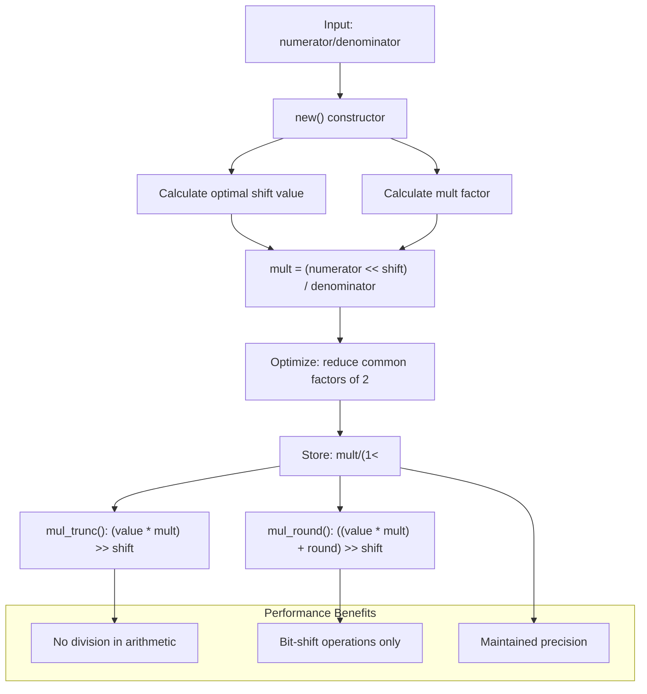
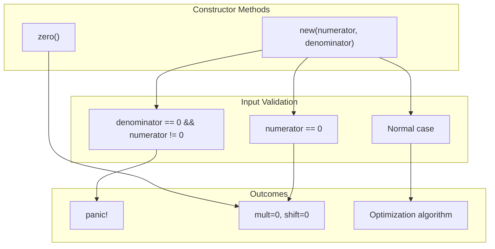
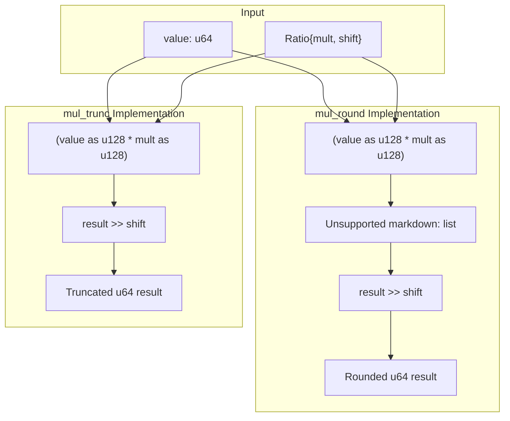

# Ratio Type Implementation

> **Relevant source files**
> * [src/lib.rs](https://github.com/arceos-org/int_ratio/blob/c753d341/src/lib.rs)

This document provides a comprehensive overview of the core `Ratio` struct implementation, focusing on its innovative multiplication-shift optimization strategy that eliminates expensive division operations. The `Ratio` type transforms traditional `numerator/denominator` arithmetic into an efficient `mult/(1<<shift)` representation optimized for embedded and performance-critical applications.

For detailed internal algorithms and mathematical proofs, see [Internal Architecture](/arceos-org/int_ratio/2.1-internal-architecture). For complete method documentation and usage examples, see [API Reference](/arceos-org/int_ratio/2.2-api-reference). For mathematical foundations and precision analysis, see [Mathematical Foundation](/arceos-org/int_ratio/2.3-mathematical-foundation).

## Core Transformation Strategy

The fundamental innovation of the `Ratio` type lies in its preprocessing approach that converts rational arithmetic into optimized integer operations.

#### Ratio Transformation Process



Sources: [src/lib.rs(L51 - L84)&emsp;](https://github.com/arceos-org/int_ratio/blob/c753d341/src/lib.rs#L51-L84)

## Struct Layout and Field Responsibilities

The `Ratio` struct maintains both the original rational representation and the optimized computational form:

|Field|Type|Purpose|Usage|
| --- | --- | --- | --- |
|numerator|u32|Original numerator value|Stored forinverse()andDebug|
|denominator|u32|Original denominator value|Stored forinverse()andDebug|
|mult|u32|Optimized multiplier|Used inmul_trunc()andmul_round()|
|shift|u32|Bit-shift amount|Represents power of 2 denominator|

The struct maintains both representations to support mathematical operations like `inverse()` while providing optimized arithmetic through the `mult`/`shift` fields.

Sources: [src/lib.rs(L13 - L19)&emsp;](https://github.com/arceos-org/int_ratio/blob/c753d341/src/lib.rs#L13-L19)

## Constructor Methods and Special Cases

#### Constructor Method Mapping



Sources: [src/lib.rs(L37 - L44)&emsp;](https://github.com/arceos-org/int_ratio/blob/c753d341/src/lib.rs#L37-L44) [src/lib.rs(L51 - L84)&emsp;](https://github.com/arceos-org/int_ratio/blob/c753d341/src/lib.rs#L51-L84)

The `new()` constructor implements a sophisticated optimization algorithm:

1. **Shift Maximization**: Starts with `shift = 32` and decreases until `mult` fits in `u32` [src/lib.rs(L63 - L71)&emsp;](https://github.com/arceos-org/int_ratio/blob/c753d341/src/lib.rs#L63-L71)
2. **Precision Optimization**: Uses `(numerator << shift + denominator/2) / denominator` for rounding [src/lib.rs(L66)&emsp;](https://github.com/arceos-org/int_ratio/blob/c753d341/src/lib.rs#L66-L66)
3. **Factor Reduction**: Removes common factors of 2 to minimize storage requirements [src/lib.rs(L73 - L76)&emsp;](https://github.com/arceos-org/int_ratio/blob/c753d341/src/lib.rs#L73-L76)

The special `zero()` constructor creates a `0/0` ratio that behaves safely in operations, particularly `inverse()` which returns another zero ratio instead of panicking.

## Arithmetic Operations Implementation

The core arithmetic methods leverage the `mult`/`shift` representation for efficient computation:

#### Operation Implementation Details



Sources: [src/lib.rs(L114 - L116)&emsp;](https://github.com/arceos-org/int_ratio/blob/c753d341/src/lib.rs#L114-L116) [src/lib.rs(L130 - L132)&emsp;](https://github.com/arceos-org/int_ratio/blob/c753d341/src/lib.rs#L130-L132)

Key implementation characteristics:

* **Widening Multiplication**: Uses `u128` intermediate to prevent overflow [src/lib.rs(L115)&emsp;](https://github.com/arceos-org/int_ratio/blob/c753d341/src/lib.rs#L115-L115) [src/lib.rs(L131)&emsp;](https://github.com/arceos-org/int_ratio/blob/c753d341/src/lib.rs#L131-L131)
* **Truncation vs Rounding**: `mul_trunc()` simply shifts, while `mul_round()` adds `(1 << shift >> 1)` for rounding
* **Bit-Shift Performance**: Final division replaced with right-shift operation
* **No Division Operations**: All arithmetic uses multiplication and bit manipulation

## Performance and Precision Characteristics

The `Ratio` implementation achieves optimal performance through several design decisions:

|Aspect|Traditional Approach|RatioImplementation|
| --- | --- | --- |
|Division Operations|Required for each calculation|Pre-computed in constructor|
|Intermediate Precision|Limited by operand width|Maximized through optimalshift|
|Platform Dependencies|Varies by division hardware|Consistent across architectures|
|Memory Overhead|Minimal (8 bytes)|Moderate (16 bytes) for optimization|

The `Debug` implementation reveals the transformation: `Ratio(numerator/denominator ~= mult/(1<<shift))` [src/lib.rs(L137 - L145)&emsp;](https://github.com/arceos-org/int_ratio/blob/c753d341/src/lib.rs#L137-L145) allowing verification of the optimization quality.

## Equality and Comparison Semantics

The `PartialEq` implementation compares the optimized representation rather than the original values:

```
// Equality based on mult and shift, not numerator/denominator
self.mult == other.mult && self.shift == other.shift
```

This design choice ensures that mathematically equivalent ratios with different original representations are considered equal after optimization.

Sources: [src/lib.rs(L148 - L153)&emsp;](https://github.com/arceos-org/int_ratio/blob/c753d341/src/lib.rs#L148-L153)