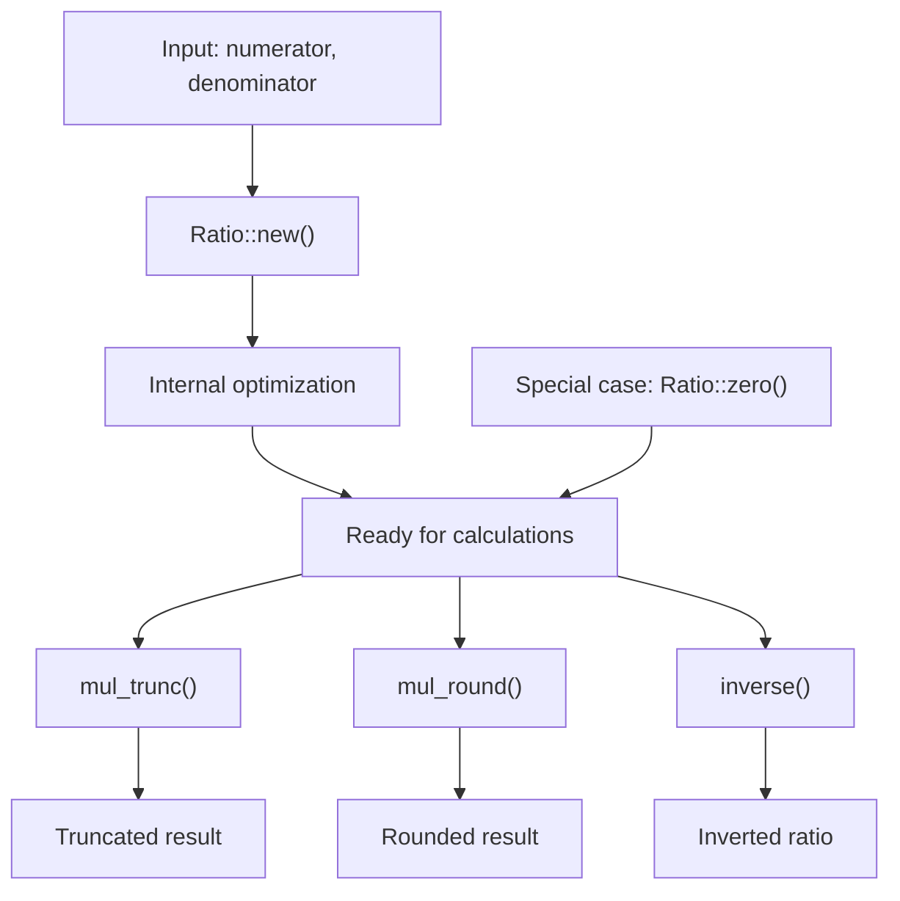
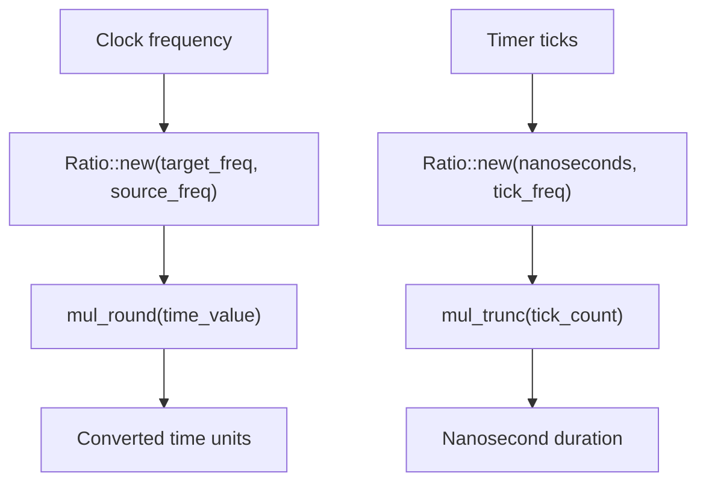
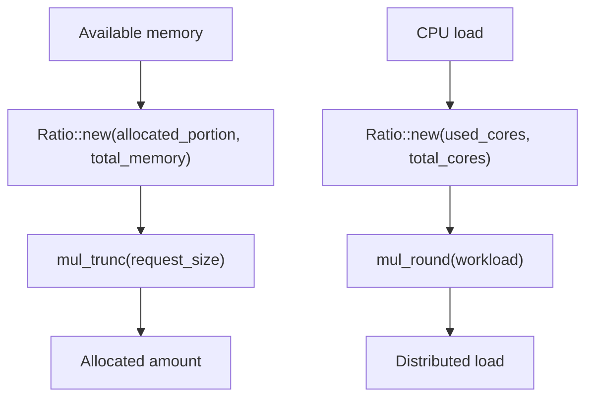
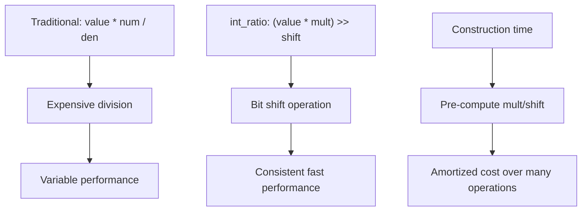

# Usage Guide

> **Relevant source files**
> * [README.md](https://github.com/arceos-org/int_ratio/blob/c753d341/README.md)
> * [src/lib.rs](https://github.com/arceos-org/int_ratio/blob/c753d341/src/lib.rs)

This guide demonstrates how to use the `int_ratio` crate in practical applications. It covers the core usage patterns, arithmetic operations, and performance considerations for working with the `Ratio` type.

For detailed information about the internal architecture and optimization strategies, see [Internal Architecture](/arceos-org/int_ratio/2.1-internal-architecture). For comprehensive API documentation, see [API Reference](/arceos-org/int_ratio/2.2-api-reference).

## Creating and Using Ratios

The `Ratio` type provides efficient rational arithmetic through its optimized `mult/(1<<shift)` representation. The basic workflow involves creating a ratio from integers and then performing multiplication operations with either truncation or rounding behavior.

### Basic Ratio Creation Workflow



**Creating Ratios from Integers**

The primary constructor `Ratio::new()` accepts `u32` values for both numerator and denominator:

```javascript
use int_ratio::Ratio;

// Create a ratio representing 2/3
let ratio = Ratio::new(2, 3);

// Create a ratio representing 625/1000 (0.625)
let fraction = Ratio::new(625, 1000);

// Create unit ratio (1/1)
let unit = Ratio::new(1, 1);
```

Sources: [src/lib.rs(L46 - L84)&emsp;](https://github.com/arceos-org/int_ratio/blob/c753d341/src/lib.rs#L46-L84)

### Special Zero Ratio

The `Ratio::zero()` constructor creates a special `0/0` ratio that behaves safely in all operations, including inversion:

```javascript
let zero = Ratio::zero();
assert_eq!(zero.mul_trunc(123), 0);
assert_eq!(zero.inverse(), Ratio::zero()); // Safe inversion
```

Sources: [src/lib.rs(L22 - L44)&emsp;](https://github.com/arceos-org/int_ratio/blob/c753d341/src/lib.rs#L22-L44)

## Arithmetic Operations

The crate provides two multiplication methods with different rounding behaviors, plus ratio inversion.

### Truncation vs Rounding Comparison

|Operation|Method|Behavior|Example (2/3 × 100)|
| --- | --- | --- | --- |
|Truncation|mul_trunc()|Round down|66(from 66.666...)|
|Rounding|mul_round()|Round to nearest|67(from 66.666...)|
|Inversion|inverse()|Swap num/den|Ratio::new(3, 2)|

### Truncation Operations

The `mul_trunc()` method always rounds down to the nearest integer:

```javascript
let ratio = Ratio::new(2, 3);

// These demonstrate truncation behavior
assert_eq!(ratio.mul_trunc(99), 66);   // 99 × 2/3 = 66.0 exactly
assert_eq!(ratio.mul_trunc(100), 66);  // 100 × 2/3 = 66.666... → 66
assert_eq!(ratio.mul_trunc(101), 67);  // 101 × 2/3 = 67.333... → 67
```

Sources: [src/lib.rs(L103 - L116)&emsp;](https://github.com/arceos-org/int_ratio/blob/c753d341/src/lib.rs#L103-L116)

### Rounding Operations

The `mul_round()` method rounds to the nearest integer using standard rounding rules:

```javascript
let ratio = Ratio::new(2, 3);

// These demonstrate rounding behavior  
assert_eq!(ratio.mul_round(99), 66);   // 99 × 2/3 = 66.0 exactly
assert_eq!(ratio.mul_round(100), 67);  // 100 × 2/3 = 66.666... → 67
assert_eq!(ratio.mul_round(101), 67);  // 101 × 2/3 = 67.333... → 67
```

Sources: [src/lib.rs(L118 - L132)&emsp;](https://github.com/arceos-org/int_ratio/blob/c753d341/src/lib.rs#L118-L132)

## Common Usage Patterns

### Pattern: Time and Frequency Conversion



**Example: Converting between time units**

```javascript
// Convert microseconds to nanoseconds (1000:1 ratio)
let us_to_ns = Ratio::new(1000, 1);
let nanoseconds = us_to_ns.mul_trunc(42); // 42000 ns

// Convert CPU cycles to milliseconds (assuming 1GHz CPU)
let cycles_to_ms = Ratio::new(1, 1_000_000); // 1ms per 1M cycles  
let duration_ms = cycles_to_ms.mul_round(2_500_000); // ~3ms
```

### Pattern: Resource Scaling



**Example: Memory allocation ratios**

```javascript
// Allocate 3/4 of available memory to cache
let cache_ratio = Ratio::new(3, 4);
let total_memory = 1024 * 1024 * 1024; // 1GB
let cache_size = cache_ratio.mul_trunc(total_memory); // 768MB

// Scale down resource requests by 2/3
let scale_down = Ratio::new(2, 3);
let reduced_request = scale_down.mul_round(original_request);
```

### Pattern: Rate Limiting and Throttling

```javascript
// Throttle to 70% of maximum rate
let throttle = Ratio::new(7, 10);
let allowed_requests = throttle.mul_trunc(max_requests_per_second);

// Convert packet rate between different time windows
let per_second_to_per_minute = Ratio::new(60, 1);
let packets_per_minute = per_second_to_per_minute.mul_round(packets_per_second);
```

## Performance Considerations

The `Ratio` type is optimized for performance-critical code through its `mult/(1<<shift)` representation.

### Performance Benefits Workflow



**When to Use Each Operation:**

|Use Case|Recommended Method|Rationale|
| --- | --- | --- |
|Memory allocation|mul_trunc()|Never over-allocate|
|Time calculations|mul_round()|Minimize timing errors|
|Rate limiting|mul_trunc()|Conservative limiting|
|Display/UI values|mul_round()|Better visual appearance|

### Construction Cost vs Runtime Benefit

The `Ratio::new()` constructor performs optimization work upfront to enable fast runtime operations:

```javascript
// One-time construction cost
let ratio = Ratio::new(2, 3); // Computes optimal mult/shift values

// Many fast runtime operations  
for value in large_dataset {
    let result = ratio.mul_trunc(value); // Just multiplication + shift
    process(result);
}
```

Sources: [src/lib.rs(L62 - L83)&emsp;](https://github.com/arceos-org/int_ratio/blob/c753d341/src/lib.rs#L62-L83)

## Edge Cases and Error Handling

### Division by Zero Protection

The constructor panics for invalid ratios but allows the special zero case:

```javascript
// Panics: invalid ratio
// let invalid = Ratio::new(5, 0); 

// Safe: zero ratio
let zero_num = Ratio::new(0, 5);    // Represents 0/5 = 0
let zero_special = Ratio::zero();   // Special 0/0 case

// Safe inversion of zero ratios
assert_eq!(zero_special.inverse(), Ratio::zero());
```

### Precision Limits

The `Ratio` type works with `u32` inputs and `u64` calculation values:

```javascript
// Maximum values supported
let max_ratio = Ratio::new(u32::MAX, u32::MAX); // Represents 1.0
let tiny_ratio = Ratio::new(1, u32::MAX);       // Very small fraction

// Large value calculations
let large_result = max_ratio.mul_trunc(u64::MAX); // Uses u128 internally
```

Sources: [src/lib.rs(L159 - L185)&emsp;](https://github.com/arceos-org/int_ratio/blob/c753d341/src/lib.rs#L159-L185)

## Debug and Inspection

The `Debug` implementation shows both the original and optimized representations:

```javascript
let ratio = Ratio::new(625, 1000);
println!("{:?}", ratio); 
// Output: Ratio(625/1000 ~= 5/8)
```

This format displays:

* Original numerator/denominator
* Optimized mult/shift representation as an equivalent fraction

Sources: [src/lib.rs(L135 - L146)&emsp;](https://github.com/arceos-org/int_ratio/blob/c753d341/src/lib.rs#L135-L146)