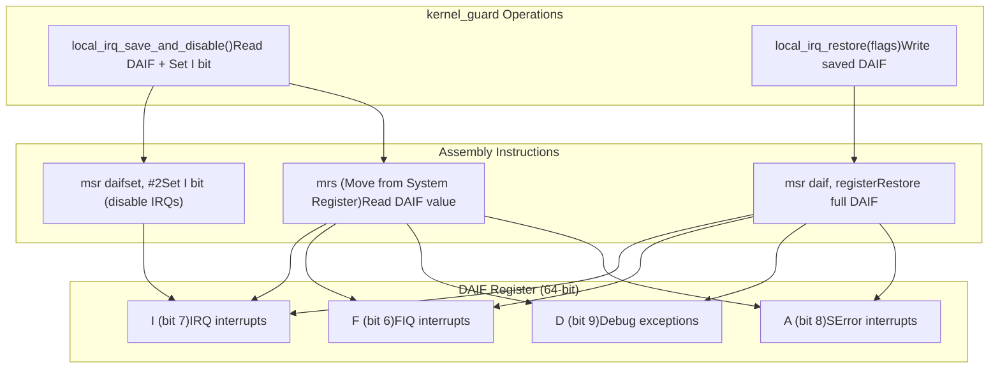
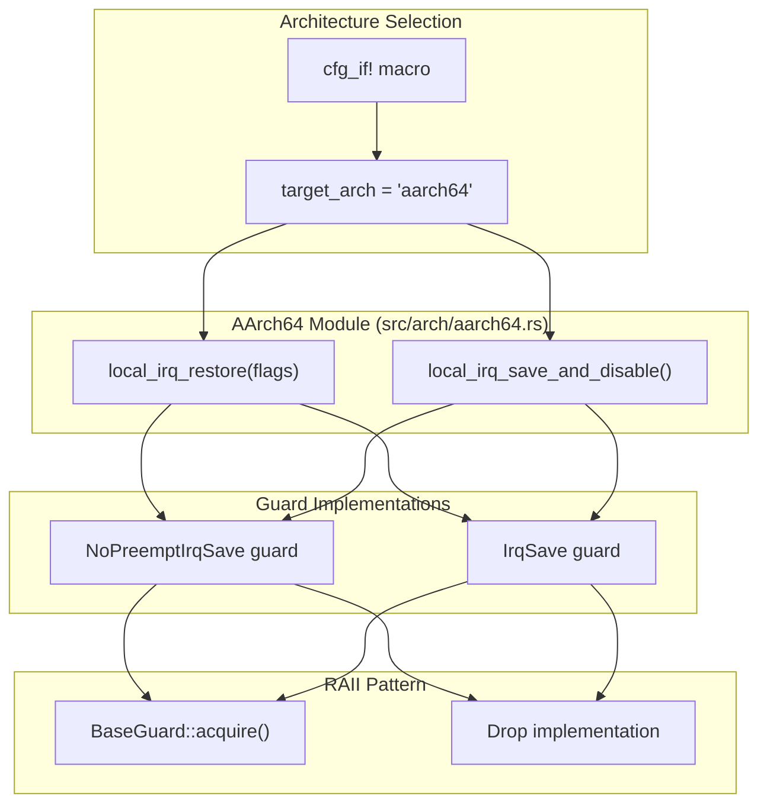
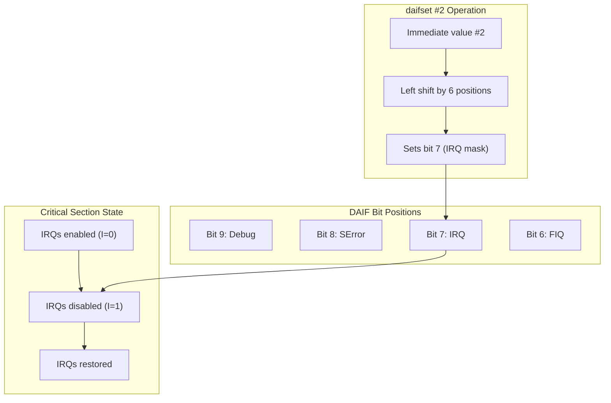

# AArch64 Implementation

> **Relevant source files**
> * [src/arch/aarch64.rs](https://github.com/arceos-org/kernel_guard/blob/f1a9da26/src/arch/aarch64.rs)

This document details the AArch64-specific implementation of interrupt control mechanisms within the kernel_guard crate. It covers the ARM64 architecture's DAIF register manipulation and the assembly instructions used to save and restore interrupt states for RAII guard implementations.

For information about the overall architecture abstraction system, see [Architecture Abstraction Layer](/arceos-org/kernel_guard/3.1-architecture-abstraction-layer). For comparisons with other CPU architectures, see [x86/x86_64 Implementation](/arceos-org/kernel_guard/3.2-x86x86_64-implementation), [RISC-V Implementation](/arceos-org/kernel_guard/3.3-risc-v-implementation), and [LoongArch64 Implementation](/arceos-org/kernel_guard/3.5-loongarch64-implementation).

## DAIF Register and Interrupt Control

The AArch64 implementation centers around the DAIF (Debug, SError, IRQ, FIQ) system register, which controls various exception types. The kernel_guard crate specifically manipulates the IRQ (Interrupt Request) bit to implement critical sections.

### DAIF Register Structure

Sources: [src/arch/aarch64.rs(L1 - L15)&emsp;](https://github.com/arceos-org/kernel_guard/blob/f1a9da26/src/arch/aarch64.rs#L1-L15)

## Core Implementation Functions

The AArch64 implementation provides two primary functions that form the foundation for all interrupt-disabling guards on this architecture.

### Interrupt Save and Disable

The `local_irq_save_and_disable` function captures the current interrupt state and disables IRQs atomically:

|Function|Return Type|Operation|Assembly Instructions|
| --- | --- | --- | --- |
|local_irq_save_and_disable|usize|Save DAIF, disable IRQs|mrs {}, daif; msr daifset, #2|

The function uses two ARM64 instructions in sequence:

1. `mrs {}, daif` - Move the DAIF register value to a general-purpose register
2. `msr daifset, #2` - Set bit 1 (which corresponds to the IRQ mask bit) in DAIF

### Interrupt Restore

The `local_irq_restore` function restores the previously saved interrupt state:

|Function|Parameters|Operation|Assembly Instructions|
| --- | --- | --- | --- |
|local_irq_restore|flags: usize|Restore DAIF|msr daif, {}|

This function directly writes the saved flags back to the DAIF register, restoring the complete interrupt state.

Sources: [src/arch/aarch64.rs(L3 - L14)&emsp;](https://github.com/arceos-org/kernel_guard/blob/f1a9da26/src/arch/aarch64.rs#L3-L14)

## Integration with Guard System

The AArch64 implementation integrates with the broader kernel_guard architecture through the conditional compilation system and provides the low-level primitives for RAII guards.

Sources: [src/arch/aarch64.rs(L1 - L15)&emsp;](https://github.com/arceos-org/kernel_guard/blob/f1a9da26/src/arch/aarch64.rs#L1-L15)

## Assembly Instruction Details

The AArch64 implementation relies on specific ARM64 assembly instructions for system register manipulation:

### System Register Access Instructions

|Instruction|Purpose|Syntax|Usage in kernel_guard|
| --- | --- | --- | --- |
|mrs|Move from System Register|mrs Xt, system_reg|Read current DAIF state|
|msr|Move to System Register|msr system_reg, Xt|Write to DAIF register|
|msr(immediate)|Move immediate to System Register|msr daifset, #imm|Set specific DAIF bits|

### Bit Manipulation Strategy

The `daifset #2` instruction specifically targets the IRQ bit by using immediate value 2, which when processed by the instruction becomes a mask for bit 7 of the DAIF register.

Sources: [src/arch/aarch64.rs(L7 - L13)&emsp;](https://github.com/arceos-org/kernel_guard/blob/f1a9da26/src/arch/aarch64.rs#L7-L13)

## Safety and Inline Optimization

Both functions are marked with `#[inline]` for performance optimization and use `unsafe` blocks for assembly code execution:

* **Inline annotation**: Ensures the assembly instructions are inlined at call sites for minimal overhead
* **Unsafe blocks**: Required for all inline assembly operations in Rust
* **Register constraints**: Uses `out(reg)` and `in(reg)` to specify register allocation for the assembler

The implementation assumes that the DAIF register is accessible in the current execution context, which is typically true for kernel-level code running at EL1 (Exception Level 1) or higher privilege levels.

Sources: [src/arch/aarch64.rs(L3 - L14)&emsp;](https://github.com/arceos-org/kernel_guard/blob/f1a9da26/src/arch/aarch64.rs#L3-L14)