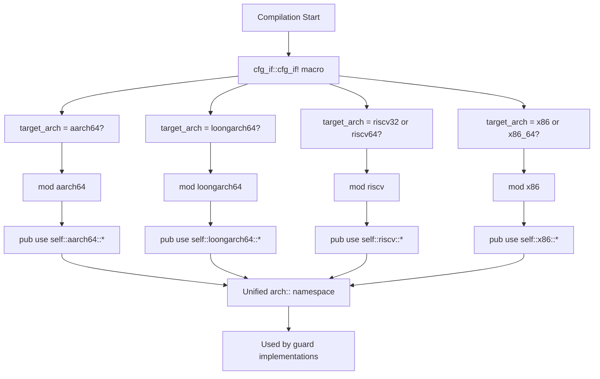
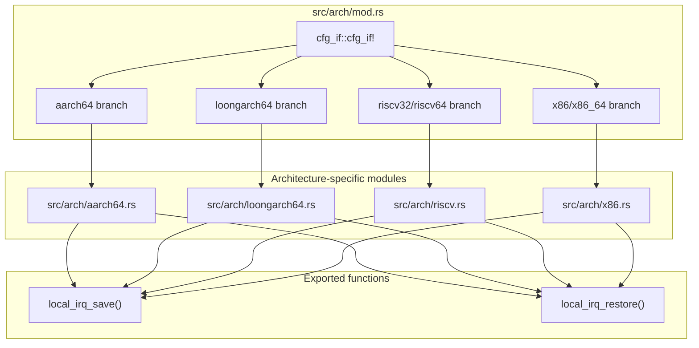

# Architecture Abstraction Layer

> **Relevant source files**
> * [src/arch/mod.rs](https://github.com/arceos-org/kernel_guard/blob/f1a9da26/src/arch/mod.rs)

## Purpose and Scope

The Architecture Abstraction Layer provides a unified interface for interrupt control across multiple CPU architectures through conditional compilation. This module serves as the entry point that selects and re-exports the appropriate architecture-specific implementation based on the target compilation architecture.

For details on specific architecture implementations, see [x86/x86_64 Implementation](/arceos-org/kernel_guard/3.2-x86x86_64-implementation), [RISC-V Implementation](/arceos-org/kernel_guard/3.3-risc-v-implementation), [AArch64 Implementation](/arceos-org/kernel_guard/3.4-aarch64-implementation), and [LoongArch64 Implementation](/arceos-org/kernel_guard/3.5-loongarch64-implementation). For information about how these implementations are used by the core guard system, see [RAII Guards](/arceos-org/kernel_guard/2.1-raii-guards).

## Conditional Compilation Strategy

The architecture abstraction layer uses the `cfg_if` macro to perform compile-time architecture selection. This approach ensures that only the relevant code for the target architecture is included in the final binary, reducing both code size and complexity.

### Architecture Selection Flow



**Sources:** [src/arch/mod.rs(L3 - L17)&emsp;](https://github.com/arceos-org/kernel_guard/blob/f1a9da26/src/arch/mod.rs#L3-L17)

### Module Structure and Re-exports

The abstraction layer follows a simple but effective pattern where each supported architecture has its own module that implements the same interface. The main module conditionally includes and re-exports the appropriate implementation:

|Target Architecture|Condition|Module|Re-export|
| --- | --- | --- | --- |
|x86 32-bit|target_arch = "x86"|mod x86|pub use self::x86::*|
|x86 64-bit|target_arch = "x86_64"|mod x86|pub use self::x86::*|
|RISC-V 32-bit|target_arch = "riscv32"|mod riscv|pub use self::riscv::*|
|RISC-V 64-bit|target_arch = "riscv64"|mod riscv|pub use self::riscv::*|
|AArch64|target_arch = "aarch64"|mod aarch64|pub use self::aarch64::*|
|LoongArch64|target_arch = "loongarch64"|mod loongarch64|pub use self::loongarch64::*|

**Sources:** [src/arch/mod.rs(L4 - L16)&emsp;](https://github.com/arceos-org/kernel_guard/blob/f1a9da26/src/arch/mod.rs#L4-L16)

## Code Entity Mapping



**Sources:** [src/arch/mod.rs(L1 - L18)&emsp;](https://github.com/arceos-org/kernel_guard/blob/f1a9da26/src/arch/mod.rs#L1-L18)

## Compiler Attributes and Target Handling

The module includes a conditional compiler attribute that suppresses warnings for unused code when targeting non-bare-metal environments:

```
#![cfg_attr(not(target_os = "none"), allow(dead_code, unused_imports))]
```

This attribute serves an important purpose:

* When `target_os = "none"` (bare metal/no_std environments), the architecture-specific code is actively used
* When targeting other operating systems (like Linux), the interrupt control functions may not be used by the guard implementations, leading to dead code warnings
* The attribute prevents these warnings without removing the code, maintaining consistency across build targets

**Sources:** [src/arch/mod.rs(L1)&emsp;](https://github.com/arceos-org/kernel_guard/blob/f1a9da26/src/arch/mod.rs#L1-L1)

## Integration with Core Library

The architecture abstraction layer provides the low-level interrupt control functions that are consumed by the guard implementations in the core library. The `local_irq_save()` and `local_irq_restore()` functions exposed through this layer are called by:

* `IrqSave` guard for interrupt-only protection
* `NoPreemptIrqSave` guard for combined interrupt and preemption protection

This design ensures that the same high-level guard interface can work across all supported architectures while utilizing the most efficient interrupt control mechanism available on each platform.

**Sources:** [src/arch/mod.rs(L3 - L17)&emsp;](https://github.com/arceos-org/kernel_guard/blob/f1a9da26/src/arch/mod.rs#L3-L17)