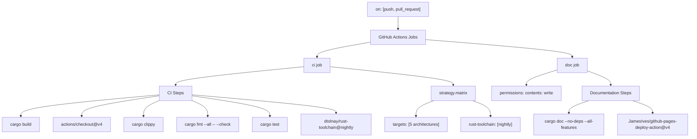
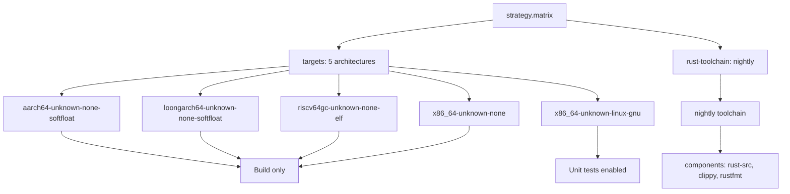
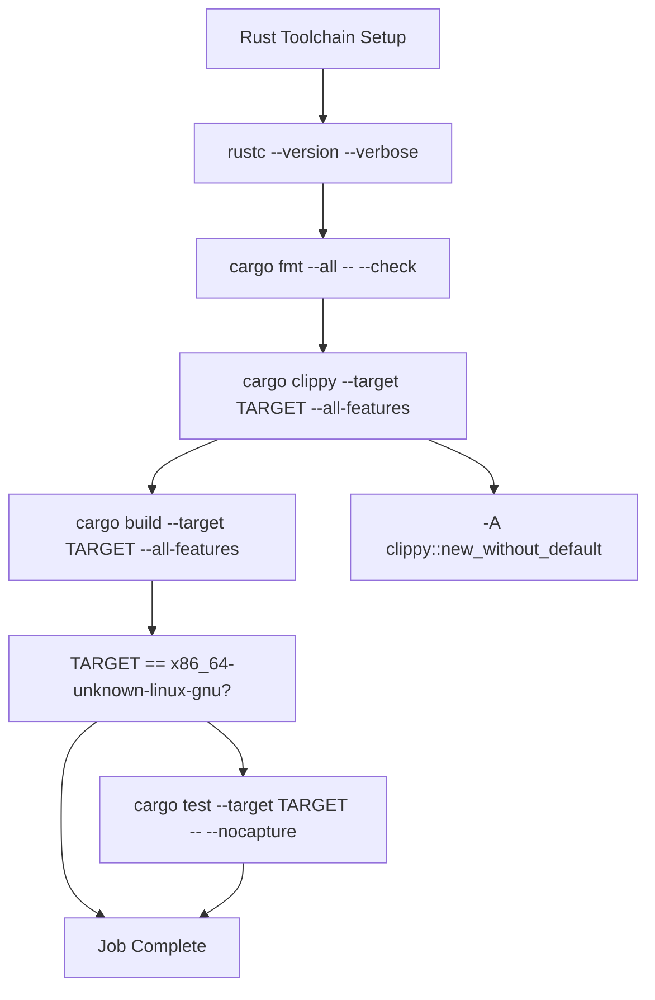
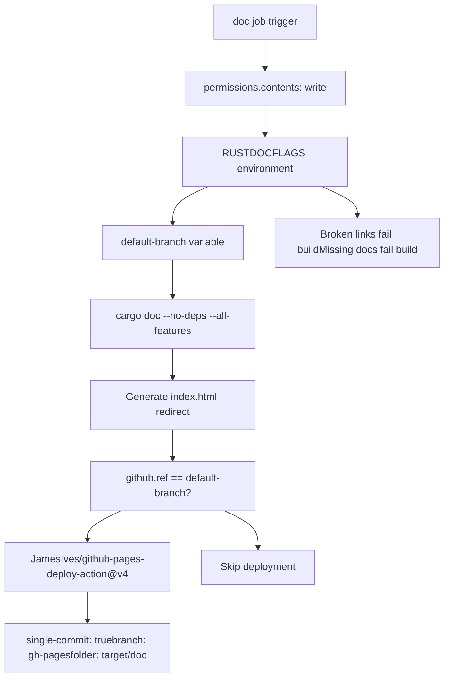
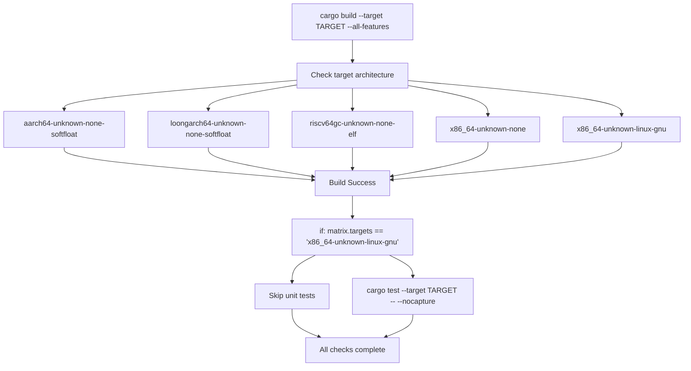

# Build System and CI

> **Relevant source files**
> * [.github/workflows/ci.yml](https://github.com/arceos-org/kernel_guard/blob/f1a9da26/.github/workflows/ci.yml)

This document covers the automated build system and continuous integration (CI) pipeline for the `kernel_guard` crate. The CI system is implemented using GitHub Actions and provides multi-architecture testing, code quality enforcement, and automated documentation deployment.

For information about setting up a local development environment, see [Development Environment](/arceos-org/kernel_guard/5.2-development-environment). For details about the specific architectures supported, see [Multi-Architecture Support](/arceos-org/kernel_guard/3-multi-architecture-support).

## CI Pipeline Overview

The kernel_guard project uses GitHub Actions for continuous integration, defined in a single workflow file that handles both build/test operations and documentation deployment. The pipeline is triggered on all push and pull request events.

**CI Pipeline Structure**



Sources: [.github/workflows/ci.yml(L1 - L56)&emsp;](https://github.com/arceos-org/kernel_guard/blob/f1a9da26/.github/workflows/ci.yml#L1-L56)

## CI Job Configuration

The primary `ci` job runs on `ubuntu-latest` and uses a matrix strategy to test multiple configurations simultaneously. The job is configured with `fail-fast: false` to ensure all matrix combinations are tested even if some fail.

### Matrix Strategy

The build matrix tests against multiple target architectures using the nightly Rust toolchain:

|Target Architecture|Purpose|
| --- | --- |
|x86_64-unknown-linux-gnu|Standard Linux testing and unit tests|
|x86_64-unknown-none|Bare metal x86_64|
|riscv64gc-unknown-none-elf|RISC-V 64-bit bare metal|
|aarch64-unknown-none-softfloat|ARM64 bare metal|
|loongarch64-unknown-none-softfloat|LoongArch64 bare metal|

**Matrix Configuration Flow**



Sources: [.github/workflows/ci.yml(L8 - L12)&emsp;](https://github.com/arceos-org/kernel_guard/blob/f1a9da26/.github/workflows/ci.yml#L8-L12) [.github/workflows/ci.yml(L16 - L19)&emsp;](https://github.com/arceos-org/kernel_guard/blob/f1a9da26/.github/workflows/ci.yml#L16-L19)

### Quality Assurance Steps

The CI job enforces code quality through a series of automated checks:

**Quality Assurance Workflow**



The clippy step includes a specific allowance for the `new_without_default` lint, configured via the `-A clippy::new_without_default` flag.

Sources: [.github/workflows/ci.yml(L20 - L30)&emsp;](https://github.com/arceos-org/kernel_guard/blob/f1a9da26/.github/workflows/ci.yml#L20-L30)

## Documentation Job and GitHub Pages

The `doc` job handles automated documentation generation and deployment to GitHub Pages. This job requires write permissions to the repository contents for deployment.

### Documentation Build Process

The documentation job uses specific environment variables and build flags to ensure high-quality documentation:

```yaml
RUSTDOCFLAGS: -D rustdoc::broken_intra_doc_links -D missing-docs
```

**Documentation Deployment Flow**



The index.html generation uses a shell command to extract the crate name and create a redirect:

```
printf '<meta http-equiv="refresh" content="0;url=%s/index.html">' $(cargo tree | head -1 | cut -d' ' -f1) > target/doc/index.html
```

Sources: [.github/workflows/ci.yml(L32 - L56)&emsp;](https://github.com/arceos-org/kernel_guard/blob/f1a9da26/.github/workflows/ci.yml#L32-L56) [.github/workflows/ci.yml(L40)&emsp;](https://github.com/arceos-org/kernel_guard/blob/f1a9da26/.github/workflows/ci.yml#L40-L40) [.github/workflows/ci.yml(L46 - L48)&emsp;](https://github.com/arceos-org/kernel_guard/blob/f1a9da26/.github/workflows/ci.yml#L46-L48)

## Build and Test Execution

The CI system executes different build and test strategies based on the target architecture:

### Target-Specific Behavior



Unit tests are only executed on the `x86_64-unknown-linux-gnu` target because the bare metal targets cannot run standard Rust test frameworks.

Sources: [.github/workflows/ci.yml(L26 - L30)&emsp;](https://github.com/arceos-org/kernel_guard/blob/f1a9da26/.github/workflows/ci.yml#L26-L30)

The CI pipeline ensures that the kernel_guard crate builds correctly across all supported architectures while maintaining code quality standards through automated formatting, linting, and testing.