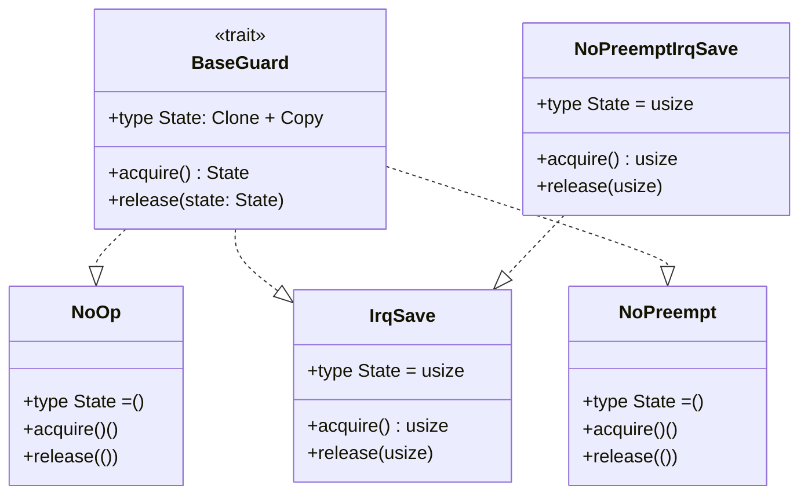
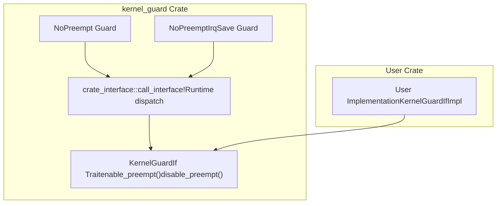
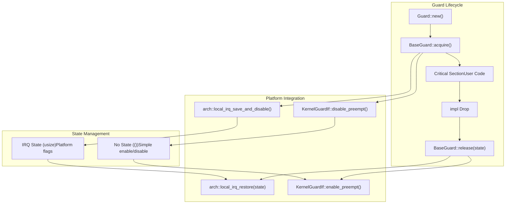
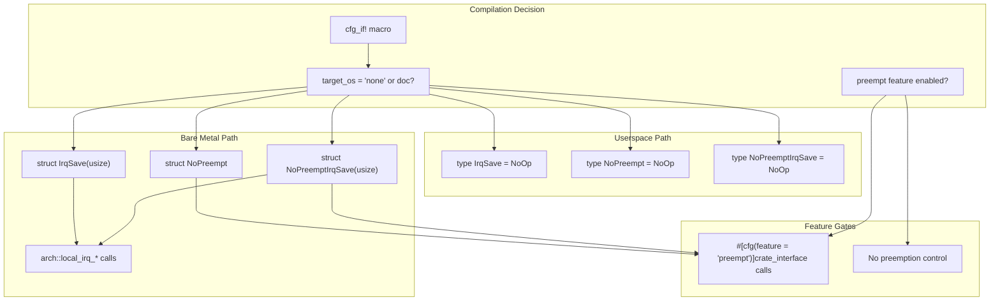
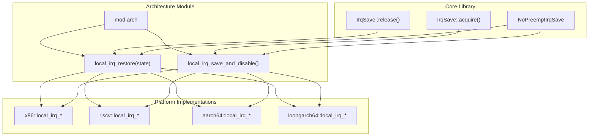
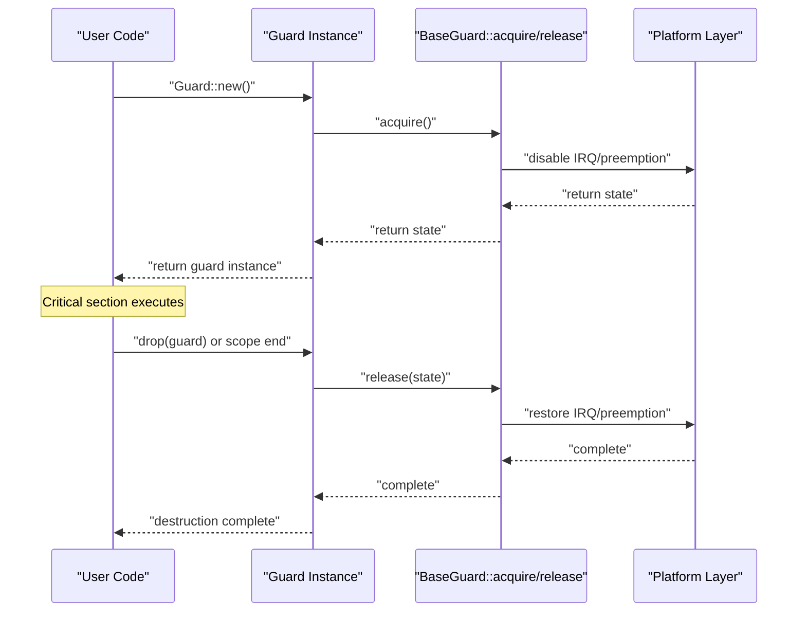

# Core Architecture

> **Relevant source files**
> * [README.md](https://github.com/arceos-org/kernel_guard/blob/f1a9da26/README.md)
> * [src/lib.rs](https://github.com/arceos-org/kernel_guard/blob/f1a9da26/src/lib.rs)

This document describes the core architecture of the `kernel_guard` crate, focusing on the trait system, RAII guard implementations, and conditional compilation strategy. The architecture provides a unified interface for creating critical sections while abstracting platform-specific interrupt handling and kernel preemption control.

For information about platform-specific implementations, see [Multi-Architecture Support](/arceos-org/kernel_guard/3-multi-architecture-support). For integration details and feature configuration, see [Integration Guide](/arceos-org/kernel_guard/4-integration-guide).

## Trait System Foundation

The `kernel_guard` crate is built around two core traits that define the contract for critical section management and kernel integration.

### BaseGuard Trait

The `BaseGuard` trait serves as the fundamental interface that all guard implementations must satisfy. It defines a generic pattern for acquiring and releasing critical section protection.

**BaseGuard Trait Architecture**

The trait uses an associated `State` type to capture platform-specific information needed to restore the system state when the critical section ends. For example, interrupt guards store the previous interrupt flag state, while preemption-only guards use unit type since no state needs preservation.

Sources: [src/lib.rs(L68 - L78)&emsp;](https://github.com/arceos-org/kernel_guard/blob/f1a9da26/src/lib.rs#L68-L78)

### KernelGuardIf Interface

The `KernelGuardIf` trait provides the integration point between `kernel_guard` and the user's kernel implementation. This trait must be implemented by crate users when the `preempt` feature is enabled.

**KernelGuardIf Integration Pattern**

The interface uses the `crate_interface` crate to provide stable ABI boundaries, allowing the kernel implementation to be provided at runtime rather than compile time.

Sources: [src/lib.rs(L58 - L66)&emsp;](https://github.com/arceos-org/kernel_guard/blob/f1a9da26/src/lib.rs#L58-L66) [src/lib.rs(L154)&emsp;](https://github.com/arceos-org/kernel_guard/blob/f1a9da26/src/lib.rs#L154-L154) [src/lib.rs(L159)&emsp;](https://github.com/arceos-org/kernel_guard/blob/f1a9da26/src/lib.rs#L159-L159) [src/lib.rs(L168)&emsp;](https://github.com/arceos-org/kernel_guard/blob/f1a9da26/src/lib.rs#L168-L168) [src/lib.rs(L177)&emsp;](https://github.com/arceos-org/kernel_guard/blob/f1a9da26/src/lib.rs#L177-L177)

## Guard Implementation Hierarchy

The crate provides four distinct guard types, each designed for specific synchronization requirements in kernel contexts.

### Guard Type Matrix

|Guard Type|IRQ Control|Preemption Control|State Type|Primary Use Case|
| --- | --- | --- | --- | --- |
|NoOp|None|None|()|Testing, userspace|
|IrqSave|Disable/Restore|None|usize|IRQ-sensitive operations|
|NoPreempt|None|Disable/Enable|()|Scheduler coordination|
|NoPreemptIrqSave|Disable/Restore|Disable/Enable|usize|Complete critical sections|

### Implementation Strategy

**RAII Guard Lifecycle and Platform Integration**

Sources: [src/lib.rs(L134 - L179)&emsp;](https://github.com/arceos-org/kernel_guard/blob/f1a9da26/src/lib.rs#L134-L179) [src/lib.rs(L181 - L237)&emsp;](https://github.com/arceos-org/kernel_guard/blob/f1a9da26/src/lib.rs#L181-L237)

## Conditional Compilation Strategy

The crate uses sophisticated conditional compilation to provide different implementations based on the target environment and available features.

### Target Environment Detection

**Conditional Compilation Flow**

The compilation strategy ensures that:

1. **Bare metal targets** (`target_os = "none"`) receive full guard implementations with platform-specific interrupt control
2. **Userspace targets** receive no-op aliases to prevent compilation errors while maintaining API compatibility
3. **Feature-gated preemption** only compiles preemption control when the `preempt` feature is enabled

Sources: [src/lib.rs(L83 - L111)&emsp;](https://github.com/arceos-org/kernel_guard/blob/f1a9da26/src/lib.rs#L83-L111) [src/lib.rs(L130 - L238)&emsp;](https://github.com/arceos-org/kernel_guard/blob/f1a9da26/src/lib.rs#L130-L238) [src/lib.rs(L153 - L154)&emsp;](https://github.com/arceos-org/kernel_guard/blob/f1a9da26/src/lib.rs#L153-L154) [src/lib.rs(L158 - L159)&emsp;](https://github.com/arceos-org/kernel_guard/blob/f1a9da26/src/lib.rs#L158-L159) [src/lib.rs(L167 - L168)&emsp;](https://github.com/arceos-org/kernel_guard/blob/f1a9da26/src/lib.rs#L167-L168) [src/lib.rs(L176 - L177)&emsp;](https://github.com/arceos-org/kernel_guard/blob/f1a9da26/src/lib.rs#L176-L177)

## Architecture Module Integration

The core library integrates with platform-specific implementations through the `arch` module, which provides a uniform interface for interrupt control across different CPU architectures.

### Architecture Abstraction Interface

**Architecture Module Integration Pattern**

The architecture module provides two critical functions that abstract platform-specific interrupt handling:

* `local_irq_save_and_disable()`: Returns current interrupt state and disables interrupts
* `local_irq_restore(state)`: Restores interrupt state from saved value

Sources: [src/lib.rs(L56)&emsp;](https://github.com/arceos-org/kernel_guard/blob/f1a9da26/src/lib.rs#L56-L56) [src/lib.rs(L139)&emsp;](https://github.com/arceos-org/kernel_guard/blob/f1a9da26/src/lib.rs#L139-L139) [src/lib.rs(L145)&emsp;](https://github.com/arceos-org/kernel_guard/blob/f1a9da26/src/lib.rs#L145-L145) [src/lib.rs(L170)&emsp;](https://github.com/arceos-org/kernel_guard/blob/f1a9da26/src/lib.rs#L170-L170) [src/lib.rs(L174)&emsp;](https://github.com/arceos-org/kernel_guard/blob/f1a9da26/src/lib.rs#L174-L174)

## RAII Lifecycle Management

The crate implements the RAII (Resource Acquisition Is Initialization) pattern to ensure critical sections are properly managed without requiring explicit cleanup calls.

### Drop Implementation Pattern

**RAII Lifecycle Sequence**

Each guard type implements the `Drop` trait to ensure that critical section protection is automatically released when the guard goes out of scope, preventing resource leaks and ensuring system stability.

Sources: [src/lib.rs(L126 - L128)&emsp;](https://github.com/arceos-org/kernel_guard/blob/f1a9da26/src/lib.rs#L126-L128) [src/lib.rs(L188 - L192)&emsp;](https://github.com/arceos-org/kernel_guard/blob/f1a9da26/src/lib.rs#L188-L192) [src/lib.rs(L208 - L212)&emsp;](https://github.com/arceos-org/kernel_guard/blob/f1a9da26/src/lib.rs#L208-L212) [src/lib.rs(L227 - L231)&emsp;](https://github.com/arceos-org/kernel_guard/blob/f1a9da26/src/lib.rs#L227-L231)