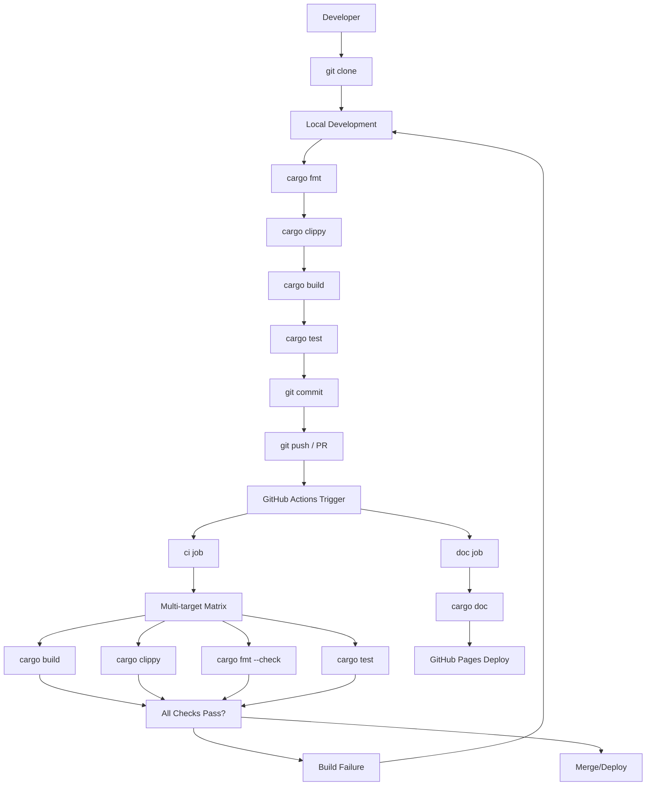
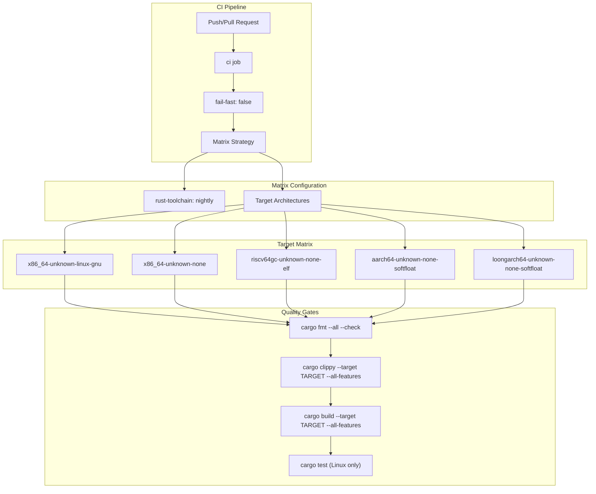
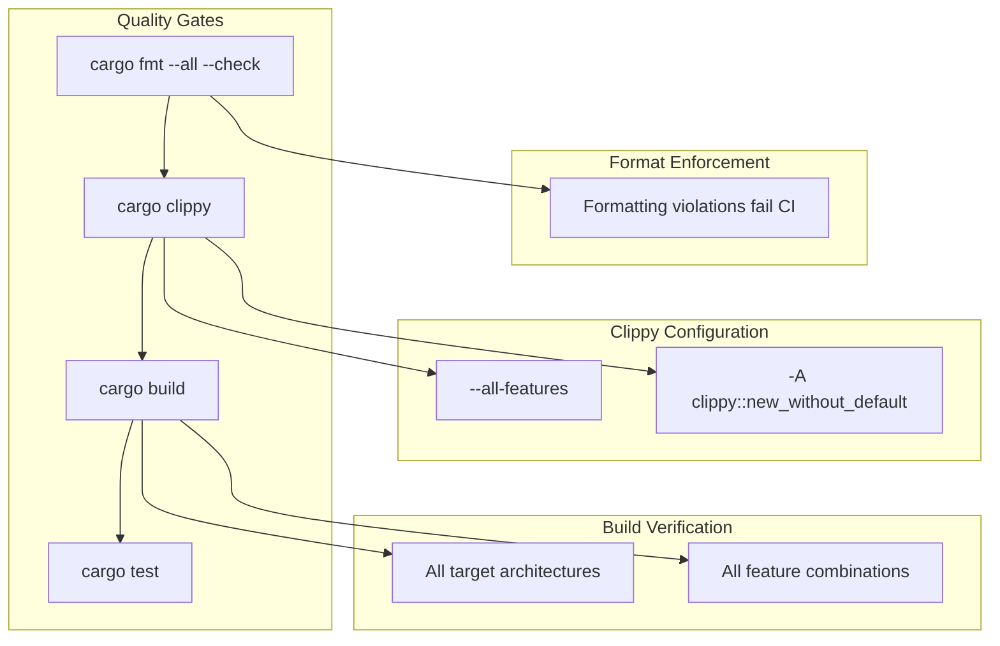
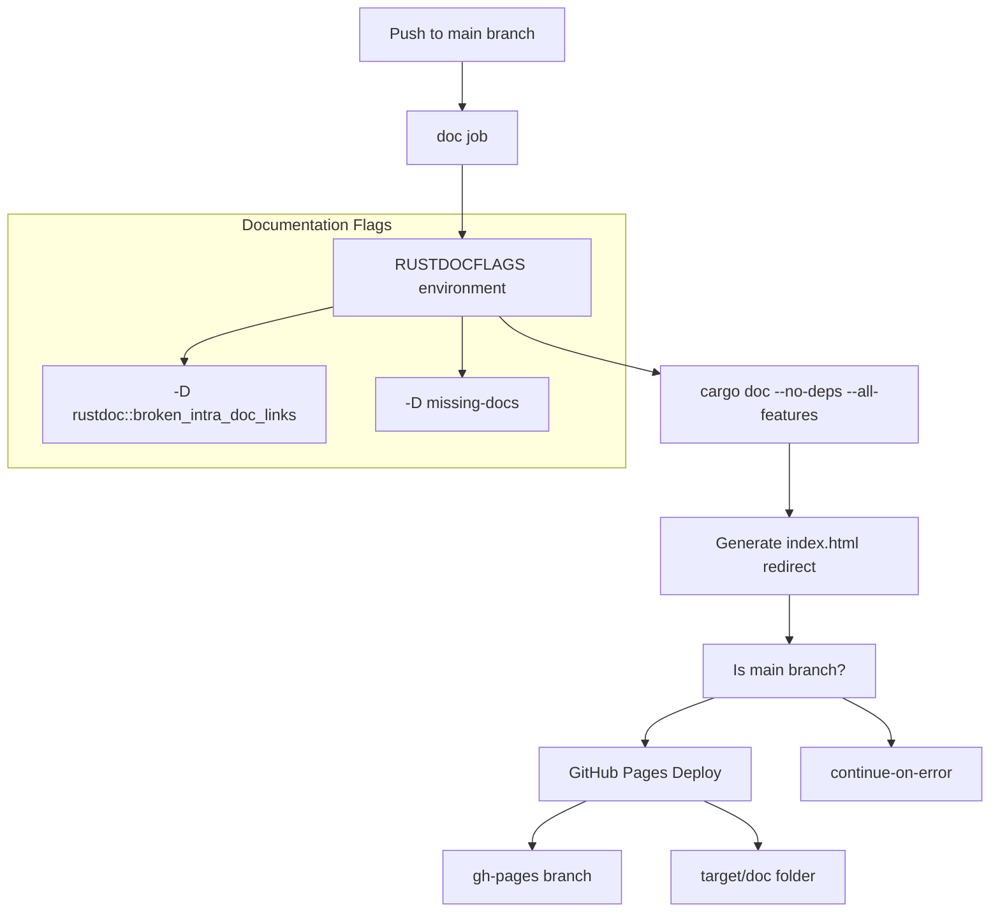

# Development

> **Relevant source files**
> * [.github/workflows/ci.yml](https://github.com/arceos-org/kernel_guard/blob/f1a9da26/.github/workflows/ci.yml)
> * [.gitignore](https://github.com/arceos-org/kernel_guard/blob/f1a9da26/.gitignore)
> * [Cargo.toml](https://github.com/arceos-org/kernel_guard/blob/f1a9da26/Cargo.toml)

This document provides comprehensive information for contributors and maintainers about the development workflow, testing procedures, and CI/CD pipeline for the `kernel_guard` crate. It covers the automated build system, multi-architecture testing strategy, documentation generation process, and local development environment setup.

For information about integrating `kernel_guard` into other projects, see [Integration Guide](/arceos-org/kernel_guard/4-integration-guide). For details about the core architecture and implementation, see [Core Architecture](/arceos-org/kernel_guard/2-core-architecture).

## Development Workflow Overview

The `kernel_guard` project follows a streamlined development workflow centered around GitHub Actions for continuous integration and automated documentation deployment.

### Development Process Flow



Sources: [.github/workflows/ci.yml(L1 - L56)&emsp;](https://github.com/arceos-org/kernel_guard/blob/f1a9da26/.github/workflows/ci.yml#L1-L56) [Cargo.toml(L1 - L21)&emsp;](https://github.com/arceos-org/kernel_guard/blob/f1a9da26/Cargo.toml#L1-L21)

## CI/CD Pipeline Architecture

The continuous integration system is defined in [.github/workflows/ci.yml](https://github.com/arceos-org/kernel_guard/blob/f1a9da26/.github/workflows/ci.yml) and consists of two primary jobs: `ci` and `doc`, each serving distinct purposes in the development pipeline.

### CI Job Matrix Configuration



Sources: [.github/workflows/ci.yml(L6 - L30)&emsp;](https://github.com/arceos-org/kernel_guard/blob/f1a9da26/.github/workflows/ci.yml#L6-L30)

### Build and Test Matrix

The CI system uses a matrix strategy to test across multiple target architectures simultaneously:

|Target Architecture|Operating System|Test Execution|
| --- | --- | --- |
|x86_64-unknown-linux-gnu|Linux (hosted)|Full tests|
|x86_64-unknown-none|Bare metal|Build only|
|riscv64gc-unknown-none-elf|Bare metal|Build only|
|aarch64-unknown-none-softfloat|Bare metal|Build only|
|loongarch64-unknown-none-softfloat|Bare metal|Build only|

The conditional test execution is controlled by the matrix condition at [.github/workflows/ci.yml(L29)&emsp;](https://github.com/arceos-org/kernel_guard/blob/f1a9da26/.github/workflows/ci.yml#L29-L29): `if: ${{ matrix.targets == 'x86_64-unknown-linux-gnu' }}`.

Sources: [.github/workflows/ci.yml(L11 - L12)&emsp;](https://github.com/arceos-org/kernel_guard/blob/f1a9da26/.github/workflows/ci.yml#L11-L12) [.github/workflows/ci.yml(L28 - L30)&emsp;](https://github.com/arceos-org/kernel_guard/blob/f1a9da26/.github/workflows/ci.yml#L28-L30)

## Toolchain and Dependencies

### Rust Toolchain Requirements

The project requires Rust nightly toolchain with specific components:

* **Toolchain**: `nightly` [.github/workflows/ci.yml(L17)&emsp;](https://github.com/arceos-org/kernel_guard/blob/f1a9da26/.github/workflows/ci.yml#L17-L17)
* **Components**: `rust-src`, `clippy`, `rustfmt` [.github/workflows/ci.yml(L18)&emsp;](https://github.com/arceos-org/kernel_guard/blob/f1a9da26/.github/workflows/ci.yml#L18-L18)
* **Targets**: All supported architectures [.github/workflows/ci.yml(L19)&emsp;](https://github.com/arceos-org/kernel_guard/blob/f1a9da26/.github/workflows/ci.yml#L19-L19)

### Crate Dependencies

The project maintains minimal dependencies as defined in [Cargo.toml(L18 - L20)&emsp;](https://github.com/arceos-org/kernel_guard/blob/f1a9da26/Cargo.toml#L18-L20):

|Dependency|Version|Purpose|
| --- | --- | --- |
|cfg-if|1.0|Conditional compilation|
|crate_interface|0.1|Stable API abstraction|

Sources: [Cargo.toml(L18 - L20)&emsp;](https://github.com/arceos-org/kernel_guard/blob/f1a9da26/Cargo.toml#L18-L20) [.github/workflows/ci.yml(L15 - L19)&emsp;](https://github.com/arceos-org/kernel_guard/blob/f1a9da26/.github/workflows/ci.yml#L15-L19)

## Quality Assurance Process

### Code Quality Checks

The CI pipeline enforces code quality through multiple automated checks:



Sources: [.github/workflows/ci.yml(L22 - L27)&emsp;](https://github.com/arceos-org/kernel_guard/blob/f1a9da26/.github/workflows/ci.yml#L22-L27)

### Testing Strategy

Unit testing is architecture-specific and only executed on the Linux target:

* **Test Execution**: [.github/workflows/ci.yml(L28 - L30)&emsp;](https://github.com/arceos-org/kernel_guard/blob/f1a9da26/.github/workflows/ci.yml#L28-L30)
* **Test Command**: `cargo test --target x86_64-unknown-linux-gnu -- --nocapture`
* **Rationale**: Bare metal targets cannot execute standard unit tests

Sources: [.github/workflows/ci.yml(L28 - L30)&emsp;](https://github.com/arceos-org/kernel_guard/blob/f1a9da26/.github/workflows/ci.yml#L28-L30)

## Documentation Pipeline

### Automated Documentation Generation

The `doc` job handles documentation building and deployment:



Sources: [.github/workflows/ci.yml(L32 - L56)&emsp;](https://github.com/arceos-org/kernel_guard/blob/f1a9da26/.github/workflows/ci.yml#L32-L56) [.github/workflows/ci.yml(L40)&emsp;](https://github.com/arceos-org/kernel_guard/blob/f1a9da26/.github/workflows/ci.yml#L40-L40)

### Documentation Configuration

The documentation system includes several important configurations:

* **Strict Documentation**: `-D missing-docs` flag requires all public items to be documented
* **Link Validation**: `-D rustdoc::broken_intra_doc_links` prevents broken documentation links
* **Automatic Indexing**: Dynamic index.html generation using `cargo tree` output [.github/workflows/ci.yml(L48)&emsp;](https://github.com/arceos-org/kernel_guard/blob/f1a9da26/.github/workflows/ci.yml#L48-L48)

Sources: [.github/workflows/ci.yml(L40)&emsp;](https://github.com/arceos-org/kernel_guard/blob/f1a9da26/.github/workflows/ci.yml#L40-L40) [.github/workflows/ci.yml(L47 - L48)&emsp;](https://github.com/arceos-org/kernel_guard/blob/f1a9da26/.github/workflows/ci.yml#L47-L48)

## Development Environment Setup

### Local Development Requirements

For local development, ensure your environment excludes build artifacts and temporary files as specified in [.gitignore(L1 - L4)&emsp;](https://github.com/arceos-org/kernel_guard/blob/f1a9da26/.gitignore#L1-L4):

```
/target
/.vscode
.DS_Store
Cargo.lock
```

### Feature Development

The crate supports feature-based development through [Cargo.toml(L14 - L16)&emsp;](https://github.com/arceos-org/kernel_guard/blob/f1a9da26/Cargo.toml#L14-L16):

* **Default Features**: None (`default = []`)
* **Optional Features**: `preempt` for preemption control functionality

### Local Testing Commands

For effective local development, use these commands that mirror the CI pipeline:

```markdown
# Format check
cargo fmt --all -- --check

# Linting
cargo clippy --all-features -- -A clippy::new_without_default

# Multi-target builds
cargo build --target x86_64-unknown-none --all-features
cargo build --target riscv64gc-unknown-none-elf --all-features

# Unit testing (Linux only)
cargo test --target x86_64-unknown-linux-gnu -- --nocapture

# Documentation generation
cargo doc --no-deps --all-features
```

Sources: [.github/workflows/ci.yml(L22 - L30)&emsp;](https://github.com/arceos-org/kernel_guard/blob/f1a9da26/.github/workflows/ci.yml#L22-L30) [.gitignore(L1 - L4)&emsp;](https://github.com/arceos-org/kernel_guard/blob/f1a9da26/.gitignore#L1-L4) [Cargo.toml(L14 - L16)&emsp;](https://github.com/arceos-org/kernel_guard/blob/f1a9da26/Cargo.toml#L14-L16)