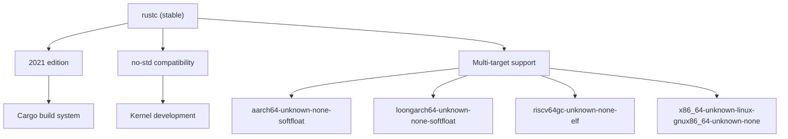
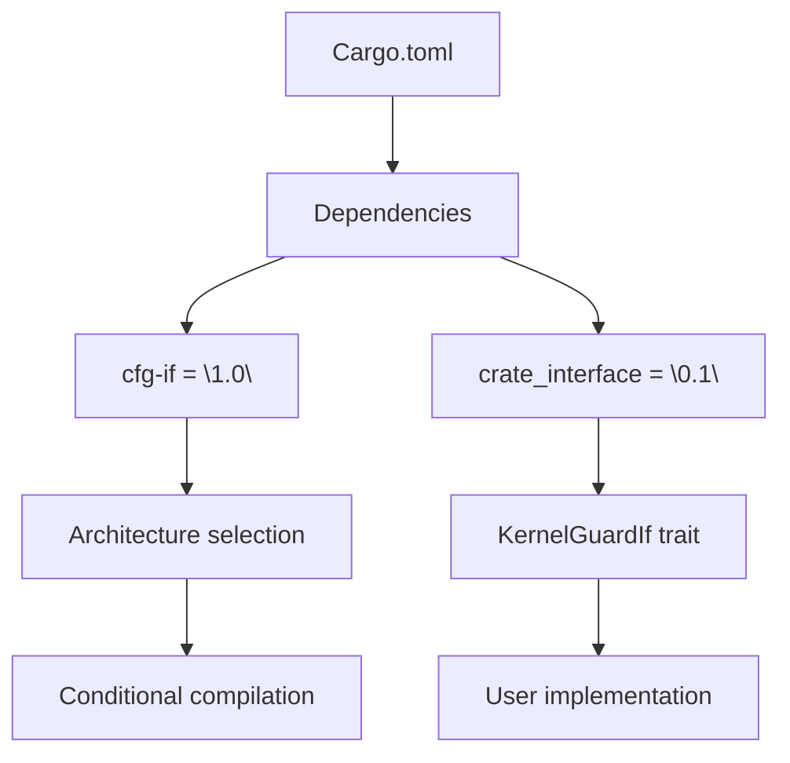
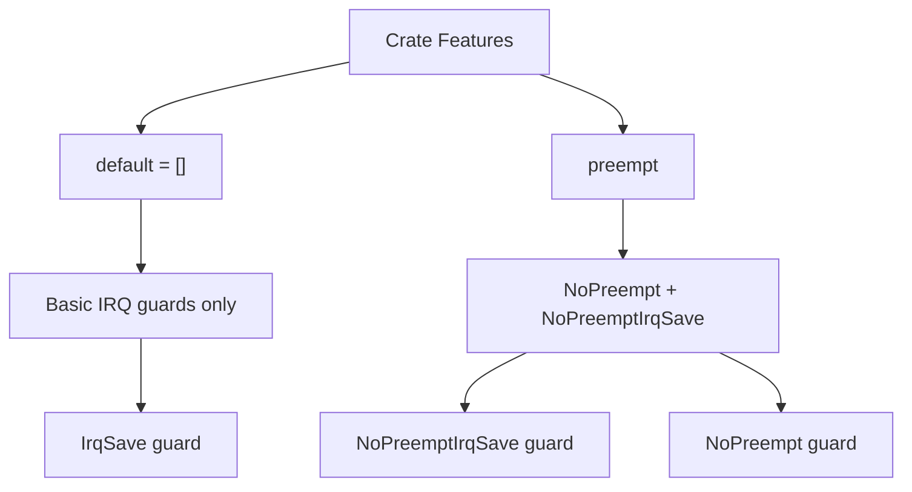
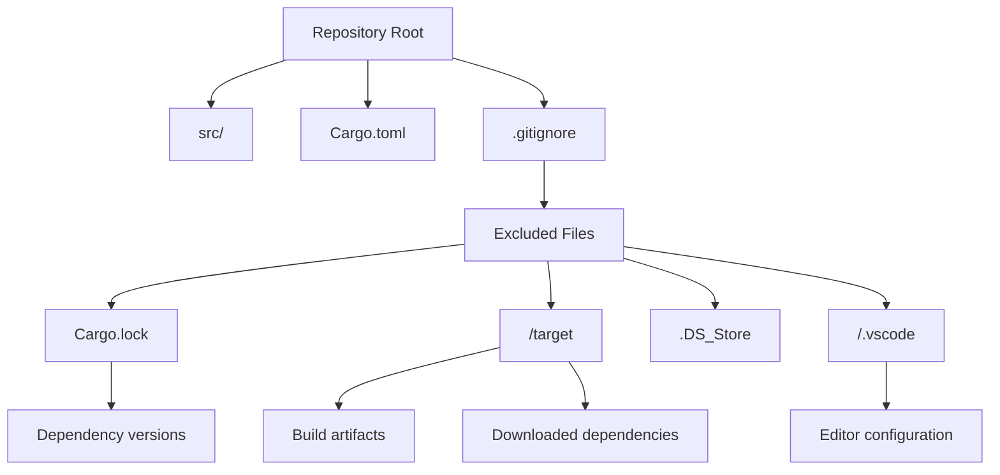
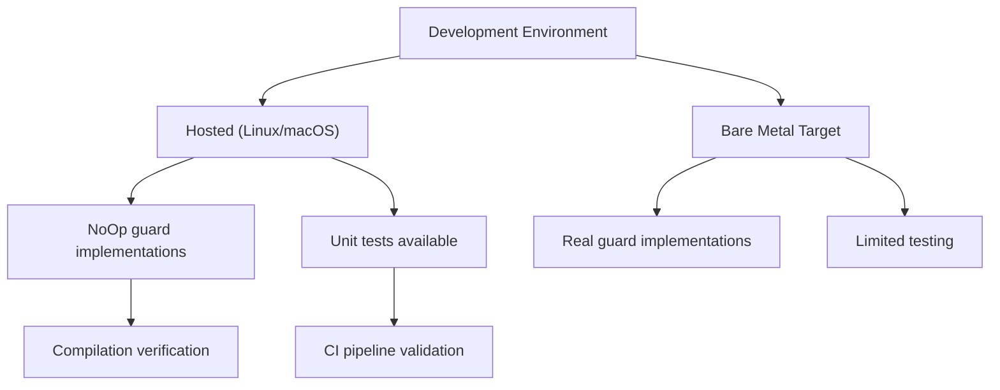

# Development Environment

> **Relevant source files**
> * [.gitignore](https://github.com/arceos-org/kernel_guard/blob/f1a9da26/.gitignore)
> * [Cargo.toml](https://github.com/arceos-org/kernel_guard/blob/f1a9da26/Cargo.toml)

This section provides setup instructions for local development of the `kernel_guard` crate, including toolchain requirements, dependency management, and project configuration. For information about the CI/CD pipeline and automated testing, see [Build System and CI](/arceos-org/kernel_guard/5.1-build-system-and-ci).

## Prerequisites and Toolchain Setup

The `kernel_guard` crate is designed for kernel-level development and supports multiple target architectures. Development requires a properly configured Rust toolchain with cross-compilation capabilities.

### Rust Toolchain Requirements

The project uses Rust 2021 edition and requires a recent stable Rust compiler. The crate is designed for `no-std` environments, making it suitable for bare-metal kernel development.



**Rust Toolchain Setup**

```markdown
# Install required targets for cross-compilation
rustup target add x86_64-unknown-none
rustup target add riscv64gc-unknown-none-elf
rustup target add aarch64-unknown-none-softfloat
rustup target add loongarch64-unknown-none-softfloat
```

Sources: [Cargo.toml(L4)&emsp;](https://github.com/arceos-org/kernel_guard/blob/f1a9da26/Cargo.toml#L4-L4) [Cargo.toml(L12)&emsp;](https://github.com/arceos-org/kernel_guard/blob/f1a9da26/Cargo.toml#L12-L12)

## Project Dependencies and Configuration

The project maintains minimal dependencies to ensure compatibility with kernel environments. All dependencies are carefully selected for `no-std` compatibility.

### Core Dependencies

The project relies on two primary dependencies that enable its architecture-agnostic design and conditional compilation features.

|Dependency|Version|Purpose|
| --- | --- | --- |
|cfg-if|1.0|Conditional compilation macros|
|crate_interface|0.1|Stable API abstraction layer|



Sources: [Cargo.toml(L18 - L20)&emsp;](https://github.com/arceos-org/kernel_guard/blob/f1a9da26/Cargo.toml#L18-L20)

### Feature Configuration

The crate provides optional features that control guard functionality and compilation behavior.

|Feature|Default|Description|
| --- | --- | --- |
|default|✓|Empty default feature set|
|preempt|✗|Enables preemption control guards|



Sources: [Cargo.toml(L14 - L16)&emsp;](https://github.com/arceos-org/kernel_guard/blob/f1a9da26/Cargo.toml#L14-L16)

## Local Development Workflow

### Project Structure

The development environment excludes common build artifacts and editor-specific files to maintain a clean repository state.

**Excluded Files and Directories**

* `/target` - Cargo build artifacts and dependencies
* `/.vscode` - Visual Studio Code workspace settings
* `.DS_Store` - macOS file system metadata
* `Cargo.lock` - Dependency lock file (excluded for libraries)



Sources: [.gitignore(L1 - L4)&emsp;](https://github.com/arceos-org/kernel_guard/blob/f1a9da26/.gitignore#L1-L4)

### Build Commands

**Basic Development Commands**

```markdown
# Build for host target
cargo build

# Build for specific target
cargo build --target x86_64-unknown-none

# Enable preempt feature
cargo build --features preempt

# Check formatting
cargo fmt --check

# Run linting
cargo clippy
```

**Cross-Compilation Workflow**

```markdown
# Build for all supported architectures
cargo build --target x86_64-unknown-none
cargo build --target riscv64gc-unknown-none-elf
cargo build --target aarch64-unknown-none-softfloat
cargo build --target loongarch64-unknown-none-softfloat
```

### Testing Limitations

Due to the kernel-specific nature of the crate, comprehensive testing is only available on hosted environments. The guards provide no-op implementations when not running on bare metal, allowing basic compilation and unit testing on development machines.



Sources: [Cargo.toml(L12)&emsp;](https://github.com/arceos-org/kernel_guard/blob/f1a9da26/Cargo.toml#L12-L12)

## Documentation Development

The project uses standard Rust documentation tools with GitHub Pages integration for hosting.

**Documentation Commands**

```markdown
# Generate local documentation
cargo doc --open

# Generate documentation with all features
cargo doc --all-features --open

# Check documentation examples
cargo test --doc
```

The documentation is automatically deployed to GitHub Pages through the CI pipeline, providing up-to-date API reference at the configured documentation URL.

Sources: [Cargo.toml(L10)&emsp;](https://github.com/arceos-org/kernel_guard/blob/f1a9da26/Cargo.toml#L10-L10)