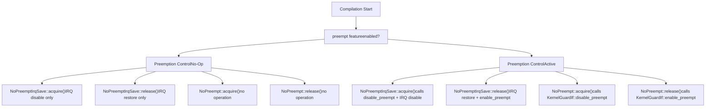
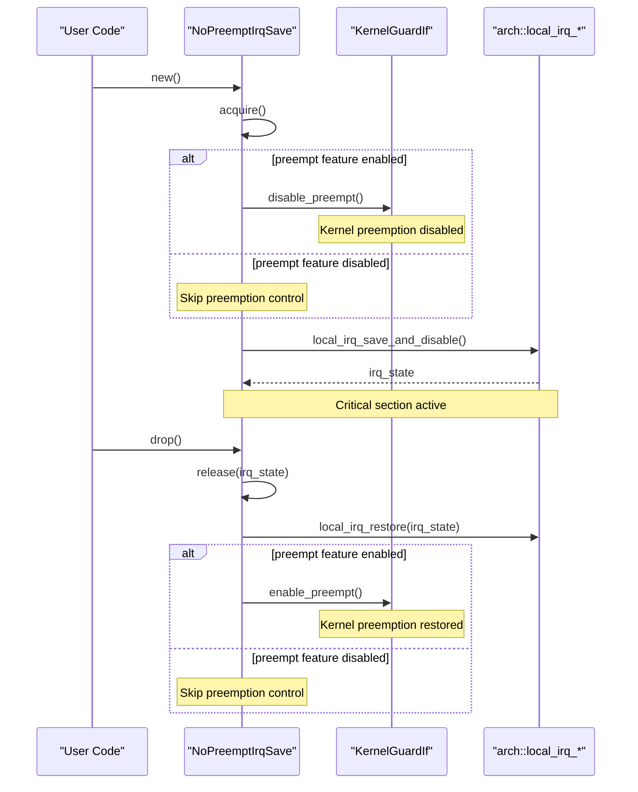
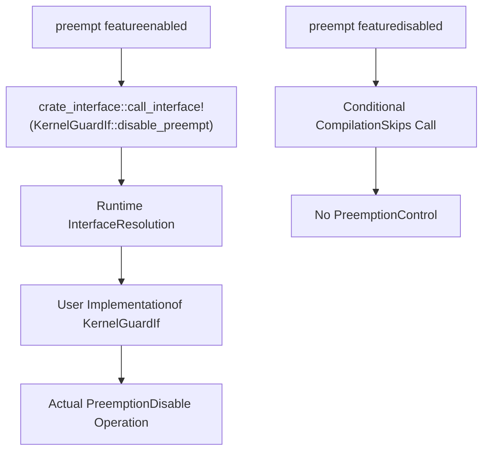

# Feature Configuration

> **Relevant source files**
> * [Cargo.toml](https://github.com/arceos-org/kernel_guard/blob/f1a9da26/Cargo.toml)
> * [src/lib.rs](https://github.com/arceos-org/kernel_guard/blob/f1a9da26/src/lib.rs)

This document explains the feature-based configuration system in the `kernel_guard` crate, specifically focusing on the `preempt` feature and its impact on guard availability and functionality. For information about implementing the required traits when using features, see [Implementing KernelGuardIf](/arceos-org/kernel_guard/4.2-implementing-kernelguardif).

## Overview

The `kernel_guard` crate uses Cargo features to provide conditional functionality that adapts to different system requirements. The primary feature is `preempt`, which enables kernel preemption control capabilities in guard implementations. This feature system allows the crate to be used in both simple interrupt-only scenarios and more complex preemptive kernel environments.

## Feature Definitions

The crate defines its features in the Cargo manifest with a minimal configuration approach:

|Feature|Default|Purpose|
| --- | --- | --- |
|preempt|Disabled|Enables kernel preemption control in applicable guards|
|default|Empty|No features enabled by default|

**Sources**: [Cargo.toml(L14 - L16)&emsp;](https://github.com/arceos-org/kernel_guard/blob/f1a9da26/Cargo.toml#L14-L16)

## Preempt Feature Behavior

### Feature Impact on Guard Implementations

The `preempt` feature primarily affects two guard types: `NoPreempt` and `NoPreemptIrqSave`. When this feature is enabled, these guards will attempt to disable and re-enable kernel preemption around critical sections.

#### Compilation-Time Feature Resolution



**Sources**: [src/lib.rs(L149 - L161)&emsp;](https://github.com/arceos-org/kernel_guard/blob/f1a9da26/src/lib.rs#L149-L161) [src/lib.rs(L163 - L179)&emsp;](https://github.com/arceos-org/kernel_guard/blob/f1a9da26/src/lib.rs#L163-L179)

### Guard Behavior Matrix

The following table shows how each guard type behaves based on feature configuration:

|Guard Type|preempt Feature Disabled|preempt Feature Enabled|
| --- | --- | --- |
|NoOp|No operation|No operation|
|IrqSave|IRQ disable/restore only|IRQ disable/restore only|
|NoPreempt|No operation|Preemption disable/enable viaKernelGuardIf|
|NoPreemptIrqSave|IRQ disable/restore only|Preemption disable + IRQ disable/restore|

### Implementation Details

#### NoPreempt Guard Feature Integration

```

```

**Sources**: [src/lib.rs(L149 - L161)&emsp;](https://github.com/arceos-org/kernel_guard/blob/f1a9da26/src/lib.rs#L149-L161) [src/lib.rs(L200 - L217)&emsp;](https://github.com/arceos-org/kernel_guard/blob/f1a9da26/src/lib.rs#L200-L217)

#### NoPreemptIrqSave Combined Behavior

The `NoPreemptIrqSave` guard demonstrates the most complex feature-dependent behavior, combining both IRQ control and optional preemption control:



**Sources**: [src/lib.rs(L163 - L179)&emsp;](https://github.com/arceos-org/kernel_guard/blob/f1a9da26/src/lib.rs#L163-L179) [src/lib.rs(L220 - L237)&emsp;](https://github.com/arceos-org/kernel_guard/blob/f1a9da26/src/lib.rs#L220-L237)

## Integration Requirements

### Feature Dependencies

When the `preempt` feature is enabled, user code must provide an implementation of the `KernelGuardIf` trait using the `crate_interface` mechanism. The relationship between feature activation and implementation requirements is:

|Configuration|User Implementation Required|
| --- | --- |
|preemptdisabled|None|
|preemptenabled|Must implementKernelGuardIftrait|

### Runtime Interface Resolution

The crate uses `crate_interface::call_interface!` macros to dynamically dispatch to user-provided implementations at runtime. This occurs only when the `preempt` feature is active:



**Sources**: [src/lib.rs(L153 - L154)&emsp;](https://github.com/arceos-org/kernel_guard/blob/f1a9da26/src/lib.rs#L153-L154) [src/lib.rs(L158 - L159)&emsp;](https://github.com/arceos-org/kernel_guard/blob/f1a9da26/src/lib.rs#L158-L159) [src/lib.rs(L167 - L168)&emsp;](https://github.com/arceos-org/kernel_guard/blob/f1a9da26/src/lib.rs#L167-L168) [src/lib.rs(L176 - L177)&emsp;](https://github.com/arceos-org/kernel_guard/blob/f1a9da26/src/lib.rs#L176-L177)

## Configuration Examples

### Basic Usage Without Preemption

```
[dependencies]
kernel_guard = "0.1"
```

In this configuration, `NoPreempt` and `NoPreemptIrqSave` guards will only control IRQs, making them functionally equivalent to `IrqSave` for the IRQ portion.

### Full Preemptive Configuration

```
[dependencies]
kernel_guard = { version = "0.1", features = ["preempt"] }
```

This configuration enables full preemption control capabilities, requiring the user to implement `KernelGuardIf`.

**Sources**: [Cargo.toml(L14 - L16)&emsp;](https://github.com/arceos-org/kernel_guard/blob/f1a9da26/Cargo.toml#L14-L16) [src/lib.rs(L21 - L26)&emsp;](https://github.com/arceos-org/kernel_guard/blob/f1a9da26/src/lib.rs#L21-L26)