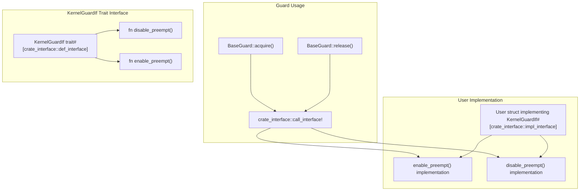
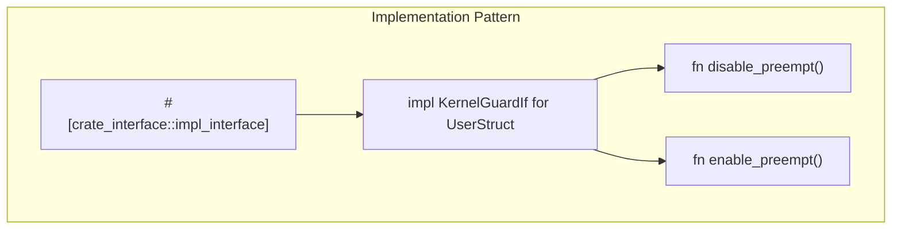
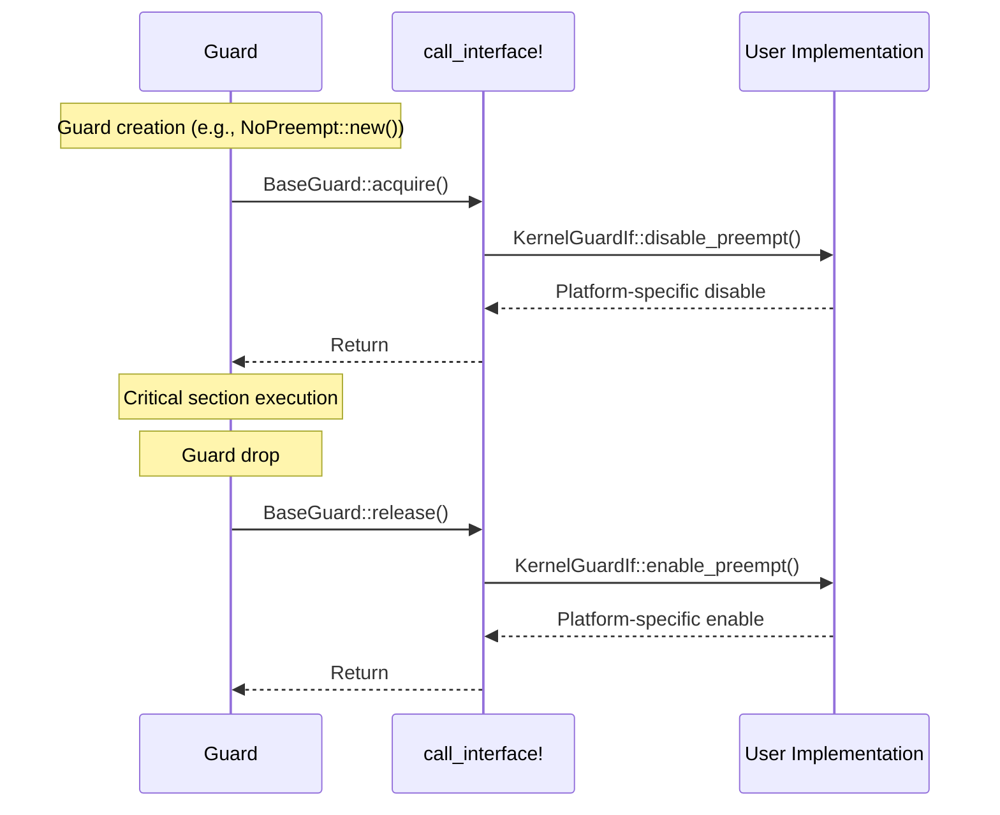
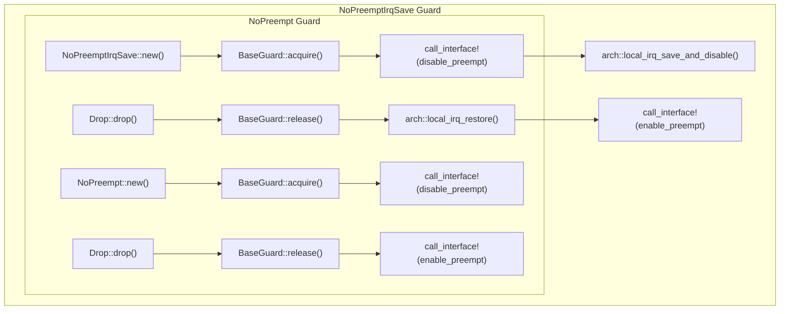

# Implementing KernelGuardIf

> **Relevant source files**
> * [README.md](https://github.com/arceos-org/kernel_guard/blob/f1a9da26/README.md)
> * [src/lib.rs](https://github.com/arceos-org/kernel_guard/blob/f1a9da26/src/lib.rs)

This page provides a comprehensive guide for implementing the `KernelGuardIf` trait to enable preemption control in the kernel_guard crate. This implementation is required when using guards that need to disable kernel preemption, such as `NoPreempt` and `NoPreemptIrqSave`. For information about feature configuration, see [Feature Configuration](/arceos-org/kernel_guard/4.1-feature-configuration). For details about the core guard types, see [RAII Guards](/arceos-org/kernel_guard/2.1-raii-guards).

## When KernelGuardIf Implementation is Required

The `KernelGuardIf` trait must be implemented by users when the `preempt` feature is enabled and they want to use preemption-aware guards. Without this implementation, preemption control operations become no-ops.

|Guard Type|Requires KernelGuardIf|IRQ Control|Preemption Control|
| --- | --- | --- | --- |
|NoOp|No|No|No|
|IrqSave|No|Yes|No|
|NoPreempt|Yes (with preempt feature)|No|Yes|
|NoPreemptIrqSave|Yes (with preempt feature)|Yes|Yes|

Sources: [src/lib.rs(L80 - L111)&emsp;](https://github.com/arceos-org/kernel_guard/blob/f1a9da26/src/lib.rs#L80-L111) [src/lib.rs(L149 - L179)&emsp;](https://github.com/arceos-org/kernel_guard/blob/f1a9da26/src/lib.rs#L149-L179)

## Trait Definition and Interface

The `KernelGuardIf` trait defines the interface for kernel preemption control:



The trait is defined using the `crate_interface::def_interface` attribute, which creates a stable interface that can be implemented by external crates. The methods are called through the `crate_interface::call_interface!` macro.

Sources: [src/lib.rs(L58 - L66)&emsp;](https://github.com/arceos-org/kernel_guard/blob/f1a9da26/src/lib.rs#L58-L66)

## Implementation Steps

### Step 1: Define Implementation Struct

Create a struct that will implement the `KernelGuardIf` trait:

```
struct KernelGuardIfImpl;
```

The struct typically doesn't need any fields, as preemption control is usually a global system operation.

### Step 2: Implement the Trait

Use the `#[crate_interface::impl_interface]` attribute to implement the trait:



The `#[crate_interface::impl_interface]` attribute registers the implementation with the crate_interface system, making it available for dynamic dispatch.

Sources: [src/lib.rs(L35 - L43)&emsp;](https://github.com/arceos-org/kernel_guard/blob/f1a9da26/src/lib.rs#L35-L43) [README.md(L41 - L49)&emsp;](https://github.com/arceos-org/kernel_guard/blob/f1a9da26/README.md#L41-L49)

### Step 3: Implement Method Bodies

Provide platform-specific implementations for enabling and disabling preemption:

* `enable_preempt()`: Should re-enable kernel preemption
* `disable_preempt()`: Should disable kernel preemption

These implementations are highly platform-specific and depend on the kernel or operating system being used.

## Interface Mechanism and Call Flow

The crate_interface mechanism provides runtime dispatch to user implementations:



The guards call the interface methods conditionally based on feature flags:

* `NoPreempt` calls the interface in both `acquire()` and `release()` methods
* `NoPreemptIrqSave` calls the interface alongside IRQ control operations
* Calls are wrapped in `#[cfg(feature = "preempt")]` conditionals

Sources: [src/lib.rs(L153 - L154)&emsp;](https://github.com/arceos-org/kernel_guard/blob/f1a9da26/src/lib.rs#L153-L154) [src/lib.rs(L158 - L159)&emsp;](https://github.com/arceos-org/kernel_guard/blob/f1a9da26/src/lib.rs#L158-L159) [src/lib.rs(L167 - L168)&emsp;](https://github.com/arceos-org/kernel_guard/blob/f1a9da26/src/lib.rs#L167-L168) [src/lib.rs(L176 - L177)&emsp;](https://github.com/arceos-org/kernel_guard/blob/f1a9da26/src/lib.rs#L176-L177)

## Complete Implementation Example

Here's a complete example showing the implementation pattern:

```javascript
use kernel_guard::{KernelGuardIf, NoPreempt};

struct KernelGuardIfImpl;

#[crate_interface::impl_interface]
impl KernelGuardIf for KernelGuardIfImpl {
    fn enable_preempt() {
        // Platform-specific implementation
        // Example: atomic decrement of preemption counter
        // or direct scheduler manipulation
    }
    
    fn disable_preempt() {
        // Platform-specific implementation  
        // Example: atomic increment of preemption counter
        // or direct scheduler manipulation
    }
}

// Usage after implementation
let guard = NoPreempt::new();
// Critical section with preemption disabled
drop(guard); // Preemption re-enabled
```

Sources: [src/lib.rs(L30 - L52)&emsp;](https://github.com/arceos-org/kernel_guard/blob/f1a9da26/src/lib.rs#L30-L52) [README.md(L36 - L58)&emsp;](https://github.com/arceos-org/kernel_guard/blob/f1a9da26/README.md#L36-L58)

## Guard Behavior with KernelGuardIf

The following diagram shows how different guards utilize the KernelGuardIf implementation:



Note the ordering in `NoPreemptIrqSave`: preemption is disabled first, then IRQs are disabled. On release, IRQs are restored first, then preemption is re-enabled.

Sources: [src/lib.rs(L149 - L179)&emsp;](https://github.com/arceos-org/kernel_guard/blob/f1a9da26/src/lib.rs#L149-L179)

## Best Practices and Considerations

### Implementation Guidelines

1. **Thread Safety**: Ensure implementations are thread-safe, as they may be called from multiple contexts
2. **Performance**: Keep implementations lightweight, as they're called frequently in critical sections
3. **Error Handling**: Implementations should not panic, as this would break RAII guarantees
4. **Platform Specific**: Implementations must match the target platform's preemption semantics

### Common Implementation Patterns

|Pattern|Use Case|Example|
| --- | --- | --- |
|Reference Counting|Nested preemption disable|Atomic counter increment/decrement|
|Direct Control|Simple scheduler toggle|Direct register manipulation|
|System Call|User-space kernels|Syscall to kernel preemption control|
|No-op Stub|Testing/debugging|Empty implementations for testing|

### Feature Flag Considerations

When the `preempt` feature is disabled, all calls to `KernelGuardIf` methods are compiled out. This means:

* No runtime overhead when preemption control is not needed
* Guards still provide IRQ control functionality
* Implementation is not required when feature is disabled

Sources: [src/lib.rs(L23 - L26)&emsp;](https://github.com/arceos-org/kernel_guard/blob/f1a9da26/src/lib.rs#L23-L26) [src/lib.rs(L153)&emsp;](https://github.com/arceos-org/kernel_guard/blob/f1a9da26/src/lib.rs#L153-L153) [src/lib.rs(L158)&emsp;](https://github.com/arceos-org/kernel_guard/blob/f1a9da26/src/lib.rs#L158-L158) [src/lib.rs(L167)&emsp;](https://github.com/arceos-org/kernel_guard/blob/f1a9da26/src/lib.rs#L167-L167) [src/lib.rs(L176)&emsp;](https://github.com/arceos-org/kernel_guard/blob/f1a9da26/src/lib.rs#L176-L176)