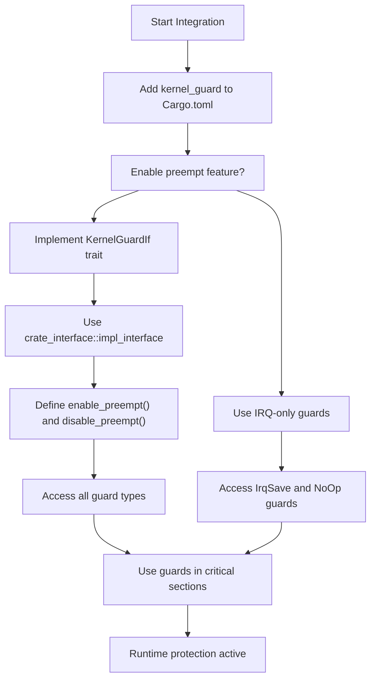
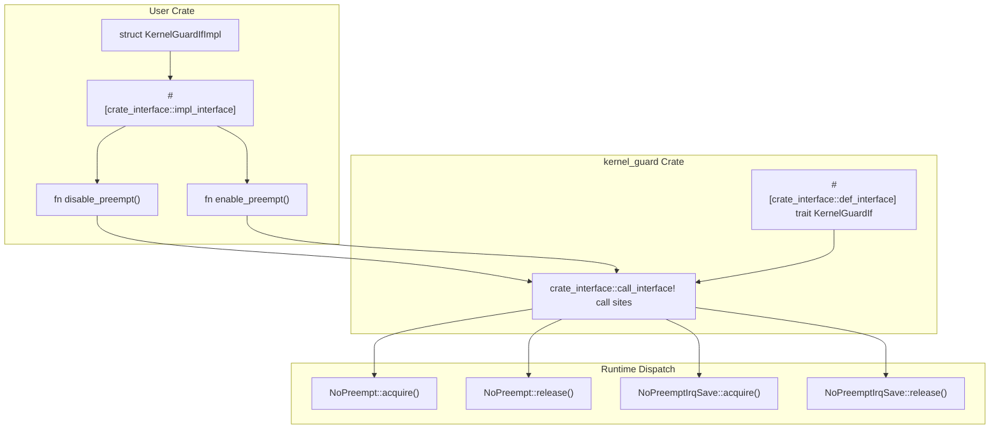
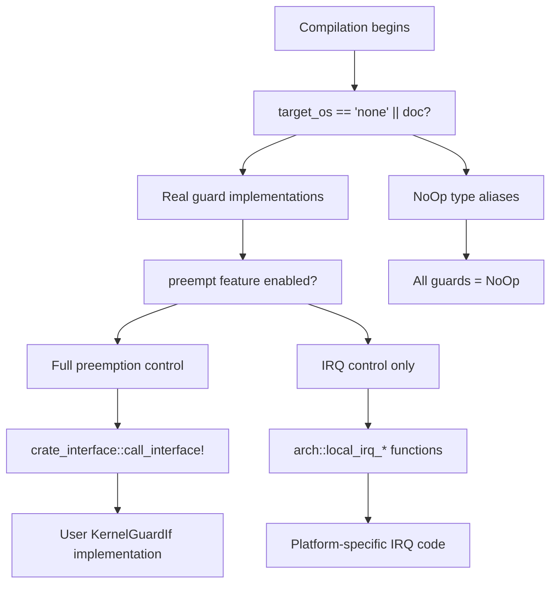

# Integration Guide

> **Relevant source files**
> * [Cargo.toml](https://github.com/arceos-org/kernel_guard/blob/f1a9da26/Cargo.toml)
> * [README.md](https://github.com/arceos-org/kernel_guard/blob/f1a9da26/README.md)
> * [src/lib.rs](https://github.com/arceos-org/kernel_guard/blob/f1a9da26/src/lib.rs)

This page provides a practical guide for integrating the `kernel_guard` crate into your kernel or OS project. It covers dependency setup, feature configuration, and implementing the required interfaces to enable preemption control.

For detailed information about the available guard types and their behavior, see [RAII Guards](/arceos-org/kernel_guard/2.1-raii-guards). For architecture-specific implementation details, see [Multi-Architecture Support](/arceos-org/kernel_guard/3-multi-architecture-support).

## Integration Overview

The `kernel_guard` crate integration follows a two-phase approach: dependency configuration and interface implementation. The crate uses conditional compilation to provide different functionality levels based on target platform and enabled features.

### Integration Flow Diagram



Sources: [Cargo.toml(L14 - L16)&emsp;](https://github.com/arceos-org/kernel_guard/blob/f1a9da26/Cargo.toml#L14-L16) [src/lib.rs(L58 - L66)&emsp;](https://github.com/arceos-org/kernel_guard/blob/f1a9da26/src/lib.rs#L58-L66) [src/lib.rs(L83 - L111)&emsp;](https://github.com/arceos-org/kernel_guard/blob/f1a9da26/src/lib.rs#L83-L111)

## Dependency Configuration

Add `kernel_guard` to your `Cargo.toml` dependencies section:

```
[dependencies]
kernel_guard = "0.1.2"
```

For preemptive systems that need both IRQ and preemption control:

```
[dependencies]
kernel_guard = { version = "0.1.2", features = ["preempt"] }
```

### Supported Dependencies

|Dependency|Version|Purpose|
| --- | --- | --- |
|cfg-if|1.0|Conditional compilation for architecture selection|
|crate_interface|0.1|Runtime interface dispatch forKernelGuardIf|

Sources: [Cargo.toml(L18 - L20)&emsp;](https://github.com/arceos-org/kernel_guard/blob/f1a9da26/Cargo.toml#L18-L20)

## Interface Implementation Requirements

When the `preempt` feature is enabled, you must implement the `KernelGuardIf` trait to provide preemption control functionality.

### KernelGuardIf Implementation Pattern



Sources: [src/lib.rs(L59 - L66)&emsp;](https://github.com/arceos-org/kernel_guard/blob/f1a9da26/src/lib.rs#L59-L66) [src/lib.rs(L153 - L159)&emsp;](https://github.com/arceos-org/kernel_guard/blob/f1a9da26/src/lib.rs#L153-L159) [src/lib.rs(L167 - L177)&emsp;](https://github.com/arceos-org/kernel_guard/blob/f1a9da26/src/lib.rs#L167-L177)

### Implementation Template

The following template shows the required implementation structure:

```rust
use kernel_guard::KernelGuardIf;

struct KernelGuardIfImpl;

#[crate_interface::impl_interface]
impl KernelGuardIf for KernelGuardIfImpl {
    fn enable_preempt() {
        // Platform-specific preemption enable code
    }
    
    fn disable_preempt() {
        // Platform-specific preemption disable code
    }
}
```

Sources: [src/lib.rs(L30 - L43)&emsp;](https://github.com/arceos-org/kernel_guard/blob/f1a9da26/src/lib.rs#L30-L43) [README.md(L36 - L49)&emsp;](https://github.com/arceos-org/kernel_guard/blob/f1a9da26/README.md#L36-L49)

## Target Platform Considerations

The crate behavior varies based on the target platform:

### Platform-Specific Guard Availability

|Target|IrqSave|NoPreempt|NoPreemptIrqSave|Notes|
| --- | --- | --- | --- | --- |
|target_os = "none"|✅ Full|✅ Full*|✅ Full*|Real implementations|
|Other targets|❌ NoOp alias|❌ NoOp alias|❌ NoOp alias|User-mode safety|

*Requires `preempt` feature and `KernelGuardIf` implementation

Sources: [src/lib.rs(L83 - L111)&emsp;](https://github.com/arceos-org/kernel_guard/blob/f1a9da26/src/lib.rs#L83-L111)

### Conditional Compilation Logic



Sources: [src/lib.rs(L83 - L111)&emsp;](https://github.com/arceos-org/kernel_guard/blob/f1a9da26/src/lib.rs#L83-L111) [src/lib.rs(L130 - L238)&emsp;](https://github.com/arceos-org/kernel_guard/blob/f1a9da26/src/lib.rs#L130-L238)

## Usage Patterns

### Basic Guard Usage

All guards follow the RAII pattern where the critical section begins at guard creation and ends when the guard is dropped:

```javascript
// IRQ protection only
let _guard = IrqSave::new();
// Critical section protected from interrupts

// Preemption protection (requires preempt feature + KernelGuardIf)
let _guard = NoPreempt::new();
// Critical section protected from preemption

// Combined protection
let _guard = NoPreemptIrqSave::new();
// Critical section protected from both interrupts and preemption
```

### Integration Verification

To verify your integration is working correctly:

1. **Compilation Test**: Ensure your project compiles with the desired feature set
2. **Runtime Test**: Verify that critical sections actually disable the expected mechanisms
3. **Documentation Test**: Use `cargo doc` to check that all guard types are available

Sources: [src/lib.rs(L181 - L237)&emsp;](https://github.com/arceos-org/kernel_guard/blob/f1a9da26/src/lib.rs#L181-L237) [README.md(L50 - L58)&emsp;](https://github.com/arceos-org/kernel_guard/blob/f1a9da26/README.md#L50-L58)