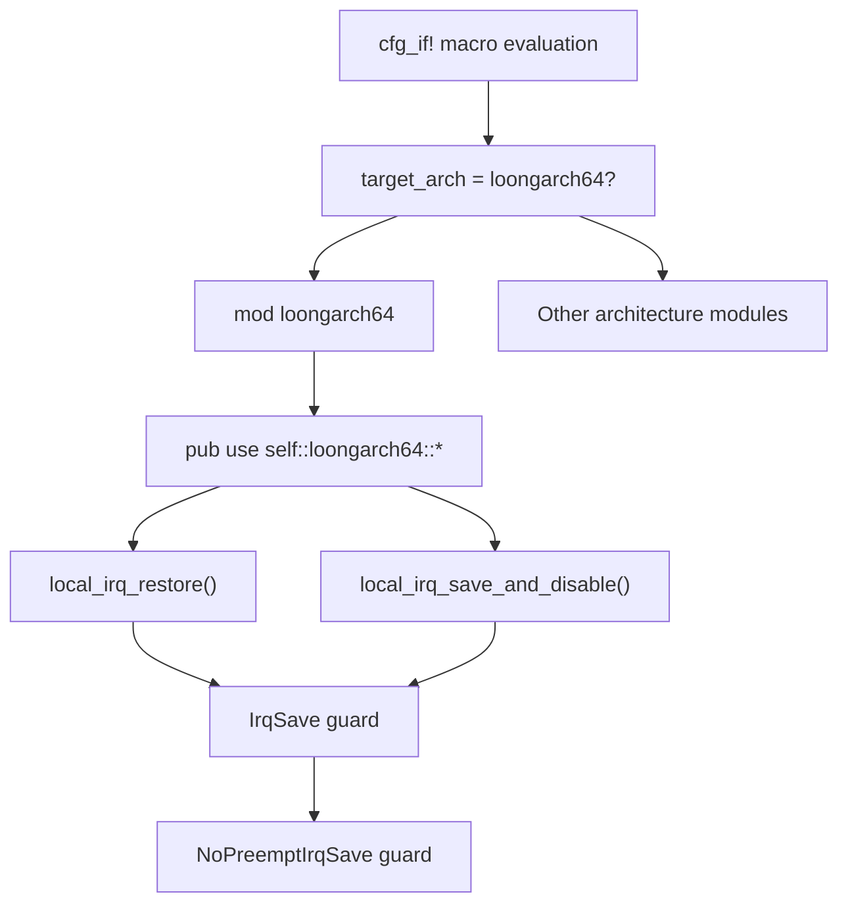
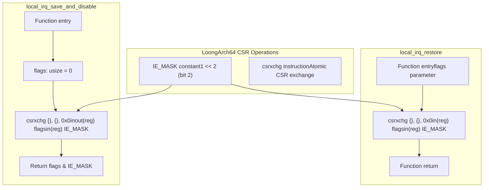
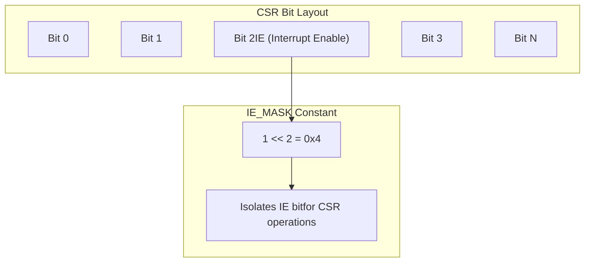
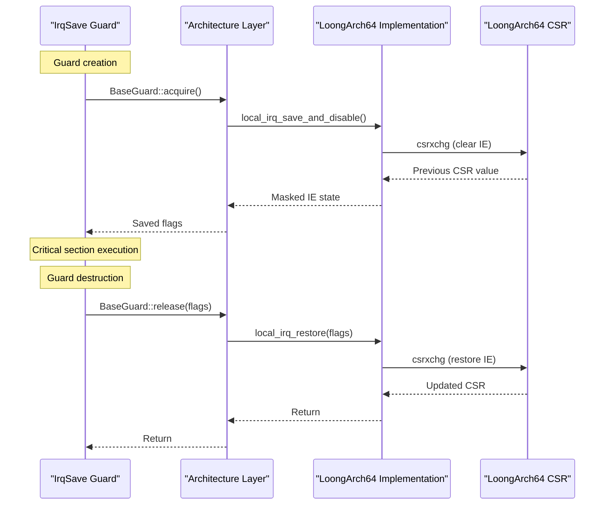

# LoongArch64 Implementation

> **Relevant source files**
> * [src/arch/loongarch64.rs](https://github.com/arceos-org/kernel_guard/blob/f1a9da26/src/arch/loongarch64.rs)

## Purpose and Scope

This document covers the LoongArch64-specific implementation of interrupt control mechanisms within the kernel_guard crate. The LoongArch64 implementation provides platform-specific functions for saving, disabling, and restoring interrupt states using Control Status Register (CSR) manipulation.

For general architecture abstraction concepts, see [Architecture Abstraction Layer](/arceos-org/kernel_guard/3.1-architecture-abstraction-layer). For other architecture implementations, see [x86/x86_64 Implementation](/arceos-org/kernel_guard/3.2-x86x86_64-implementation), [RISC-V Implementation](/arceos-org/kernel_guard/3.3-risc-v-implementation), and [AArch64 Implementation](/arceos-org/kernel_guard/3.4-aarch64-implementation).

## Architecture Integration

The LoongArch64 implementation is conditionally compiled as part of the multi-architecture support system. It provides the same interface as other architectures but uses LoongArch64-specific Control Status Registers and the `csrxchg` instruction for atomic CSR exchange operations.

### Architecture Selection Flow

Sources: [src/arch/loongarch64.rs(L1 - L18)&emsp;](https://github.com/arceos-org/kernel_guard/blob/f1a9da26/src/arch/loongarch64.rs#L1-L18)

## Interrupt Control Implementation

The LoongArch64 implementation centers around two core functions that manipulate the interrupt enable bit in Control Status Registers using the atomic `csrxchg` instruction.

### Core Functions

|Function|Purpose|Return Value|
| --- | --- | --- |
|local_irq_save_and_disable()|Save current interrupt state and disable interrupts|Previous interrupt enable state (masked)|
|local_irq_restore(flags)|Restore interrupt state from saved flags|None|

### CSR Manipulation Details

Sources: [src/arch/loongarch64.rs(L3 - L17)&emsp;](https://github.com/arceos-org/kernel_guard/blob/f1a9da26/src/arch/loongarch64.rs#L3-L17)

## Control Status Register (CSR) Operations

The implementation uses CSR address `0x0` (likely CRMD - Current Mode) with the `csrxchg` instruction for atomic read-modify-write operations on the interrupt enable bit.

### Interrupt Enable Bit Manipulation

The `IE_MASK` constant defines bit 2 as the interrupt enable bit:

Sources: [src/arch/loongarch64.rs(L3)&emsp;](https://github.com/arceos-org/kernel_guard/blob/f1a9da26/src/arch/loongarch64.rs#L3-L3)

### Assembly Instruction Details

The `csrxchg` instruction performs atomic exchange operations:

* **Save Operation**: `csrxchg {flags}, {IE_MASK}, 0x0` clears the IE bit and returns the old CSR value
* **Restore Operation**: `csrxchg {flags}, {IE_MASK}, 0x0` sets the IE bit based on the flags parameter

The instruction syntax uses:

* `inout(reg) flags` for read-modify-write of the flags variable
* `in(reg) IE_MASK` for the bit mask input
* `0x0` as the CSR address

Sources: [src/arch/loongarch64.rs(L9 - L16)&emsp;](https://github.com/arceos-org/kernel_guard/blob/f1a9da26/src/arch/loongarch64.rs#L9-L16)

## Integration with Guard System

The LoongArch64 functions integrate seamlessly with the kernel_guard's RAII guard system through the architecture abstraction layer.

### Guard Usage Flow

Sources: [src/arch/loongarch64.rs(L6 - L17)&emsp;](https://github.com/arceos-org/kernel_guard/blob/f1a9da26/src/arch/loongarch64.rs#L6-L17)