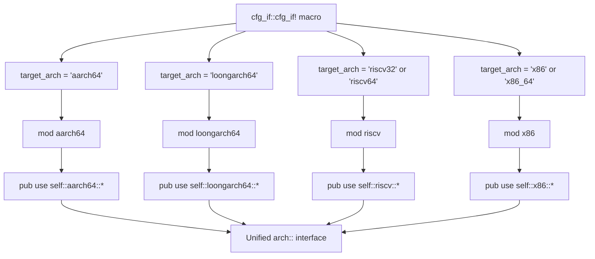
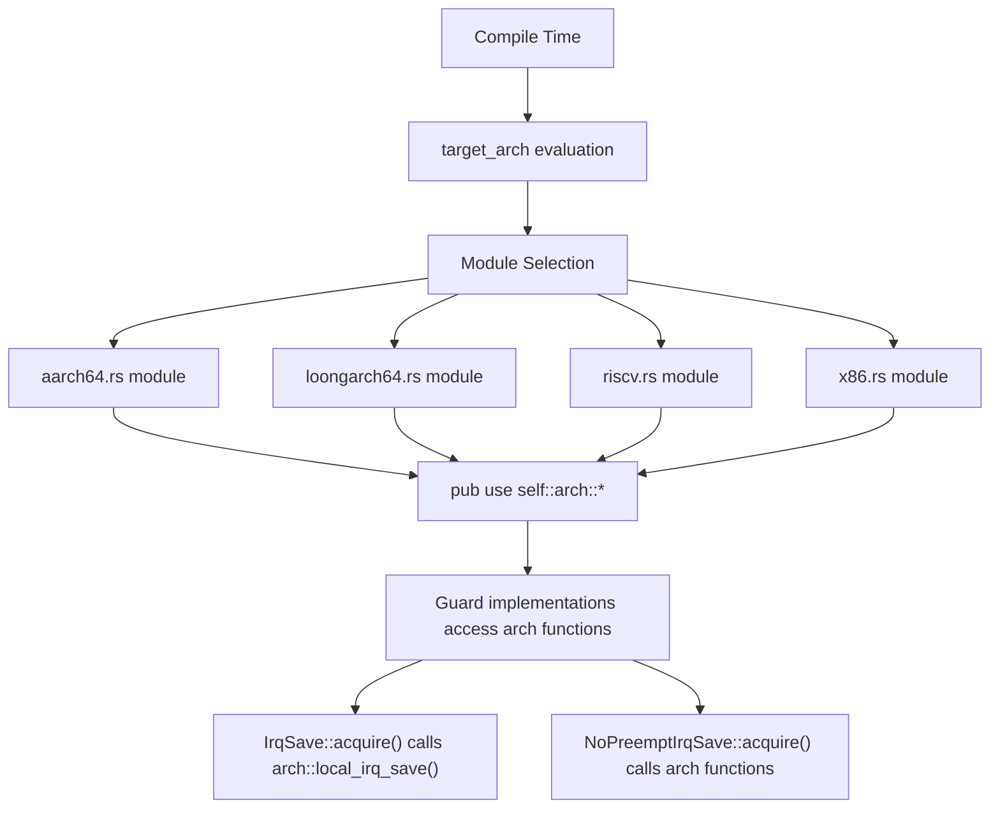

# Multi-Architecture Support

> **Relevant source files**
> * [Cargo.toml](https://github.com/arceos-org/kernel_guard/blob/f1a9da26/Cargo.toml)
> * [src/arch/mod.rs](https://github.com/arceos-org/kernel_guard/blob/f1a9da26/src/arch/mod.rs)

This document covers how the `kernel_guard` crate provides cross-platform support for multiple CPU architectures through conditional compilation and architecture-specific implementations. It explains the architecture selection mechanism, supported platforms, and how platform-specific interrupt control is abstracted behind a unified interface.

For detailed implementation specifics of each architecture, see [Architecture Abstraction Layer](/arceos-org/kernel_guard/3.1-architecture-abstraction-layer), [x86/x86_64 Implementation](/arceos-org/kernel_guard/3.2-x86x86_64-implementation), [RISC-V Implementation](/arceos-org/kernel_guard/3.3-risc-v-implementation), [AArch64 Implementation](/arceos-org/kernel_guard/3.4-aarch64-implementation), and [LoongArch64 Implementation](/arceos-org/kernel_guard/3.5-loongarch64-implementation). For information about how these implementations integrate with the core guard system, see [Core Architecture](/arceos-org/kernel_guard/2-core-architecture).

## Architecture Selection Mechanism

The `kernel_guard` crate uses the `cfg_if` macro to conditionally compile architecture-specific code based on the target platform. The selection logic is centralized in the architecture module, which determines which platform-specific implementation to include at compile time.



The conditional compilation ensures that only the relevant architecture-specific code is included in the final binary, reducing both compile time and binary size. Each architecture module provides the same interface functions but with platform-specific implementations.

**Sources:** [src/arch/mod.rs(L3 - L17)&emsp;](https://github.com/arceos-org/kernel_guard/blob/f1a9da26/src/arch/mod.rs#L3-L17)

## Supported Architectures

The crate currently supports four major CPU architecture families, each with specific register and instruction handling for interrupt control:

|Architecture|Target Identifiers|Key Registers|Instruction Set|
| --- | --- | --- | --- |
|x86/x86_64|x86,x86_64|EFLAGS|cli,sti|
|RISC-V|riscv32,riscv64|sstatusCSR|csrrc,csrrs|
|AArch64|aarch64|DAIF|mrs,msr|
|LoongArch64|loongarch64|CSR|csrxchg|

Each architecture implementation provides the same core functions: `local_irq_save`, `local_irq_restore`, `local_irq_enable`, and `local_irq_disable`. The specific mechanism for manipulating interrupt state varies by platform but the interface remains consistent.

**Sources:** [src/arch/mod.rs(L4 - L16)&emsp;](https://github.com/arceos-org/kernel_guard/blob/f1a9da26/src/arch/mod.rs#L4-L16)

## Conditional Compilation Strategy

The architecture abstraction uses a hierarchical conditional compilation strategy that first selects the appropriate architecture module, then re-exports its symbols to create a unified interface:



This design allows the core guard implementations to remain architecture-agnostic while delegating platform-specific operations to the appropriate architecture module. The `cfg_if` macro ensures clean compilation without unused code warnings on platforms where certain modules are not applicable.

**Sources:** [src/arch/mod.rs(L1 - L17)&emsp;](https://github.com/arceos-org/kernel_guard/blob/f1a9da26/src/arch/mod.rs#L1-L17) [Cargo.toml(L19)&emsp;](https://github.com/arceos-org/kernel_guard/blob/f1a9da26/Cargo.toml#L19-L19)

## Dead Code Handling

The architecture module includes a conditional compilation attribute to handle scenarios where architecture-specific code might not be used on certain targets:

```
#![cfg_attr(not(target_os = "none"), allow(dead_code, unused_imports))]
```

This attribute prevents compiler warnings when building for non-bare-metal targets (where `target_os != "none"`), as some architecture-specific functionality may not be utilized in hosted environments where the operating system handles interrupt management.

**Sources:** [src/arch/mod.rs(L1)&emsp;](https://github.com/arceos-org/kernel_guard/blob/f1a9da26/src/arch/mod.rs#L1-L1)

## Integration Points

The multi-architecture support integrates with the broader `kernel_guard` system through several key mechanisms:

* **Guard Implementations**: The `IrqSave` and `NoPreemptIrqSave` guards call architecture-specific functions through the unified `arch::` interface
* **Feature Gates**: The `cfg_if` dependency enables the conditional compilation logic
* **Target OS Detection**: The crate can detect bare-metal vs. hosted environments and adjust behavior accordingly
* **Interface Consistency**: All architecture modules provide the same function signatures, ensuring guard implementations work across platforms

This architecture enables the same guard code to work across multiple CPU architectures while maintaining platform-specific optimizations for interrupt control.

**Sources:** [src/arch/mod.rs(L3 - L17)&emsp;](https://github.com/arceos-org/kernel_guard/blob/f1a9da26/src/arch/mod.rs#L3-L17) [Cargo.toml(L19)&emsp;](https://github.com/arceos-org/kernel_guard/blob/f1a9da26/Cargo.toml#L19-L19)