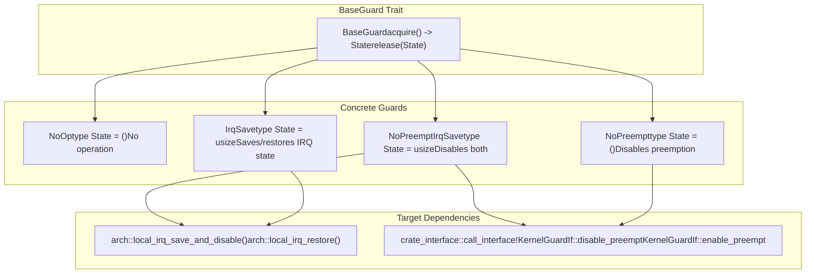
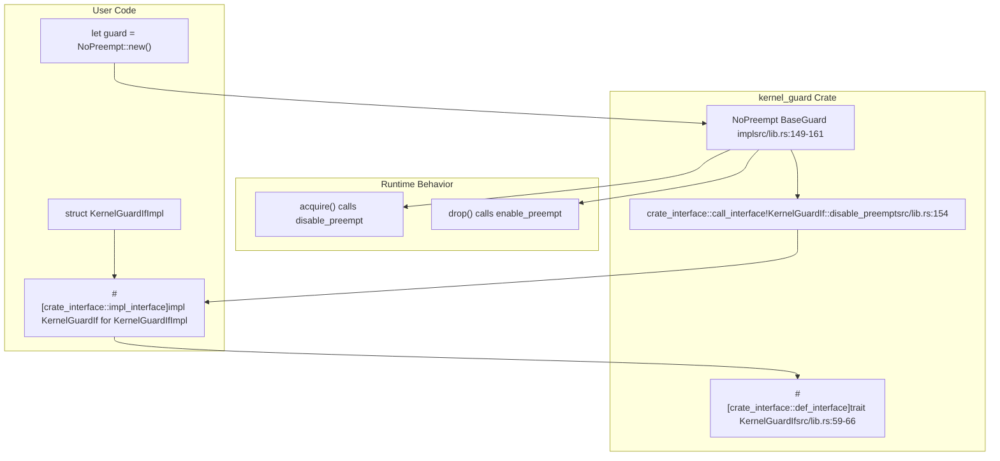

# Overview

> **Relevant source files**
> * [Cargo.toml](https://github.com/arceos-org/kernel_guard/blob/f1a9da26/Cargo.toml)
> * [README.md](https://github.com/arceos-org/kernel_guard/blob/f1a9da26/README.md)
> * [src/lib.rs](https://github.com/arceos-org/kernel_guard/blob/f1a9da26/src/lib.rs)

## Purpose and Scope

The `kernel_guard` crate provides RAII (Resource Acquisition Is Initialization) wrappers for creating critical sections in kernel-level code where local interrupts (IRQs) and/or preemption must be temporarily disabled. This crate is specifically designed for operating system kernels and bare-metal systems that require fine-grained control over interrupt handling and task scheduling.

The primary use case is implementing synchronization primitives like spinlocks in kernel code, where critical sections must be protected from both interrupt handlers and preemptive task switching. For detailed information about the core architecture and guard implementations, see [Core Architecture](/arceos-org/kernel_guard/2-core-architecture). For multi-architecture support details, see [Multi-Architecture Support](/arceos-org/kernel_guard/3-multi-architecture-support). For integration guidance, see [Integration Guide](/arceos-org/kernel_guard/4-integration-guide).

Sources: [Cargo.toml(L6 - L12)&emsp;](https://github.com/arceos-org/kernel_guard/blob/f1a9da26/Cargo.toml#L6-L12) [src/lib.rs(L1 - L11)&emsp;](https://github.com/arceos-org/kernel_guard/blob/f1a9da26/src/lib.rs#L1-L11) [README.md(L7 - L11)&emsp;](https://github.com/arceos-org/kernel_guard/blob/f1a9da26/README.md#L7-L11)

## Core Guard Types and RAII Pattern

The crate implements four distinct guard types that follow the RAII pattern, automatically managing critical section entry and exit through constructor and destructor semantics:

### Guard Type Architecture



Sources: [src/lib.rs(L68 - L78)&emsp;](https://github.com/arceos-org/kernel_guard/blob/f1a9da26/src/lib.rs#L68-L78) [src/lib.rs(L81 - L111)&emsp;](https://github.com/arceos-org/kernel_guard/blob/f1a9da26/src/lib.rs#L81-L111) [src/lib.rs(L134 - L179)&emsp;](https://github.com/arceos-org/kernel_guard/blob/f1a9da26/src/lib.rs#L134-L179)

|Guard Type|State Type|IRQ Control|Preemption Control|Target Compatibility|
| --- | --- | --- | --- | --- |
|NoOp|()|None|None|All targets|
|IrqSave|usize|Save/restore|None|target_os = "none"only|
|NoPreempt|()|None|Disable/enable|Requirespreemptfeature|
|NoPreemptIrqSave|usize|Save/restore|Disable/enable|target_os = "none"+preemptfeature|

Sources: [src/lib.rs(L113 - L128)&emsp;](https://github.com/arceos-org/kernel_guard/blob/f1a9da26/src/lib.rs#L113-L128) [src/lib.rs(L134 - L179)&emsp;](https://github.com/arceos-org/kernel_guard/blob/f1a9da26/src/lib.rs#L134-L179) [src/lib.rs(L200 - L237)&emsp;](https://github.com/arceos-org/kernel_guard/blob/f1a9da26/src/lib.rs#L200-L237)

## Conditional Compilation Strategy

The crate uses sophisticated conditional compilation to provide different implementations based on the target environment and enabled features:

### Compilation Flow and Code Paths

```

```

Sources: [src/lib.rs(L83 - L111)&emsp;](https://github.com/arceos-org/kernel_guard/blob/f1a9da26/src/lib.rs#L83-L111) [src/lib.rs(L130 - L238)&emsp;](https://github.com/arceos-org/kernel_guard/blob/f1a9da26/src/lib.rs#L130-L238) [Cargo.toml(L14 - L16)&emsp;](https://github.com/arceos-org/kernel_guard/blob/f1a9da26/Cargo.toml#L14-L16)

## Multi-Architecture Support Integration

The crate abstracts platform-specific interrupt handling through a unified architecture interface:

### Architecture Module Structure

```

```

Sources: [src/lib.rs(L56)&emsp;](https://github.com/arceos-org/kernel_guard/blob/f1a9da26/src/lib.rs#L56-L56) [src/lib.rs(L139 - L145)&emsp;](https://github.com/arceos-org/kernel_guard/blob/f1a9da26/src/lib.rs#L139-L145) [src/lib.rs(L170 - L174)&emsp;](https://github.com/arceos-org/kernel_guard/blob/f1a9da26/src/lib.rs#L170-L174)

## User Integration Pattern

The crate uses the `crate_interface` mechanism to allow users to provide preemption control implementations:

### Integration Interface Flow



Sources: [src/lib.rs(L58 - L66)&emsp;](https://github.com/arceos-org/kernel_guard/blob/f1a9da26/src/lib.rs#L58-L66) [src/lib.rs(L149 - L161)&emsp;](https://github.com/arceos-org/kernel_guard/blob/f1a9da26/src/lib.rs#L149-L161) [src/lib.rs(L31 - L52)&emsp;](https://github.com/arceos-org/kernel_guard/blob/f1a9da26/src/lib.rs#L31-L52) [README.md(L36 - L58)&emsp;](https://github.com/arceos-org/kernel_guard/blob/f1a9da26/README.md#L36-L58)

## Feature Configuration Summary

The crate provides two primary configuration axes:

|Configuration|Effect|Code Path|
| --- | --- | --- |
|target_os = "none"|Enables real IRQ control implementations|src/lib.rs86-100|
|target_os != "none"|UsesNoOpaliases for all guards|src/lib.rs102-110|
|feature = "preempt"|Enables preemption control calls|src/lib.rs153-159|
|Nopreemptfeature|Preemption calls become no-ops|Conditional compilation removes calls|

Sources: [src/lib.rs(L83 - L111)&emsp;](https://github.com/arceos-org/kernel_guard/blob/f1a9da26/src/lib.rs#L83-L111) [Cargo.toml(L14 - L16)&emsp;](https://github.com/arceos-org/kernel_guard/blob/f1a9da26/Cargo.toml#L14-L16) [src/lib.rs(L153 - L159)&emsp;](https://github.com/arceos-org/kernel_guard/blob/f1a9da26/src/lib.rs#L153-L159)

The crate is specifically designed for the ArceOS ecosystem but provides a generic interface suitable for any kernel or bare-metal system requiring interrupt and preemption management. The modular architecture ensures that only the necessary functionality is compiled for each target platform while maintaining a consistent API across all supported architectures.