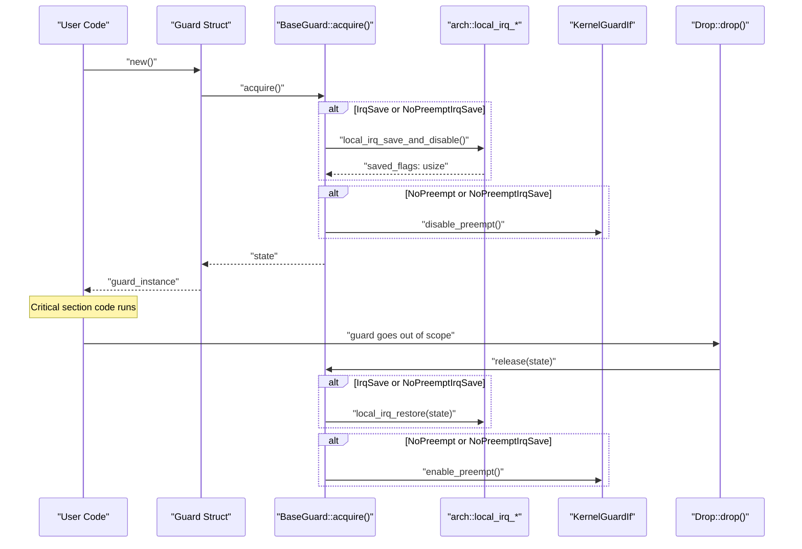

# RAII Guards

> **Relevant source files**
> * [README.md](https://github.com/arceos-org/kernel_guard/blob/f1a9da26/README.md)
> * [src/lib.rs](https://github.com/arceos-org/kernel_guard/blob/f1a9da26/src/lib.rs)

This document describes the four RAII guard types provided by the `kernel_guard` crate: `NoOp`, `IrqSave`, `NoPreempt`, and `NoPreemptIrqSave`. These guards implement the Resource Acquisition Is Initialization (RAII) pattern to automatically manage critical sections by disabling interrupts and/or preemption when created and restoring the previous state when dropped.

For information about the underlying trait system that enables these guards, see [Trait System](/arceos-org/kernel_guard/2.2-trait-system). For architecture-specific implementations of interrupt control, see [Multi-Architecture Support](/arceos-org/kernel_guard/3-multi-architecture-support).

## Overview

The RAII guards in `kernel_guard` provide automatic critical section management through Rust's ownership system. Each guard type disables specific kernel features upon creation and restores them when the guard goes out of scope, ensuring that critical sections are properly bounded even in the presence of early returns or panics.

### Guard Type Hierarchy

```

```

Sources: [src/lib.rs(L68 - L78)&emsp;](https://github.com/arceos-org/kernel_guard/blob/f1a9da26/src/lib.rs#L68-L78) [src/lib.rs(L80 - L111)&emsp;](https://github.com/arceos-org/kernel_guard/blob/f1a9da26/src/lib.rs#L80-L111) [src/lib.rs(L113 - L128)&emsp;](https://github.com/arceos-org/kernel_guard/blob/f1a9da26/src/lib.rs#L113-L128)

### RAII Lifecycle Pattern



Sources: [src/lib.rs(L134 - L179)&emsp;](https://github.com/arceos-org/kernel_guard/blob/f1a9da26/src/lib.rs#L134-L179) [src/lib.rs(L181 - L237)&emsp;](https://github.com/arceos-org/kernel_guard/blob/f1a9da26/src/lib.rs#L181-L237)

## Guard Types

### NoOp Guard

The `NoOp` guard provides a no-operation implementation that does nothing around critical sections. It serves as a placeholder when guard functionality is not needed or not available.

|Property|Value|
| --- | --- |
|State Type|()|
|Target Availability|All targets|
|IRQ Control|None|
|Preemption Control|None|

The `NoOp` guard is always available and implements `BaseGuard` with empty operations:

```python
// Implementation reference from src/lib.rs:113-117
impl BaseGuard for NoOp {
    type State = ();
    fn acquire() -> Self::State {}
    fn release(_state: Self::State) {}
}
```

Sources: [src/lib.rs(L80 - L81)&emsp;](https://github.com/arceos-org/kernel_guard/blob/f1a9da26/src/lib.rs#L80-L81) [src/lib.rs(L113 - L128)&emsp;](https://github.com/arceos-org/kernel_guard/blob/f1a9da26/src/lib.rs#L113-L128)

### IrqSave Guard

The `IrqSave` guard disables local interrupts and saves the previous interrupt state, restoring it when dropped. This guard is only available on bare-metal targets (`target_os = "none"`).

|Property|Value|
| --- | --- |
|State Type|usize(saved IRQ flags)|
|Target Availability|target_os = "none"only|
|IRQ Control|Saves and disables, then restores|
|Preemption Control|None|

On non-bare-metal targets, `IrqSave` becomes a type alias to `NoOp`:

```python
// Conditional compilation from src/lib.rs:83-111
cfg_if::cfg_if! {
    if #[cfg(any(target_os = "none", doc))] {
        pub struct IrqSave(usize);
    } else {
        pub type IrqSave = NoOp;
    }
}
```

The `IrqSave` implementation calls architecture-specific interrupt control functions:

Sources: [src/lib.rs(L88)&emsp;](https://github.com/arceos-org/kernel_guard/blob/f1a9da26/src/lib.rs#L88-L88) [src/lib.rs(L102 - L103)&emsp;](https://github.com/arceos-org/kernel_guard/blob/f1a9da26/src/lib.rs#L102-L103) [src/lib.rs(L134 - L147)&emsp;](https://github.com/arceos-org/kernel_guard/blob/f1a9da26/src/lib.rs#L134-L147) [src/lib.rs(L181 - L198)&emsp;](https://github.com/arceos-org/kernel_guard/blob/f1a9da26/src/lib.rs#L181-L198)

### NoPreempt Guard

The `NoPreempt` guard disables kernel preemption for the duration of the critical section. It requires the `preempt` feature to be enabled and a user implementation of `KernelGuardIf`.

|Property|Value|
| --- | --- |
|State Type|()|
|Target Availability|target_os = "none"only|
|IRQ Control|None|
|Preemption Control|Disables, then re-enables|

The preemption control is conditional on the `preempt` feature:

```python
// Feature-gated implementation from src/lib.rs:149-161
impl BaseGuard for NoPreempt {
    type State = ();
    fn acquire() -> Self::State {
        #[cfg(feature = "preempt")]
        crate_interface::call_interface!(KernelGuardIf::disable_preempt);
    }
    fn release(_state: Self::State) {
        #[cfg(feature = "preempt")]
        crate_interface::call_interface!(KernelGuardIf::enable_preempt);
    }
}
```

Sources: [src/lib.rs(L92)&emsp;](https://github.com/arceos-org/kernel_guard/blob/f1a9da26/src/lib.rs#L92-L92) [src/lib.rs(L105 - L106)&emsp;](https://github.com/arceos-org/kernel_guard/blob/f1a9da26/src/lib.rs#L105-L106) [src/lib.rs(L149 - L161)&emsp;](https://github.com/arceos-org/kernel_guard/blob/f1a9da26/src/lib.rs#L149-L161) [src/lib.rs(L200 - L218)&emsp;](https://github.com/arceos-org/kernel_guard/blob/f1a9da26/src/lib.rs#L200-L218)

### NoPreemptIrqSave Guard

The `NoPreemptIrqSave` guard combines both preemption and interrupt control, providing the strongest level of critical section protection. It disables preemption first, then interrupts, and restores them in reverse order.

|Property|Value|
| --- | --- |
|State Type|usize(saved IRQ flags)|
|Target Availability|target_os = "none"only|
|IRQ Control|Saves and disables, then restores|
|Preemption Control|Disables, then re-enables|

The ordering ensures proper nesting: preemption is disabled before IRQs and re-enabled after IRQs are restored:

```python
// Ordered disable/enable from src/lib.rs:163-179
impl BaseGuard for NoPreemptIrqSave {
    type State = usize;
    fn acquire() -> Self::State {
        // disable preempt first
        #[cfg(feature = "preempt")]
        crate_interface::call_interface!(KernelGuardIf::disable_preempt);
        // then disable IRQs
        super::arch::local_irq_save_and_disable()
    }
    fn release(state: Self::State) {
        // restore IRQs first
        super::arch::local_irq_restore(state);
        // then enable preempt
        #[cfg(feature = "preempt")]
        crate_interface::call_interface!(KernelGuardIf::enable_preempt);
    }
}
```

Sources: [src/lib.rs(L100)&emsp;](https://github.com/arceos-org/kernel_guard/blob/f1a9da26/src/lib.rs#L100-L100) [src/lib.rs(L108 - L109)&emsp;](https://github.com/arceos-org/kernel_guard/blob/f1a9da26/src/lib.rs#L108-L109) [src/lib.rs(L163 - L179)&emsp;](https://github.com/arceos-org/kernel_guard/blob/f1a9da26/src/lib.rs#L163-L179) [src/lib.rs(L220 - L237)&emsp;](https://github.com/arceos-org/kernel_guard/blob/f1a9da26/src/lib.rs#L220-L237)

## Conditional Compilation Strategy

The guards use `cfg_if` macros to provide different implementations based on the target platform. This ensures that the crate can be used in both kernel and userspace contexts.

### Target-Based Implementation Selection

```

```

Sources: [src/lib.rs(L83 - L111)&emsp;](https://github.com/arceos-org/kernel_guard/blob/f1a9da26/src/lib.rs#L83-L111) [src/lib.rs(L130 - L238)&emsp;](https://github.com/arceos-org/kernel_guard/blob/f1a9da26/src/lib.rs#L130-L238)

## Usage Patterns

All guards follow the same basic usage pattern, differing only in their protection scope:

|Guard Type|Use Case|Dependencies|
| --- | --- | --- |
|NoOp|Testing, userspace|None|
|IrqSave|Interrupt-safe critical sections|Architecture support|
|NoPreempt|Preemption-safe critical sections|preemptfeature +KernelGuardIfimpl|
|NoPreemptIrqSave|Maximum protection critical sections|Both above dependencies|

The RAII pattern ensures automatic cleanup:

```javascript
// Pattern from src/lib.rs:45-51
let guard = GuardType::new();
// Critical section automatically begins here
// ... critical section code ...
// Critical section automatically ends when guard is dropped
```

Sources: [src/lib.rs(L12 - L19)&emsp;](https://github.com/arceos-org/kernel_guard/blob/f1a9da26/src/lib.rs#L12-L19) [src/lib.rs(L45 - L51)&emsp;](https://github.com/arceos-org/kernel_guard/blob/f1a9da26/src/lib.rs#L45-L51) [src/lib.rs(L181 - L237)&emsp;](https://github.com/arceos-org/kernel_guard/blob/f1a9da26/src/lib.rs#L181-L237)