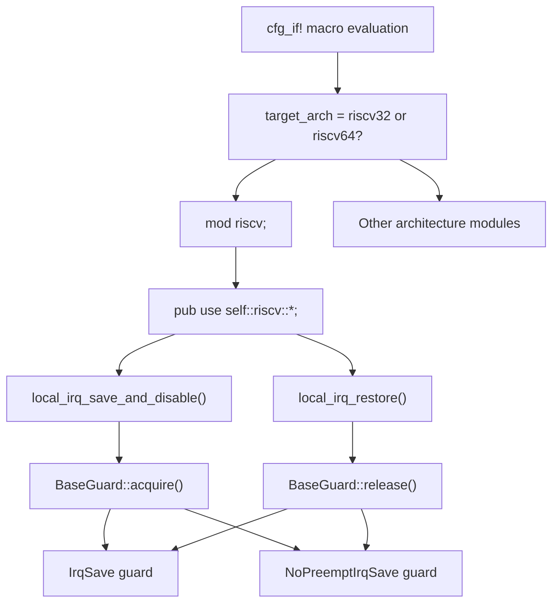
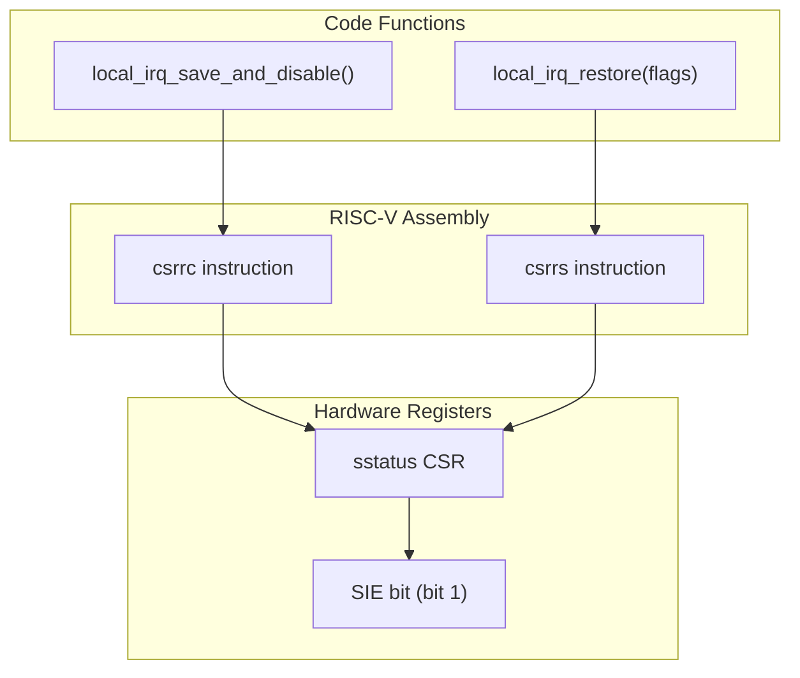
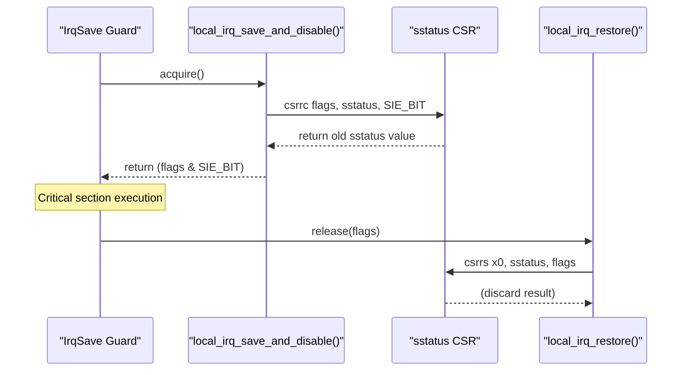

# RISC-V Implementation

> **Relevant source files**
> * [src/arch/riscv.rs](https://github.com/arceos-org/kernel_guard/blob/f1a9da26/src/arch/riscv.rs)

This document covers the RISC-V-specific implementation of interrupt control functionality within the kernel_guard crate. The RISC-V implementation provides low-level interrupt disable/restore operations by manipulating the `sstatus` Control and Status Register (CSR), specifically the Supervisor Interrupt Enable (SIE) bit.

For the overall architecture abstraction mechanism, see [Architecture Abstraction Layer](/arceos-org/kernel_guard/3.1-architecture-abstraction-layer). For other architecture implementations, see [x86/x86_64 Implementation](/arceos-org/kernel_guard/3.2-x86x86_64-implementation), [AArch64 Implementation](/arceos-org/kernel_guard/3.4-aarch64-implementation), and [LoongArch64 Implementation](/arceos-org/kernel_guard/3.5-loongarch64-implementation).

## RISC-V CSR Architecture Context

The RISC-V implementation operates within the Supervisor mode privilege level, using the `sstatus` CSR to control interrupt delivery. The implementation focuses on atomic manipulation of the SIE bit to provide safe critical section entry and exit.

### RISC-V Architecture Selection Flow

Sources: [src/arch/mod.rs(L1 - L50)&emsp;](https://github.com/arceos-org/kernel_guard/blob/f1a9da26/src/arch/mod.rs#L1-L50) [src/arch/riscv.rs(L1 - L19)&emsp;](https://github.com/arceos-org/kernel_guard/blob/f1a9da26/src/arch/riscv.rs#L1-L19)

## CSR Manipulation Implementation

The RISC-V implementation consists of two core functions that provide atomic interrupt state management through direct CSR manipulation.

### Core Function Mapping

Sources: [src/arch/riscv.rs(L6 - L18)&emsp;](https://github.com/arceos-org/kernel_guard/blob/f1a9da26/src/arch/riscv.rs#L6-L18)

## Assembly Instruction Analysis

The implementation uses RISC-V CSR atomic read-modify-write instructions to ensure interrupt state changes are atomic and cannot be interrupted.

### CSR Instruction Details

|Function|Assembly Instruction|Operation|Purpose|
| --- | --- | --- | --- |
|local_irq_save_and_disable()|csrrc {}, sstatus, {}|Clear bits and read old value|Atomically disable interrupts and save state|
|local_irq_restore()|csrrs x0, sstatus, {}|Set bits, discard result|Atomically restore interrupt state|

The `SIE_BIT` constant is defined as `1 << 1`, targeting bit 1 of the `sstatus` register which controls Supervisor Interrupt Enable.

### CSR Operation Flow

Sources: [src/arch/riscv.rs(L7 - L11)&emsp;](https://github.com/arceos-org/kernel_guard/blob/f1a9da26/src/arch/riscv.rs#L7-L11) [src/arch/riscv.rs(L15 - L17)&emsp;](https://github.com/arceos-org/kernel_guard/blob/f1a9da26/src/arch/riscv.rs#L15-L17)

## Implementation Details

### Interrupt Save and Disable

The `local_irq_save_and_disable()` function [src/arch/riscv.rs(L7 - L12)&emsp;](https://github.com/arceos-org/kernel_guard/blob/f1a9da26/src/arch/riscv.rs#L7-L12) performs an atomic clear-and-read operation:

* Uses inline assembly with `csrrc` (CSR Read and Clear bits)
* Clears the `SIE_BIT` in the `sstatus` register
* Returns only the relevant bit state (`flags & SIE_BIT`) rather than the entire register
* Ensures the returned value is either 0 (interrupts were disabled) or `SIE_BIT` (interrupts were enabled)

### Interrupt Restore

The `local_irq_restore()` function [src/arch/riscv.rs(L15 - L18)&emsp;](https://github.com/arceos-org/kernel_guard/blob/f1a9da26/src/arch/riscv.rs#L15-L18) performs an atomic set operation:

* Uses inline assembly with `csrrs` (CSR Read and Set bits)
* Sets bits specified by the `flags` parameter in the `sstatus` register
* Uses `x0` as the destination register to discard the read result
* Only modifies the interrupt state without returning any value

### Register Usage and Safety

The implementation uses specific register constraints:

* `out(reg)` for capturing the old CSR value
* `in(reg)` for providing the restore flags
* `const SIE_BIT` for compile-time constant bit mask
* All operations are marked `unsafe` due to direct hardware manipulation

Sources: [src/arch/riscv.rs(L1 - L19)&emsp;](https://github.com/arceos-org/kernel_guard/blob/f1a9da26/src/arch/riscv.rs#L1-L19)