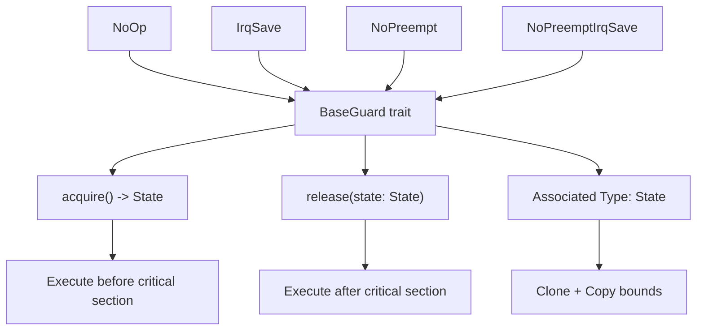
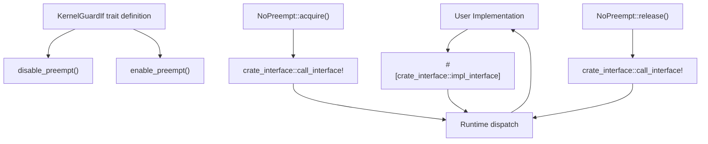
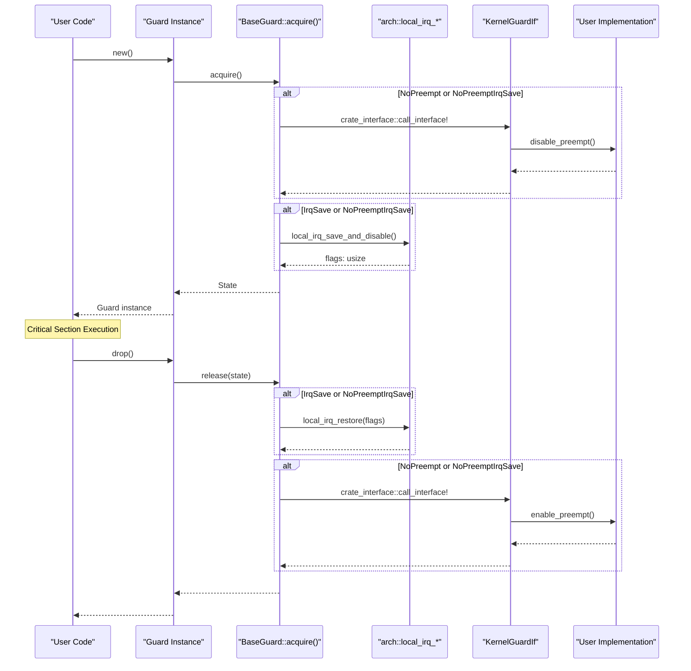

# Trait System

> **Relevant source files**
> * [Cargo.toml](https://github.com/arceos-org/kernel_guard/blob/f1a9da26/Cargo.toml)
> * [src/lib.rs](https://github.com/arceos-org/kernel_guard/blob/f1a9da26/src/lib.rs)

This document explains the trait-based architecture that forms the foundation of the kernel_guard crate. The trait system defines the interfaces for implementing critical section guards and provides extension points for user code to integrate preemption control. For information about specific guard implementations, see [RAII Guards](/arceos-org/kernel_guard/2.1-raii-guards). For details on architecture-specific implementations, see [Multi-Architecture Support](/arceos-org/kernel_guard/3-multi-architecture-support).

## Core Trait Architecture

The kernel_guard crate is built around two primary traits that define the interface contracts for guard behavior and user integration.

### BaseGuard Trait

The `BaseGuard` trait serves as the foundational interface that all guard types must implement. It defines the basic lifecycle operations for entering and exiting critical sections using the RAII pattern.



**BaseGuard Trait Definition**

The trait defines three key components at [src/lib.rs(L68 - L78)&emsp;](https://github.com/arceos-org/kernel_guard/blob/f1a9da26/src/lib.rs#L68-L78):

|Component|Purpose|Requirements|
| --- | --- | --- |
|Stateassociated type|Stores state information during critical section|Must implementClone + Copy|
|acquire()method|Performs setup operations before critical section|ReturnsStatevalue|
|release(state)method|Performs cleanup operations after critical section|Consumes savedState|

**Sources:** [src/lib.rs(L68 - L78)&emsp;](https://github.com/arceos-org/kernel_guard/blob/f1a9da26/src/lib.rs#L68-L78)

### KernelGuardIf Trait

The `KernelGuardIf` trait provides an extension point for user code to implement preemption control functionality. This trait uses the `crate_interface` mechanism to enable runtime dispatch to user-provided implementations.



**Interface Definition**

The trait is defined at [src/lib.rs(L59 - L66)&emsp;](https://github.com/arceos-org/kernel_guard/blob/f1a9da26/src/lib.rs#L59-L66) with two required methods:

* `enable_preempt()`: Called when preemption should be re-enabled
* `disable_preempt()`: Called when preemption should be disabled

**Sources:** [src/lib.rs(L59 - L66)&emsp;](https://github.com/arceos-org/kernel_guard/blob/f1a9da26/src/lib.rs#L59-L66)

## Runtime Dispatch Mechanism

The crate uses the `crate_interface` library to implement a stable interface between the kernel_guard crate and user code. This mechanism allows the library to call user-provided functions at runtime without compile-time dependencies.

### crate_interface Integration

**Interface Declaration**

The trait is declared as an interface using `#[crate_interface::def_interface]` at [src/lib.rs(L59)&emsp;](https://github.com/arceos-org/kernel_guard/blob/f1a9da26/src/lib.rs#L59-L59) which generates the necessary infrastructure for runtime dispatch.

**User Implementation Pattern**

Users must implement the trait using the `#[crate_interface::impl_interface]` attribute, as shown in the example at [src/lib.rs(L35 - L43)&emsp;](https://github.com/arceos-org/kernel_guard/blob/f1a9da26/src/lib.rs#L35-L43):

```rust
#[crate_interface::impl_interface]
impl KernelGuardIf for KernelGuardIfImpl {
    fn enable_preempt() { /* implementation */ }
    fn disable_preempt() { /* implementation */ }
}
```

**Runtime Calls**

The library invokes user implementations using `crate_interface::call_interface!` macro at several locations:

* [src/lib.rs(L154)&emsp;](https://github.com/arceos-org/kernel_guard/blob/f1a9da26/src/lib.rs#L154-L154) - Disable preemption in `NoPreempt::acquire()`
* [src/lib.rs(L159)&emsp;](https://github.com/arceos-org/kernel_guard/blob/f1a9da26/src/lib.rs#L159-L159) - Enable preemption in `NoPreempt::release()`
* [src/lib.rs(L168)&emsp;](https://github.com/arceos-org/kernel_guard/blob/f1a9da26/src/lib.rs#L168-L168) - Disable preemption in `NoPreemptIrqSave::acquire()`
* [src/lib.rs(L177)&emsp;](https://github.com/arceos-org/kernel_guard/blob/f1a9da26/src/lib.rs#L177-L177) - Enable preemption in `NoPreemptIrqSave::release()`

**Sources:** [src/lib.rs(L59)&emsp;](https://github.com/arceos-org/kernel_guard/blob/f1a9da26/src/lib.rs#L59-L59) [src/lib.rs(L35 - L43)&emsp;](https://github.com/arceos-org/kernel_guard/blob/f1a9da26/src/lib.rs#L35-L43) [src/lib.rs(L154)&emsp;](https://github.com/arceos-org/kernel_guard/blob/f1a9da26/src/lib.rs#L154-L154) [src/lib.rs(L159)&emsp;](https://github.com/arceos-org/kernel_guard/blob/f1a9da26/src/lib.rs#L159-L159) [src/lib.rs(L168)&emsp;](https://github.com/arceos-org/kernel_guard/blob/f1a9da26/src/lib.rs#L168-L168) [src/lib.rs(L177)&emsp;](https://github.com/arceos-org/kernel_guard/blob/f1a9da26/src/lib.rs#L177-L177)

## Trait Implementation Patterns

### Feature-Conditional Implementation

The `KernelGuardIf` calls are conditionally compiled based on the `preempt` feature flag. When the feature is disabled, the calls become no-ops:

```

```

**Conditional Compilation Points:**

* [src/lib.rs(L153 - L154)&emsp;](https://github.com/arceos-org/kernel_guard/blob/f1a9da26/src/lib.rs#L153-L154) - `disable_preempt` in `NoPreempt::acquire()`
* [src/lib.rs(L158 - L159)&emsp;](https://github.com/arceos-org/kernel_guard/blob/f1a9da26/src/lib.rs#L158-L159) - `enable_preempt` in `NoPreempt::release()`
* [src/lib.rs(L167 - L168)&emsp;](https://github.com/arceos-org/kernel_guard/blob/f1a9da26/src/lib.rs#L167-L168) - `disable_preempt` in `NoPreemptIrqSave::acquire()`
* [src/lib.rs(L176 - L177)&emsp;](https://github.com/arceos-org/kernel_guard/blob/f1a9da26/src/lib.rs#L176-L177) - `enable_preempt` in `NoPreemptIrqSave::release()`

**Sources:** [src/lib.rs(L153 - L154)&emsp;](https://github.com/arceos-org/kernel_guard/blob/f1a9da26/src/lib.rs#L153-L154) [src/lib.rs(L158 - L159)&emsp;](https://github.com/arceos-org/kernel_guard/blob/f1a9da26/src/lib.rs#L158-L159) [src/lib.rs(L167 - L168)&emsp;](https://github.com/arceos-org/kernel_guard/blob/f1a9da26/src/lib.rs#L167-L168) [src/lib.rs(L176 - L177)&emsp;](https://github.com/arceos-org/kernel_guard/blob/f1a9da26/src/lib.rs#L176-L177)

### State Management Patterns

Different guard types use different `State` type strategies:

|Guard Type|State Type|Purpose|
| --- | --- | --- |
|NoOp|()|No state needed|
|IrqSave|usize|Stores IRQ flags for restoration|
|NoPreempt|()|Preemption state managed externally|
|NoPreemptIrqSave|usize|Stores IRQ flags, preemption managed externally|

**Sources:** [src/lib.rs(L114)&emsp;](https://github.com/arceos-org/kernel_guard/blob/f1a9da26/src/lib.rs#L114-L114) [src/lib.rs(L135)&emsp;](https://github.com/arceos-org/kernel_guard/blob/f1a9da26/src/lib.rs#L135-L135) [src/lib.rs(L150)&emsp;](https://github.com/arceos-org/kernel_guard/blob/f1a9da26/src/lib.rs#L150-L150) [src/lib.rs(L164)&emsp;](https://github.com/arceos-org/kernel_guard/blob/f1a9da26/src/lib.rs#L164-L164)

## Complete Trait Interaction Flow

The following diagram shows how the traits interact during a complete guard lifecycle:



**Sources:** [src/lib.rs(L183 - L185)&emsp;](https://github.com/arceos-org/kernel_guard/blob/f1a9da26/src/lib.rs#L183-L185) [src/lib.rs(L202 - L205)&emsp;](https://github.com/arceos-org/kernel_guard/blob/f1a9da26/src/lib.rs#L202-L205) [src/lib.rs(L222 - L224)&emsp;](https://github.com/arceos-org/kernel_guard/blob/f1a9da26/src/lib.rs#L222-L224) [src/lib.rs(L134 - L147)&emsp;](https://github.com/arceos-org/kernel_guard/blob/f1a9da26/src/lib.rs#L134-L147) [src/lib.rs(L149 - L161)&emsp;](https://github.com/arceos-org/kernel_guard/blob/f1a9da26/src/lib.rs#L149-L161) [src/lib.rs(L163 - L179)&emsp;](https://github.com/arceos-org/kernel_guard/blob/f1a9da26/src/lib.rs#L163-L179)