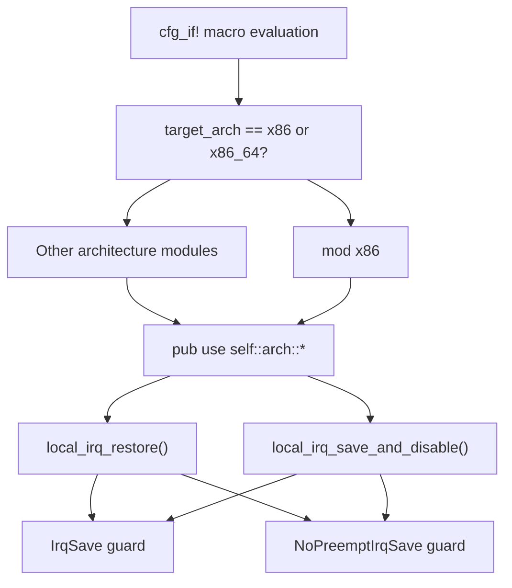
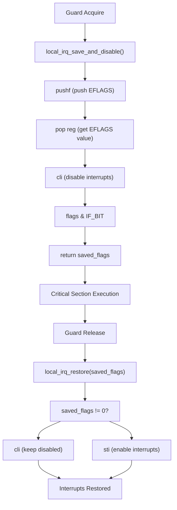
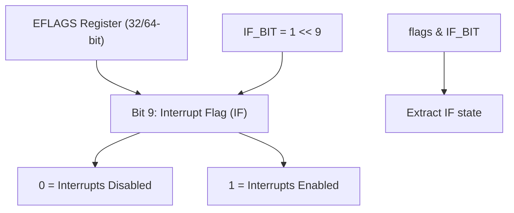

# x86/x86_64 Implementation

> **Relevant source files**
> * [src/arch/x86.rs](https://github.com/arceos-org/kernel_guard/blob/f1a9da26/src/arch/x86.rs)

## Purpose and Scope

This document covers the x86 and x86_64 architecture-specific implementation of interrupt control within the kernel_guard crate. The x86 implementation provides low-level primitives for disabling and restoring local interrupts by manipulating the EFLAGS register using inline assembly.

This implementation is automatically selected when compiling for `target_arch = "x86"` or `target_arch = "x86_64"` through the conditional compilation system. For information about other architecture implementations, see [RISC-V Implementation](/arceos-org/kernel_guard/3.3-risc-v-implementation), [AArch64 Implementation](/arceos-org/kernel_guard/3.4-aarch64-implementation), and [LoongArch64 Implementation](/arceos-org/kernel_guard/3.5-loongarch64-implementation). For details about the architecture selection mechanism, see [Architecture Abstraction Layer](/arceos-org/kernel_guard/3.1-architecture-abstraction-layer).

## x86 Interrupt Control Mechanism

The x86 architecture provides interrupt control through the Interrupt Flag (IF) bit in the EFLAGS register. When this bit is set, the processor responds to maskable hardware interrupts; when cleared, such interrupts are ignored.

### x86 Architecture Integration

Sources: [src/arch/x86.rs(L1 - L21)&emsp;](https://github.com/arceos-org/kernel_guard/blob/f1a9da26/src/arch/x86.rs#L1-L21)

## Implementation Details

The x86 implementation consists of two core functions that manipulate the EFLAGS register through inline assembly.

### Interrupt Flag Constants

The implementation defines the Interrupt Flag bit position as a constant:

|Constant|Value|Purpose|
| --- | --- | --- |
|IF_BIT|1 << 9|Bit mask for the Interrupt Flag in EFLAGS register|

### Core Functions

#### local_irq_save_and_disable()

This function atomically saves the current interrupt state and disables interrupts. It returns the previous state of the Interrupt Flag for later restoration.

**Implementation Strategy:**

* Uses `pushf` instruction to push EFLAGS onto the stack
* Uses `pop` instruction to retrieve EFLAGS value into a register
* Uses `cli` instruction to clear the Interrupt Flag
* Returns only the IF bit status (masked with `IF_BIT`)

#### local_irq_restore(flags)

This function restores the interrupt state based on the previously saved flags value.

**Implementation Strategy:**

* Checks if the saved flags indicate interrupts were enabled
* Uses `sti` instruction to set the Interrupt Flag if interrupts should be enabled
* Uses `cli` instruction to clear the Interrupt Flag if interrupts should remain disabled

### Interrupt Control Flow

Sources: [src/arch/x86.rs(L7 - L20)&emsp;](https://github.com/arceos-org/kernel_guard/blob/f1a9da26/src/arch/x86.rs#L7-L20)

## Assembly Instructions Reference

The x86 implementation uses specific assembly instructions for interrupt control:

|Instruction|Purpose|Usage in Implementation|
| --- | --- | --- |
|pushf|Push EFLAGS register onto stack|Save current interrupt state|
|pop|Pop value from stack into register|Retrieve EFLAGS value|
|cli|Clear Interrupt Flag|Disable maskable interrupts|
|sti|Set Interrupt Flag|Enable maskable interrupts|

### EFLAGS Register Structure

The implementation specifically targets bit 9 of the EFLAGS register:

Sources: [src/arch/x86.rs(L3 - L4)&emsp;](https://github.com/arceos-org/kernel_guard/blob/f1a9da26/src/arch/x86.rs#L3-L4) [src/arch/x86.rs(L10)&emsp;](https://github.com/arceos-org/kernel_guard/blob/f1a9da26/src/arch/x86.rs#L10-L10)

## Integration with Guard System

The x86 interrupt control functions integrate directly with the RAII guard implementations. When guards are created in bare-metal environments (`target_os = "none"`), they call these architecture-specific functions to provide actual interrupt control functionality.

**Function Usage by Guards:**

* `IrqSave` guard calls `local_irq_save_and_disable()` on creation and `local_irq_restore()` on drop
* `NoPreemptIrqSave` guard uses the same interrupt control functions in addition to preemption control

The inline assembly ensures minimal overhead and atomic operation for critical section protection in kernel environments.

Sources: [src/arch/x86.rs(L1 - L21)&emsp;](https://github.com/arceos-org/kernel_guard/blob/f1a9da26/src/arch/x86.rs#L1-L21)