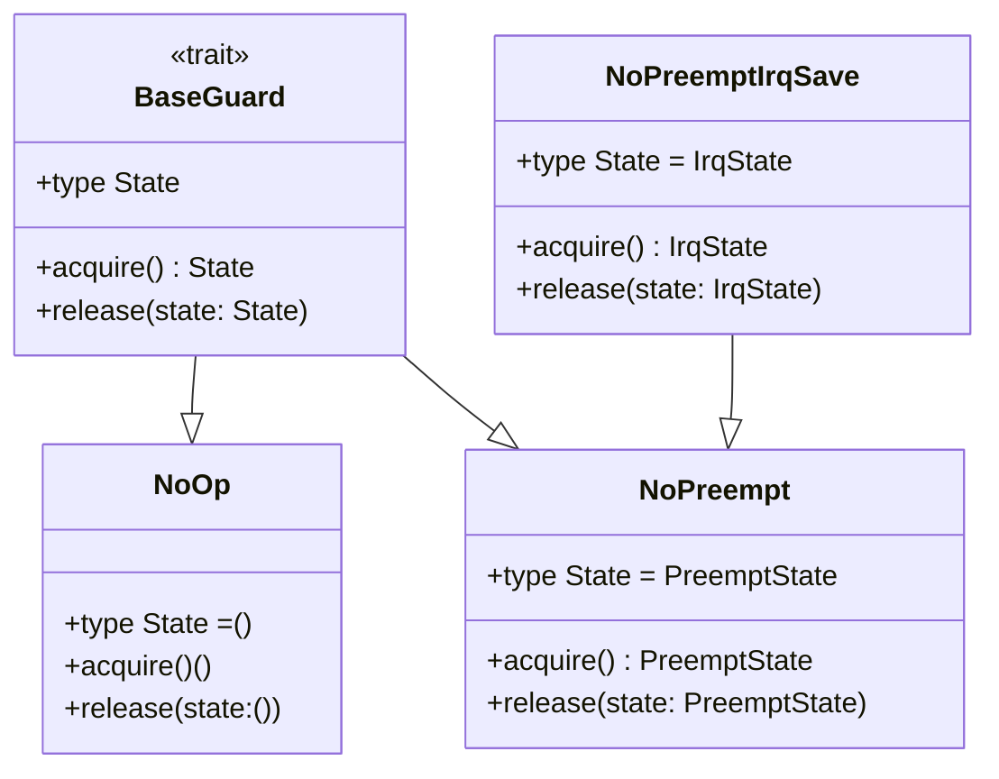
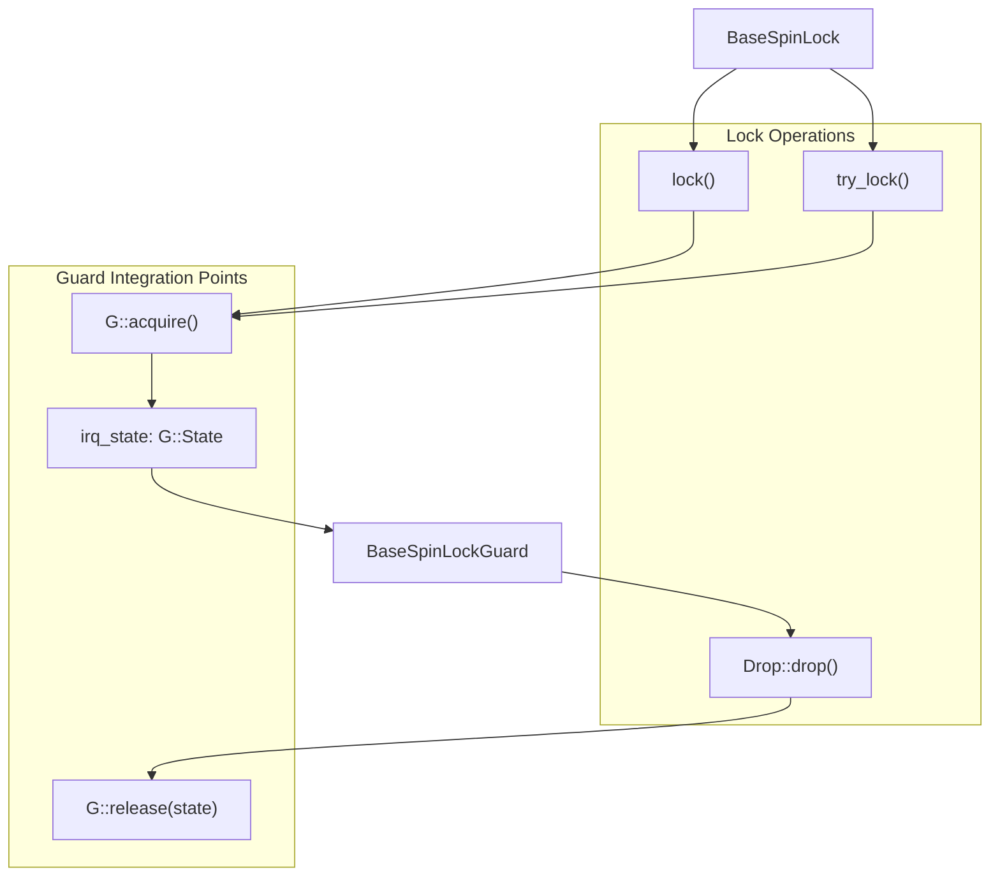
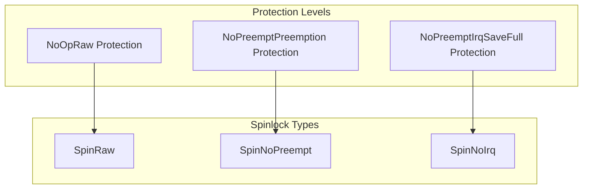
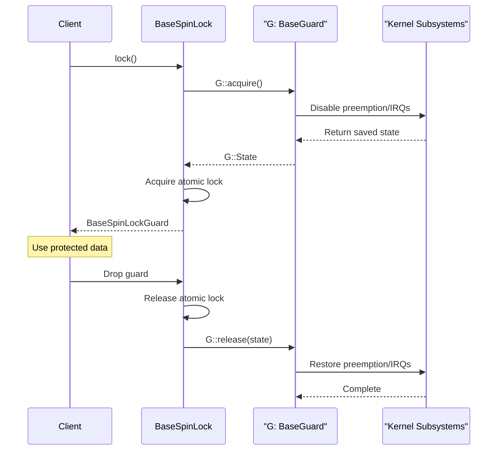

# BaseGuard Trait System

> **Relevant source files**
> * [src/base.rs](https://github.com/arceos-org/kspin/blob/dfc0ff2c/src/base.rs)
> * [src/lib.rs](https://github.com/arceos-org/kspin/blob/dfc0ff2c/src/lib.rs)

The BaseGuard trait system is the core abstraction that enables different protection behaviors in kspin spinlocks through type parameterization. This system allows `BaseSpinLock<G, T>` to provide varying levels of interrupt and preemption protection by substituting different guard implementations at compile time.

For information about the specific spinlock types that use these guards, see [Spinlock Types and Public API](/arceos-org/kspin/2-spinlock-types-and-public-api). For details about the underlying `BaseSpinLock` implementation, see [BaseSpinLock and BaseSpinLockGuard](/arceos-org/kspin/3.1-basespinlock-and-basespinlockguard).

## BaseGuard Trait Interface

The `BaseGuard` trait is defined in the external `kernel_guard` crate and provides a standardized interface for managing system-level protection states during critical sections.



**BaseGuard Trait Interface**

Sources: [src/base.rs(L16)&emsp;](https://github.com/arceos-org/kspin/blob/dfc0ff2c/src/base.rs#L16-L16) [src/lib.rs(L6)&emsp;](https://github.com/arceos-org/kspin/blob/dfc0ff2c/src/lib.rs#L6-L6)

## Integration with BaseSpinLock

The `BaseSpinLock<G, T>` struct uses the `BaseGuard` trait as a type parameter to customize protection behavior without runtime overhead. The guard type `G` determines what system-level protections are applied during lock acquisition and release.



**BaseGuard Integration Flow**

The integration occurs at three key points in [src/base.rs](https://github.com/arceos-org/kspin/blob/dfc0ff2c/src/base.rs):

1. **State acquisition** during lock operations [src/base.rs(L78)&emsp;](https://github.com/arceos-org/kspin/blob/dfc0ff2c/src/base.rs#L78-L78) [src/base.rs(L123)&emsp;](https://github.com/arceos-org/kspin/blob/dfc0ff2c/src/base.rs#L123-L123)
2. **State storage** in the guard struct [src/base.rs(L39)&emsp;](https://github.com/arceos-org/kspin/blob/dfc0ff2c/src/base.rs#L39-L39)
3. **State release** during guard destruction [src/base.rs(L225)&emsp;](https://github.com/arceos-org/kspin/blob/dfc0ff2c/src/base.rs#L225-L225)

Sources: [src/base.rs(L27)&emsp;](https://github.com/arceos-org/kspin/blob/dfc0ff2c/src/base.rs#L27-L27) [src/base.rs(L37 - L43)&emsp;](https://github.com/arceos-org/kspin/blob/dfc0ff2c/src/base.rs#L37-L43) [src/base.rs(L77 - L101)&emsp;](https://github.com/arceos-org/kspin/blob/dfc0ff2c/src/base.rs#L77-L101) [src/base.rs(L218 - L227)&emsp;](https://github.com/arceos-org/kspin/blob/dfc0ff2c/src/base.rs#L218-L227)

## Concrete Guard Implementations

The kspin crate uses three specific implementations of `BaseGuard` from the `kernel_guard` crate, each providing different levels of system protection.

|Guard Type|Protection Level|State Type|Use Context|
| --- | --- | --- | --- |
|NoOp|None|()|IRQ-disabled, preemption-disabled|
|NoPreempt|Disable preemption|PreemptState|IRQ-disabled contexts|
|NoPreemptIrqSave|Disable preemption + IRQs|IrqState|Any context|



**Guard Type to Spinlock Type Mapping**

Sources: [src/lib.rs(L6)&emsp;](https://github.com/arceos-org/kspin/blob/dfc0ff2c/src/lib.rs#L6-L6) [src/lib.rs(L15)&emsp;](https://github.com/arceos-org/kspin/blob/dfc0ff2c/src/lib.rs#L15-L15) [src/lib.rs(L24)&emsp;](https://github.com/arceos-org/kspin/blob/dfc0ff2c/src/lib.rs#L24-L24) [src/lib.rs(L33)&emsp;](https://github.com/arceos-org/kspin/blob/dfc0ff2c/src/lib.rs#L33-L33)

## Type-Driven Protection Behavior

The BaseGuard trait system enables compile-time selection of protection behavior through Rust's type system. Each guard implementation provides different `acquire()` and `release()` semantics without requiring runtime branching.



**Protection State Management Sequence**

The type-driven approach ensures that:

* **`NoOp`**: `acquire()` and `release()` are no-ops, providing zero overhead
* **`NoPreempt`**: Manages preemption state to prevent task switching
* **`NoPreemptIrqSave`**: Manages both preemption and interrupt state for maximum protection

Sources: [src/base.rs(L77 - L79)&emsp;](https://github.com/arceos-org/kspin/blob/dfc0ff2c/src/base.rs#L77-L79) [src/base.rs(L122 - L124)&emsp;](https://github.com/arceos-org/kspin/blob/dfc0ff2c/src/base.rs#L122-L124) [src/base.rs(L222 - L225)&emsp;](https://github.com/arceos-org/kspin/blob/dfc0ff2c/src/base.rs#L222-L225)

## State Management in Guard Lifecycle

The `BaseSpinLockGuard` stores the protection state returned by `G::acquire()` and ensures proper cleanup through Rust's RAII pattern. This guarantees that system protection state is always restored, even in the presence of panics.

```

```

**Guard State Lifecycle**

The state management implementation in `BaseSpinLockGuard`:

* **State storage**: `irq_state: G::State` field holds the protection state [src/base.rs(L39)&emsp;](https://github.com/arceos-org/kspin/blob/dfc0ff2c/src/base.rs#L39-L39)
* **State acquisition**: Captured during guard creation [src/base.rs(L96)&emsp;](https://github.com/arceos-org/kspin/blob/dfc0ff2c/src/base.rs#L96-L96) [src/base.rs(L141)&emsp;](https://github.com/arceos-org/kspin/blob/dfc0ff2c/src/base.rs#L141-L141)
* **State restoration**: Automatically handled in `Drop::drop()` [src/base.rs(L225)&emsp;](https://github.com/arceos-org/kspin/blob/dfc0ff2c/src/base.rs#L225-L225)

This design ensures that protection state is never leaked and that the system always returns to its original state when the critical section ends.

Sources: [src/base.rs(L37 - L43)&emsp;](https://github.com/arceos-org/kspin/blob/dfc0ff2c/src/base.rs#L37-L43) [src/base.rs(L94 - L100)&emsp;](https://github.com/arceos-org/kspin/blob/dfc0ff2c/src/base.rs#L94-L100) [src/base.rs(L138 - L145)&emsp;](https://github.com/arceos-org/kspin/blob/dfc0ff2c/src/base.rs#L138-L145) [src/base.rs(L218 - L227)&emsp;](https://github.com/arceos-org/kspin/blob/dfc0ff2c/src/base.rs#L218-L227)