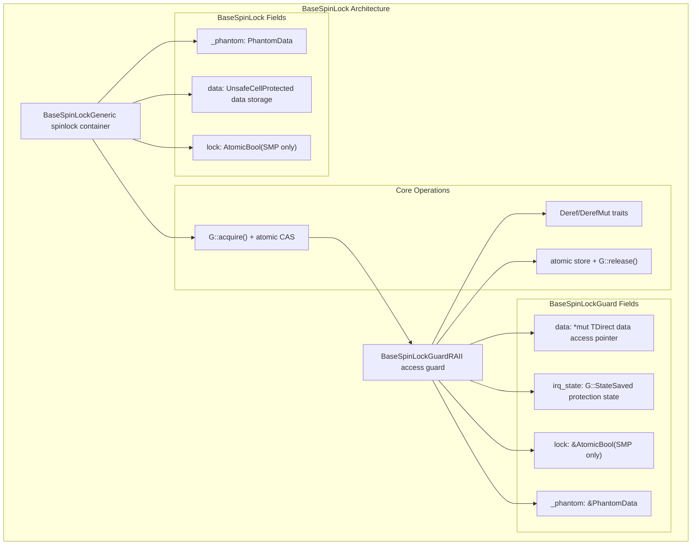
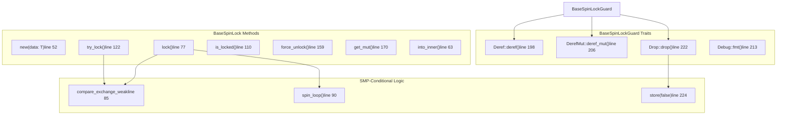
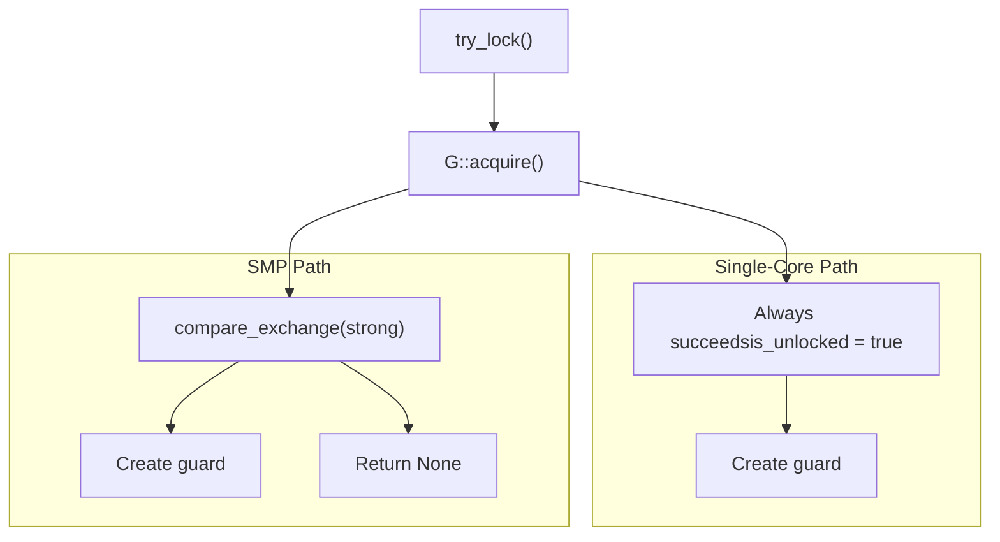

# BaseSpinLock and BaseSpinLockGuard

> **Relevant source files**
> * [src/base.rs](https://github.com/arceos-org/kspin/blob/dfc0ff2c/src/base.rs)

## Purpose and Scope

This document provides detailed technical analysis of the core spinlock implementation in the kspin crate. The `BaseSpinLock<G, T>` struct and its companion `BaseSpinLockGuard<G, T>` form the foundational implementation that underlies all public spinlock types in the crate. This generic implementation enables different protection behaviors through type parameterization while providing efficient RAII-based lock management.

For information about the public spinlock APIs that users interact with, see [Spinlock Types and Public API](/arceos-org/kspin/2-spinlock-types-and-public-api). For details about the trait system that enables different protection behaviors, see [BaseGuard Trait System](/arceos-org/kspin/3.2-baseguard-trait-system).

## Architecture Overview

The core implementation consists of two primary components that work together to provide safe, efficient spinlock functionality:

### Core Implementation Structure



Sources: [src/base.rs(L27 - L43)&emsp;](https://github.com/arceos-org/kspin/blob/dfc0ff2c/src/base.rs#L27-L43) [src/base.rs(L49 - L101)&emsp;](https://github.com/arceos-org/kspin/blob/dfc0ff2c/src/base.rs#L49-L101) [src/base.rs(L218 - L227)&emsp;](https://github.com/arceos-org/kspin/blob/dfc0ff2c/src/base.rs#L218-L227)

### Method Implementation Map



Sources: [src/base.rs(L49 - L175)&emsp;](https://github.com/arceos-org/kspin/blob/dfc0ff2c/src/base.rs#L49-L175) [src/base.rs(L195 - L227)&emsp;](https://github.com/arceos-org/kspin/blob/dfc0ff2c/src/base.rs#L195-L227)

## BaseSpinLock Structure Analysis

### Field Organization and Purpose

The `BaseSpinLock<G, T>` struct is carefully designed to minimize memory overhead while supporting both SMP and single-core environments:

|Field|Type|Purpose|Conditional|
| --- | --- | --- | --- |
|_phantom|PhantomData<G>|Zero-cost guard type marker|Always present|
|lock|AtomicBool|Lock state for atomic operations|SMP feature only|
|data|UnsafeCell<T>|Protected data storage|Always present|

The conditional compilation using `#[cfg(feature = "smp")]` allows the lock state to be completely eliminated in single-core builds, reducing memory overhead and eliminating unnecessary atomic operations.

Sources: [src/base.rs(L27 - L32)&emsp;](https://github.com/arceos-org/kspin/blob/dfc0ff2c/src/base.rs#L27-L32)

### Constructor and Data Access Methods

The `new()` constructor provides compile-time initialization with zero runtime cost:

```javascript
// Simplified view of the new() method
pub const fn new(data: T) -> Self {
    Self {
        _phantom: PhantomData,
        data: UnsafeCell::new(data),
        #[cfg(feature = "smp")]
        lock: AtomicBool::new(false),
    }
}
```

The `into_inner()` and `get_mut()` methods provide safe data extraction when exclusive access is statically guaranteed, eliminating the need for runtime locking.

Sources: [src/base.rs(L52 - L59)&emsp;](https://github.com/arceos-org/kspin/blob/dfc0ff2c/src/base.rs#L52-L59) [src/base.rs(L63 - L68)&emsp;](https://github.com/arceos-org/kspin/blob/dfc0ff2c/src/base.rs#L63-L68) [src/base.rs(L170 - L175)&emsp;](https://github.com/arceos-org/kspin/blob/dfc0ff2c/src/base.rs#L170-L175)

## BaseSpinLockGuard RAII Implementation

### Guard Structure and Lifetime Management

The `BaseSpinLockGuard<'a, G, T>` implements the RAII pattern to ensure automatic lock release:

```mermaid
flowchart TD
subgraph subGraph2["Guard Lifecycle"]
    Create["Guard Creationlock() or try_lock()"]
    Access["Data AccessDeref/DerefMut"]
    Drop["Automatic CleanupDrop trait"]
    subgraph subGraph1["Drop Steps"]
        AtomicRelease["lock.store(false)(SMP only)"]
        GuardRelease["G::release(irq_state)Restore protection"]
    end
    subgraph subGraph0["Creation Steps"]
        Acquire["G::acquire()Get protection state"]
        CAS["compare_exchange(SMP only)"]
        ConstructGuard["Construct guard withdata pointer & state"]
    end
end

Access --> Drop
Acquire --> CAS
AtomicRelease --> GuardRelease
CAS --> ConstructGuard
ConstructGuard --> Access
Create --> Acquire
Drop --> AtomicRelease
```



Sources: [src/base.rs(L77 - L101)&emsp;](https://github.com/arceos-org/kspin/blob/dfc0ff2c/src/base.rs#L77-L101) [src/base.rs(L218 - L227)&emsp;](https://github.com/arceos-org/kspin/blob/dfc0ff2c/src/base.rs#L218-L227)

### Memory Safety Through Type System

The guard uses several mechanisms to ensure memory safety:

1. **Lifetime binding**: The `'a` lifetime ensures the guard cannot outlive the lock
2. **Raw pointer storage**: Direct `*mut T` access eliminates borrowing conflicts
3. **Phantom reference**: `&'a PhantomData<G>` ties the guard lifetime to the lock
4. **Exclusive data access**: The guard provides exclusive access through `Deref`/`DerefMut`

Sources: [src/base.rs(L37 - L43)&emsp;](https://github.com/arceos-org/kspin/blob/dfc0ff2c/src/base.rs#L37-L43) [src/base.rs(L195 - L210)&emsp;](https://github.com/arceos-org/kspin/blob/dfc0ff2c/src/base.rs#L195-L210)

## Core Locking Operations

### Lock Acquisition Algorithm

The `lock()` method implements a two-phase spinning algorithm optimized for different contention scenarios:

```

```

The algorithm uses `compare_exchange_weak` for potential efficiency gains on some architectures, falling back to spinning until the lock appears available before retrying.

Sources: [src/base.rs(L77 - L101)&emsp;](https://github.com/arceos-org/kspin/blob/dfc0ff2c/src/base.rs#L77-L101)

### Try-Lock Implementation

The `try_lock()` method provides non-blocking acquisition using a strong compare-exchange operation:



The use of strong compare-exchange is specifically chosen over weak to avoid unnecessary retry loops in the try-lock scenario.

Sources: [src/base.rs(L122 - L149)&emsp;](https://github.com/arceos-org/kspin/blob/dfc0ff2c/src/base.rs#L122-L149)

## SMP vs Single-Core Optimization

### Conditional Compilation Strategy

The crate uses `cfg_if!` macros to provide dramatically different implementations based on the `smp` feature:

|Operation|SMP Implementation|Single-Core Implementation|
| --- | --- | --- |
|Lock state|AtomicBoolfield|No field (zero bytes)|
|lock()|Atomic CAS + spinning|Immediate success|
|try_lock()|Atomic CAS|Always succeeds|
|is_locked()|load(Relaxed)|Always returnsfalse|
|Guard drop|store(false, Release)|No atomic operation|

This approach allows single-core builds to have zero overhead for lock operations while maintaining identical APIs.

Sources: [src/base.rs(L13 - L14)&emsp;](https://github.com/arceos-org/kspin/blob/dfc0ff2c/src/base.rs#L13-L14) [src/base.rs(L29 - L30)&emsp;](https://github.com/arceos-org/kspin/blob/dfc0ff2c/src/base.rs#L29-L30) [src/base.rs(L111 - L118)&emsp;](https://github.com/arceos-org/kspin/blob/dfc0ff2c/src/base.rs#L111-L118) [src/base.rs(L125 - L136)&emsp;](https://github.com/arceos-org/kspin/blob/dfc0ff2c/src/base.rs#L125-L136)

### Memory Ordering Semantics

The SMP implementation uses carefully chosen memory orderings:

* **Acquire ordering** on successful CAS: Ensures all subsequent reads see writes from the previous critical section
* **Relaxed ordering** on failed CAS: No synchronization needed for failed attempts
* **Release ordering** on unlock: Ensures all writes in critical section are visible before lock release
* **Relaxed ordering** for `is_locked()`: Only a hint, no synchronization guarantees

Sources: [src/base.rs(L85)&emsp;](https://github.com/arceos-org/kspin/blob/dfc0ff2c/src/base.rs#L85-L85) [src/base.rs(L131)&emsp;](https://github.com/arceos-org/kspin/blob/dfc0ff2c/src/base.rs#L131-L131) [src/base.rs(L224)&emsp;](https://github.com/arceos-org/kspin/blob/dfc0ff2c/src/base.rs#L224-L224) [src/base.rs(L113)&emsp;](https://github.com/arceos-org/kspin/blob/dfc0ff2c/src/base.rs#L113-L113)

## Thread Safety and Sync Implementation

### Safety Trait Implementations

The crate provides the same safety guarantees as `std::sync::Mutex`:

```css
unsafe impl<G: BaseGuard, T: ?Sized + Send> Sync for BaseSpinLock<G, T> {}
unsafe impl<G: BaseGuard, T: ?Sized + Send> Send for BaseSpinLock<G, T> {}
```

These implementations are safe because:

* The lock ensures exclusive access to the data
* The guard system prevents concurrent access
* The `BaseGuard` trait handles interrupt/preemption safety

Sources: [src/base.rs(L46 - L47)&emsp;](https://github.com/arceos-org/kspin/blob/dfc0ff2c/src/base.rs#L46-L47)

### Debug and Display Support

Both `BaseSpinLock` and `BaseSpinLockGuard` implement `Debug` to aid in development:

* The lock's debug implementation attempts `try_lock()` to safely display data
* The guard's debug implementation directly displays the protected data
* Locked spinlocks display `"SpinLock { <locked> }"` to avoid blocking

Sources: [src/base.rs(L184 - L193)&emsp;](https://github.com/arceos-org/kspin/blob/dfc0ff2c/src/base.rs#L184-L193) [src/base.rs(L212 - L216)&emsp;](https://github.com/arceos-org/kspin/blob/dfc0ff2c/src/base.rs#L212-L216)