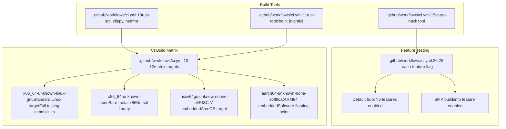
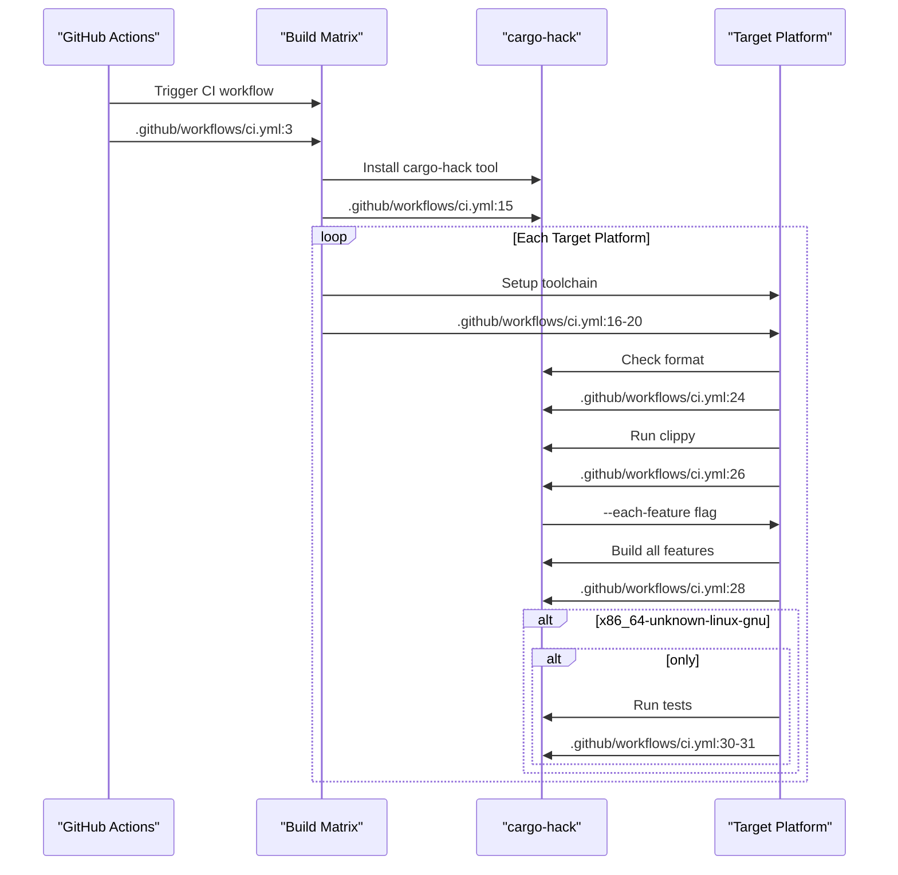
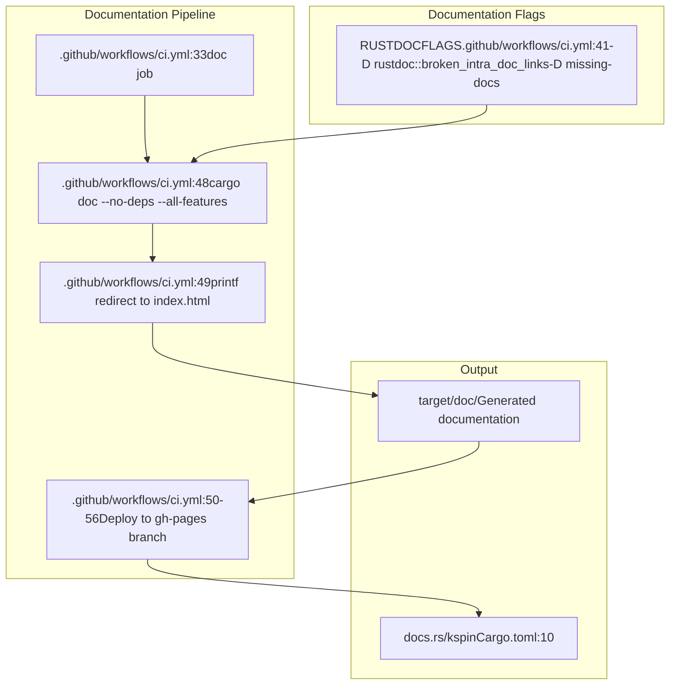

# Build System and Feature Flags

> **Relevant source files**
> * [.github/workflows/ci.yml](https://github.com/arceos-org/kspin/blob/dfc0ff2c/.github/workflows/ci.yml)
> * [Cargo.toml](https://github.com/arceos-org/kspin/blob/dfc0ff2c/Cargo.toml)

This document covers the build system configuration, feature flags, and compilation targets for the kspin crate. It explains how to build the crate with different feature combinations and target platforms, and describes the automated build and testing infrastructure.

For information about the development environment setup and tooling, see [Development Environment Setup](/arceos-org/kspin/4.3-development-environment-setup). For details about the testing infrastructure, see [Testing and CI Pipeline](/arceos-org/kspin/4.2-testing-and-ci-pipeline).

## Feature Flags

The kspin crate uses Cargo feature flags to enable compile-time optimization for different deployment scenarios. The primary feature flag is `smp`, which controls whether the spinlock implementation includes multi-core synchronization logic.

### SMP Feature Flag

The `smp` feature flag is defined in [Cargo.toml(L14 - L16)&emsp;](https://github.com/arceos-org/kspin/blob/dfc0ff2c/Cargo.toml#L14-L16) and controls fundamental compilation behavior:

```

```

**Build Matrix: Feature Flag Compilation**

When the `smp` feature is **enabled**:

* `BaseSpinLock` includes an `AtomicBool` state field
* Lock operations use `compare_exchange` atomic operations
* Full memory ordering constraints are enforced
* Spinning behavior is implemented for contention scenarios

When the `smp` feature is **disabled**:

* `BaseSpinLock` has no state field (zero-cost abstraction)
* Lock operations become no-ops or compile-time optimizations
* No atomic operations are generated
* Suitable for single-core embedded environments

Sources: [Cargo.toml(L14 - L16)&emsp;](https://github.com/arceos-org/kspin/blob/dfc0ff2c/Cargo.toml#L14-L16)

## Target Platform Support

The build system supports multiple target architectures through the CI matrix configuration. Each target represents a different deployment environment with specific requirements.

### Supported Targets

|Target Platform|Architecture|Use Case|SMP Support|
| --- | --- | --- | --- |
|x86_64-unknown-linux-gnu|x86-64|Development/Testing|Full|
|x86_64-unknown-none|x86-64|Bare metal kernel|Full|
|riscv64gc-unknown-none-elf|RISC-V 64-bit|Embedded kernel|Full|
|aarch64-unknown-none-softfloat|ARM64|Embedded systems|Full|



Sources: [.github/workflows/ci.yml(L10 - L12)&emsp;](https://github.com/arceos-org/kspin/blob/dfc0ff2c/.github/workflows/ci.yml#L10-L12) [.github/workflows/ci.yml(L19)&emsp;](https://github.com/arceos-org/kspin/blob/dfc0ff2c/.github/workflows/ci.yml#L19-L19)

## Build Commands and Configuration

### Basic Build Commands

The standard build commands work with cargo's feature flag system:

```markdown
# Default build (no features)
cargo build

# Build with SMP support
cargo build --features smp

# Build for specific target
cargo build --target x86_64-unknown-none --features smp

# Build all feature combinations
cargo hack build --each-feature
```

### CI Build Pipeline

The automated build pipeline uses `cargo-hack` to test all feature combinations across all target platforms:



**Build Steps Detail:**

1. **Format Check**: `cargo fmt --all -- --check` [.github/workflows/ci.yml(L24)&emsp;](https://github.com/arceos-org/kspin/blob/dfc0ff2c/.github/workflows/ci.yml#L24-L24)
2. **Linting**: `cargo hack clippy --target $target --each-feature` [.github/workflows/ci.yml(L26)&emsp;](https://github.com/arceos-org/kspin/blob/dfc0ff2c/.github/workflows/ci.yml#L26-L26)
3. **Compilation**: `cargo hack build --target $target --each-feature` [.github/workflows/ci.yml(L28)&emsp;](https://github.com/arceos-org/kspin/blob/dfc0ff2c/.github/workflows/ci.yml#L28-L28)
4. **Testing**: `cargo hack test --target $target --each-feature` (Linux only) [.github/workflows/ci.yml(L31)&emsp;](https://github.com/arceos-org/kspin/blob/dfc0ff2c/.github/workflows/ci.yml#L31-L31)

Sources: [.github/workflows/ci.yml(L24 - L31)&emsp;](https://github.com/arceos-org/kspin/blob/dfc0ff2c/.github/workflows/ci.yml#L24-L31)

## Dependency Management

The crate's dependencies are managed through Cargo.toml and support the feature flag system:

```

```

**Dependency Roles:**

* **cfg-if**: Enables conditional compilation based on feature flags and target platform
* **kernel_guard**: Provides `NoOp`, `NoPreempt`, and `NoPreemptIrqSave` guard types
* **smp feature**: Controls atomic operation inclusion without additional dependencies

Sources: [Cargo.toml(L19 - L21)&emsp;](https://github.com/arceos-org/kspin/blob/dfc0ff2c/Cargo.toml#L19-L21) [Cargo.toml(L14 - L17)&emsp;](https://github.com/arceos-org/kspin/blob/dfc0ff2c/Cargo.toml#L14-L17)

## Documentation Generation

The build system includes automated documentation generation and deployment:



The documentation build enforces strict documentation requirements through `RUSTDOCFLAGS` and deploys automatically to GitHub Pages for the default branch.

Sources: [.github/workflows/ci.yml(L33 - L56)&emsp;](https://github.com/arceos-org/kspin/blob/dfc0ff2c/.github/workflows/ci.yml#L33-L56) [.github/workflows/ci.yml(L41)&emsp;](https://github.com/arceos-org/kspin/blob/dfc0ff2c/.github/workflows/ci.yml#L41-L41) [Cargo.toml(L10)&emsp;](https://github.com/arceos-org/kspin/blob/dfc0ff2c/Cargo.toml#L10-L10)