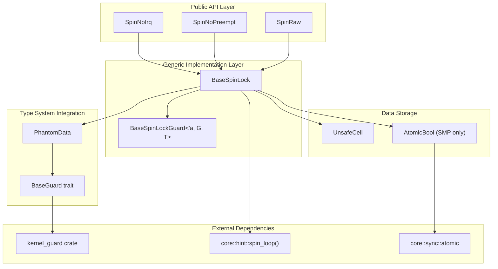
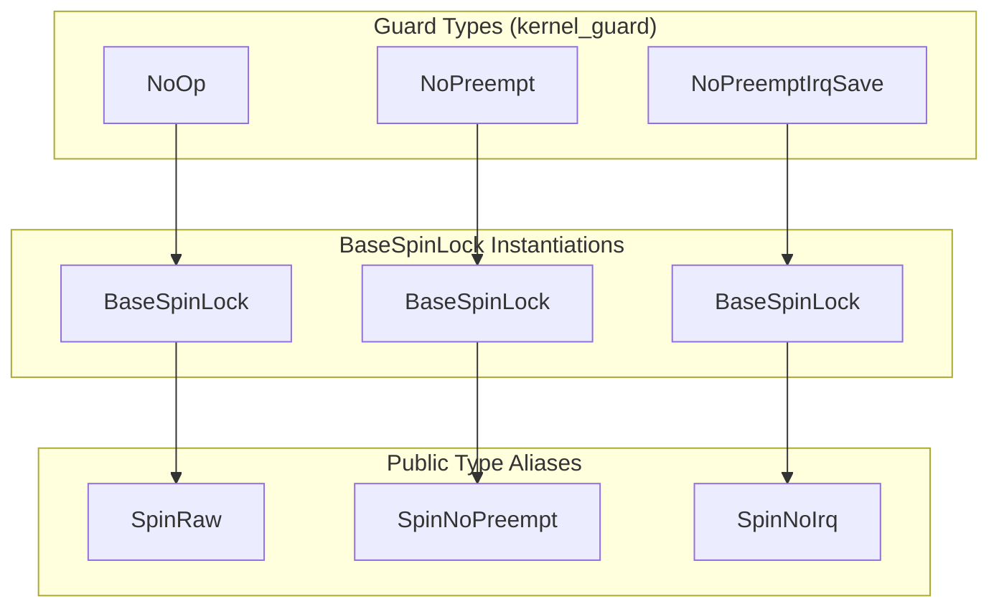
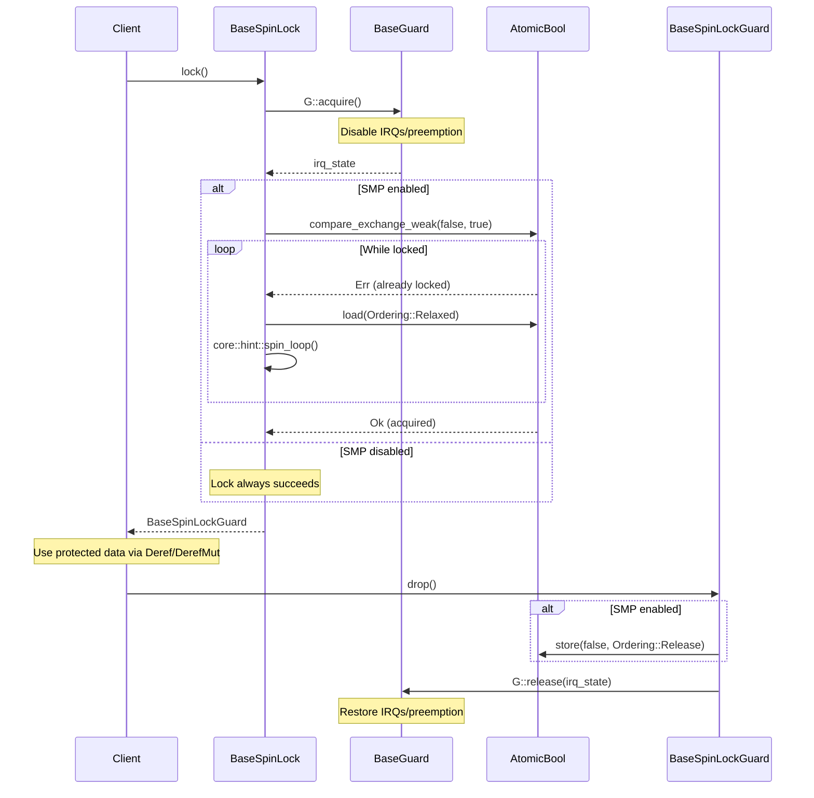
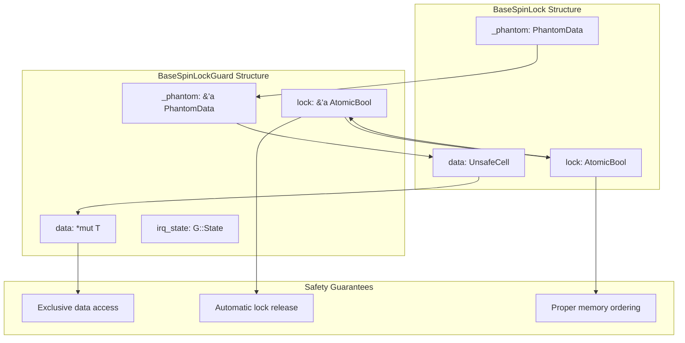

# Core Implementation Architecture

> **Relevant source files**
> * [src/base.rs](https://github.com/arceos-org/kspin/blob/dfc0ff2c/src/base.rs)

This page provides a detailed analysis of the core implementation that underlies all spinlock types in the kspin crate. It covers the generic `BaseSpinLock` architecture, the RAII guard system, and the feature-conditional compilation strategy that enables optimization for different target environments.

For information about the specific spinlock types that users interact with, see [Spinlock Types and Public API](/arceos-org/kspin/2-spinlock-types-and-public-api). For detailed implementation analysis of individual components, see [BaseSpinLock and BaseSpinLockGuard](/arceos-org/kspin/3.1-basespinlock-and-basespinlockguard), [BaseGuard Trait System](/arceos-org/kspin/3.2-baseguard-trait-system), [SMP vs Single-Core Implementation](/arceos-org/kspin/3.3-smp-vs-single-core-implementation), and [Memory Ordering and Atomic Operations](/arceos-org/kspin/3.4-memory-ordering-and-atomic-operations).

## Architectural Overview

The kspin crate implements a layered architecture where all public spinlock types (`SpinRaw`, `SpinNoPreempt`, `SpinNoIrq`) are type aliases that wrap a single generic implementation: `BaseSpinLock<G, T>`. This design provides compile-time specialization through the type system while maintaining a unified codebase.

**Core Components Diagram**



Sources: [src/base.rs(L27 - L32)&emsp;](https://github.com/arceos-org/kspin/blob/dfc0ff2c/src/base.rs#L27-L32) [src/base.rs(L37 - L43)&emsp;](https://github.com/arceos-org/kspin/blob/dfc0ff2c/src/base.rs#L37-L43)

## Generic Type Parameterization

The `BaseSpinLock<G, T>` struct uses two generic parameters that enable compile-time specialization:

|Parameter|Purpose|Constraints|
| --- | --- | --- |
|G|Guard behavior type|Must implementBaseGuardtrait|
|T|Protected data type|Supports?Sizedfor unsized types|

The guard type `G` determines the protection behavior through the `BaseGuard` trait, which provides `acquire()` and `release()` methods that are called when entering and exiting the critical section.

**Type Parameterization Flow**



Sources: [src/base.rs(L27 - L32)&emsp;](https://github.com/arceos-org/kspin/blob/dfc0ff2c/src/base.rs#L27-L32) [src/lib.rs](https://github.com/arceos-org/kspin/blob/dfc0ff2c/src/lib.rs)

## Feature-Conditional Architecture

The implementation uses the `smp` feature flag to provide dramatically different code paths for single-core versus multi-core environments:

**SMP Feature Compilation Strategy**

```

```

Sources: [src/base.rs(L13 - L14)&emsp;](https://github.com/arceos-org/kspin/blob/dfc0ff2c/src/base.rs#L13-L14) [src/base.rs(L29 - L30)&emsp;](https://github.com/arceos-org/kspin/blob/dfc0ff2c/src/base.rs#L29-L30) [src/base.rs(L41 - L42)&emsp;](https://github.com/arceos-org/kspin/blob/dfc0ff2c/src/base.rs#L41-L42) [src/base.rs(L79 - L93)&emsp;](https://github.com/arceos-org/kspin/blob/dfc0ff2c/src/base.rs#L79-L93) [src/base.rs(L111 - L118)&emsp;](https://github.com/arceos-org/kspin/blob/dfc0ff2c/src/base.rs#L111-L118) [src/base.rs(L125 - L136)&emsp;](https://github.com/arceos-org/kspin/blob/dfc0ff2c/src/base.rs#L125-L136)

## Lock Acquisition and Guard Lifecycle

The core operation flow demonstrates how the RAII pattern ensures correct lock management:

**Lock Lifecycle Flow**



Sources: [src/base.rs(L77 - L101)&emsp;](https://github.com/arceos-org/kspin/blob/dfc0ff2c/src/base.rs#L77-L101) [src/base.rs(L218 - L227)&emsp;](https://github.com/arceos-org/kspin/blob/dfc0ff2c/src/base.rs#L218-L227)

## Memory Safety and Synchronization

The implementation provides memory safety through several mechanisms:

|Mechanism|Implementation|Purpose|
| --- | --- | --- |
|UnsafeCell<T>|src/base.rs31|Interior mutability for protected data|
|RAII Guard|src/base.rs37-43|Automatic lock release on scope exit|
|Raw pointer in guard|src/base.rs40|Direct data access while lock is held|
|Atomic operations|src/base.rs83-85|Multi-core synchronization|
|Memory ordering|Ordering::Acquire/Release|Proper memory barriers|

**Data Access Safety Model**



Sources: [src/base.rs(L27 - L32)&emsp;](https://github.com/arceos-org/kspin/blob/dfc0ff2c/src/base.rs#L27-L32) [src/base.rs(L37 - L43)&emsp;](https://github.com/arceos-org/kspin/blob/dfc0ff2c/src/base.rs#L37-L43) [src/base.rs(L195 - L210)&emsp;](https://github.com/arceos-org/kspin/blob/dfc0ff2c/src/base.rs#L195-L210) [src/base.rs(L218 - L227)&emsp;](https://github.com/arceos-org/kspin/blob/dfc0ff2c/src/base.rs#L218-L227)