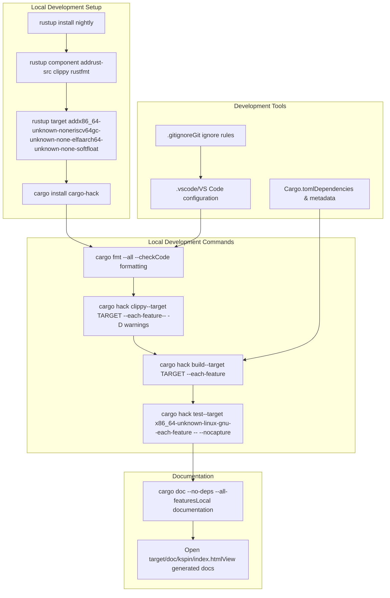
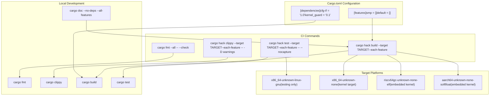

# Development Environment Setup

> **Relevant source files**
> * [.github/workflows/ci.yml](https://github.com/arceos-org/kspin/blob/dfc0ff2c/.github/workflows/ci.yml)
> * [.gitignore](https://github.com/arceos-org/kspin/blob/dfc0ff2c/.gitignore)
> * [Cargo.toml](https://github.com/arceos-org/kspin/blob/dfc0ff2c/Cargo.toml)

This document provides guidance for setting up a development environment to build, test, and contribute to the kspin crate. It covers the required toolchain, build processes, and development practices used by the project.

For information about the build system's feature flags and compilation targets, see [Build System and Feature Flags](/arceos-org/kspin/4.1-build-system-and-feature-flags). For details about the automated testing infrastructure, see [Testing and CI Pipeline](/arceos-org/kspin/4.2-testing-and-ci-pipeline).

## Prerequisites

The kspin crate requires specific Rust toolchain components and supports multiple target platforms. The development environment must be configured to handle both hosted and no-std embedded targets.

### Required Rust Toolchain Components

The project uses the Rust nightly toolchain with specific components required for cross-platform development and code quality checks:

|Component|Purpose|
| --- | --- |
|rust-src|Source code for cross-compilation to no-std targets|
|clippy|Linting and static analysis|
|rustfmt|Code formatting|

### Supported Target Platforms

The CI system validates builds across multiple target architectures:

|Target|Platform Type|Usage Context|
| --- | --- | --- |
|x86_64-unknown-linux-gnu|Hosted Linux|Development and testing|
|x86_64-unknown-none|Bare metal x86-64|Kernel environments|
|riscv64gc-unknown-none-elf|Bare metal RISC-V|Embedded kernel systems|
|aarch64-unknown-none-softfloat|Bare metal ARM64|Embedded kernel systems|

Sources: [.github/workflows/ci.yml(L12)&emsp;](https://github.com/arceos-org/kspin/blob/dfc0ff2c/.github/workflows/ci.yml#L12-L12) [.github/workflows/ci.yml(L18 - L20)&emsp;](https://github.com/arceos-org/kspin/blob/dfc0ff2c/.github/workflows/ci.yml#L18-L20)

## Development Toolchain Setup

### Rust Toolchain Installation

Install the nightly Rust toolchain with required components and target platforms:

```markdown
# Install nightly toolchain
rustup toolchain install nightly

# Add required components
rustup component add --toolchain nightly rust-src clippy rustfmt

# Add target platforms
rustup target add --toolchain nightly x86_64-unknown-none
rustup target add --toolchain nightly riscv64gc-unknown-none-elf
rustup target add --toolchain nightly aarch64-unknown-none-softfloat
```

### Development Tools

Install `cargo-hack` for comprehensive feature combination testing:

```
cargo install cargo-hack
```

The `cargo-hack` tool enables testing all feature combinations across different targets, matching the CI environment exactly.

Sources: [.github/workflows/ci.yml(L15)&emsp;](https://github.com/arceos-org/kspin/blob/dfc0ff2c/.github/workflows/ci.yml#L15-L15) [.github/workflows/ci.yml(L16 - L20)&emsp;](https://github.com/arceos-org/kspin/blob/dfc0ff2c/.github/workflows/ci.yml#L16-L20)

## Development Workflow

#### Development Environment Flow



Sources: [.github/workflows/ci.yml(L16 - L31)&emsp;](https://github.com/arceos-org/kspin/blob/dfc0ff2c/.github/workflows/ci.yml#L16-L31) [.github/workflows/ci.yml(L45 - L49)&emsp;](https://github.com/arceos-org/kspin/blob/dfc0ff2c/.github/workflows/ci.yml#L45-L49) [.gitignore(L2)&emsp;](https://github.com/arceos-org/kspin/blob/dfc0ff2c/.gitignore#L2-L2)

## Local Build and Test Process

### Code Quality Checks

Replicate the CI environment locally by running the same commands used in automated testing:

#### Code Formatting

```
cargo fmt --all -- --check
```

#### Linting with Feature Combinations

```markdown
# Lint for specific target with all feature combinations
cargo hack clippy --target x86_64-unknown-none --each-feature -- -D warnings
cargo hack clippy --target riscv64gc-unknown-none-elf --each-feature -- -D warnings
```

#### Building Across Targets

```markdown
# Build for all feature combinations on each target
cargo hack build --target x86_64-unknown-none --each-feature
cargo hack build --target riscv64gc-unknown-none-elf --each-feature
cargo hack build --target aarch64-unknown-none-softfloat --each-feature
```

#### Testing

```markdown
# Run tests (only on hosted target)
cargo hack test --target x86_64-unknown-linux-gnu --each-feature -- --nocapture
```

Sources: [.github/workflows/ci.yml(L24)&emsp;](https://github.com/arceos-org/kspin/blob/dfc0ff2c/.github/workflows/ci.yml#L24-L24) [.github/workflows/ci.yml(L26)&emsp;](https://github.com/arceos-org/kspin/blob/dfc0ff2c/.github/workflows/ci.yml#L26-L26) [.github/workflows/ci.yml(L28)&emsp;](https://github.com/arceos-org/kspin/blob/dfc0ff2c/.github/workflows/ci.yml#L28-L28) [.github/workflows/ci.yml(L31)&emsp;](https://github.com/arceos-org/kspin/blob/dfc0ff2c/.github/workflows/ci.yml#L31-L31)

### Feature Flag Testing

The `--each-feature` flag tests the following combinations:

* No features (default)
* `smp` feature enabled
* All features enabled

This ensures the crate works correctly in both single-core and multi-core environments.

#### Local Development Command Mapping



Sources: [Cargo.toml(L14 - L17)&emsp;](https://github.com/arceos-org/kspin/blob/dfc0ff2c/Cargo.toml#L14-L17) [Cargo.toml(L19 - L21)&emsp;](https://github.com/arceos-org/kspin/blob/dfc0ff2c/Cargo.toml#L19-L21) [.github/workflows/ci.yml(L12)&emsp;](https://github.com/arceos-org/kspin/blob/dfc0ff2c/.github/workflows/ci.yml#L12-L12) [.github/workflows/ci.yml(L24 - L31)&emsp;](https://github.com/arceos-org/kspin/blob/dfc0ff2c/.github/workflows/ci.yml#L24-L31)

## Development Environment Configuration

### IDE Setup

The project includes VS Code ignore rules, indicating support for Visual Studio Code development:

```
/.vscode
```

Developers can create local `.vscode/settings.json` configurations for:

* Rust-analyzer settings
* Target-specific build configurations
* Code formatting preferences

### Git Configuration

The `.gitignore` file excludes:

* Build artifacts (`/target`)
* IDE configurations (`/.vscode`)
* System files (`.DS_Store`)

Sources: [.gitignore(L1 - L3)&emsp;](https://github.com/arceos-org/kspin/blob/dfc0ff2c/.gitignore#L1-L3)

## Documentation Development

### Local Documentation Building

Generate and view documentation locally:

```markdown
# Build documentation with all features
cargo doc --no-deps --all-features

# View in browser
open target/doc/kspin/index.html
```

The documentation build process matches the CI environment, ensuring consistency with the published GitHub Pages documentation.

### Documentation Quality Checks

The CI system enforces documentation quality with specific `RUSTDOCFLAGS`:

```
RUSTDOCFLAGS="-D rustdoc::broken_intra_doc_links -D missing-docs" cargo doc --no-deps --all-features
```

Sources: [.github/workflows/ci.yml(L41)&emsp;](https://github.com/arceos-org/kspin/blob/dfc0ff2c/.github/workflows/ci.yml#L41-L41) [.github/workflows/ci.yml(L45 - L49)&emsp;](https://github.com/arceos-org/kspin/blob/dfc0ff2c/.github/workflows/ci.yml#L45-L49)

## Continuous Integration Alignment

The local development environment should replicate the CI matrix strategy to ensure compatibility:

### Matrix Testing Strategy

|Toolchain|All Targets|Feature Testing|
| --- | --- | --- |
|nightly|✓|--each-feature|

### CI Job Replication

1. **Format Check**: `cargo fmt --all -- --check`
2. **Lint Check**: `cargo hack clippy --target TARGET --each-feature -- -D warnings`
3. **Build Check**: `cargo hack build --target TARGET --each-feature`
4. **Unit Tests**: `cargo hack test --target x86_64-unknown-linux-gnu --each-feature -- --nocapture`
5. **Documentation**: `cargo doc --no-deps --all-features`

Running these commands locally before committing ensures smooth CI pipeline execution.

Sources: [.github/workflows/ci.yml(L8 - L12)&emsp;](https://github.com/arceos-org/kspin/blob/dfc0ff2c/.github/workflows/ci.yml#L8-L12) [.github/workflows/ci.yml(L24 - L31)&emsp;](https://github.com/arceos-org/kspin/blob/dfc0ff2c/.github/workflows/ci.yml#L24-L31)