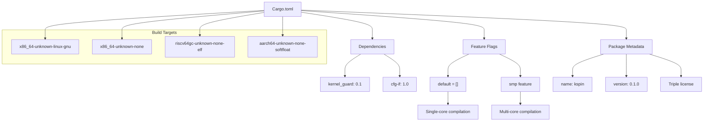
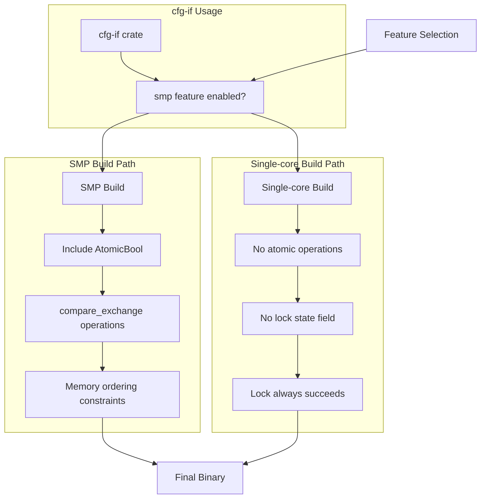
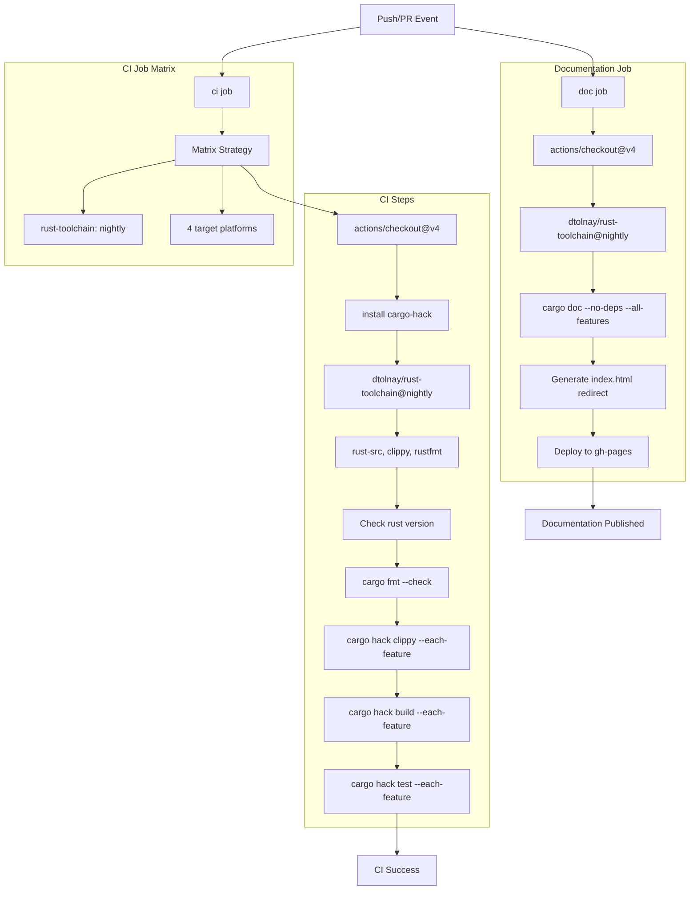
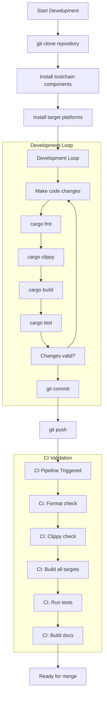

# Development and Building

> **Relevant source files**
> * [.github/workflows/ci.yml](https://github.com/arceos-org/kspin/blob/dfc0ff2c/.github/workflows/ci.yml)
> * [Cargo.toml](https://github.com/arceos-org/kspin/blob/dfc0ff2c/Cargo.toml)

This document provides comprehensive information for developers who want to build, test, or contribute to the kspin crate. It covers the build system configuration, feature flag usage, continuous integration pipeline, and development environment setup. For information about the actual spinlock APIs and usage patterns, see [Spinlock Types and Public API](/arceos-org/kspin/2-spinlock-types-and-public-api). For details about the internal implementation architecture, see [Core Implementation Architecture](/arceos-org/kspin/3-core-implementation-architecture).

## Build System Overview

The kspin crate uses Cargo as its primary build system with support for multiple target platforms and optional feature flags. The build configuration is centralized in the project's `Cargo.toml` file, which defines dependencies, metadata, and feature gates that control compilation behavior.

### Package Configuration

The crate is configured as a library package targeting kernel-space environments with no-std compatibility. The package metadata includes licensing under multiple schemes (GPL-3.0-or-later, Apache-2.0, MulanPSL-2.0) and categorization for operating system and no-std use cases [Cargo.toml(L1 - L13)&emsp;](https://github.com/arceos-org/kspin/blob/dfc0ff2c/Cargo.toml#L1-L13)

### Target Platform Support

The build system supports multiple target architectures commonly used in kernel and embedded development:

|Target|Architecture|Use Case|
| --- | --- | --- |
|x86_64-unknown-linux-gnu|x86-64|Hosted testing environment|
|x86_64-unknown-none|x86-64|Bare metal/kernel|
|riscv64gc-unknown-none-elf|RISC-V 64-bit|Embedded/kernel|
|aarch64-unknown-none-softfloat|ARM64|Embedded/kernel|

**Build System Architecture**



Sources: [Cargo.toml(L1 - L22)&emsp;](https://github.com/arceos-org/kspin/blob/dfc0ff2c/Cargo.toml#L1-L22) [.github/workflows/ci.yml(L12)&emsp;](https://github.com/arceos-org/kspin/blob/dfc0ff2c/.github/workflows/ci.yml#L12-L12)

## Feature Flag System

The kspin crate uses Cargo feature flags to enable compile-time optimization and conditional compilation based on the target environment. The primary feature flag is `smp`, which controls whether the spinlock implementation includes multi-core synchronization primitives.

### Feature Configuration

The feature system is defined in the `[features]` section of `Cargo.toml`:

* **`smp`**: Enables multi-core environment support with atomic operations
* **`default`**: Empty default feature set for maximum compatibility

When the `smp` feature is disabled, the implementation optimizes away atomic operations and lock state for single-core environments [Cargo.toml(L14 - L17)&emsp;](https://github.com/arceos-org/kspin/blob/dfc0ff2c/Cargo.toml#L14-L17)

**Feature Flag Compilation Flow**



Sources: [Cargo.toml(L14 - L17)&emsp;](https://github.com/arceos-org/kspin/blob/dfc0ff2c/Cargo.toml#L14-L17) [Cargo.toml(L20 - L21)&emsp;](https://github.com/arceos-org/kspin/blob/dfc0ff2c/Cargo.toml#L20-L21)

## Continuous Integration Pipeline

The project uses GitHub Actions for automated testing, building, and documentation deployment. The CI pipeline is defined in `.github/workflows/ci.yml` and consists of two main jobs: `ci` for code validation and `doc` for documentation generation.

### CI Job Matrix

The `ci` job uses a matrix strategy to test across multiple dimensions:

|Matrix Dimension|Values|
| --- | --- |
|Rust Toolchain|nightly|
|Target Platforms|4 platforms (see table above)|
|Feature Combinations|Each feature individually viacargo-hack|

### CI Pipeline Stages

**CI/CD Pipeline Architecture**



Sources: [.github/workflows/ci.yml(L1 - L57)&emsp;](https://github.com/arceos-org/kspin/blob/dfc0ff2c/.github/workflows/ci.yml#L1-L57)

### Code Quality Checks

The CI pipeline enforces code quality through multiple automated checks:

1. **Code Formatting**: `cargo fmt --all -- --check` ensures consistent code style [.github/workflows/ci.yml(L24)&emsp;](https://github.com/arceos-org/kspin/blob/dfc0ff2c/.github/workflows/ci.yml#L24-L24)
2. **Linting**: `cargo hack clippy --target ${{ matrix.targets }} --each-feature -- -D warnings` catches potential issues [.github/workflows/ci.yml(L26)&emsp;](https://github.com/arceos-org/kspin/blob/dfc0ff2c/.github/workflows/ci.yml#L26-L26)
3. **Building**: `cargo hack build --target ${{ matrix.targets }} --each-feature` validates compilation [.github/workflows/ci.yml(L28)&emsp;](https://github.com/arceos-org/kspin/blob/dfc0ff2c/.github/workflows/ci.yml#L28-L28)
4. **Testing**: `cargo hack test --target ${{ matrix.targets }} --each-feature` runs unit tests (Linux only) [.github/workflows/ci.yml(L30 - L31)&emsp;](https://github.com/arceos-org/kspin/blob/dfc0ff2c/.github/workflows/ci.yml#L30-L31)

### Documentation Deployment

The `doc` job automatically builds and deploys documentation to GitHub Pages when changes are pushed to the default branch. The documentation is built with strict settings that treat broken links and missing documentation as errors [.github/workflows/ci.yml(L41)&emsp;](https://github.com/arceos-org/kspin/blob/dfc0ff2c/.github/workflows/ci.yml#L41-L41)

## Development Environment Setup

To contribute to the kspin crate, developers need to set up a Rust development environment with specific toolchain components and target support.

### Required Toolchain Components

The development environment requires the Rust nightly toolchain with the following components:

* `rust-src`: Source code for cross-compilation
* `clippy`: Linting tool for code analysis
* `rustfmt`: Code formatting tool

### Target Installation

Install the required compilation targets:

```
rustup target add x86_64-unknown-linux-gnu
rustup target add x86_64-unknown-none  
rustup target add riscv64gc-unknown-none-elf
rustup target add aarch64-unknown-none-softfloat
```

### Development Tools

Install `cargo-hack` for feature flag testing:

```
cargo install cargo-hack
```

This tool enables testing with each feature flag combination individually, which is essential for ensuring the crate works correctly across different configurations [.github/workflows/ci.yml(L15)&emsp;](https://github.com/arceos-org/kspin/blob/dfc0ff2c/.github/workflows/ci.yml#L15-L15)

### Local Development Workflow

**Development Workflow**



Sources: [.github/workflows/ci.yml(L14 - L31)&emsp;](https://github.com/arceos-org/kspin/blob/dfc0ff2c/.github/workflows/ci.yml#L14-L31) [Cargo.toml(L1 - L22)&emsp;](https://github.com/arceos-org/kspin/blob/dfc0ff2c/Cargo.toml#L1-L22)

## Testing Procedures

The kspin crate employs comprehensive testing through both local development tools and automated CI validation. Testing is performed across multiple feature combinations and target platforms to ensure broad compatibility.

### Local Testing Commands

|Command|Purpose|
| --- | --- |
|cargo test|Run tests with default features|
|cargo hack test --each-feature|Test each feature individually|
|cargo hack test --feature smp|Test with SMP feature enabled|
|cargo test --target x86_64-unknown-linux-gnu|Test on specific target|

### CI Testing Matrix

The CI system automatically tests every feature combination across all supported target platforms. Unit tests are executed only on the `x86_64-unknown-linux-gnu` target, as this is the only hosted environment that supports test execution [.github/workflows/ci.yml(L30 - L31)&emsp;](https://github.com/arceos-org/kspin/blob/dfc0ff2c/.github/workflows/ci.yml#L30-L31)

The use of `cargo-hack` ensures that feature flag interactions are properly validated and that the crate maintains compatibility across different compilation configurations [.github/workflows/ci.yml(L26 - L31)&emsp;](https://github.com/arceos-org/kspin/blob/dfc0ff2c/.github/workflows/ci.yml#L26-L31)

Sources: [.github/workflows/ci.yml(L26 - L31)&emsp;](https://github.com/arceos-org/kspin/blob/dfc0ff2c/.github/workflows/ci.yml#L26-L31) [Cargo.toml(L14 - L22)&emsp;](https://github.com/arceos-org/kspin/blob/dfc0ff2c/Cargo.toml#L14-L22)