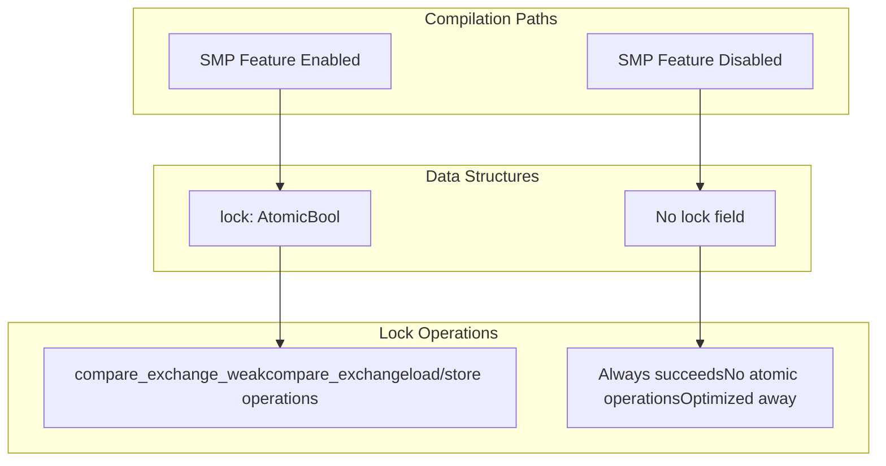
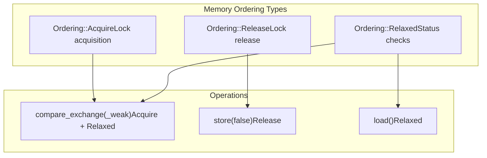
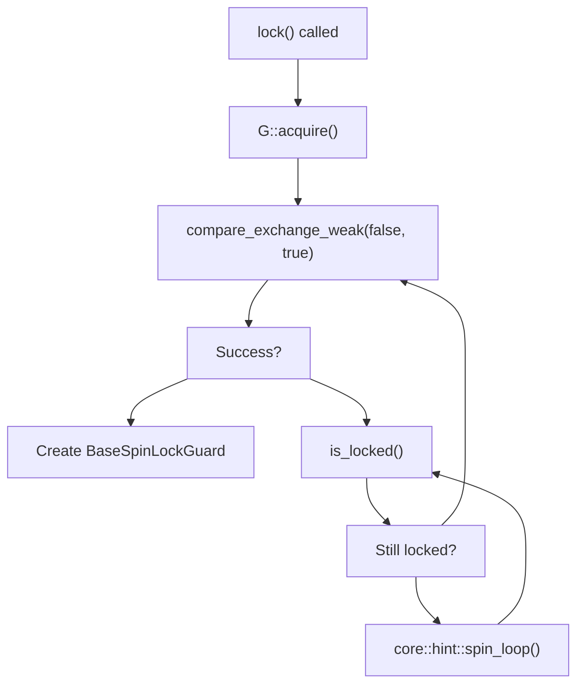
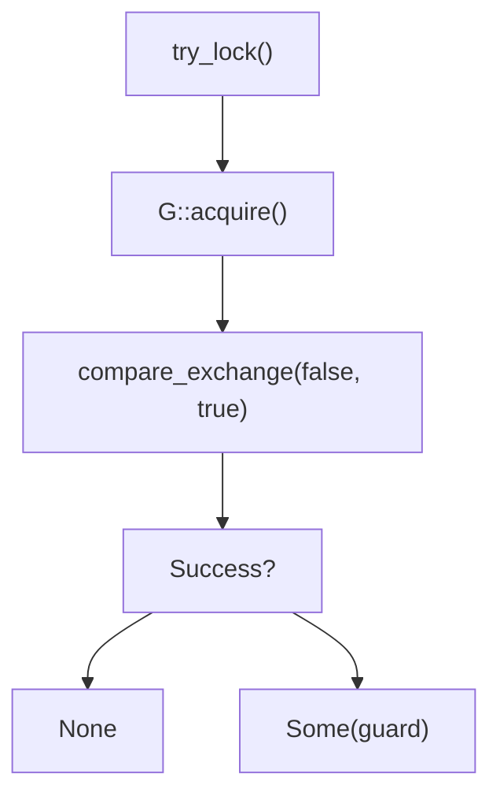
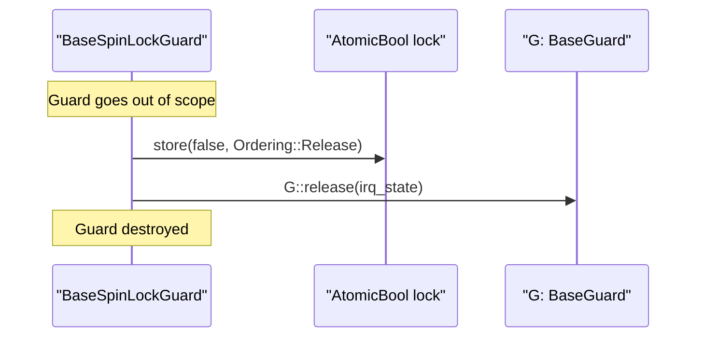
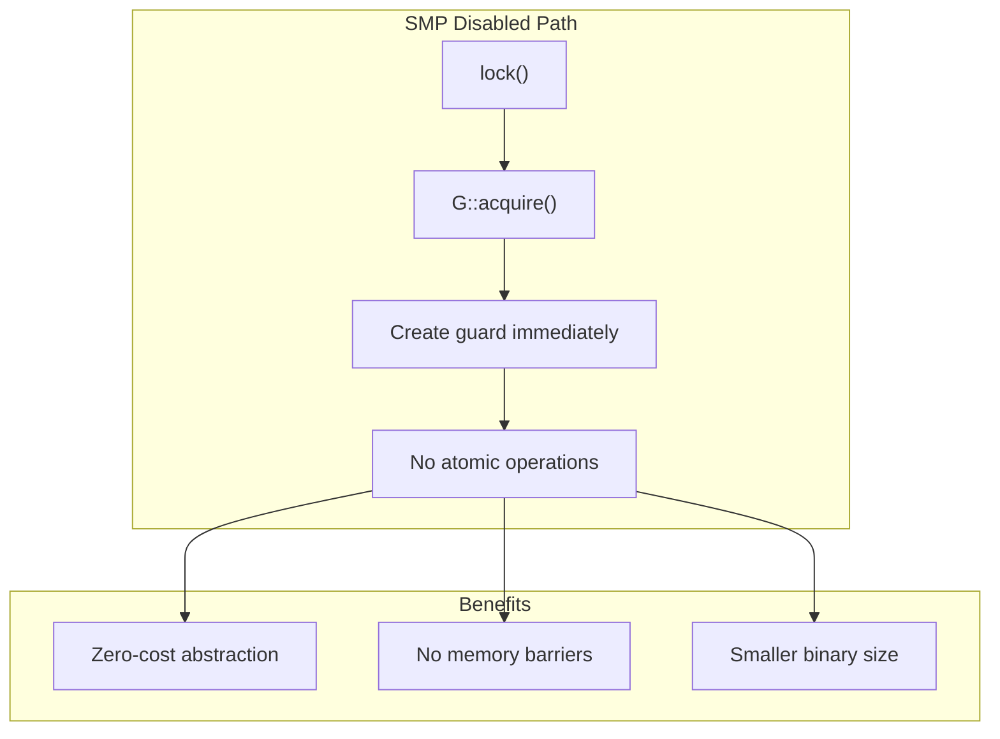

# Memory Ordering and Atomic Operations

> **Relevant source files**
> * [src/base.rs](https://github.com/arceos-org/kspin/blob/dfc0ff2c/src/base.rs)

This document covers the atomic operations and memory ordering semantics used in the kspin crate's spinlock implementation. It details how the `BaseSpinLock` uses platform-specific atomic primitives to ensure thread safety in multi-core environments, and how these operations are optimized away for single-core systems.

For information about the overall spinlock architecture and guard types, see [Core Implementation Architecture](/arceos-org/kspin/3-core-implementation-architecture). For details about the SMP feature flag system, see [SMP vs Single-Core Implementation](/arceos-org/kspin/3.3-smp-vs-single-core-implementation).

## Conditional Atomic Operations

The kspin crate uses conditional compilation to include atomic operations only when targeting multi-core systems. The `smp` feature flag controls whether atomic synchronization primitives are compiled into the final binary.

The `BaseSpinLock` struct conditionally includes an `AtomicBool` field based on the `smp` feature:

|Compilation Mode|Lock Field|Behavior|
| --- | --- | --- |
|SMP enabled|lock: AtomicBool|Full atomic synchronization|
|SMP disabled|No lock field|All lock operations succeed immediately|

Sources: [src/base.rs(L13 - L14)&emsp;](https://github.com/arceos-org/kspin/blob/dfc0ff2c/src/base.rs#L13-L14) [src/base.rs(L29 - L30)&emsp;](https://github.com/arceos-org/kspin/blob/dfc0ff2c/src/base.rs#L29-L30) [src/base.rs(L111 - L117)&emsp;](https://github.com/arceos-org/kspin/blob/dfc0ff2c/src/base.rs#L111-L117)

## Memory Ordering Semantics

The spinlock implementation uses three specific memory orderings to ensure correct synchronization semantics while minimizing performance overhead:

### Memory Ordering Usage Patterns

|Operation|Success Ordering|Failure Ordering|Purpose|
| --- | --- | --- | --- |
|compare_exchange_weak|Acquire|Relaxed|Lock acquisition with retry|
|compare_exchange|Acquire|Relaxed|Single attempt lock acquisition|
|store(false)|Release|N/A|Lock release|
|load()|Relaxed|N/A|Non-blocking status check|

The `Acquire` ordering on successful lock acquisition ensures that all subsequent reads and writes cannot be reordered before the lock acquisition. The `Release` ordering on lock release ensures that all previous reads and writes complete before the lock is released.

Sources: [src/base.rs(L85)&emsp;](https://github.com/arceos-org/kspin/blob/dfc0ff2c/src/base.rs#L85-L85) [src/base.rs(L131)&emsp;](https://github.com/arceos-org/kspin/blob/dfc0ff2c/src/base.rs#L131-L131) [src/base.rs(L161)&emsp;](https://github.com/arceos-org/kspin/blob/dfc0ff2c/src/base.rs#L161-L161) [src/base.rs(L224)&emsp;](https://github.com/arceos-org/kspin/blob/dfc0ff2c/src/base.rs#L224-L224) [src/base.rs(L113)&emsp;](https://github.com/arceos-org/kspin/blob/dfc0ff2c/src/base.rs#L113-L113)

## Atomic Operation Flow

The spinlock uses a two-phase approach for lock acquisition: an optimistic compare-and-swap followed by a passive wait loop.

### Lock Acquisition Pattern

The `lock()` method implements an efficient two-stage spinning strategy:

1. **Active spinning**: Attempts to acquire the lock using `compare_exchange_weak`
2. **Passive waiting**: When acquisition fails, enters a read-only spin loop checking `is_locked()`
3. **CPU optimization**: Uses `core::hint::spin_loop()` to signal the processor during busy waiting

Sources: [src/base.rs(L77 - L101)&emsp;](https://github.com/arceos-org/kspin/blob/dfc0ff2c/src/base.rs#L77-L101) [src/base.rs(L83 - L92)&emsp;](https://github.com/arceos-org/kspin/blob/dfc0ff2c/src/base.rs#L83-L92) [src/base.rs(L89 - L91)&emsp;](https://github.com/arceos-org/kspin/blob/dfc0ff2c/src/base.rs#L89-L91)

### Try-Lock Pattern

The `try_lock()` method uses a single-shot approach with `compare_exchange` (strong semantics) rather than the weak variant used in the spinning loop:

The strong compare-exchange is used because there's no retry loop, making the single operation more likely to succeed on architectures where weak operations can fail spuriously.

Sources: [src/base.rs(L122 - L149)&emsp;](https://github.com/arceos-org/kspin/blob/dfc0ff2c/src/base.rs#L122-L149) [src/base.rs(L129 - L132)&emsp;](https://github.com/arceos-org/kspin/blob/dfc0ff2c/src/base.rs#L129-L132)

## Lock Release Mechanism

Lock release occurs automatically through the RAII `Drop` implementation of `BaseSpinLockGuard`. The release process ensures proper memory ordering and guard state cleanup:

The release ordering ensures that all memory operations performed while holding the lock are visible to other threads before the lock becomes available.

Sources: [src/base.rs(L218 - L227)&emsp;](https://github.com/arceos-org/kspin/blob/dfc0ff2c/src/base.rs#L218-L227) [src/base.rs(L224)&emsp;](https://github.com/arceos-org/kspin/blob/dfc0ff2c/src/base.rs#L224-L224) [src/base.rs(L225)&emsp;](https://github.com/arceos-org/kspin/blob/dfc0ff2c/src/base.rs#L225-L225)

## Performance Optimizations

### CPU Spin Loop Hints

The implementation uses `core::hint::spin_loop()` to provide architecture-specific optimizations during busy waiting:

* **x86/x86_64**: Translates to the `PAUSE` instruction, reducing power consumption
* **ARM**: May use `YIELD` or similar instructions
* **RISC-V**: Architecture-specific power management hints

### Weak vs Strong Compare-Exchange

The spinlock strategically chooses between weak and strong compare-exchange operations:

|Context|Operation|Rationale|
| --- | --- | --- |
|Spinning loop|compare_exchange_weak|Acceptable spurious failures in retry context|
|Single attempt|compare_exchange|Must succeed if possible, no retry mechanism|

Sources: [src/base.rs(L85)&emsp;](https://github.com/arceos-org/kspin/blob/dfc0ff2c/src/base.rs#L85-L85) [src/base.rs(L131)&emsp;](https://github.com/arceos-org/kspin/blob/dfc0ff2c/src/base.rs#L131-L131) [src/base.rs(L127 - L128)&emsp;](https://github.com/arceos-org/kspin/blob/dfc0ff2c/src/base.rs#L127-L128)

### Single-Core Optimization

When compiled without the `smp` feature, all atomic operations are eliminated:

This optimization is particularly important for embedded systems where multi-core synchronization overhead would be unnecessary.

Sources: [src/base.rs(L79 - L93)&emsp;](https://github.com/arceos-org/kspin/blob/dfc0ff2c/src/base.rs#L79-L93) [src/base.rs(L126 - L136)&emsp;](https://github.com/arceos-org/kspin/blob/dfc0ff2c/src/base.rs#L126-L136) [src/base.rs(L160 - L161)&emsp;](https://github.com/arceos-org/kspin/blob/dfc0ff2c/src/base.rs#L160-L161) [src/base.rs(L223 - L224)&emsp;](https://github.com/arceos-org/kspin/blob/dfc0ff2c/src/base.rs#L223-L224)