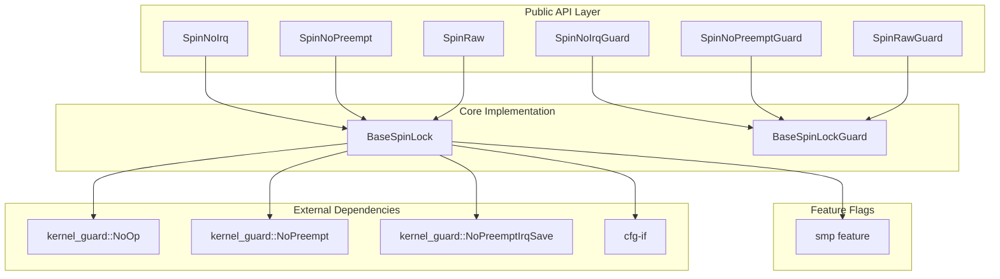
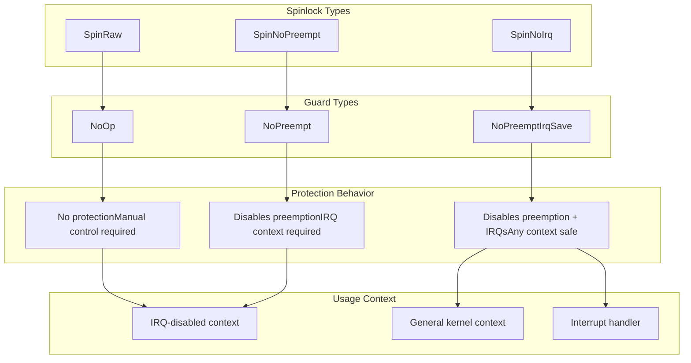
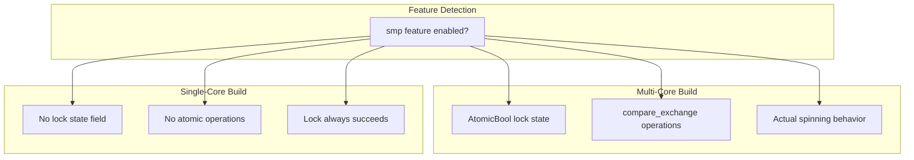

# Overview

> **Relevant source files**
> * [Cargo.toml](https://github.com/arceos-org/kspin/blob/dfc0ff2c/Cargo.toml)
> * [README.md](https://github.com/arceos-org/kspin/blob/dfc0ff2c/README.md)
> * [src/lib.rs](https://github.com/arceos-org/kspin/blob/dfc0ff2c/src/lib.rs)

The `kspin` crate provides kernel-space spinlock implementations with configurable protection levels for the ArceOS operating system ecosystem. This library offers three distinct spinlock types that control interrupt and preemption states during critical sections, enabling safe concurrent access to shared data in kernel environments.

This document covers the fundamental architecture, protection mechanisms, and usage patterns of the `kspin` crate. For detailed implementation specifics of the core spinlock logic, see [Core Implementation Architecture](/arceos-org/kspin/3-core-implementation-architecture). For usage guidelines and safety considerations, see [Usage Guidelines and Safety](/arceos-org/kspin/2.4-usage-guidelines-and-safety).

## System Architecture

The `kspin` crate implements a layered architecture where specialized spinlock types are built upon a generic `BaseSpinLock` foundation. The system integrates with the `kernel_guard` crate to provide different levels of protection through compile-time type safety.

**Component Architecture**

Sources: [src/lib.rs(L1 - L37)&emsp;](https://github.com/arceos-org/kspin/blob/dfc0ff2c/src/lib.rs#L1-L37) [Cargo.toml(L19 - L21)&emsp;](https://github.com/arceos-org/kspin/blob/dfc0ff2c/Cargo.toml#L19-L21) [Cargo.toml(L14 - L17)&emsp;](https://github.com/arceos-org/kspin/blob/dfc0ff2c/Cargo.toml#L14-L17)

## Protection Level Hierarchy

The `kspin` crate provides three protection levels, each corresponding to different kernel execution contexts and safety requirements. The protection levels are implemented through type aliases that parameterize the generic `BaseSpinLock` with specific guard types.

**Protection Levels and Guard Mapping**

Sources: [src/lib.rs(L10 - L36)&emsp;](https://github.com/arceos-org/kspin/blob/dfc0ff2c/src/lib.rs#L10-L36) [README.md(L16 - L33)&emsp;](https://github.com/arceos-org/kspin/blob/dfc0ff2c/README.md#L16-L33)

## Key Design Principles

|Principle|Implementation|Benefit|
| --- | --- | --- |
|Type Safety|Guard types encode protection requirements|Compile-time prevention of misuse|
|RAII Pattern|BaseSpinLockGuardensures cleanup|Automatic lock release on scope exit|
|Zero-Cost Abstraction|smpfeature eliminates overhead|Single-core optimization|
|Flexible Protection|Three distinct protection levels|Context-appropriate safety|

The crate follows a **compile-time optimization strategy** where the `smp` feature flag controls whether actual atomic operations are generated. In single-core environments, the lock state is optimized away entirely, reducing the spinlock to a simple guard management system.

Sources: [Cargo.toml(L14 - L17)&emsp;](https://github.com/arceos-org/kspin/blob/dfc0ff2c/Cargo.toml#L14-L17) [README.md(L12)&emsp;](https://github.com/arceos-org/kspin/blob/dfc0ff2c/README.md#L12-L12)

## Integration with ArceOS Ecosystem

The `kspin` crate serves as a foundational synchronization primitive within the ArceOS operating system project. It provides the kernel-level locking mechanisms required for:

* **Memory management subsystems** requiring atomic access to page tables and allocation structures
* **Device driver frameworks** needing interrupt-safe critical sections
* **Scheduler components** protecting task queues and scheduling state
* **File system implementations** ensuring metadata consistency

The library's design emphasizes **kernel-space usage** through its dependency on `kernel_guard`, which provides the underlying preemption and interrupt control mechanisms. The three-tier protection model allows different kernel subsystems to choose the appropriate level of protection based on their execution context requirements.

Sources: [Cargo.toml(L6)&emsp;](https://github.com/arceos-org/kspin/blob/dfc0ff2c/Cargo.toml#L6-L6) [Cargo.toml(L8)&emsp;](https://github.com/arceos-org/kspin/blob/dfc0ff2c/Cargo.toml#L8-L8) [src/lib.rs(L6)&emsp;](https://github.com/arceos-org/kspin/blob/dfc0ff2c/src/lib.rs#L6-L6)

## Compilation Model

The `kspin` crate uses conditional compilation to adapt its behavior based on target environment characteristics:

This compilation strategy ensures that embedded and single-core kernel environments receive fully optimized code with no synchronization overhead, while multi-core systems get the full atomic operation implementation required for correct concurrent behavior.

Sources: [README.md(L12)&emsp;](https://github.com/arceos-org/kspin/blob/dfc0ff2c/README.md#L12-L12) [Cargo.toml(L15 - L16)&emsp;](https://github.com/arceos-org/kspin/blob/dfc0ff2c/Cargo.toml#L15-L16)