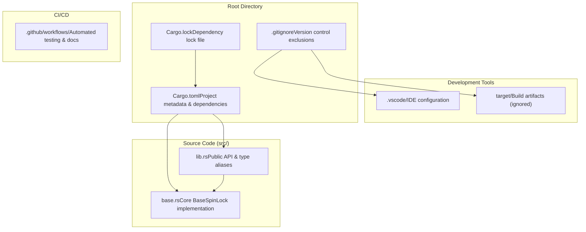
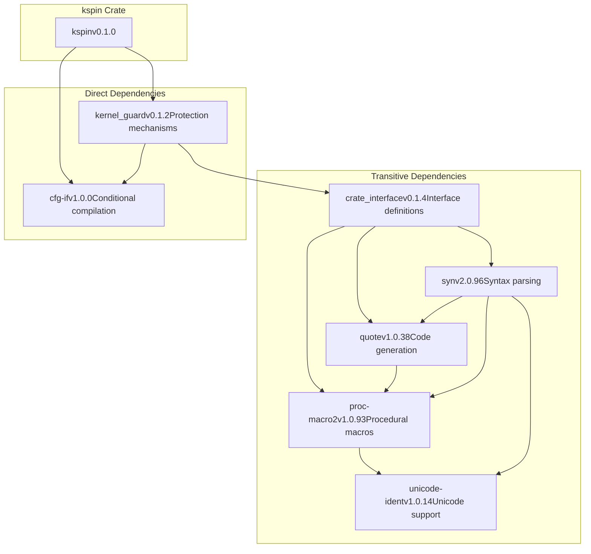
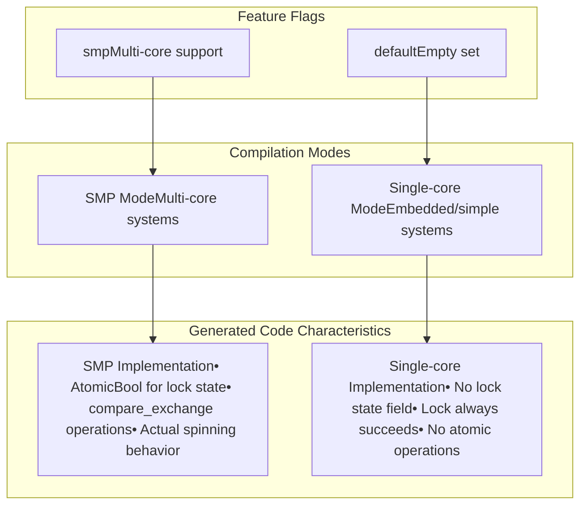
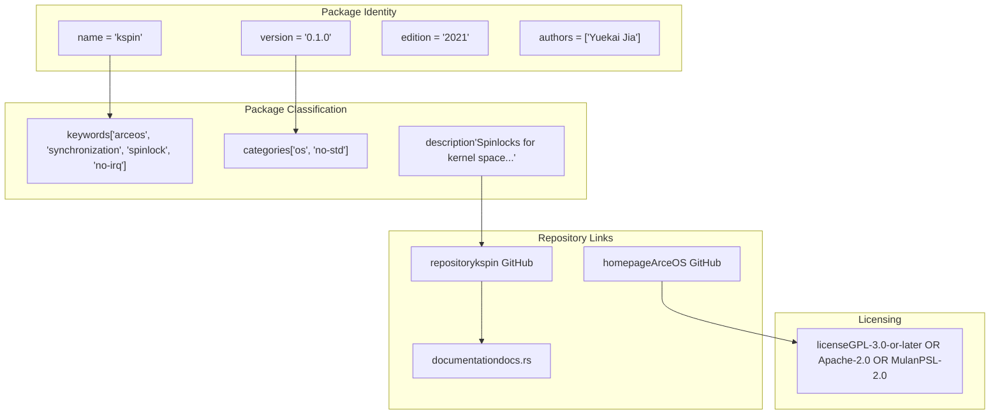

# Project Structure and Dependencies

> **Relevant source files**
> * [.gitignore](https://github.com/arceos-org/kspin/blob/dfc0ff2c/.gitignore)
> * [Cargo.lock](https://github.com/arceos-org/kspin/blob/dfc0ff2c/Cargo.lock)
> * [Cargo.toml](https://github.com/arceos-org/kspin/blob/dfc0ff2c/Cargo.toml)

This document describes the organizational structure of the kspin crate, including its file layout, external dependencies, and build configuration. It covers the project's dependency management, feature flag system, and how the crate is organized to support different compilation targets.

For detailed information about the specific spinlock types and their usage, see [Spinlock Types and Public API](/arceos-org/kspin/2-spinlock-types-and-public-api). For implementation details of the core architecture, see [Core Implementation Architecture](/arceos-org/kspin/3-core-implementation-architecture).

## File Structure Overview

The kspin crate follows a minimal but well-organized structure typical of focused Rust libraries. The project consists of core source files, build configuration, and development tooling.

### Project File Organization

**Sources:** [Cargo.toml(L1 - L22)&emsp;](https://github.com/arceos-org/kspin/blob/dfc0ff2c/Cargo.toml#L1-L22) [.gitignore(L1 - L4)&emsp;](https://github.com/arceos-org/kspin/blob/dfc0ff2c/.gitignore#L1-L4) [Cargo.lock(L1 - L74)&emsp;](https://github.com/arceos-org/kspin/blob/dfc0ff2c/Cargo.lock#L1-L74)

### Source File Responsibilities

|File|Purpose|Key Components|
| --- | --- | --- |
|src/lib.rs|Public API surface|SpinRaw,SpinNoPreempt,SpinNoIrqtype aliases|
|src/base.rs|Core implementation|BaseSpinLock,BaseSpinLockGuard,BaseGuardtrait|

The crate deliberately maintains a minimal file structure with only two source files, emphasizing simplicity and focused functionality.

**Sources:** [Cargo.toml(L1 - L22)&emsp;](https://github.com/arceos-org/kspin/blob/dfc0ff2c/Cargo.toml#L1-L22)

## External Dependencies

The kspin crate has a carefully curated set of external dependencies that provide essential functionality for kernel-space synchronization and conditional compilation.

### Direct Dependencies

**Sources:** [Cargo.toml(L19 - L21)&emsp;](https://github.com/arceos-org/kspin/blob/dfc0ff2c/Cargo.toml#L19-L21) [Cargo.lock(L5 - L74)&emsp;](https://github.com/arceos-org/kspin/blob/dfc0ff2c/Cargo.lock#L5-L74)

### Dependency Roles

|Crate|Version|Purpose|Usage in kspin|
| --- | --- | --- | --- |
|cfg-if|1.0.0|Conditional compilation utilities|Enables SMP vs single-core optimizations|
|kernel_guard|0.1.2|Kernel protection mechanisms|ProvidesNoOp,NoPreempt,NoPreemptIrqSaveguards|

The `kernel_guard` crate is the primary external dependency, providing the guard types that implement different protection levels. The `cfg-if` crate enables clean conditional compilation based on feature flags.

**Sources:** [Cargo.toml(L20 - L21)&emsp;](https://github.com/arceos-org/kspin/blob/dfc0ff2c/Cargo.toml#L20-L21) [Cargo.lock(L23 - L30)&emsp;](https://github.com/arceos-org/kspin/blob/dfc0ff2c/Cargo.lock#L23-L30)

## Feature Configuration

The kspin crate uses Cargo feature flags to enable compile-time optimization for different target environments, particularly distinguishing between single-core and multi-core systems.

### Feature Flag System

**Sources:** [Cargo.toml(L14 - L17)&emsp;](https://github.com/arceos-org/kspin/blob/dfc0ff2c/Cargo.toml#L14-L17)

### Feature Flag Details

|Feature|Default|Description|Impact|
| --- | --- | --- | --- |
|smp|No|Enable multi-core support|Adds atomic operations and actual lock state|
|default|Yes|Default feature set (empty)|Optimized for single-core environments|

The feature system allows the same codebase to generate dramatically different implementations:

* **Without `smp`**: Lock operations are compile-time no-ops, eliminating all atomic overhead
* **With `smp`**: Full atomic spinlock implementation with proper memory ordering

**Sources:** [Cargo.toml(L14 - L17)&emsp;](https://github.com/arceos-org/kspin/blob/dfc0ff2c/Cargo.toml#L14-L17)

## Build System Organization

The project follows standard Rust crate conventions with specific configurations for kernel-space development and multi-platform support.

### Package Metadata Configuration

**Sources:** [Cargo.toml(L1 - L12)&emsp;](https://github.com/arceos-org/kspin/blob/dfc0ff2c/Cargo.toml#L1-L12)

### Development Environment Setup

The project includes configuration for common development tools:

|Tool|Configuration|Purpose|
| --- | --- | --- |
|Git|.gitignoreexcludes/target,/.vscode,.DS_Store|Clean repository state|
|VS Code|.vscode/directory (ignored)|IDE-specific settings|
|Cargo|Cargo.lockcommitted|Reproducible builds|

The `.gitignore` configuration ensures that build artifacts and IDE-specific files don't pollute the repository, while the committed `Cargo.lock` file ensures reproducible builds across different environments.

**Sources:** [.gitignore(L1 - L4)&emsp;](https://github.com/arceos-org/kspin/blob/dfc0ff2c/.gitignore#L1-L4) [Cargo.lock(L1 - L4)&emsp;](https://github.com/arceos-org/kspin/blob/dfc0ff2c/Cargo.lock#L1-L4)