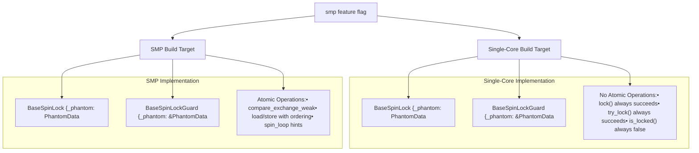
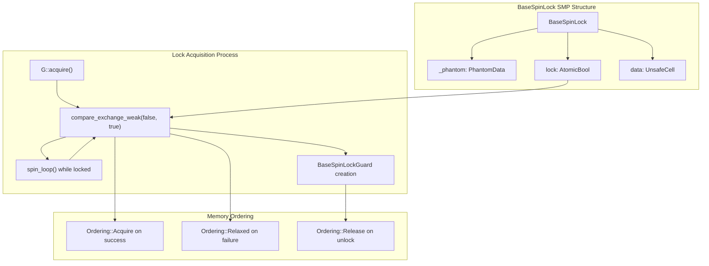
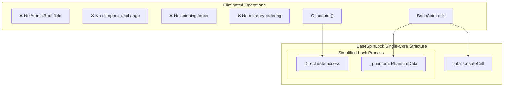
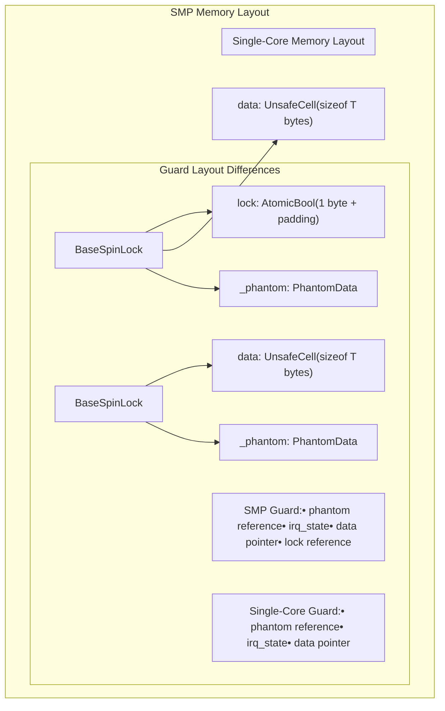

# SMP vs Single-Core Implementation

> **Relevant source files**
> * [Cargo.toml](https://github.com/arceos-org/kspin/blob/dfc0ff2c/Cargo.toml)
> * [src/base.rs](https://github.com/arceos-org/kspin/blob/dfc0ff2c/src/base.rs)

## Purpose and Scope

This document explains how the kspin crate uses feature flags to provide dramatically different implementations for multi-core (SMP) and single-core environments. The `smp` feature flag enables compile-time optimization that completely eliminates atomic operations and lock state when they are unnecessary in single-core systems.

For details about the underlying `BaseSpinLock` structure, see [BaseSpinLock and BaseSpinLockGuard](/arceos-org/kspin/3.1-basespinlock-and-basespinlockguard). For information about how different guard types interact with both implementations, see [BaseGuard Trait System](/arceos-org/kspin/3.2-baseguard-trait-system). For technical details about atomic operations used in SMP mode, see [Memory Ordering and Atomic Operations](/arceos-org/kspin/3.4-memory-ordering-and-atomic-operations).

## Feature Flag Architecture

The kspin crate uses conditional compilation through the `smp` feature flag to generate entirely different code paths for multi-core and single-core environments. This approach enables zero-cost abstractions where single-core systems pay no performance penalty for multi-core synchronization primitives.

**Conditional Compilation Flow**



Sources: [Cargo.toml(L14 - L16)&emsp;](https://github.com/arceos-org/kspin/blob/dfc0ff2c/Cargo.toml#L14-L16) [src/base.rs(L13 - L14)&emsp;](https://github.com/arceos-org/kspin/blob/dfc0ff2c/src/base.rs#L13-L14) [src/base.rs(L29 - L31)&emsp;](https://github.com/arceos-org/kspin/blob/dfc0ff2c/src/base.rs#L29-L31) [src/base.rs(L41 - L43)&emsp;](https://github.com/arceos-org/kspin/blob/dfc0ff2c/src/base.rs#L41-L43)

## SMP Implementation Details

In SMP environments, the `BaseSpinLock` maintains actual lock state using atomic operations to coordinate between multiple CPU cores. The implementation provides true mutual exclusion through hardware-level atomic instructions.

**SMP Lock Structure and Operations**



The SMP implementation uses a two-phase locking strategy:

1. **Guard Acquisition**: First acquires the protection guard (disabling preemption/IRQs)
2. **Atomic Lock**: Then attempts to acquire the atomic lock using compare-and-swap operations

**Key SMP Code Paths**:

* Lock acquisition with spinning: [src/base.rs(L79 - L93)&emsp;](https://github.com/arceos-org/kspin/blob/dfc0ff2c/src/base.rs#L79-L93)
* Try-lock with strong compare-exchange: [src/base.rs(L126 - L132)&emsp;](https://github.com/arceos-org/kspin/blob/dfc0ff2c/src/base.rs#L126-L132)
* Lock status checking: [src/base.rs(L112 - L113)&emsp;](https://github.com/arceos-org/kspin/blob/dfc0ff2c/src/base.rs#L112-L113)
* Force unlock operation: [src/base.rs(L160 - L161)&emsp;](https://github.com/arceos-org/kspin/blob/dfc0ff2c/src/base.rs#L160-L161)

Sources: [src/base.rs(L27 - L32)&emsp;](https://github.com/arceos-org/kspin/blob/dfc0ff2c/src/base.rs#L27-L32) [src/base.rs(L77 - L101)&emsp;](https://github.com/arceos-org/kspin/blob/dfc0ff2c/src/base.rs#L77-L101) [src/base.rs(L122 - L149)&emsp;](https://github.com/arceos-org/kspin/blob/dfc0ff2c/src/base.rs#L122-L149) [src/base.rs(L159 - L162)&emsp;](https://github.com/arceos-org/kspin/blob/dfc0ff2c/src/base.rs#L159-L162)

## Single-Core Implementation Details

In single-core environments, the `BaseSpinLock` completely eliminates the atomic lock state. Since only one CPU core exists, proper guard acquisition (disabling preemption/IRQs) provides sufficient mutual exclusion without any atomic operations.

**Single-Core Optimization Strategy**



**Single-Core Behavior**:

* `lock()` always succeeds immediately after guard acquisition
* `try_lock()` always returns `Some(guard)`
* `is_locked()` always returns `false`
* `force_unlock()` performs no atomic operations

**Key Single-Core Code Paths**:

* Simplified lock acquisition: [src/base.rs(L94 - L101)&emsp;](https://github.com/arceos-org/kspin/blob/dfc0ff2c/src/base.rs#L94-L101)
* Always-successful try-lock: [src/base.rs(L134 - L135)&emsp;](https://github.com/arceos-org/kspin/blob/dfc0ff2c/src/base.rs#L134-L135)
* Always-false lock status: [src/base.rs(L114 - L115)&emsp;](https://github.com/arceos-org/kspin/blob/dfc0ff2c/src/base.rs#L114-L115)
* No-op force unlock: [src/base.rs(L159 - L162)&emsp;](https://github.com/arceos-org/kspin/blob/dfc0ff2c/src/base.rs#L159-L162)

Sources: [src/base.rs(L25 - L26)&emsp;](https://github.com/arceos-org/kspin/blob/dfc0ff2c/src/base.rs#L25-L26) [src/base.rs(L133 - L135)&emsp;](https://github.com/arceos-org/kspin/blob/dfc0ff2c/src/base.rs#L133-L135) [src/base.rs(L114 - L116)&emsp;](https://github.com/arceos-org/kspin/blob/dfc0ff2c/src/base.rs#L114-L116)

## Compile-Time Optimization Benefits

The feature flag approach provides significant performance and size benefits for single-core targets by eliminating unnecessary code at compile time.

**Performance Comparison**

|Operation|SMP Implementation|Single-Core Implementation|
| --- | --- | --- |
|Lock Acquisition|Guard + Atomic CAS loop|Guard only|
|Try Lock|Guard + Atomic CAS|Guard only|
|Lock Check|Atomic load|Constantfalse|
|Unlock|Atomic store + Guard release|Guard release only|
|Memory Usage|+1AtomicBoolper lock|No additional fields|
|Code Size|Full atomic operation codegen|Optimized away|

**Optimization Mechanisms**

```

```

Sources: [src/base.rs(L111 - L117)&emsp;](https://github.com/arceos-org/kspin/blob/dfc0ff2c/src/base.rs#L111-L117) [src/base.rs(L125 - L136)&emsp;](https://github.com/arceos-org/kspin/blob/dfc0ff2c/src/base.rs#L125-L136) [Cargo.toml(L14 - L16)&emsp;](https://github.com/arceos-org/kspin/blob/dfc0ff2c/Cargo.toml#L14-L16)

## Code Generation Differences

The conditional compilation results in fundamentally different assembly code generation for the two target environments.

**Structure Layout Differences**



**Function Implementation Differences**

The same function signatures produce completely different implementations:

* **`lock()` method**: SMP version includes spinning loop [src/base.rs(L83 - L92)&emsp;](https://github.com/arceos-org/kspin/blob/dfc0ff2c/src/base.rs#L83-L92) single-core version skips directly to guard creation [src/base.rs(L94 - L101)&emsp;](https://github.com/arceos-org/kspin/blob/dfc0ff2c/src/base.rs#L94-L101)
* **`try_lock()` method**: SMP version uses atomic compare-exchange [src/base.rs(L129 - L132)&emsp;](https://github.com/arceos-org/kspin/blob/dfc0ff2c/src/base.rs#L129-L132) single-core version sets `is_unlocked = true` [src/base.rs(L134)&emsp;](https://github.com/arceos-org/kspin/blob/dfc0ff2c/src/base.rs#L134-L134)
* **`is_locked()` method**: SMP version loads atomic state [src/base.rs(L113)&emsp;](https://github.com/arceos-org/kspin/blob/dfc0ff2c/src/base.rs#L113-L113) single-core version returns constant `false` [src/base.rs(L115)&emsp;](https://github.com/arceos-org/kspin/blob/dfc0ff2c/src/base.rs#L115-L115)

This design ensures that single-core embedded systems receive highly optimized code while SMP systems get full multi-core safety guarantees.

Sources: [src/base.rs(L27 - L32)&emsp;](https://github.com/arceos-org/kspin/blob/dfc0ff2c/src/base.rs#L27-L32) [src/base.rs(L37 - L43)&emsp;](https://github.com/arceos-org/kspin/blob/dfc0ff2c/src/base.rs#L37-L43) [src/base.rs(L52 - L59)&emsp;](https://github.com/arceos-org/kspin/blob/dfc0ff2c/src/base.rs#L52-L59) [src/base.rs(L77 - L149)&emsp;](https://github.com/arceos-org/kspin/blob/dfc0ff2c/src/base.rs#L77-L149) [src/base.rs(L218 - L226)&emsp;](https://github.com/arceos-org/kspin/blob/dfc0ff2c/src/base.rs#L218-L226)