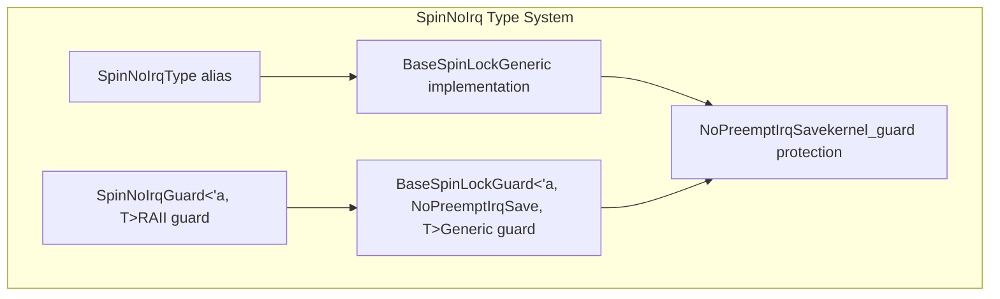
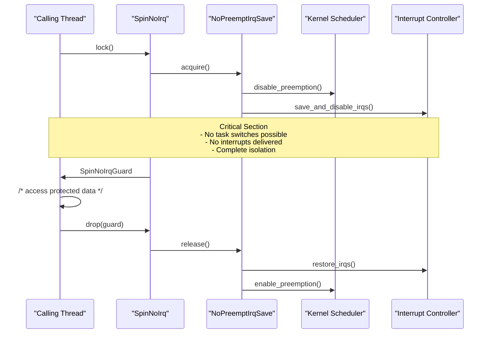
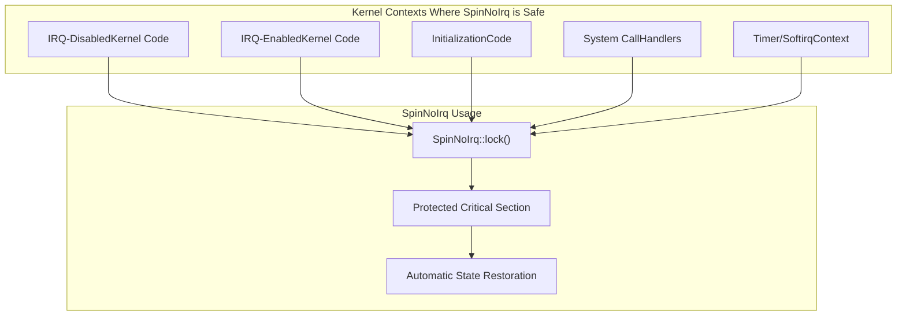
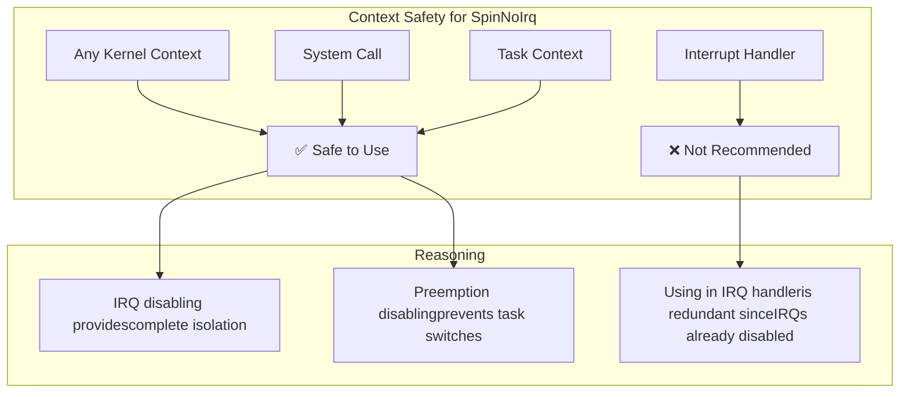
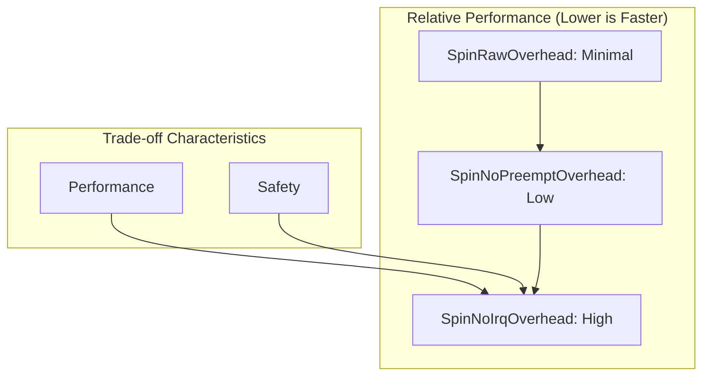
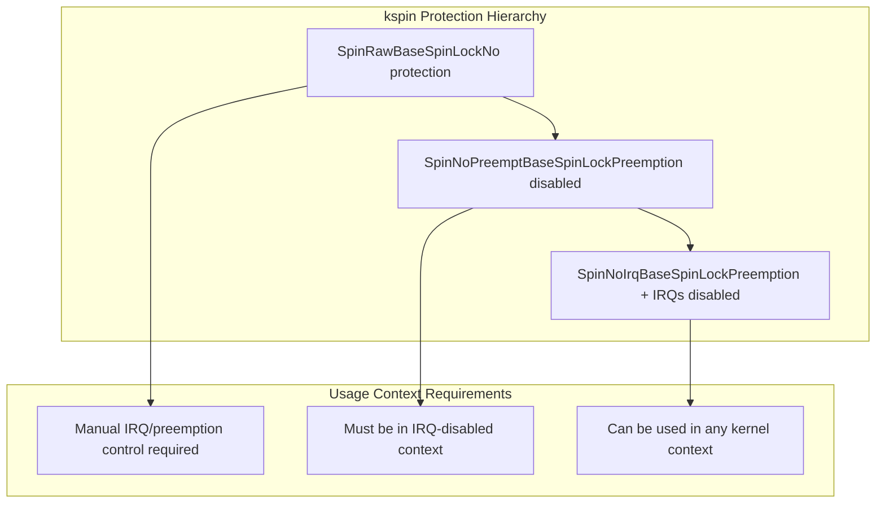

# SpinNoIrq

> **Relevant source files**
> * [README.md](https://github.com/arceos-org/kspin/blob/dfc0ff2c/README.md)
> * [src/lib.rs](https://github.com/arceos-org/kspin/blob/dfc0ff2c/src/lib.rs)

`SpinNoIrq` is the full-protection spinlock implementation in the kspin crate that provides maximum safety by disabling both kernel preemption and local interrupts during lock acquisition and critical sections. This is the safest but most performance-intensive spinlock variant, designed for use in IRQ-enabled contexts where complete isolation is required.

For information about lighter-weight spinlock variants, see [SpinRaw](/arceos-org/kspin/2.1-spinraw) and [SpinNoPreempt](/arceos-org/kspin/2.2-spinnopreempt). For comprehensive usage guidelines across all spinlock types, see [Usage Guidelines and Safety](/arceos-org/kspin/2.4-usage-guidelines-and-safety).

## Type Definition and Core Components

`SpinNoIrq` is implemented as a type alias that specializes the generic `BaseSpinLock` with the `NoPreemptIrqSave` guard type from the `kernel_guard` crate.

The core type definitions establish the relationship between the public API and the underlying implementation:

|Component|Definition|Purpose|
| --- | --- | --- |
|SpinNoIrq<T>|BaseSpinLock<NoPreemptIrqSave, T>|Main spinlock type for data of typeT|
|SpinNoIrqGuard<'a, T>|BaseSpinLockGuard<'a, NoPreemptIrqSave, T>|RAII guard providing mutable access to protected data|

Sources: [src/lib.rs(L24 - L27)&emsp;](https://github.com/arceos-org/kspin/blob/dfc0ff2c/src/lib.rs#L24-L27)

## Protection Mechanism

`SpinNoIrq` implements a dual-protection mechanism that addresses both concurrency sources in kernel environments: task preemption and interrupt handling.

The protection mechanism operates through the `NoPreemptIrqSave` guard which:

1. **Disables Preemption**: Prevents the kernel scheduler from switching to other tasks
2. **Saves and Disables IRQs**: Stores current interrupt state and disables local interrupts
3. **Provides Restoration**: Automatically restores the previous state when the guard is dropped

Sources: [src/lib.rs(L20 - L23)&emsp;](https://github.com/arceos-org/kspin/blob/dfc0ff2c/src/lib.rs#L20-L23)

## Usage Patterns

`SpinNoIrq` is designed for scenarios requiring complete protection and can be safely used in any kernel context.

### Safe Contexts

### Typical Usage Pattern

The standard usage follows the RAII pattern where the guard automatically manages protection state:

|Operation|Effect|Automatic Behavior|
| --- | --- | --- |
|SpinNoIrq::new(data)|Creates protected spinlock|None|
|lock.lock()|Acquires lock|Disables preemption + IRQs|
|Guard in scope|Access to protected data|Maintains protection|
|drop(guard)|Releases lock|Restores preemption + IRQ state|

Sources: [README.md(L29 - L33)&emsp;](https://github.com/arceos-org/kspin/blob/dfc0ff2c/README.md#L29-L33)

## Safety Guarantees

`SpinNoIrq` provides the strongest safety guarantees among all spinlock variants in the kspin crate.

### Protection Matrix

|Threat Vector|SpinNoIrq Protection|Mechanism|
| --- | --- | --- |
|Task Preemption|✅ Complete Protection|NoPreemptcomponent disables scheduler|
|Hardware Interrupts|✅ Complete Protection|IrqSavecomponent disables IRQs|
|Nested Lock Acquisition|✅ Deadlock Prevention|IRQ disabling prevents interrupt-based nesting|
|Data Race Conditions|✅ Mutual Exclusion|Atomic lock state + protection barriers|

### Context Safety Analysis

Sources: [src/lib.rs(L20 - L23)&emsp;](https://github.com/arceos-org/kspin/blob/dfc0ff2c/src/lib.rs#L20-L23)

## Performance Considerations

`SpinNoIrq` trades performance for safety, making it the most expensive but safest option.

### Performance Impact Analysis

|Aspect|Impact Level|Details|
| --- | --- | --- |
|Lock Acquisition Overhead|High|IRQ save/restore + preemption control|
|Critical Section Latency|Highest|No interrupts can be serviced|
|System Responsiveness|Significant|Delayed interrupt handling|
|Throughput Impact|Moderate|Depends on critical section duration|

### Performance Comparison

Sources: [src/lib.rs(L20 - L27)&emsp;](https://github.com/arceos-org/kspin/blob/dfc0ff2c/src/lib.rs#L20-L27)

## Relationship to Other Spinlock Types

`SpinNoIrq` sits at the top of the protection hierarchy, providing comprehensive safety at the cost of performance.

### Spinlock Hierarchy

### Selection Criteria

|Scenario|Recommended Type|Rationale|
| --- | --- | --- |
|General kernel code|SpinNoIrq|Maximum safety, acceptable overhead|
|Performance-critical paths with manual control|SpinRaw|Minimal overhead when protection already handled|
|IRQ-disabled contexts|SpinNoPreempt|Balanced protection without redundant IRQ control|
|Uncertain context or shared between contexts|SpinNoIrq|Safe default choice|

Sources: [src/lib.rs(L10 - L36)&emsp;](https://github.com/arceos-org/kspin/blob/dfc0ff2c/src/lib.rs#L10-L36) [README.md(L16 - L33)&emsp;](https://github.com/arceos-org/kspin/blob/dfc0ff2c/README.md#L16-L33)