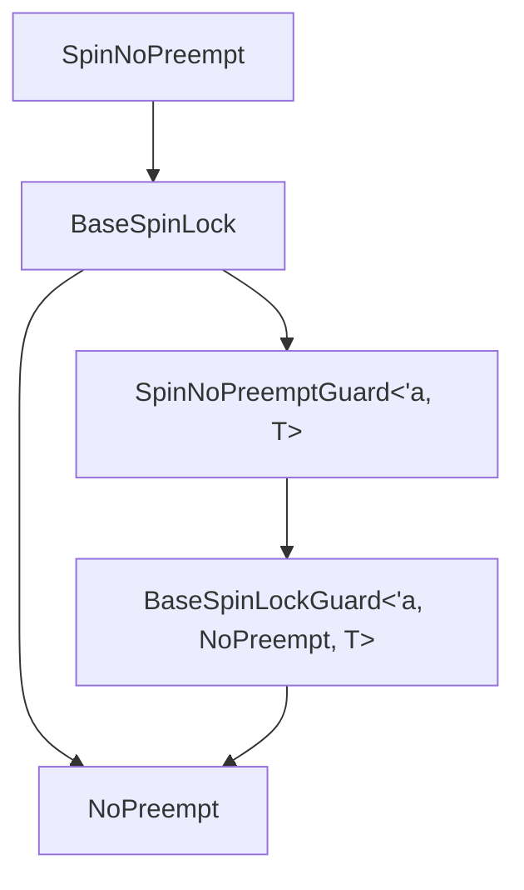
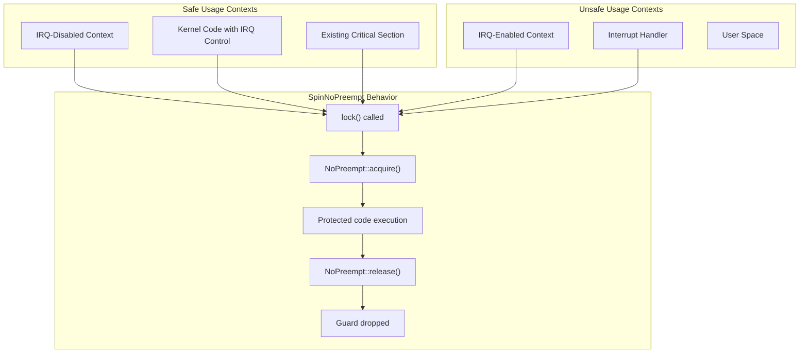
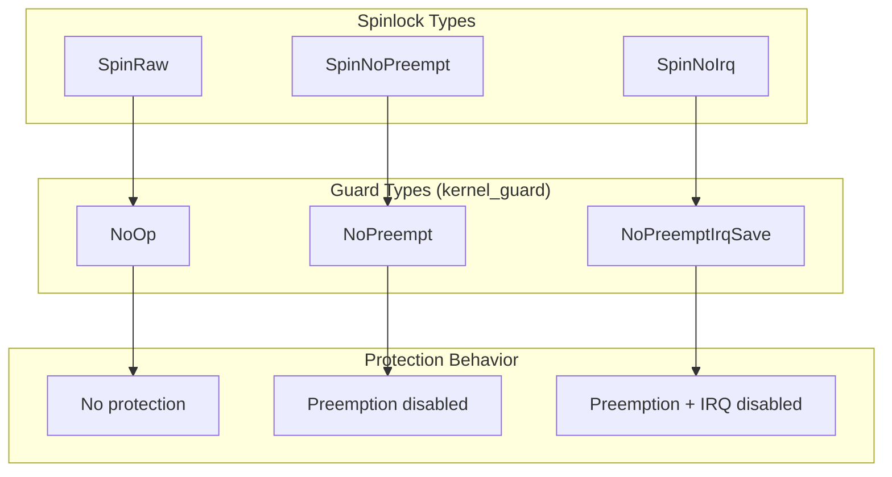

# SpinNoPreempt

> **Relevant source files**
> * [README.md](https://github.com/arceos-org/kspin/blob/dfc0ff2c/README.md)
> * [src/lib.rs](https://github.com/arceos-org/kspin/blob/dfc0ff2c/src/lib.rs)

This document describes the `SpinNoPreempt` spinlock type, which provides kernel-space synchronization by disabling preemption during critical sections. This spinlock offers a balanced approach between performance and safety, suitable for IRQ-disabled contexts where preemption control is necessary but interrupt masking is already handled externally.

For information about the raw spinlock without protection mechanisms, see [SpinRaw](/arceos-org/kspin/2.1-spinraw). For the full-protection spinlock that also disables IRQs, see [SpinNoIrq](/arceos-org/kspin/2.3-spinnoirq). For comprehensive usage guidelines across all spinlock types, see [Usage Guidelines and Safety](/arceos-org/kspin/2.4-usage-guidelines-and-safety).

## Type Definition and Core Components

`SpinNoPreempt<T>` is implemented as a type alias that combines the generic `BaseSpinLock` with the `NoPreempt` guard type from the `kernel_guard` crate. This composition provides preemption-disabled synchronization while maintaining type safety and RAII semantics.

### Type Composition Diagram



Sources: [src/lib.rs(L15 - L18)&emsp;](https://github.com/arceos-org/kspin/blob/dfc0ff2c/src/lib.rs#L15-L18)

The key components are:

|Component|Definition|Purpose|
| --- | --- | --- |
|SpinNoPreempt<T>|BaseSpinLock<NoPreempt, T>|Main spinlock type that holds data of typeT|
|SpinNoPreemptGuard<'a, T>|BaseSpinLockGuard<'a, NoPreempt, T>|RAII guard providing mutable access to protected data|
|NoPreempt|Guard type fromkernel_guardcrate|Implements preemption disable/enable behavior|

Sources: [src/lib.rs(L15 - L18)&emsp;](https://github.com/arceos-org/kspin/blob/dfc0ff2c/src/lib.rs#L15-L18) [src/lib.rs(L6)&emsp;](https://github.com/arceos-org/kspin/blob/dfc0ff2c/src/lib.rs#L6-L6)

## Safety Requirements and Usage Context

`SpinNoPreempt` has specific safety requirements that must be understood before use. The spinlock is designed for contexts where IRQ handling is already managed externally, but preemption control is needed for the critical section.

### Safety Context Requirements



Sources: [src/lib.rs(L10 - L14)&emsp;](https://github.com/arceos-org/kspin/blob/dfc0ff2c/src/lib.rs#L10-L14)

### Key Safety Rules

1. **IRQ Context Requirement**: Must be used in local IRQ-disabled context
2. **Interrupt Handler Prohibition**: Never use in interrupt handlers
3. **Preemption Assumption**: Assumes external IRQ management is already in place

The documentation explicitly states: "It must be used in the local IRQ-disabled context, or never be used in interrupt handlers."

Sources: [src/lib.rs(L13 - L14)&emsp;](https://github.com/arceos-org/kspin/blob/dfc0ff2c/src/lib.rs#L13-L14)

## Implementation Architecture

`SpinNoPreempt` leverages the modular architecture of the kspin crate, where the `BaseSpinLock` provides the core spinning logic and the `NoPreempt` guard type defines the protection behavior.

### Lock Acquisition Flow

```

```

Sources: [src/lib.rs(L15)&emsp;](https://github.com/arceos-org/kspin/blob/dfc0ff2c/src/lib.rs#L15-L15) [src/base.rs](https://github.com/arceos-org/kspin/blob/dfc0ff2c/src/base.rs) (referenced via BaseSpinLock usage)

## Comparison with Other Spinlock Types

`SpinNoPreempt` occupies the middle ground in the protection spectrum provided by the kspin crate, offering more protection than `SpinRaw` but less overhead than `SpinNoIrq`.

### Protection Level Comparison

|Spinlock Type|Preemption Control|IRQ Control|Usage Context|Performance|
| --- | --- | --- | --- | --- |
|SpinRaw<T>|None|None|IRQ-disabled + preemption-disabled|Fastest|
|SpinNoPreempt<T>|Disabled during lock|Must be externally disabled|IRQ-disabled contexts|Balanced|
|SpinNoIrq<T>|Disabled during lock|Disabled during lock|Any context|Safest but slower|

Sources: [src/lib.rs(L15)&emsp;](https://github.com/arceos-org/kspin/blob/dfc0ff2c/src/lib.rs#L15-L15) [src/lib.rs(L24)&emsp;](https://github.com/arceos-org/kspin/blob/dfc0ff2c/src/lib.rs#L24-L24) [src/lib.rs(L33)&emsp;](https://github.com/arceos-org/kspin/blob/dfc0ff2c/src/lib.rs#L33-L33)

### Guard Type Mapping



Sources: [src/lib.rs(L6)&emsp;](https://github.com/arceos-org/kspin/blob/dfc0ff2c/src/lib.rs#L6-L6) [src/lib.rs(L15)&emsp;](https://github.com/arceos-org/kspin/blob/dfc0ff2c/src/lib.rs#L15-L15) [src/lib.rs(L24)&emsp;](https://github.com/arceos-org/kspin/blob/dfc0ff2c/src/lib.rs#L24-L24) [src/lib.rs(L33)&emsp;](https://github.com/arceos-org/kspin/blob/dfc0ff2c/src/lib.rs#L33-L33)

## Usage Patterns and Examples

The typical usage pattern for `SpinNoPreempt` follows the RAII principle, where the guard automatically manages preemption state during its lifetime.

### Basic Usage Pattern

From the repository examples, the standard pattern is:

```javascript
let data = SpinNoPreempt::new(());
let mut guard = data.lock();
/* critical section, preemption are disabled. */
drop(guard);
```

Sources: [README.md(L24 - L27)&emsp;](https://github.com/arceos-org/kspin/blob/dfc0ff2c/README.md#L24-L27)

### Method Interface

`SpinNoPreempt<T>` inherits all methods from `BaseSpinLock<NoPreempt, T>`, providing the standard spinlock interface:

|Method|Return Type|Purpose|
| --- | --- | --- |
|new(data: T)|Self|Create new spinlock with initial data|
|lock()|SpinNoPreemptGuard<'_, T>|Acquire lock, blocking until available|
|try_lock()|Option<SpinNoPreemptGuard<'_, T>>|Attempt to acquire lock without blocking|

The guard provides:

* Automatic preemption re-enabling on drop
* Mutable access to protected data via `Deref` and `DerefMut`
* Lock release when guard goes out of scope

Sources: [src/lib.rs(L15 - L18)&emsp;](https://github.com/arceos-org/kspin/blob/dfc0ff2c/src/lib.rs#L15-L18) [src/base.rs](https://github.com/arceos-org/kspin/blob/dfc0ff2c/src/base.rs) (inherited interface)