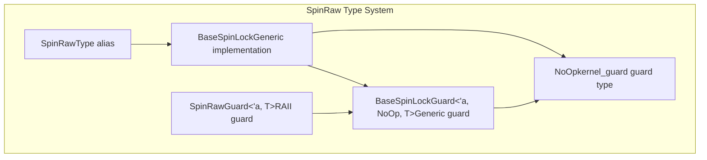
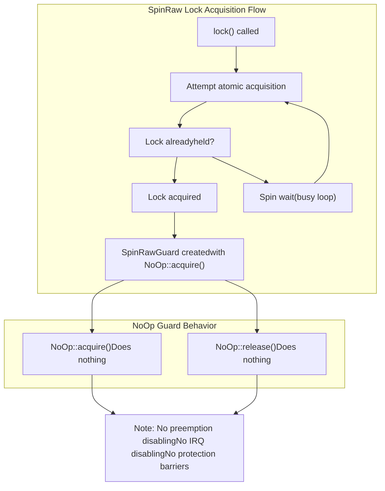
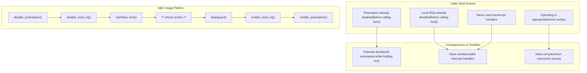
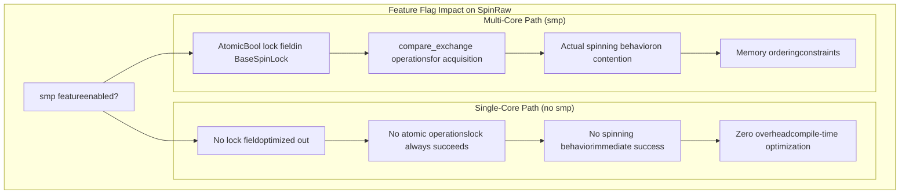
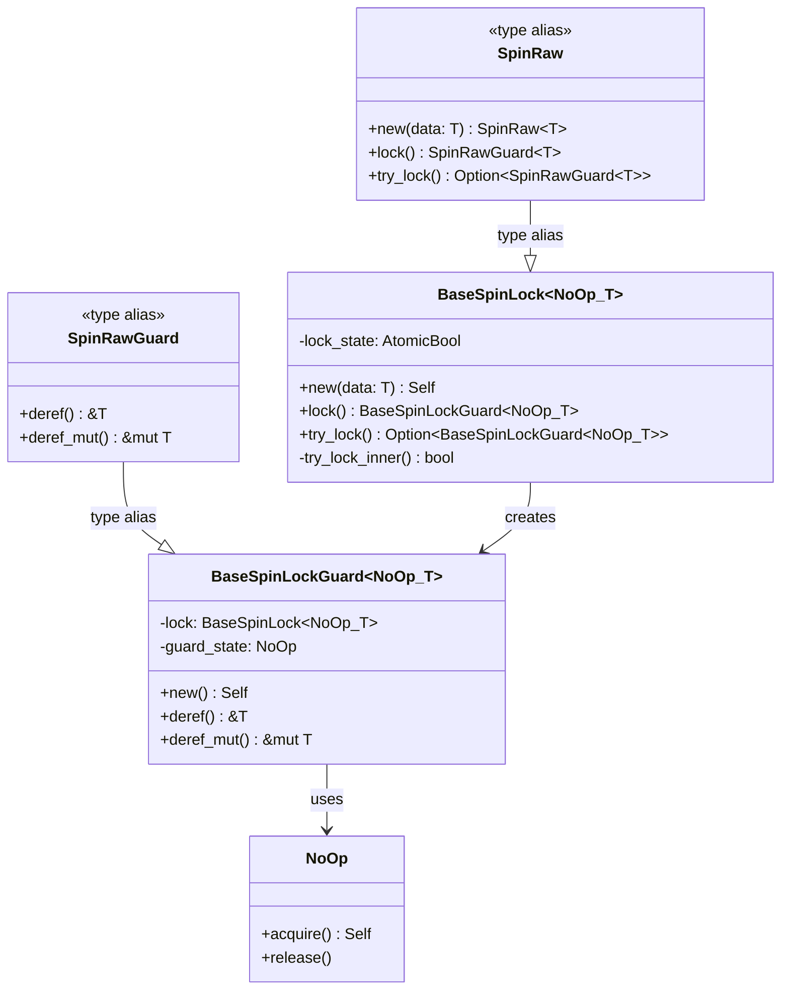

# SpinRaw

> **Relevant source files**
> * [README.md](https://github.com/arceos-org/kspin/blob/dfc0ff2c/README.md)
> * [src/lib.rs](https://github.com/arceos-org/kspin/blob/dfc0ff2c/src/lib.rs)

## Purpose and Scope

This page documents `SpinRaw<T>`, the raw spinlock implementation in the kspin crate that provides no built-in protection mechanisms. `SpinRaw` offers the fastest performance among the three spinlock types but requires manual management of preemption and interrupt state by the caller.

For information about spinlocks with built-in preemption protection, see [SpinNoPreempt](/arceos-org/kspin/2.2-spinnopreempt). For full protection including IRQ disabling, see [SpinNoIrq](/arceos-org/kspin/2.3-spinnoirq). For detailed implementation internals, see [BaseSpinLock and BaseSpinLockGuard](/arceos-org/kspin/3.1-basespinlock-and-basespinlockguard). For comprehensive usage guidelines across all spinlock types, see [Usage Guidelines and Safety](/arceos-org/kspin/2.4-usage-guidelines-and-safety).

## Type Definition and Basic Interface

`SpinRaw<T>` is implemented as a type alias that specializes the generic `BaseSpinLock` with the `NoOp` guard type from the `kernel_guard` crate.

### Core Type Definitions

Sources: [src/lib.rs(L33 - L36)&emsp;](https://github.com/arceos-org/kspin/blob/dfc0ff2c/src/lib.rs#L33-L36)

The `SpinRaw<T>` type provides the standard spinlock interface methods inherited from `BaseSpinLock`:

|Method|Return Type|Description|
| --- | --- | --- |
|new(data: T)|SpinRaw<T>|Creates a new spinlock containing the given data|
|lock()|SpinRawGuard<'_, T>|Acquires the lock, spinning until successful|
|try_lock()|Option<SpinRawGuard<'_, T>>|Attempts to acquire the lock without spinning|

## Protection Behavior and NoOp Guard

The defining characteristic of `SpinRaw` is its use of the `NoOp` guard type, which performs no protection actions during lock acquisition or release.

### Protection Flow Diagram

Sources: [src/lib.rs(L29 - L36)&emsp;](https://github.com/arceos-org/kspin/blob/dfc0ff2c/src/lib.rs#L29-L36) [src/base.rs](https://github.com/arceos-org/kspin/blob/dfc0ff2c/src/base.rs)

Unlike `SpinNoPreempt` and `SpinNoIrq`, the `NoOp` guard performs no system-level protection operations:

* No preemption disabling/enabling
* No interrupt disabling/enabling
* No memory barriers beyond those required for the atomic lock operations

## Safety Requirements and Usage Contexts

`SpinRaw` places the burden of ensuring safe usage entirely on the caller. The lock itself provides only the basic mutual exclusion mechanism without any system-level protections.

### Required Caller Responsibilities

Sources: [src/lib.rs(L31 - L32)&emsp;](https://github.com/arceos-org/kspin/blob/dfc0ff2c/src/lib.rs#L31-L32) [README.md(L19 - L22)&emsp;](https://github.com/arceos-org/kspin/blob/dfc0ff2c/README.md#L19-L22)

## Performance Characteristics

`SpinRaw` offers the highest performance among the three spinlock types due to its minimal overhead approach.

### Performance Comparison

|Spinlock Type|Acquisition Overhead|Release Overhead|Context Switches|
| --- | --- | --- | --- |
|SpinRaw|Atomic operation only|Atomic operation only|Manual control required|
|SpinNoPreempt|Atomic + preemption disable|Atomic + preemption enable|Prevented during lock|
|SpinNoIrq|Atomic + preemption + IRQ disable|Atomic + preemption + IRQ enable|Fully prevented|

### SMP vs Single-Core Behavior

Sources: [README.md(L12)&emsp;](https://github.com/arceos-org/kspin/blob/dfc0ff2c/README.md#L12-L12) [src/base.rs](https://github.com/arceos-org/kspin/blob/dfc0ff2c/src/base.rs)

In single-core environments (without the `smp` feature), `SpinRaw` becomes a zero-cost abstraction since no actual locking is necessary when preemption and interrupts are properly controlled.

## Integration with BaseSpinLock Architecture

`SpinRaw` leverages the generic `BaseSpinLock` implementation while providing no additional protection through its `NoOp` guard parameter.

### Architectural Mapping

Sources: [src/lib.rs(L33 - L36)&emsp;](https://github.com/arceos-org/kspin/blob/dfc0ff2c/src/lib.rs#L33-L36) [src/base.rs](https://github.com/arceos-org/kspin/blob/dfc0ff2c/src/base.rs)

The `SpinRaw` type inherits all functionality from `BaseSpinLock` while the `NoOp` guard ensures minimal overhead by performing no protection operations during the guard's lifetime.