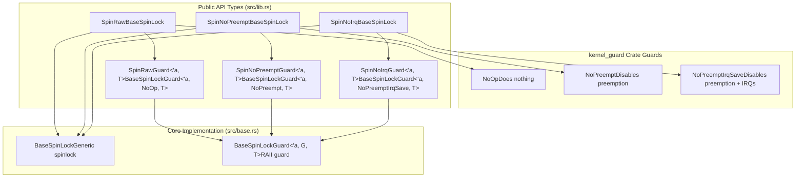
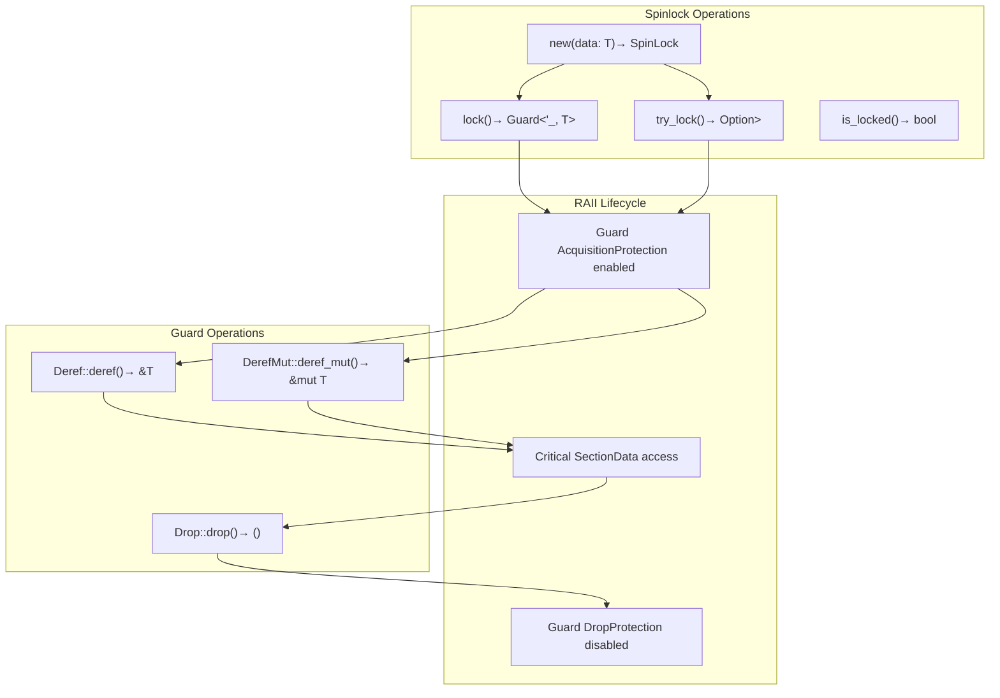

# Spinlock Types and Public API

> **Relevant source files**
> * [README.md](https://github.com/arceos-org/kspin/blob/dfc0ff2c/README.md)
> * [src/lib.rs](https://github.com/arceos-org/kspin/blob/dfc0ff2c/src/lib.rs)

This document covers the three main spinlock types exposed by the kspin crate and their public interface. These types provide different levels of protection suitable for various kernel contexts. For detailed implementation internals, see [Core Implementation Architecture](/arceos-org/kspin/3-core-implementation-architecture). For comprehensive usage guidelines and safety requirements, see [Usage Guidelines and Safety](/arceos-org/kspin/2.4-usage-guidelines-and-safety).

## Spinlock Type Overview

The kspin crate provides three specialized spinlock types, each offering a different balance between performance and protection. All types are implemented as type aliases of the generic `BaseSpinLock` with different guard types from the `kernel_guard` crate.

|Spinlock Type|Guard Type|Protection Level|Use Context|
| --- | --- | --- | --- |
|SpinRaw<T>|NoOp|No protection|Preemption and IRQ-disabled contexts|
|SpinNoPreempt<T>|NoPreempt|Disables preemption|IRQ-disabled contexts|
|SpinNoIrq<T>|NoPreemptIrqSave|Disables preemption + IRQs|Any context|

Sources: [src/lib.rs(L10 - L36)&emsp;](https://github.com/arceos-org/kspin/blob/dfc0ff2c/src/lib.rs#L10-L36)

## Type Hierarchy and Guard Relationships



Sources: [src/lib.rs(L6 - L36)&emsp;](https://github.com/arceos-org/kspin/blob/dfc0ff2c/src/lib.rs#L6-L36)

## Public API Structure



Sources: [src/lib.rs(L8)&emsp;](https://github.com/arceos-org/kspin/blob/dfc0ff2c/src/lib.rs#L8-L8) [README.md(L19 - L32)&emsp;](https://github.com/arceos-org/kspin/blob/dfc0ff2c/README.md#L19-L32)

## Type Definitions and Documentation

### SpinRaw

`SpinRaw<T>` provides the fastest spinlock implementation with no built-in protection mechanisms. It is defined as `BaseSpinLock<NoOp, T>` where the `NoOp` guard performs no protection operations.

**Key Characteristics:**

* Zero protection overhead
* Requires manual IRQ and preemption management
* Must be used in preemption-disabled and IRQ-disabled contexts
* Cannot be used in interrupt handlers

Sources: [src/lib.rs(L29 - L33)&emsp;](https://github.com/arceos-org/kspin/blob/dfc0ff2c/src/lib.rs#L29-L33)

### SpinNoPreempt

`SpinNoPreempt<T>` disables kernel preemption during lock acquisition and critical sections. It is defined as `BaseSpinLock<NoPreempt, T>`.

**Key Characteristics:**

* Automatically disables preemption when acquiring the lock
* Safe from task switching but not from interrupts
* Must be used in IRQ-disabled contexts
* Cannot be used in interrupt handlers

Sources: [src/lib.rs(L10 - L15)&emsp;](https://github.com/arceos-org/kspin/blob/dfc0ff2c/src/lib.rs#L10-L15)

### SpinNoIrq

`SpinNoIrq<T>` provides the highest level of protection by disabling both kernel preemption and local IRQs. It is defined as `BaseSpinLock<NoPreemptIrqSave, T>`.

**Key Characteristics:**

* Disables both preemption and IRQs
* Safe to use in any context including IRQ-enabled environments
* Highest protection overhead but maximum safety
* Can be used in interrupt handlers

Sources: [src/lib.rs(L20 - L24)&emsp;](https://github.com/arceos-org/kspin/blob/dfc0ff2c/src/lib.rs#L20-L24)

## Associated Guard Types

Each spinlock type has a corresponding guard type that implements the RAII pattern:

* `SpinRawGuard<'a, T>` for `SpinRaw<T>`
* `SpinNoPreemptGuard<'a, T>` for `SpinNoPreempt<T>`
* `SpinNoIrqGuard<'a, T>` for `SpinNoIrq<T>`

These guards provide mutable access to the protected data through `Deref` and `DerefMut` implementations, and automatically release the lock when dropped.

Sources: [src/lib.rs(L17 - L18)&emsp;](https://github.com/arceos-org/kspin/blob/dfc0ff2c/src/lib.rs#L17-L18) [src/lib.rs(L26 - L27)&emsp;](https://github.com/arceos-org/kspin/blob/dfc0ff2c/src/lib.rs#L26-L27) [src/lib.rs(L35 - L36)&emsp;](https://github.com/arceos-org/kspin/blob/dfc0ff2c/src/lib.rs#L35-L36)

## Usage Example from Public Documentation

The crate provides standard usage patterns as demonstrated in the README:

```javascript
// Raw spinlock - fastest, requires manual protection
let data = SpinRaw::new(());
let mut guard = data.lock();
/* critical section, does nothing while trying to lock. */
drop(guard);

// Preemption-disabled spinlock
let data = SpinNoPreempt::new(());
let mut guard = data.lock();
/* critical section, preemption are disabled. */
drop(guard);

// Full protection spinlock
let data = SpinNoIrq::new(());
let mut guard = data.lock();
/* critical section, both preemption and IRQs are disabled. */
drop(guard);
```

Sources: [README.md(L16 - L33)&emsp;](https://github.com/arceos-org/kspin/blob/dfc0ff2c/README.md#L16-L33)