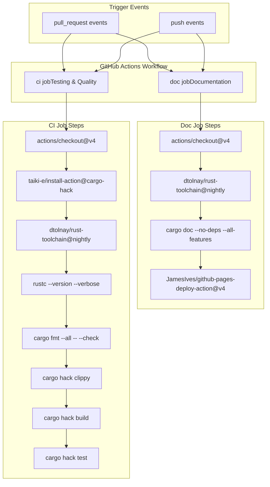
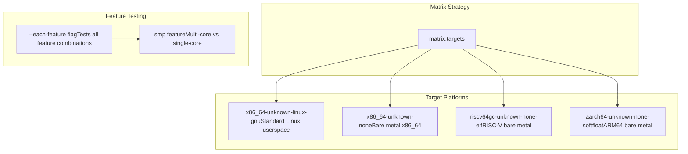
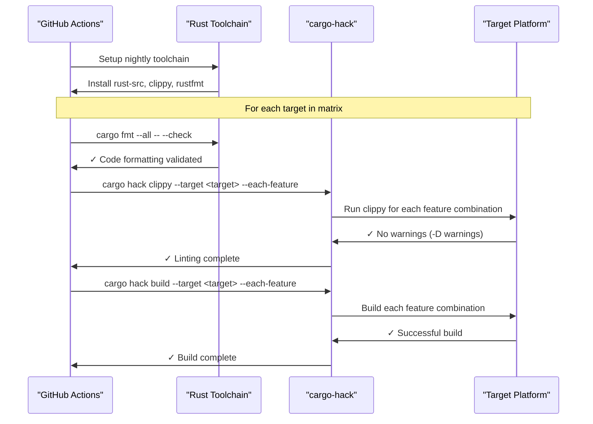
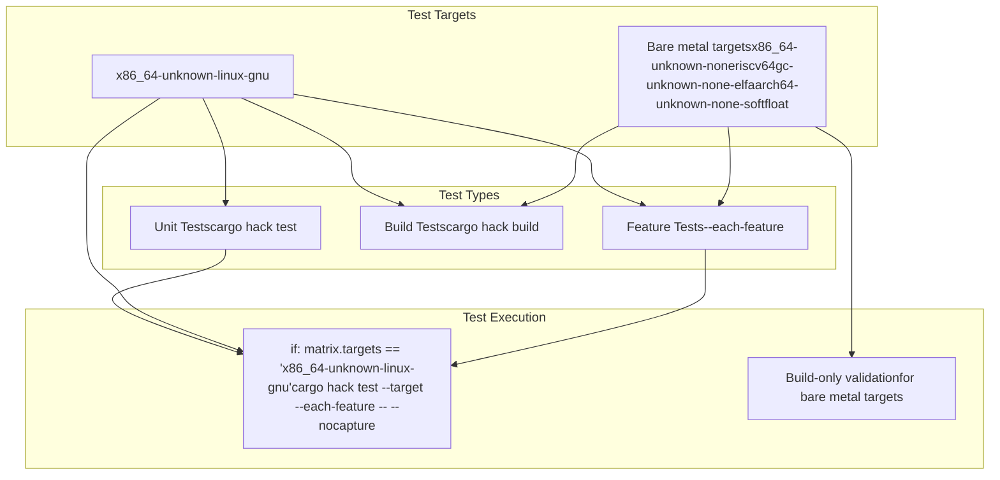
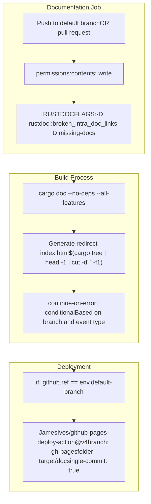

# Testing and CI Pipeline

> **Relevant source files**
> * [.github/workflows/ci.yml](https://github.com/arceos-org/kspin/blob/dfc0ff2c/.github/workflows/ci.yml)

This document covers the automated testing infrastructure and continuous integration setup for the kspin crate. The testing and CI pipeline ensures code quality, compatibility across multiple target platforms, and automated documentation deployment.

For information about manually building the crate and configuring development environments, see [Build System and Feature Flags](/arceos-org/kspin/4.1-build-system-and-feature-flags) and [Development Environment Setup](/arceos-org/kspin/4.3-development-environment-setup).

## CI Pipeline Architecture

The kspin crate uses GitHub Actions for continuous integration, configured through a single workflow file that handles both testing and documentation deployment. The pipeline is designed to validate the crate across multiple embedded and general-purpose target platforms.

**CI Pipeline Overview**

Sources: [.github/workflows/ci.yml(L1 - L57)&emsp;](https://github.com/arceos-org/kspin/blob/dfc0ff2c/.github/workflows/ci.yml#L1-L57)

## Build Matrix Strategy

The CI pipeline uses a matrix build strategy to validate the codebase across multiple target platforms and feature combinations. This ensures compatibility with the diverse environments where kernel spinlocks are typically deployed.

|Component|Configuration|
| --- | --- |
|Runner|ubuntu-latest|
|Rust Toolchain|nightly|
|Required Components|rust-src,clippy,rustfmt|
|Target Platforms|4 targets (see below)|
|Failure Strategy|fail-fast: false|

**Target Platform Matrix**

The `cargo-hack` tool is used with the `--each-feature` flag to test all possible feature combinations across all target platforms, ensuring that feature-conditional compilation works correctly.

Sources: [.github/workflows/ci.yml(L8 - L20)&emsp;](https://github.com/arceos-org/kspin/blob/dfc0ff2c/.github/workflows/ci.yml#L8-L20) [.github/workflows/ci.yml(L26 - L31)&emsp;](https://github.com/arceos-org/kspin/blob/dfc0ff2c/.github/workflows/ci.yml#L26-L31)

## Quality Assurance Pipeline

The CI pipeline enforces code quality through multiple automated checks that must pass before code can be merged.

**Quality Check Sequence**

### Code Formatting

* **Tool**: `cargo fmt`
* **Enforcement**: `--check` flag ensures CI fails if code is not properly formatted
* **Scope**: All files (`--all` flag)

### Linting

* **Tool**: `cargo clippy`
* **Configuration**: Treats all warnings as errors (`-D warnings`)
* **Coverage**: All target platforms and feature combinations
* **Command**: `cargo hack clippy --target ${{ matrix.targets }} --each-feature -- -D warnings`

### Build Validation

* **Tool**: `cargo build` via `cargo-hack`
* **Coverage**: All target platforms and feature combinations
* **Command**: `cargo hack build --target ${{ matrix.targets }} --each-feature`

Sources: [.github/workflows/ci.yml(L24 - L28)&emsp;](https://github.com/arceos-org/kspin/blob/dfc0ff2c/.github/workflows/ci.yml#L24-L28)

## Testing Strategy

The testing approach recognizes the constraints of kernel-space code while maximizing coverage where possible.

**Test Execution Matrix**

### Unit Test Execution

* **Platform Restriction**: Tests only run on `x86_64-unknown-linux-gnu`
* **Rationale**: Bare metal targets cannot execute standard Rust test framework
* **Configuration**: Tests run with `--nocapture` for full output visibility
* **Feature Coverage**: All feature combinations tested via `--each-feature`

### Build-Only Testing

For bare metal targets (`x86_64-unknown-none`, `riscv64gc-unknown-none-elf`, `aarch64-unknown-none-softfloat`), the pipeline performs build-only validation to ensure:

* Code compiles successfully for target architecture
* Feature flags work correctly in no-std environments
* Cross-compilation succeeds without runtime dependencies

Sources: [.github/workflows/ci.yml(L30 - L31)&emsp;](https://github.com/arceos-org/kspin/blob/dfc0ff2c/.github/workflows/ci.yml#L30-L31)

## Documentation Pipeline

The documentation system automatically builds and deploys API documentation to GitHub Pages, ensuring developers always have access to current documentation.

**Documentation Workflow**

### Documentation Quality Enforcement

The documentation build process enforces strict quality standards:

|Setting|Purpose|
| --- | --- |
|-D rustdoc::broken_intra_doc_links|Fails build on broken internal documentation links|
|-D missing-docs|Requires documentation for all public items|
|--no-deps|Builds only crate documentation, not dependencies|
|--all-features|Documents all feature-gated functionality|

### Deployment Strategy

* **Target Branch**: `gh-pages`
* **Deployment Condition**: Only on pushes to the default branch
* **Commit Strategy**: `single-commit: true` keeps deployment history clean
* **Index Generation**: Automatically creates redirect to main crate documentation

Sources: [.github/workflows/ci.yml(L33 - L57)&emsp;](https://github.com/arceos-org/kspin/blob/dfc0ff2c/.github/workflows/ci.yml#L33-L57)

## Pipeline Robustness Features

The CI configuration includes several features designed to maintain pipeline reliability and provide useful feedback:

### Error Handling

* **Fail-fast disabled**: `fail-fast: false` allows all matrix jobs to complete even if some fail
* **Conditional error handling**: Documentation builds continue on error for non-default branches
* **Warning promotion**: Clippy warnings treated as errors to maintain code quality

### Toolchain Management

* **Nightly Rust**: Uses bleeding-edge features required for no-std development
* **Component installation**: Automatically installs required components (`rust-src`, `clippy`, `rustfmt`)
* **Version verification**: Explicit Rust version checking for debugging

### Resource Optimization

* **Single commit deployment**: Minimizes repository size growth from documentation updates
* **Targeted testing**: Unit tests only run where feasible (Linux target)
* **Efficient caching**: Standard GitHub Actions caching for Rust toolchain and dependencies

Sources: [.github/workflows/ci.yml(L9)&emsp;](https://github.com/arceos-org/kspin/blob/dfc0ff2c/.github/workflows/ci.yml#L9-L9) [.github/workflows/ci.yml(L41)&emsp;](https://github.com/arceos-org/kspin/blob/dfc0ff2c/.github/workflows/ci.yml#L41-L41) [.github/workflows/ci.yml(L46)&emsp;](https://github.com/arceos-org/kspin/blob/dfc0ff2c/.github/workflows/ci.yml#L46-L46)