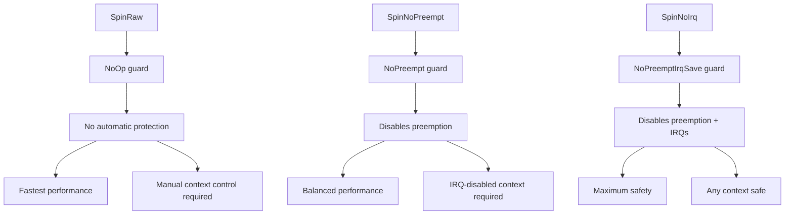
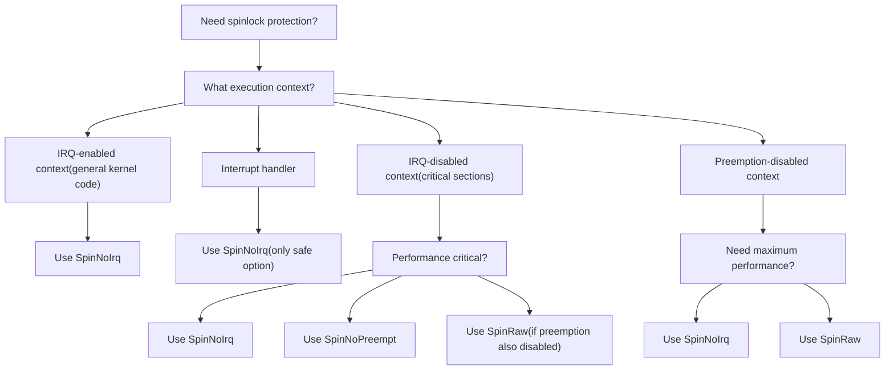
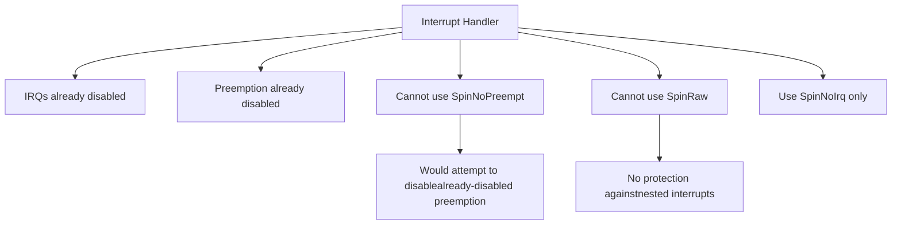
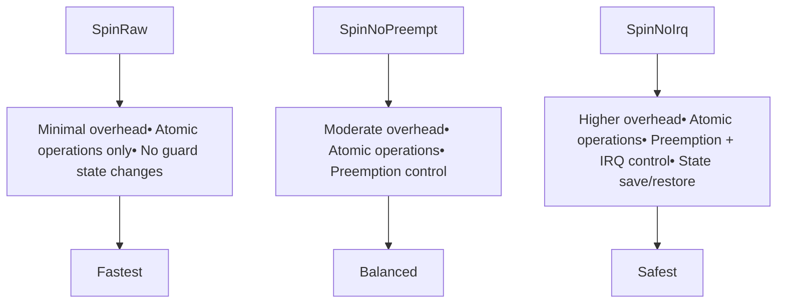

# Usage Guidelines and Safety

> **Relevant source files**
> * [README.md](https://github.com/arceos-org/kspin/blob/dfc0ff2c/README.md)
> * [src/lib.rs](https://github.com/arceos-org/kspin/blob/dfc0ff2c/src/lib.rs)

This document provides comprehensive guidelines for safely selecting and using the appropriate spinlock type from the kspin crate. It covers the safety requirements, context restrictions, and performance considerations for each spinlock variant.

For detailed information about the individual spinlock types and their APIs, see [SpinRaw](/arceos-org/kspin/2.1-spinraw), [SpinNoPreempt](/arceos-org/kspin/2.2-spinnopreempt), and [SpinNoIrq](/arceos-org/kspin/2.3-spinnoirq). For implementation details, see [Core Implementation Architecture](/arceos-org/kspin/3-core-implementation-architecture).

## Safety Model Overview

The kspin crate implements a safety model based on execution context and protection levels. Each spinlock type provides different guarantees and has specific usage requirements that must be followed to ensure system correctness.

### Protection Level Hierarchy



Sources: [src/lib.rs(L6)&emsp;](https://github.com/arceos-org/kspin/blob/dfc0ff2c/src/lib.rs#L6-L6) [src/lib.rs(L10 - L36)&emsp;](https://github.com/arceos-org/kspin/blob/dfc0ff2c/src/lib.rs#L10-L36)

### Context Classification

The kernel execution environment is divided into distinct contexts, each with different safety requirements:

|Context Type|IRQ State|Preemption State|Allowed Spinlocks|
| --- | --- | --- | --- |
|IRQ-enabled context|Enabled|Enabled|SpinNoIrq<T>only|
|IRQ-disabled context|Disabled|May be enabled|SpinNoIrq<T>,SpinNoPreempt<T>,SpinRaw<T>|
|Preemption-disabled context|Disabled|Disabled|SpinNoIrq<T>,SpinRaw<T>|
|Interrupt handler|Disabled|Disabled|SpinNoIrq<T>only|

Sources: [src/lib.rs(L10 - L36)&emsp;](https://github.com/arceos-org/kspin/blob/dfc0ff2c/src/lib.rs#L10-L36)

## Spinlock Selection Decision Tree



Sources: [src/lib.rs(L10 - L36)&emsp;](https://github.com/arceos-org/kspin/blob/dfc0ff2c/src/lib.rs#L10-L36) [README.md(L16 - L33)&emsp;](https://github.com/arceos-org/kspin/blob/dfc0ff2c/README.md#L16-L33)

## Context-Specific Usage Rules

### IRQ-Enabled Context Usage

In IRQ-enabled contexts (typical kernel code), only `SpinNoIrq<T>` should be used:

```javascript
// Safe: SpinNoIrq automatically handles IRQ and preemption state
let data = SpinNoIrq::new(shared_resource);
let guard = data.lock(); // IRQs and preemption disabled automatically
// ... critical section ...
drop(guard); // IRQs and preemption restored
```

**Prohibited patterns:**

* Using `SpinNoPreempt<T>` or `SpinRaw<T>` in IRQ-enabled contexts
* Assuming manual IRQ control is sufficient

Sources: [src/lib.rs(L20 - L24)&emsp;](https://github.com/arceos-org/kspin/blob/dfc0ff2c/src/lib.rs#L20-L24) [README.md(L29 - L32)&emsp;](https://github.com/arceos-org/kspin/blob/dfc0ff2c/README.md#L29-L32)

### IRQ-Disabled Context Usage

When IRQs are already disabled, you have multiple options based on performance requirements:

```javascript
// Option 1: Maximum safety (recommended)
let data = SpinNoIrq::new(resource);

// Option 2: Performance optimization when preemption control is needed
let data = SpinNoPreempt::new(resource);

// Option 3: Maximum performance when preemption is already disabled
let data = SpinRaw::new(resource);
```

Sources: [src/lib.rs(L10 - L18)&emsp;](https://github.com/arceos-org/kspin/blob/dfc0ff2c/src/lib.rs#L10-L18) [src/lib.rs(L29 - L36)&emsp;](https://github.com/arceos-org/kspin/blob/dfc0ff2c/src/lib.rs#L29-L36)

### Interrupt Handler Restrictions

Interrupt handlers have strict requirements due to their execution context:



Sources: [src/lib.rs(L13 - L15)&emsp;](https://github.com/arceos-org/kspin/blob/dfc0ff2c/src/lib.rs#L13-L15) [src/lib.rs(L31 - L33)&emsp;](https://github.com/arceos-org/kspin/blob/dfc0ff2c/src/lib.rs#L31-L33)

## Common Safety Violations and Pitfalls

### Deadlock Scenarios

Understanding potential deadlock situations is critical for safe spinlock usage:

|Scenario|Risk Level|Spinlock Types Affected|Mitigation|
| --- | --- | --- | --- |
|Nested locking (same lock)|High|All types|Usetry_lock()or redesign|
|Lock ordering violation|High|All types|Establish consistent lock hierarchy|
|IRQ handler accessing same lock|Critical|SpinRaw<T>,SpinNoPreempt<T>|UseSpinNoIrq<T>exclusively|
|Long critical sections|Medium|All types|Minimize critical section duration|

### Context Mismatches

Common mistakes when choosing the wrong spinlock type:

```javascript
// WRONG: SpinRaw in IRQ-enabled context
let data = SpinRaw::new(resource);
let guard = data.lock(); // No protection - race condition possible

// WRONG: SpinNoPreempt in interrupt handler  
let data = SpinNoPreempt::new(resource);
let guard = data.lock(); // May not provide sufficient protection

// CORRECT: SpinNoIrq for maximum compatibility
let data = SpinNoIrq::new(resource);
let guard = data.lock(); // Safe in any context
```

Sources: [src/lib.rs(L10 - L36)&emsp;](https://github.com/arceos-org/kspin/blob/dfc0ff2c/src/lib.rs#L10-L36)

## Performance Considerations

### Overhead Comparison

The protection mechanisms impose different performance costs:



### SMP vs Single-Core Optimization

The `smp` feature flag dramatically affects performance characteristics:

|Configuration|Lock State|Atomic Operations|Spinning Behavior|
| --- | --- | --- | --- |
|Single-core (smpdisabled)|Optimized out|None|Always succeeds|
|Multi-core (smpenabled)|AtomicBool|compare_exchange|Actual spinning|

Sources: [README.md(L12)&emsp;](https://github.com/arceos-org/kspin/blob/dfc0ff2c/README.md#L12-L12)

## Best Practices Summary

### Selection Guidelines

1. **Default choice**: Use `SpinNoIrq<T>` unless performance profiling indicates a bottleneck
2. **Performance-critical paths**: Consider `SpinNoPreempt<T>` in IRQ-disabled contexts
3. **Maximum performance**: Use `SpinRaw<T>` only in preemption-disabled, IRQ-disabled contexts
4. **Interrupt handlers**: Always use `SpinNoIrq<T>`

### Implementation Patterns

```javascript
// Pattern 1: Safe default for shared kernel data
static SHARED_DATA: SpinNoIrq<SharedResource> = SpinNoIrq::new(SharedResource::new());

// Pattern 2: Performance-optimized for known IRQ-disabled context
fn irq_disabled_function() {
    static LOCAL_DATA: SpinNoPreempt<LocalResource> = SpinNoPreempt::new(LocalResource::new());
    let guard = LOCAL_DATA.lock();
    // ... critical section ...
}

// Pattern 3: Maximum performance in controlled environment
fn preempt_and_irq_disabled_function() {
    static FAST_DATA: SpinRaw<FastResource> = SpinRaw::new(FastResource::new());
    let guard = FAST_DATA.lock();
    // ... minimal critical section ...
}
```

### Verification Checklist

* Spinlock type matches execution context requirements
* No nested acquisition of the same lock
* Consistent lock ordering across all code paths
* Critical sections are minimal in duration
* Interrupt handlers only use `SpinNoIrq<T>`
* Performance requirements justify any use of `SpinRaw<T>` or `SpinNoPreempt<T>`

Sources: [src/lib.rs(L10 - L36)&emsp;](https://github.com/arceos-org/kspin/blob/dfc0ff2c/src/lib.rs#L10-L36) [README.md(L16 - L33)&emsp;](https://github.com/arceos-org/kspin/blob/dfc0ff2c/README.md#L16-L33)