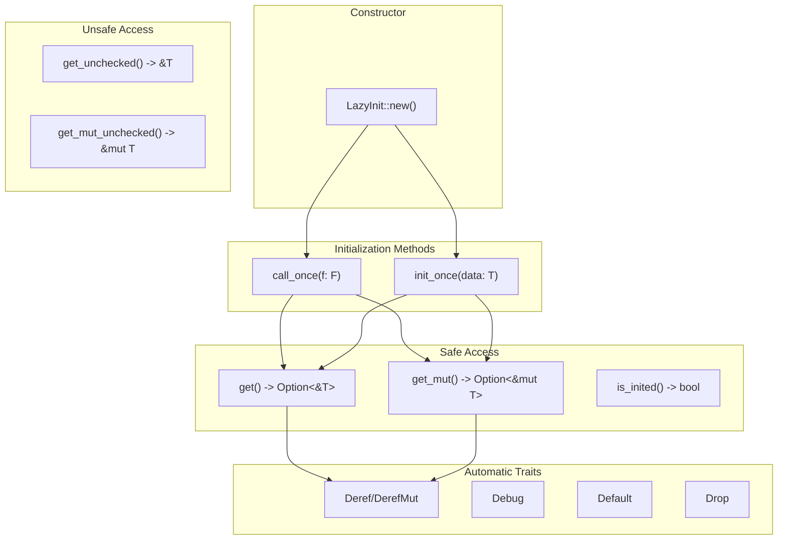

# API Reference

> **Relevant source files**
> * [README.md](https://github.com/arceos-org/lazyinit/blob/380d6b07/README.md)
> * [src/lib.rs](https://github.com/arceos-org/lazyinit/blob/380d6b07/src/lib.rs)

This document provides comprehensive documentation of all public methods, traits, and behavior of the `LazyInit<T>` struct. It covers method signatures, safety guarantees, panic conditions, and usage semantics for thread-safe lazy initialization.

For implementation details about thread safety mechanisms and memory ordering, see [Thread Safety & Memory Model](/arceos-org/lazyinit/2.2-thread-safety-and-memory-model). For practical usage examples and patterns, see [Usage Patterns & Examples](/arceos-org/lazyinit/2.3-usage-patterns-and-examples).

## Method Categories and State Flow

The `LazyInit<T>` API is organized into distinct categories based on functionality and safety guarantees:



Sources: [src/lib.rs(L22 - L182)&emsp;](https://github.com/arceos-org/lazyinit/blob/380d6b07/src/lib.rs#L22-L182)

## Constructor Methods

### LazyInit::new()

```javascript
pub const fn new() -> Self
```

Creates a new uninitialized `LazyInit<T>` instance. This is a `const` function, making it suitable for static variable initialization.

|Property|Value|
| --- | --- |
|Thread Safety|Yes|
|Const|Yes|
|Panics|Never|
|Return|New uninitialized instance|

The internal state is initialized with `inited: false` and uninitialized memory for the data field.

Sources: [src/lib.rs(L23 - L29)&emsp;](https://github.com/arceos-org/lazyinit/blob/380d6b07/src/lib.rs#L23-L29)

## Initialization Methods

### init_once()

```rust
pub fn init_once(&self, data: T) -> &T
```

Initializes the value exactly once with the provided data. Uses atomic compare-and-swap to ensure only one thread can succeed.

|Property|Value|
| --- | --- |
|Thread Safety|Yes|
|Atomicity|compare_exchange_weak|
|Panics|If already initialized|
|Return|Reference to initialized value|

**Panic Conditions:**

* Called when value is already initialized

**Memory Ordering:**

* Success: `Ordering::Acquire`
* Failure: `Ordering::Relaxed`

Sources: [src/lib.rs(L31 - L47)&emsp;](https://github.com/arceos-org/lazyinit/blob/380d6b07/src/lib.rs#L31-L47)

### call_once()

```rust
pub fn call_once<F>(&self, f: F) -> Option<&T>
where F: FnOnce() -> T
```

Performs initialization using a closure exactly once. Returns `None` if already initialized, avoiding panics.

|Property|Value|
| --- | --- |
|Thread Safety|Yes|
|Atomicity|compare_exchange_weak|
|Panics|Never (returnsNoneinstead)|
|Return|Some(&T)on success,Noneif already initialized|

**Behavior:**

* Only one thread succeeds in initialization
* Failed threads receive `None` rather than panicking
* Closure is called exactly once across all threads

Sources: [src/lib.rs(L49 - L67)&emsp;](https://github.com/arceos-org/lazyinit/blob/380d6b07/src/lib.rs#L49-L67)

## Safe Access Methods

### get()

```rust
pub fn get(&self) -> Option<&T>
```

Returns a reference to the initialized value, or `None` if uninitialized.

|Property|Value|
| --- | --- |
|Thread Safety|Yes|
|Panics|Never|
|Return|Some(&T)if initialized,Noneotherwise|

Sources: [src/lib.rs(L74 - L83)&emsp;](https://github.com/arceos-org/lazyinit/blob/380d6b07/src/lib.rs#L74-L83)

### get_mut()

```rust
pub fn get_mut(&mut self) -> Option<&mut T>
```

Returns a mutable reference to the initialized value, or `None` if uninitialized. Requires exclusive access to the `LazyInit` instance.

|Property|Value|
| --- | --- |
|Thread Safety|Yes (requires&mut self)|
|Panics|Never|
|Return|Some(&mut T)if initialized,Noneotherwise|

Sources: [src/lib.rs(L85 - L94)&emsp;](https://github.com/arceos-org/lazyinit/blob/380d6b07/src/lib.rs#L85-L94)

### is_inited()

```rust
pub fn is_inited(&self) -> bool
```

Checks initialization state without accessing the value.

|Property|Value|
| --- | --- |
|Thread Safety|Yes|
|Memory Ordering|Ordering::Acquire|
|Panics|Never|
|Return|trueif initialized,falseotherwise|

Sources: [src/lib.rs(L69 - L72)&emsp;](https://github.com/arceos-org/lazyinit/blob/380d6b07/src/lib.rs#L69-L72)

## Unsafe Access Methods

### get_unchecked()

```rust
pub unsafe fn get_unchecked(&self) -> &T
```

Returns a reference to the value without checking initialization state. Provides maximum performance for hot paths.

|Property|Value|
| --- | --- |
|Safety|UNSAFE- Must be called after initialization|
|Thread Safety|Yes (if preconditions met)|
|Debug Assertion|Checksis_inited()in debug builds|
|Panics|Undefined behavior if uninitialized|

**Safety Requirements:**

* Must only be called after successful initialization
* Caller must ensure initialization has occurred

Sources: [src/lib.rs(L96 - L105)&emsp;](https://github.com/arceos-org/lazyinit/blob/380d6b07/src/lib.rs#L96-L105)

### get_mut_unchecked()

```rust
pub unsafe fn get_mut_unchecked(&mut self) -> &mut T
```

Returns a mutable reference without checking initialization state.

|Property|Value|
| --- | --- |
|Safety|UNSAFE- Must be called after initialization|
|Thread Safety|Yes (requires&mut self)|
|Debug Assertion|Checksis_inited()in debug builds|
|Panics|Undefined behavior if uninitialized|

**Safety Requirements:**

* Must only be called after successful initialization
* Requires exclusive access to the `LazyInit` instance

Sources: [src/lib.rs(L107 - L116)&emsp;](https://github.com/arceos-org/lazyinit/blob/380d6b07/src/lib.rs#L107-L116)

## State Transition Diagram

```mermaid
stateDiagram-v2
[*] --> Uninitialized : "new()"
Uninitialized --> Initialized : "init_once(data)"
Uninitialized --> Initialized : "call_once(f) -> Some"
Uninitialized --> Initialized
note left of Initialized : ['Deref panics if called<br>on uninitialized value']
note left of Initialized----note : ['Uninitialized']
Initialized --> Initialized
Initialized --> Initialized : "Deref/DerefMut"
Initialized --> Initialized
Initialized --> [*] : "Drop"
Uninitialized --> [*] : "Drop"
note left of Uninitialized : ['init_once() panics if called<br>on already initialized value']
note left of Initialized : ['Deref panics if called<br>on uninitialized value']
```

Sources: [src/lib.rs(L22 - L182)&emsp;](https://github.com/arceos-org/lazyinit/blob/380d6b07/src/lib.rs#L22-L182)

## Trait Implementations

### DerefandDerefMut

```rust
impl<T> Deref for LazyInit<T> {
    type Target = T;
    fn deref(&self) -> &T
}

impl<T> DerefMut for LazyInit<T> {
    fn deref_mut(&mut self) -> &mut T
}
```

Enables direct access to the contained value using the dereference operator (`*`).

|Property|Value|
| --- | --- |
|Panics|If value is uninitialized|
|Thread Safety|Yes|
|Usage|*lazy_initorlazy_init.method()|

**Panic Message:** `"Use uninitialized value: LazyInit<T>"`

Sources: [src/lib.rs(L153 - L174)&emsp;](https://github.com/arceos-org/lazyinit/blob/380d6b07/src/lib.rs#L153-L174)

### Debug

```
impl<T: fmt::Debug> fmt::Debug for LazyInit<T>
```

Provides debug formatting that safely handles both initialized and uninitialized states.

**Output Format:**

* Initialized: `"LazyInit { data: <debug_value> }"`
* Uninitialized: `"LazyInit { <uninitialized> }"`

Sources: [src/lib.rs(L136 - L145)&emsp;](https://github.com/arceos-org/lazyinit/blob/380d6b07/src/lib.rs#L136-L145)

### Default

```rust
impl<T> Default for LazyInit<T> {
    fn default() -> Self { Self::new() }
}
```

Creates a new uninitialized instance, equivalent to `LazyInit::new()`.

Sources: [src/lib.rs(L147 - L151)&emsp;](https://github.com/arceos-org/lazyinit/blob/380d6b07/src/lib.rs#L147-L151)

### Drop

```sql
impl<T> Drop for LazyInit<T>
```

Properly destroys the contained value if initialized, ensuring no memory leaks.

**Behavior:**

* Checks initialization state before dropping
* Only drops the contained value if initialized
* Safe for uninitialized instances

Sources: [src/lib.rs(L176 - L182)&emsp;](https://github.com/arceos-org/lazyinit/blob/380d6b07/src/lib.rs#L176-L182)

### Thread Safety Traits

```css
unsafe impl<T: Send + Sync> Sync for LazyInit<T> {}
unsafe impl<T: Send> Send for LazyInit<T> {}
```

Manual trait implementations that enable thread safety when the contained type supports it.

|Trait|Requirement|Purpose|
| --- | --- | --- |
|Send|T: Send|Can be transferred between threads|
|Sync|T: Send + Sync|Can be shared between threads|

Sources: [src/lib.rs(L19 - L20)&emsp;](https://github.com/arceos-org/lazyinit/blob/380d6b07/src/lib.rs#L19-L20)

## Method Safety Summary

|Method|Safety Level|Panics|Thread Safe|
| --- | --- | --- | --- |
|new()|Safe|Never|Yes|
|init_once()|Safe|If already initialized|Yes|
|call_once()|Safe|Never|Yes|
|get()|Safe|Never|Yes|
|get_mut()|Safe|Never|Yes|
|is_inited()|Safe|Never|Yes|
|get_unchecked()|Unsafe|UB if uninitialized|Yes*|
|get_mut_unchecked()|Unsafe|UB if uninitialized|Yes*|
|Deref/DerefMut|Safe|If uninitialized|Yes|

*Thread safe only if safety preconditions are met.

Sources: [src/lib.rs(L22 - L182)&emsp;](https://github.com/arceos-org/lazyinit/blob/380d6b07/src/lib.rs#L22-L182)