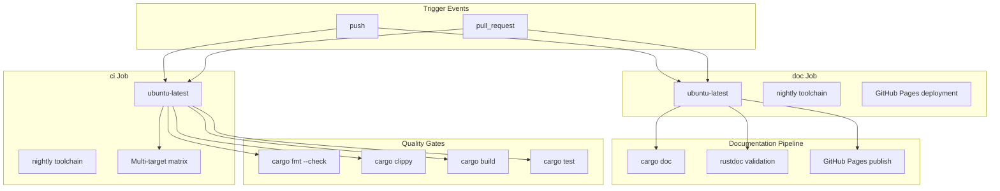
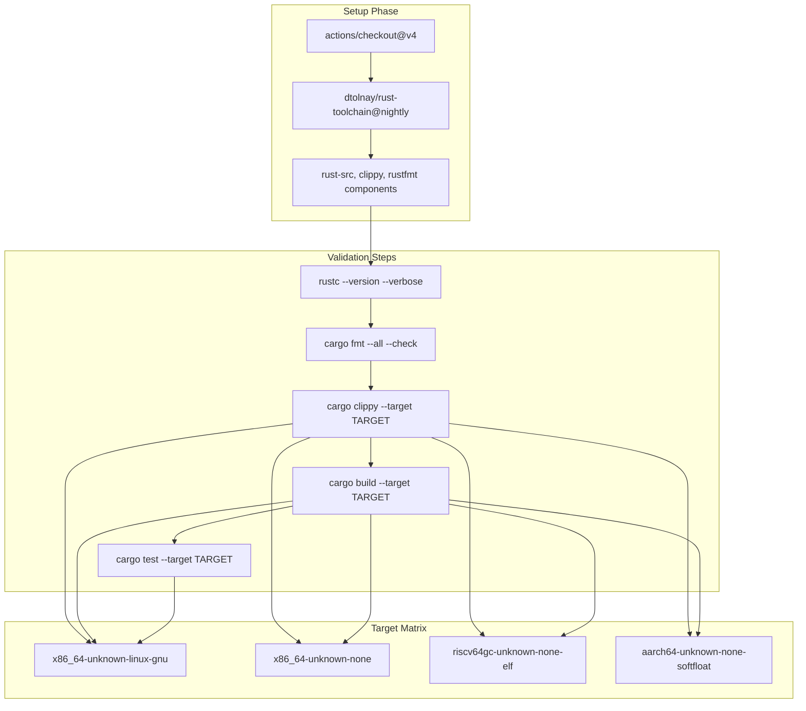
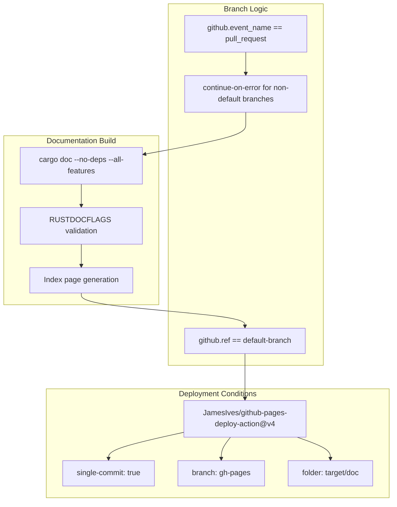
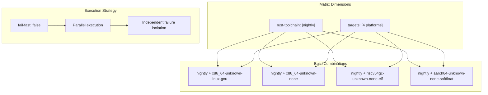

# CI/CD Pipeline

> **Relevant source files**
> * [.github/workflows/ci.yml](https://github.com/arceos-org/lazyinit/blob/380d6b07/.github/workflows/ci.yml)

This document details the continuous integration and continuous deployment (CI/CD) pipeline for the lazyinit crate. The pipeline ensures code quality through automated testing, linting, formatting checks, and multi-target compilation, while also automating documentation deployment to GitHub Pages.

For information about setting up the development environment locally, see [Development Environment Setup](/arceos-org/lazyinit/4.2-development-environment-setup). For details about the core LazyInit implementation being tested by this pipeline, see [LazyInit Implementation](/arceos-org/lazyinit/2-lazyinitlesstgreater-implementation).

## Pipeline Overview

The CI/CD pipeline consists of two parallel workflows defined in a single GitHub Actions configuration file. The pipeline triggers on both push events and pull requests to ensure all changes are validated.

### CI/CD Workflow Architecture

Sources: [.github/workflows/ci.yml(L1 - L56)&emsp;](https://github.com/arceos-org/lazyinit/blob/380d6b07/.github/workflows/ci.yml#L1-L56)

### Target Platform Matrix

The pipeline validates the crate across multiple target platforms to ensure broad compatibility, particularly for `no-std` environments:

|Target|Purpose|Test Execution|
| --- | --- | --- |
|x86_64-unknown-linux-gnu|Standard Linux development|Full test suite|
|x86_64-unknown-none|Bare metal x86_64|Build and lint only|
|riscv64gc-unknown-none-elf|RISC-V bare metal|Build and lint only|
|aarch64-unknown-none-softfloat|ARM64 bare metal|Build and lint only|

Sources: [.github/workflows/ci.yml(L12)&emsp;](https://github.com/arceos-org/lazyinit/blob/380d6b07/.github/workflows/ci.yml#L12-L12) [.github/workflows/ci.yml(L29 - L30)&emsp;](https://github.com/arceos-org/lazyinit/blob/380d6b07/.github/workflows/ci.yml#L29-L30)

## CI Job Workflow

The `ci` job implements a comprehensive quality assurance workflow that runs across all target platforms using a matrix strategy.

### Quality Assurance Pipeline

Sources: [.github/workflows/ci.yml(L14 - L30)&emsp;](https://github.com/arceos-org/lazyinit/blob/380d6b07/.github/workflows/ci.yml#L14-L30)

### Quality Gates Implementation

The pipeline enforces multiple quality gates in sequence:

1. **Code Formatting**: `cargo fmt --all -- --check` ensures consistent code style
2. **Linting**: `cargo clippy --target ${{ matrix.targets }} --all-features` with specific allowances for `clippy::new_without_default`
3. **Compilation**: `cargo build --target ${{ matrix.targets }} --all-features` validates cross-platform compatibility
4. **Testing**: `cargo test --target ${{ matrix.targets }}` runs only on `x86_64-unknown-linux-gnu` target

The conditional test execution pattern reflects the reality that unit tests require a hosted environment, while build validation can occur for bare metal targets.

Sources: [.github/workflows/ci.yml(L22 - L30)&emsp;](https://github.com/arceos-org/lazyinit/blob/380d6b07/.github/workflows/ci.yml#L22-L30)

## Documentation Job Workflow

The `doc` job handles automated documentation generation and deployment with sophisticated branching logic.

### Documentation Pipeline Architecture

Sources: [.github/workflows/ci.yml(L32 - L56)&emsp;](https://github.com/arceos-org/lazyinit/blob/380d6b07/.github/workflows/ci.yml#L32-L56)

### Documentation Quality Controls

The documentation job implements strict quality controls through environment variables:

* `RUSTDOCFLAGS: -D rustdoc::broken_intra_doc_links -D missing-docs` treats documentation warnings as errors
* Automated index page generation using `cargo tree` output for navigation
* Conditional error handling that allows documentation build failures on non-default branches

The index page generation command creates a redirect: `printf '<meta http-equiv="refresh" content="0;url=%s/index.html">' $(cargo tree | head -1 | cut -d' ' -f1) > target/doc/index.html`

Sources: [.github/workflows/ci.yml(L40)&emsp;](https://github.com/arceos-org/lazyinit/blob/380d6b07/.github/workflows/ci.yml#L40-L40) [.github/workflows/ci.yml(L46 - L48)&emsp;](https://github.com/arceos-org/lazyinit/blob/380d6b07/.github/workflows/ci.yml#L46-L48)

## Build Matrix Configuration

The pipeline uses a sophisticated matrix strategy to validate across multiple dimensions while maintaining efficiency.

### Matrix Strategy Implementation

The `fail-fast: false` configuration ensures that a failure on one target platform doesn't prevent validation of other platforms, providing comprehensive feedback on cross-platform compatibility issues.

Sources: [.github/workflows/ci.yml(L8 - L12)&emsp;](https://github.com/arceos-org/lazyinit/blob/380d6b07/.github/workflows/ci.yml#L8-L12)

## Deployment and Permissions

The documentation deployment process uses specific GitHub Actions permissions and deployment strategies optimized for documentation sites.

### GitHub Pages Deployment Configuration

The `doc` job requires `contents: write` permissions for GitHub Pages deployment. The deployment uses `JamesIves/github-pages-deploy-action@v4` with:

* `single-commit: true` for clean deployment history
* `branch: gh-pages` as the deployment target
* `folder: target/doc` containing the generated documentation

Deployment only occurs on the default branch (`github.ref == env.default-branch`), preventing documentation pollution from feature branches.

Sources: [.github/workflows/ci.yml(L36 - L37)&emsp;](https://github.com/arceos-org/lazyinit/blob/380d6b07/.github/workflows/ci.yml#L36-L37) [.github/workflows/ci.yml(L49 - L55)&emsp;](https://github.com/arceos-org/lazyinit/blob/380d6b07/.github/workflows/ci.yml#L49-L55)