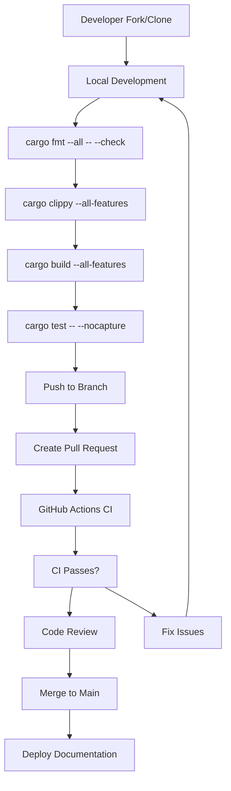
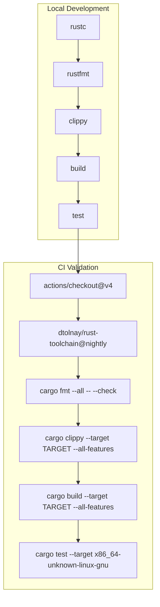
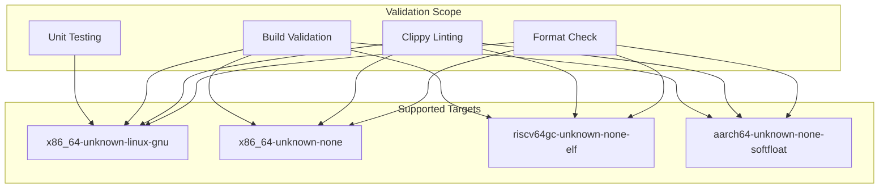
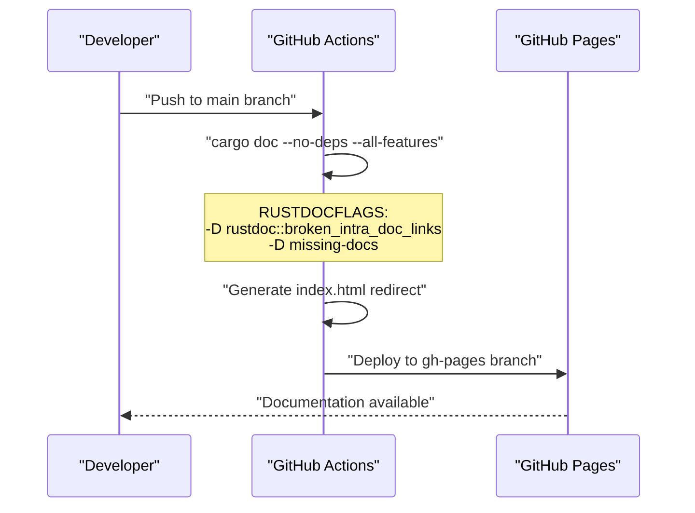

# Development & Contributing

> **Relevant source files**
> * [.github/workflows/ci.yml](https://github.com/arceos-org/lazyinit/blob/380d6b07/.github/workflows/ci.yml)
> * [.gitignore](https://github.com/arceos-org/lazyinit/blob/380d6b07/.gitignore)

This document provides information for developers who want to contribute to the lazyinit crate or understand its development processes. It covers the contribution workflow, development environment requirements, quality assurance mechanisms, and deployment procedures.

For detailed information about the CI/CD pipeline implementation, see [CI/CD Pipeline](/arceos-org/lazyinit/4.1-cicd-pipeline). For guidance on setting up a local development environment, see [Development Environment Setup](/arceos-org/lazyinit/4.2-development-environment-setup).

## Development Workflow Overview

The lazyinit crate follows a standard GitHub-based development workflow with automated quality gates and multi-target validation. All contributions are validated through a comprehensive CI/CD pipeline that ensures code quality, functionality, and compatibility across multiple target architectures.

### Contribution Process Flow

**Sources:** [.github/workflows/ci.yml(L1 - L56)&emsp;](https://github.com/arceos-org/lazyinit/blob/380d6b07/.github/workflows/ci.yml#L1-L56)

## Quality Gates and Validation

The project enforces several quality gates that all contributions must pass. These are implemented as sequential steps in the CI pipeline to ensure code quality and consistency.

### Quality Gate Pipeline

The quality gates include:

|Gate|Command|Purpose|Scope|
| --- | --- | --- | --- |
|Format Check|cargo fmt --all -- --check|Code formatting consistency|All code|
|Linting|cargo clippy --all-features|Code quality and best practices|All targets|
|Build|cargo build --all-features|Compilation validation|All targets|
|Testing|cargo test -- --nocapture|Functional validation|Linux only|

**Sources:** [.github/workflows/ci.yml(L22 - L30)&emsp;](https://github.com/arceos-org/lazyinit/blob/380d6b07/.github/workflows/ci.yml#L22-L30)

## Multi-Target Architecture Support

The crate supports multiple target architectures to ensure compatibility with diverse embedded and systems programming environments. This is particularly important for a `no-std` compatible crate.

### Target Architecture Matrix

The target matrix includes:

* **`x86_64-unknown-linux-gnu`**: Standard Linux development target with full testing
* **`x86_64-unknown-none`**: Bare metal x86_64 target for embedded systems
* **`riscv64gc-unknown-none-elf`**: RISC-V 64-bit embedded target
* **`aarch64-unknown-none-softfloat`**: ARM64 embedded target with software floating point

**Sources:** [.github/workflows/ci.yml(L12)&emsp;](https://github.com/arceos-org/lazyinit/blob/380d6b07/.github/workflows/ci.yml#L12-L12) [.github/workflows/ci.yml(L25 - L30)&emsp;](https://github.com/arceos-org/lazyinit/blob/380d6b07/.github/workflows/ci.yml#L25-L30)

## Toolchain and Component Requirements

Development requires the Rust nightly toolchain with specific components for comprehensive validation and documentation generation.

### Required Toolchain Components

|Component|Purpose|Required For|
| --- | --- | --- |
|rust-src|Source code for cross-compilation|Multi-target builds|
|clippy|Linting and code analysis|Quality gates|
|rustfmt|Code formatting|Style consistency|
|nightly toolchain|Latest language features|Core functionality|

**Sources:** [.github/workflows/ci.yml(L15 - L19)&emsp;](https://github.com/arceos-org/lazyinit/blob/380d6b07/.github/workflows/ci.yml#L15-L19)

## Documentation Generation and Deployment

The project maintains automated documentation deployment to GitHub Pages with strict documentation quality enforcement.

### Documentation Pipeline

Documentation requirements:

* All public APIs must have documentation comments
* No broken intra-doc links allowed (`-D rustdoc::broken_intra_doc_links`)
* Missing documentation is treated as an error (`-D missing-docs`)
* Automatic index page generation for navigation

**Sources:** [.github/workflows/ci.yml(L32 - L56)&emsp;](https://github.com/arceos-org/lazyinit/blob/380d6b07/.github/workflows/ci.yml#L32-L56) [.github/workflows/ci.yml(L40)&emsp;](https://github.com/arceos-org/lazyinit/blob/380d6b07/.github/workflows/ci.yml#L40-L40) [.github/workflows/ci.yml(L47 - L48)&emsp;](https://github.com/arceos-org/lazyinit/blob/380d6b07/.github/workflows/ci.yml#L47-L48)

## Development Environment Configuration

The project includes standard development environment configuration files to ensure consistent development experiences across contributors.

### Excluded Artifacts

The `.gitignore` configuration excludes common development artifacts:

|Pattern|Purpose|
| --- | --- |
|/target|Rust build output directory|
|/.vscode|Visual Studio Code configuration|
|.DS_Store|macOS filesystem metadata|
|Cargo.lock|Dependency lock file (for libraries)|

**Sources:** [.gitignore(L1 - L5)&emsp;](https://github.com/arceos-org/lazyinit/blob/380d6b07/.gitignore#L1-L5)

## Contribution Guidelines

1. **Fork and Clone**: Create a fork of the repository and clone it locally
2. **Branch**: Create a feature branch for your changes
3. **Develop**: Make changes ensuring they pass all local quality gates
4. **Test**: Verify functionality on the primary target (`x86_64-unknown-linux-gnu`)
5. **Submit**: Create a pull request with clear description of changes
6. **Review**: Address feedback from maintainers and automated checks

All contributions are automatically validated against the multi-target matrix to ensure compatibility across supported architectures.

**Sources:** [.github/workflows/ci.yml(L3)&emsp;](https://github.com/arceos-org/lazyinit/blob/380d6b07/.github/workflows/ci.yml#L3-L3) [.github/workflows/ci.yml(L6 - L30)&emsp;](https://github.com/arceos-org/lazyinit/blob/380d6b07/.github/workflows/ci.yml#L6-L30)