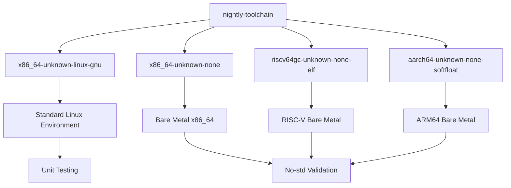
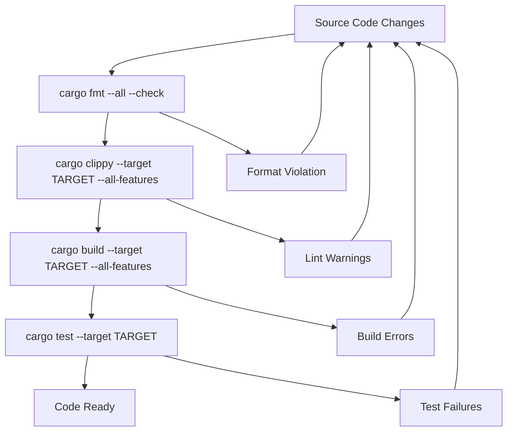
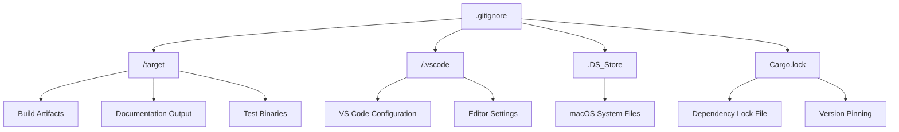
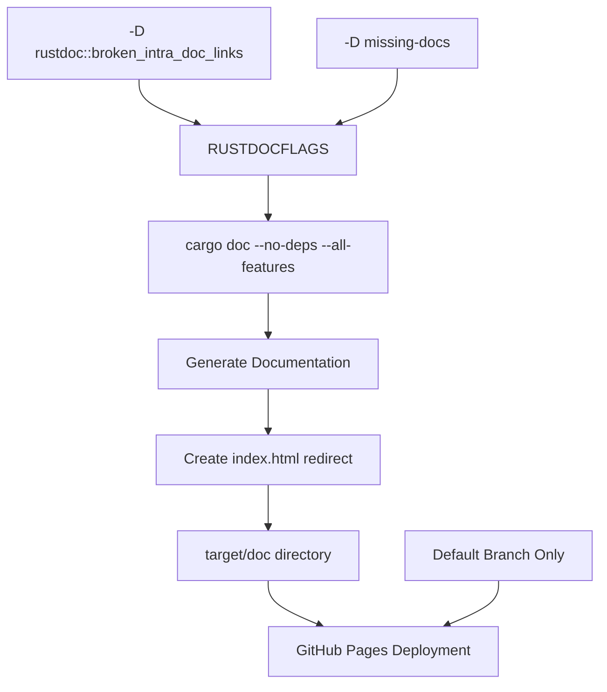

# Development Environment Setup

> **Relevant source files**
> * [.github/workflows/ci.yml](https://github.com/arceos-org/lazyinit/blob/380d6b07/.github/workflows/ci.yml)
> * [.gitignore](https://github.com/arceos-org/lazyinit/blob/380d6b07/.gitignore)

This document provides a comprehensive guide for setting up a development environment for the lazyinit crate. It covers toolchain requirements, target platform configuration, development workflows, and build artifact management. The information is derived from the project's CI/CD configuration and development infrastructure files.

For information about the CI/CD pipeline and automated quality gates, see [CI/CD Pipeline](/arceos-org/lazyinit/4.1-cicd-pipeline). For details about the core implementation and API, see [LazyInit Implementation](/arceos-org/lazyinit/2-lazyinitlesstgreater-implementation).

## Toolchain Requirements

The lazyinit crate requires specific Rust toolchain components and configuration to support its no-std compatibility and multi-target architecture.

### Required Rust Components

The development environment must include the nightly Rust toolchain with the following components:

|Component|Purpose|
| --- | --- |
|rust-src|Source code for cross-compilation targets|
|clippy|Linting and static analysis|
|rustfmt|Code formatting|

### Target Platform Support

The crate supports multiple target platforms to ensure broad compatibility across different architectures and environments:



**Development Toolchain Setup Process**

Sources: [.github/workflows/ci.yml(L11 - L19)&emsp;](https://github.com/arceos-org/lazyinit/blob/380d6b07/.github/workflows/ci.yml#L11-L19)

## Development Workflow

The development workflow follows a structured approach with multiple quality gates to ensure code quality and compatibility across all supported targets.

### Core Development Commands



**Development Quality Gate Workflow**

### Command Reference

The following commands form the core development workflow:

|Command|Purpose|Target Scope|
| --- | --- | --- |
|cargo fmt --all -- --check|Code formatting validation|All code|
|cargo clippy --target <TARGET> --all-features -- -A clippy::new_without_default|Linting with custom rules|Per target|
|cargo build --target <TARGET> --all-features|Compilation verification|Per target|
|cargo test --target <TARGET> -- --nocapture|Unit test execution|Linux only|

### Clippy Configuration

The project uses a specific clippy configuration that allows the `new_without_default` lint, which is appropriate for the `LazyInit::new()` constructor pattern.

Sources: [.github/workflows/ci.yml(L22 - L30)&emsp;](https://github.com/arceos-org/lazyinit/blob/380d6b07/.github/workflows/ci.yml#L22-L30)

## Build Artifacts and Git Configuration

The development environment is configured to exclude specific files and directories that are generated during development or are platform-specific.

### Excluded Files and Directories



**Git Ignore Structure and Build Artifacts**

### Build Artifact Management

|Path|Content|Reason for Exclusion|
| --- | --- | --- |
|/target|Compiled binaries, documentation, test artifacts|Generated content, large files|
|/.vscode|VS Code editor configuration|Editor-specific, not universal|
|.DS_Store|macOS filesystem metadata|Platform-specific system files|
|Cargo.lock|Dependency version locks|Library crate convention|

Sources: [.gitignore(L1 - L5)&emsp;](https://github.com/arceos-org/lazyinit/blob/380d6b07/.gitignore#L1-L5)

## Documentation Generation

The project includes sophisticated documentation generation with specific configuration for quality and deployment.

### Documentation Build Configuration

The documentation build process uses specific `RUSTDOCFLAGS` to enforce documentation quality:

```yaml
RUSTDOCFLAGS: -D rustdoc::broken_intra_doc_links -D missing-docs
```

These flags ensure:

* All intra-documentation links are valid
* All public items have documentation

### Documentation Workflow



**Documentation Generation and Deployment Process**

The documentation generation creates a redirect index file using the crate name extracted from `cargo tree` output:

```
printf '<meta http-equiv="refresh" content="0;url=%s/index.html">' $(cargo tree | head -1 | cut -d' ' -f1) > target/doc/index.html
```

Sources: [.github/workflows/ci.yml(L40 - L55)&emsp;](https://github.com/arceos-org/lazyinit/blob/380d6b07/.github/workflows/ci.yml#L40-L55)

## Local Development Setup

To establish a complete development environment for the lazyinit crate:

1. **Install Rust Nightly**:

```
rustup toolchain install nightly
rustup default nightly
```
2. **Add Required Components**:

```
rustup component add rust-src clippy rustfmt
```
3. **Add Target Platforms**:

```
rustup target add x86_64-unknown-none
rustup target add riscv64gc-unknown-none-elf
rustup target add aarch64-unknown-none-softfloat
```
4. **Verify Setup**:

```
rustc --version --verbose
cargo fmt --version
cargo clippy --version
```

This configuration ensures compatibility with the project's CI/CD pipeline and enables local development that matches the automated testing environment.

Sources: [.github/workflows/ci.yml(L15 - L21)&emsp;](https://github.com/arceos-org/lazyinit/blob/380d6b07/.github/workflows/ci.yml#L15-L21)